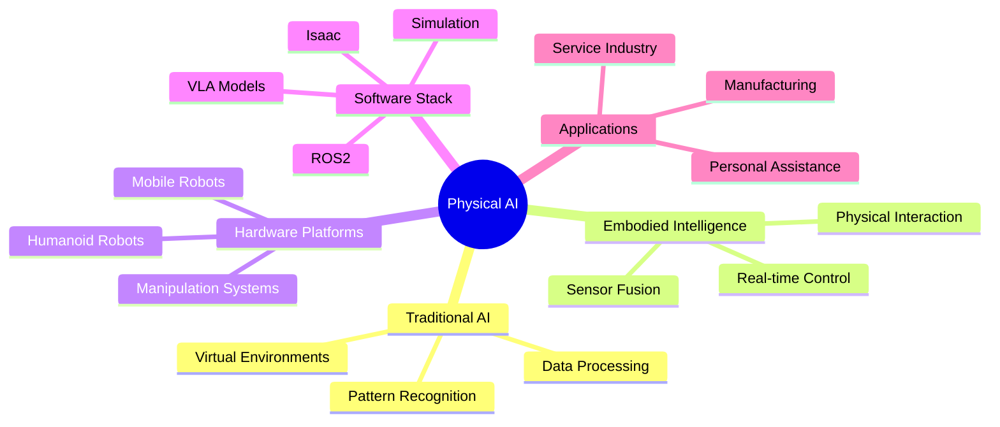

# What is Physical AI?

In a world where robots are transitioning from factory floors to our homes, understanding Physical AI is crucial for navigating the future of human-robot interaction. This emerging field represents a fundamental shift from traditional AI that processes information to AI that interacts with the physical world.

## Learning Objectives

By the end of this chapter, you will be able to:
1. Define Physical AI and distinguish it from traditional AI systems
2. Explain the key differences between digital and embodied intelligence
3. Identify current trends driving the development of humanoid robots
4. Understand the roadmap for the Physical AI and Humanoid Robotics course

## Introduction to Physical AI

Physical AI represents a revolutionary convergence of artificial intelligence and robotics, where intelligent systems are no longer confined to digital spaces but actively interact with and learn from the physical world. Unlike traditional AI systems that operate primarily in virtual environments—processing data, recognizing patterns, or generating text—Physical AI systems must navigate the complexities of real-world physics, uncertainty, and dynamic environments.

Traditional AI systems, while powerful in their domains, operate with perfect information in controlled environments. They process clean datasets, operate on binary logic, and rarely encounter the sensor noise, actuator limitations, or environmental uncertainties that characterize the physical world. Physical AI, conversely, must handle imperfect information, adapt to changing conditions, and make decisions under uncertainty while operating in three-dimensional space.

> [!NOTE]
> Physical AI systems must handle the "reality gap" – the difference between simulated environments and real-world conditions. This gap often causes systems that work perfectly in simulation to fail when deployed on actual robots.

The emergence of Physical AI is driven by several technological advances. Modern sensors provide rich, multimodal data about the environment. Advanced machine learning algorithms can process this data in real-time. And sophisticated actuators enable precise physical manipulation. Together, these technologies enable robots to perform complex tasks in unstructured environments.

## Why Humanoid Robots Now?

The recent surge in humanoid robotics development is not coincidental—it's the result of converging technological capabilities and market demands. Three major companies are leading this charge: Tesla with their Optimus robot, Figure AI with their humanoid assistants, and Unitree with their versatile robotic platforms.

Tesla's Optimus represents a significant milestone in humanoid robotics. Designed initially for factory environments, Optimus demonstrates how AI and robotics can address labor shortages in manufacturing. The robot's development leverages Tesla's expertise in autonomy, computer vision, and machine learning, bringing these capabilities into the physical domain. What makes Optimus particularly interesting is its focus on mass production—Tesla aims to manufacture these robots at scale, potentially reducing costs significantly.

> [!TIP]
> Tesla's approach to humanoid robotics emphasizes the importance of large-scale manufacturing in making robots affordable and accessible. This could democratize access to robotic labor in the same way that mass production made cars accessible to the general population.

Figure AI has taken a different approach, focusing on creating humanoid robots for general-purpose tasks in various environments. Their robots are designed to work alongside humans in warehouses, factories, and eventually homes. The company has made significant strides in enabling their robots to perform complex manipulation tasks, such as loading dishwashers and moving boxes, using advanced AI and dexterous hands.

Unitree has positioned itself as a leader in agile, dynamic robots. Their humanoid and quadrupedal robots demonstrate remarkable mobility and balance, navigating stairs, uneven terrain, and dynamic environments with ease. These capabilities are essential for robots that must operate in human-designed spaces.

The convergence of these efforts reflects several key trends:

1. **AI advancement**: Large language models and vision-language models provide the cognitive capabilities needed for robots to understand and interact with complex environments
2. **Hardware improvements**: Better actuators, sensors, and computing platforms make complex robot behaviors possible
3. **Market demand**: Labor shortages and demographic shifts create strong economic incentives for robotic solutions

## The Shift from Digital to Embodied Intelligence

The transition from digital to embodied intelligence represents a fundamental paradigm shift in how we think about artificial intelligence. Traditional AI systems operate in carefully curated digital environments where inputs are clean, outputs are discrete, and the environment is largely predictable. Physical AI systems, however, must operate in environments characterized by noise, uncertainty, and continuous state spaces.

> [!WARNING]
> The "curse of dimensionality" becomes particularly challenging in physical systems. A robot arm with 7 joints has a 7-dimensional configuration space, and each additional sensor adds more complexity to the state representation that the AI system must process.

Embodied intelligence is based on the principle that intelligence emerges from the interaction between an agent and its environment. This perspective, known as embodied cognition, suggests that the physical form of an agent shapes its cognitive processes. For robots, this means that their sensors, actuators, and physical form are not just mechanisms for implementing intelligence—they are integral to the intelligence itself.

This shift has profound implications for AI development. Instead of training models on static datasets, Physical AI systems must learn through interaction with the environment. Instead of optimizing for accuracy on benchmark datasets, they must optimize for robustness, safety, and adaptability in real-world conditions.

The concept of "learning in the loop" becomes critical. Physical AI systems must continuously adapt to new situations, learn from their mistakes, and refine their behaviors based on real-world feedback. This requires new approaches to machine learning that can handle the constraints of real-time operation, safety requirements, and limited training data.

## Course Roadmap Overview

This course is structured to provide a comprehensive understanding of Physical AI and humanoid robotics, building from fundamental concepts to advanced implementations. The journey is organized into several key modules:

**Module 0: Introduction to Physical AI** - This current module establishes the foundational concepts, hardware platforms, and development tools you'll need for the course.

**Module 1: ROS2 and Robot Operating Systems** - You'll learn to use ROS2 (Robot Operating System 2), the standard middleware for robot development, including message passing, services, and action libraries.

**Module 2: Digital Twin and Simulation** - Explore how to create and use digital twins for robot development, including physics simulation, sensor simulation, and virtual testing environments.

**Module 3: Isaac and NVIDIA Robotics Platforms** - Deep dive into NVIDIA's Isaac ecosystem, including Isaac Sim, Isaac ROS, and GPU-accelerated robotics applications.

**Module 4: Vision-Language-Action Models (VLA)** - Learn about cutting-edge VLA models that enable robots to understand natural language commands and execute complex tasks.

**Module 5-13: Advanced Topics** - These modules cover specialized topics including locomotion, manipulation, navigation, perception, control theory, and integration projects.

Throughout the course, you'll work with real hardware including NVIDIA Jetson platforms, RealSense depth cameras, and various robotic platforms. Each module includes hands-on projects that build toward a final capstone project where you'll implement a complete Physical AI system.

## Mermaid: Physical AI Ecosystem Mindmap

## Key Takeaways

🤖 **Physical AI** bridges artificial intelligence and robotics, enabling systems to interact with the real world
🧠 **Embodied Intelligence** emerges from the interaction between an agent and its environment
🏭 **Humanoid Robotics** is experiencing rapid growth with Tesla, Figure, and Unitree leading the charge
🔄 **Reality Gap** challenges must be addressed when moving from simulation to real-world deployment
🎯 **Learning in the Loop** requires continuous adaptation and real-world feedback
🔗 **Embodied Cognition** suggests physical form shapes cognitive processes in robots
🚀 **Convergence** of AI, hardware, and market demand is driving current advances

## Further Reading

1. [Tesla Optimus: The Future of Humanoid Robots](https://www.tesla.com/optimus) - Official Tesla Optimus page with technical specifications and development updates
2. [Figure AI: Building the Future of Humanoid Robotics](https://figure.ai/) - Learn about Figure's approach to humanoid robot development and AI integration
3. [The Embodied AI Manifesto](https://arxiv.org/abs/2306.01920) - Academic paper exploring the principles of embodied intelligence and physical AI

## Assessment

### Multiple Choice Questions

1. What is the primary difference between traditional AI and Physical AI?
   A) Physical AI uses more data than traditional AI
   B) Physical AI operates in physical environments with real-world constraints
   C) Physical AI is faster than traditional AI
   D) Physical AI uses different programming languages

2. Which of the following companies is NOT mentioned as a leader in humanoid robotics?
   A) Tesla
   B) Figure AI
   C) Unitree
   D) Boston Dynamics

3. What does the "reality gap" refer to in Physical AI?
   A) The difference in processing power between simulation and real robots
   B) The difference between simulated and real-world conditions
   C) The gap in funding between AI and robotics research
   D) The difference in team sizes for AI vs robotics projects

4. What is embodied cognition?
   A) The idea that AI systems should have physical bodies
   B) The principle that intelligence emerges from agent-environment interaction
   C) The concept that robots should look like humans
   D) The practice of embedding AI chips in robots

### Exercises

1. Research one humanoid robot not mentioned in this chapter (e.g., Honda ASIMO, Boston Dynamics Atlas, SoftBank Pepper) and write a paragraph comparing its approach to the robots mentioned in this chapter.

2. Consider the "curse of dimensionality" mentioned in the text. Explain in your own words why this becomes particularly challenging for physical robots with multiple joints and sensors.

### Mini-Project

Design a simple experiment that demonstrates the "reality gap" concept. You might use a simulation environment (like Gazebo, PyBullet, or Webots) and then compare the behavior of a simple controller in simulation versus on a physical robot (or even a toy robot if available). Document your findings, noting how the system behaves differently in simulation versus reality.

> [!SOLUTION]
> Solution: The experiment should include:
> 1. A simple task (e.g., moving to a target location)
> 2. Implementation in both simulation and reality
> 3. Comparison of results highlighting differences
> 4. Analysis of factors contributing to the reality gap (sensor noise, actuator limitations, environmental uncertainties)