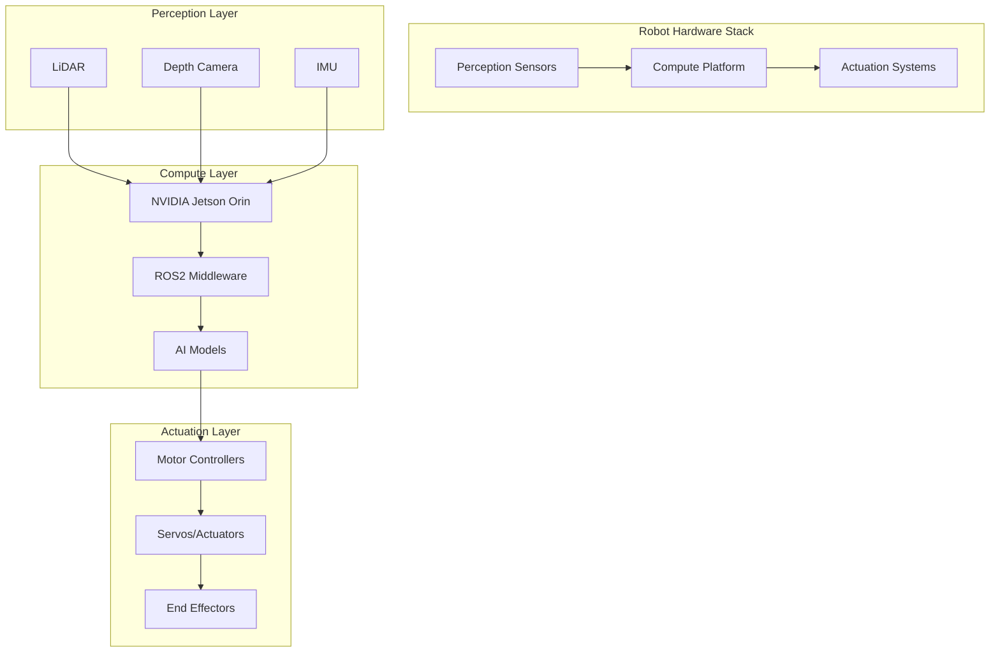

# Hardware and Sensors for Physical AI

Robots are the physical embodiment of artificial intelligence, and their capabilities are fundamentally limited by the sensors and hardware that allow them to perceive and interact with the world. Understanding these components is essential for developing effective Physical AI systems that can operate reliably in real-world environments.

## Learning Objectives

By the end of this chapter, you will be able to:
1. Identify and explain the function of key robotic sensors (LiDAR, depth cameras, IMU)
2. Compare different compute platforms from cloud to edge computing for robotics
3. Specify hardware requirements for Physical AI development
4. Evaluate the components of the $700 Jetson Student Kit and their applications

## Sensor Technologies for Physical AI

Robots exist in a three-dimensional world filled with complex sensory information, and their ability to operate effectively depends on their capacity to perceive this environment accurately. Modern robots employ a diverse array of sensors, each providing different types of information about the world around them.

### LiDAR: Light Detection and Ranging

LiDAR (Light Detection and Ranging) sensors work by emitting laser pulses and measuring the time it takes for the light to return after reflecting off objects. This "time of flight" measurement enables LiDAR to create highly accurate 3D maps of the environment with millimeter-level precision.

LiDAR sensors are particularly valuable for robotics because they provide dense, geometric information about the environment regardless of lighting conditions. Unlike cameras, LiDAR works equally well in bright sunlight and complete darkness. The resulting point clouds contain precise distance measurements that are ideal for navigation, obstacle detection, and mapping applications.

> [!NOTE]
> LiDAR sensors generate massive amounts of data—typically hundreds of thousands of points per second. Processing this data in real-time requires significant computational resources, making the choice of compute platform critical for LiDAR-based systems.

Modern LiDAR sensors come in various forms, from mechanical spinning units to solid-state MEMS-based systems. While mechanical LiDAR was historically expensive and bulky, newer solid-state designs are becoming more affordable and suitable for consumer robotics applications.

### Depth Cameras: RealSense and Beyond

Depth cameras, such as Intel's RealSense D435i, provide a different approach to 3D perception by combining traditional RGB imaging with depth information. The RealSense D435i uses stereo vision technology, employing two infrared cameras to triangulate depth information similar to how human eyes perceive depth.

The D435i provides synchronized RGB and depth streams, making it particularly valuable for applications that require both visual appearance and geometric information. This dual capability enables robots to recognize objects based on both their shape and visual appearance, which is crucial for manipulation tasks.

> [!TIP]
> The RealSense D435i includes an integrated IMU (Inertial Measurement Unit) that provides additional motion and orientation data. This fusion of depth sensing and inertial measurement makes it a comprehensive perception solution for robotics applications.

Depth cameras excel in applications requiring detailed understanding of object surfaces and textures. They're particularly useful for tasks like object recognition, grasping, and close-range manipulation where fine geometric detail is important.

### IMU: Inertial Measurement Units

Inertial Measurement Units (IMUs) provide crucial information about a robot's motion and orientation through accelerometers, gyroscopes, and sometimes magnetometers. These sensors measure linear acceleration, angular velocity, and magnetic field orientation respectively.

For humanoid robots, IMUs are essential for maintaining balance and understanding body position. The data from IMUs enables feedback control systems to maintain stability, especially during dynamic movements like walking or reaching. In mobile robots, IMUs help track motion when other sensors might be unavailable or unreliable.

> [!WARNING]
> IMU data is subject to drift over time, meaning that position and orientation estimates based solely on IMU measurements will become increasingly inaccurate. This is why IMUs are typically fused with other sensors using techniques like Kalman filtering.

IMUs are particularly valuable because they provide high-frequency measurements (often 1000Hz or more) with low latency, making them ideal for real-time control applications where quick responses to motion changes are critical.

## Compute Platforms: From Cloud to Edge

Physical AI systems require significant computational resources to process sensor data, run AI models, and control actuators in real-time. The choice of compute platform depends on requirements for latency, power consumption, cost, and environmental conditions.

### Cloud Computing for Robotics

Cloud computing platforms offer virtually unlimited computational resources and are ideal for training AI models, processing large datasets, and performing computationally intensive tasks that don't require real-time response. Cloud platforms like AWS RoboMaker, Google Cloud, and Azure provide specialized robotics services and simulation environments.

However, cloud computing introduces latency that makes it unsuitable for real-time control tasks. A robot requiring immediate responses to environmental changes cannot rely on cloud-based processing due to network delays that could range from tens of milliseconds to hundreds of milliseconds.

### Workstation Computing

High-performance workstations equipped with powerful GPUs represent a middle ground between cloud and edge computing. These systems can process robot data in real-time while providing sufficient computational power for complex AI models. Workstations are commonly used for robot development, testing, and applications where the robot can be tethered to a powerful computer.

The NVIDIA RTX series GPUs, particularly the RTX 4070 and above, provide excellent performance for robotics applications. These GPUs excel at running neural networks, processing sensor data, and rendering graphics for simulation and visualization.

### Edge Computing: NVIDIA Jetson Platforms

Edge computing brings computational power directly to the robot, enabling real-time processing without network dependencies. The NVIDIA Jetson platform, particularly the Jetson Orin, represents the current state-of-the-art for edge AI in robotics.

The Jetson Orin delivers up to 275 TOPS (trillions of operations per second) of AI performance while consuming as little as 15W of power. This combination of performance and efficiency makes it ideal for mobile robots that need to run complex AI models while operating on battery power.

> [!TIP]
> The Jetson Orin includes specialized hardware accelerators for deep learning, computer vision, and signal processing, making it significantly more efficient for AI workloads than general-purpose CPUs.

Edge computing enables robots to operate autonomously in environments where network connectivity is unavailable or unreliable. This is crucial for applications in remote locations, underwater, or in areas with restricted communications.

## Hardware Requirements for Physical AI Development

Developing Physical AI systems requires significant computational resources, particularly for training models, running simulations, and processing real-time sensor data. The following specifications represent minimum requirements for effective Physical AI development:

### Recommended Specifications

- **GPU**: NVIDIA RTX 4070 or better (RTX 4080/4090 preferred for large-scale training)
- **RAM**: 64GB or more (128GB recommended for large model work)
- **CPU**: Multi-core processor (AMD Ryzen 7000 series or Intel i7/i9)
- **Storage**: Fast NVMe SSD (1TB+ recommended)
- **OS**: Ubuntu 22.04 LTS (optimized for robotics development)

These specifications enable developers to run complex simulations, train neural networks, and process real-time sensor data from multiple sources simultaneously. The GPU is particularly critical as most Physical AI applications rely heavily on parallel processing for sensor fusion, computer vision, and neural network inference.

> [!NOTE]
> Ubuntu 22.04 is recommended because it has excellent support for ROS2, NVIDIA drivers, and other robotics frameworks. Many robotics libraries are optimized for this distribution.

### Development vs. Deployment Considerations

While the above specifications are ideal for development, deployment systems often have different constraints. Production robots may need to operate in harsh environments, consume minimal power, or fit within specific size constraints. This often requires optimizing models and algorithms for less powerful hardware.

## The $700 Jetson Student Kit Breakdown

For students and enthusiasts looking to get started with Physical AI development, the $700 Jetson Student Kit provides an excellent entry point into edge AI robotics. This kit typically includes:

### Core Components

1. **NVIDIA Jetson Orin NX (64GB)** - The primary compute module providing 100+ TOPS of AI performance
2. **Carrier Board** - Provides I/O connections, power management, and interfaces for sensors
3. **Power Supply** - Appropriate power delivery for the Jetson and connected peripherals
4. **Memory and Storage** - High-speed RAM and fast storage for real-time processing
5. **Connectivity** - Wi-Fi, Ethernet, and USB ports for connecting sensors and actuators

### Educational Value

The Jetson Student Kit offers several advantages for learning Physical AI:

- **Real Hardware Experience**: Students work with the same compute platform used in professional robotics
- **Power Efficiency**: The Orin's efficiency allows for mobile robot applications
- **AI Acceleration**: Built-in accelerators for neural networks, computer vision, and sensor processing
- **ROS2 Compatibility**: Full support for Robot Operating System 2 and standard robotics tools

> [!WARNING]
> While the Jetson Orin NX is powerful, it's not as capable as a high-end workstation GPU. Students should design their projects with computational constraints in mind and optimize their algorithms accordingly.

The kit serves as an excellent platform for implementing the concepts learned throughout this course, from basic sensor processing to complex AI models for robot control.

## Mermaid: Hardware Architecture Diagram



## Python Dataclass for SensorReading

```python
from dataclasses import dataclass
from typing import List, Optional
from datetime import datetime
import numpy as np

@dataclass
class SensorReading:
    """
    A dataclass to represent a unified sensor reading from a robot.
    This class can encapsulate readings from various sensor types
    including LiDAR, depth cameras, IMUs, and other perception systems.
    """
    timestamp: datetime
    sensor_type: str  # 'lidar', 'depth_camera', 'imu', 'camera', etc.
    sensor_id: str    # Unique identifier for the sensor
    data: np.ndarray  # Raw sensor data (varies by sensor type)
    confidence: float  # Confidence level of the reading (0.0 to 1.0)
    frame_id: str     # Coordinate frame of the reading
    quality_score: Optional[float] = None  # Optional quality metric
    covariance: Optional[np.ndarray] = None  # Uncertainty in the reading

    def __post_init__(self):
        """Validate the sensor reading after initialization."""
        if not 0.0 <= self.confidence <= 1.0:
            raise ValueError("Confidence must be between 0.0 and 1.0")

        if self.quality_score is not None and not 0.0 <= self.quality_score <= 1.0:
            raise ValueError("Quality score must be between 0.0 and 1.0")

    def is_valid(self) -> bool:
        """Check if the sensor reading is valid based on confidence."""
        return self.confidence > 0.5

    def get_timestamp_ms(self) -> float:
        """Get timestamp as milliseconds since epoch."""
        return self.timestamp.timestamp() * 1000

# Example usage:
# from datetime import datetime
# import numpy as np
#
# # Create a sample LiDAR reading
# lidar_data = np.random.rand(1024, 3)  # 1024 points with x,y,z coordinates
# lidar_reading = SensorReading(
#     timestamp=datetime.now(),
#     sensor_type='lidar',
#     sensor_id='lidar_front',
#     data=lidar_data,
#     confidence=0.95,
#     frame_id='base_laser'
# )
#
# print(f"LiDAR reading valid: {lidar_reading.is_valid()}")
# print(f"Data shape: {lidar_reading.data.shape}")
```

## Key Takeaways

🔌 **LiDAR Sensors** provide precise 3D mapping with millimeter-level accuracy regardless of lighting
📷 **Depth Cameras** like RealSense D435i combine RGB and depth for rich perception data
⚖️ **IMUs** offer high-frequency motion and orientation data essential for robot stability
☁️ **Compute Platforms** range from cloud (training) to edge (real-time control)
⚡ **Jetson Orin** delivers 100+ TOPS of AI performance in an efficient edge package
🔧 **Hardware Requirements** include RTX 4070+, 64GB RAM, and Ubuntu 22.04 for development
🎓 **Student Kit** provides an accessible entry point to Physical AI with real hardware

## Further Reading

1. [NVIDIA Jetson Orin Developer Guide](https://developer.nvidia.com/embedded/jetson-orin) - Comprehensive documentation for the Jetson Orin platform
2. [Intel RealSense D435i Datasheet](https://dev.intelrealsense.com/docs/d400-series-product-families) - Technical specifications and implementation details
3. [ROS2 Hardware Integration Guide](https://docs.ros.org/en/rolling/Tutorials/Advanced/URDF/Hardware-Integration.html) - Best practices for integrating sensors with ROS2

## Assessment

### Multiple Choice Questions

1. What does LiDAR stand for?
   A) Light Detection and Ranging
   B) Laser Detection and Recognition
   C) Linear Detection and Ranging
   D) Light Direction and Resolution

2. Which sensor type is particularly valuable for maintaining robot balance?
   A) LiDAR
   B) Depth camera
   C) IMU
   D) RGB camera

3. What is the primary advantage of edge computing over cloud computing for robotics?
   A) Higher computational power
   B) Lower latency for real-time control
   C) Better cost efficiency
   D) More storage capacity

4. What does TOPS measure in the context of AI hardware?
   A) Temperature operations per second
   B) Tensor operations per second
   C) Time operations per system
   D) Throughput operations per session

### Exercises

1. Compare the advantages and disadvantages of LiDAR vs. stereo vision (depth cameras) for robot navigation. Consider factors like accuracy, computational requirements, environmental conditions, and cost.

2. Calculate the data throughput requirements for a robot using multiple sensors: a 10Hz LiDAR producing 100,000 points per scan, a 30Hz depth camera producing 640x480x4 bytes per frame, and a 1000Hz IMU. What compute platform specifications would you recommend to process this data in real-time?

### Mini-Project

Build a simple sensor fusion system that combines data from different sensor types. You can simulate this with synthetic data or use available datasets. The system should:
1. Process readings from at least two different sensor types
2. Implement a basic fusion algorithm (e.g., weighted averaging or Kalman filtering)
3. Demonstrate how combining sensors provides better information than individual sensors

> [!SOLUTION]
> Solution: The project should include:
> 1. Data structures for different sensor types
> 2. Timestamp synchronization for sensor readings
> 3. A fusion algorithm that combines sensor data meaningfully
> 4. Visualization showing the benefit of fusion vs. individual sensors
> 5. Analysis of how fusion improves reliability or accuracy