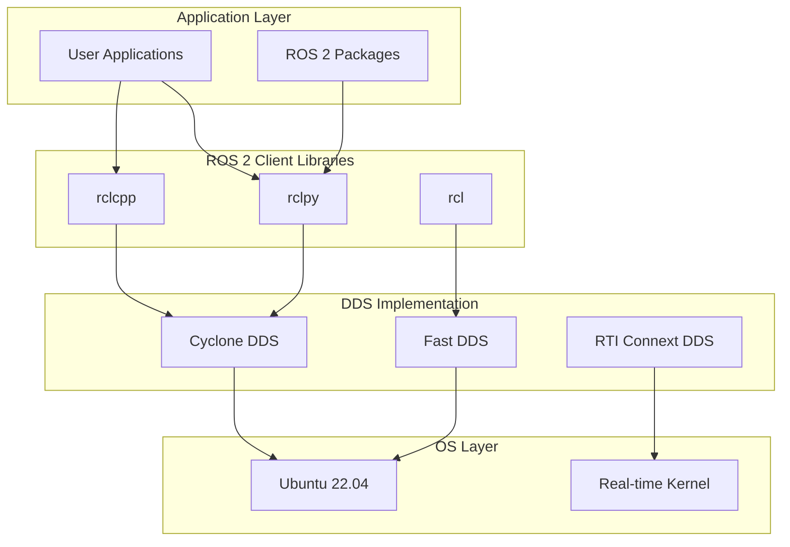

# ROS 2 Architecture: The Robotic Nervous System

Robots are complex systems that require sophisticated coordination between multiple components, from low-level sensors to high-level planning algorithms. ROS 2 provides the architectural foundation that enables these components to communicate seamlessly, forming what we call the "robotic nervous system." Understanding this architecture is fundamental to developing robust robotic applications.

## Learning Objectives

By the end of this chapter, you will be able to:
1. Explain the key differences between ROS 1 and ROS 2 architectures
2. Identify the main ROS 2 distributions and their characteristics
3. Describe the core architecture and computation graph of ROS 2
4. Install ROS 2 on Ubuntu 22.04 and execute basic commands

## Why ROS 2 Over ROS 1?

The transition from ROS 1 to ROS 2 represents more than just an incremental update—it's a fundamental architectural overhaul addressing critical limitations of the original system. ROS 1, while revolutionary in its time, was built around a centralized master architecture that created single points of failure and struggled with real-time requirements.

ROS 2's primary architectural innovation is its adoption of Data Distribution Service (DDS) as the underlying communication middleware. DDS provides a decentralized, fault-tolerant communication system that enables robots to operate reliably in complex, distributed environments. Unlike ROS 1's master-slave architecture, DDS allows nodes to discover each other dynamically without relying on a central coordinator.

> [!NOTE]
> Data Distribution Service (DDS) is an industry-standard middleware protocol specifically designed for real-time, distributed systems. It provides built-in Quality of Service (QoS) policies, data durability, and reliable message delivery—features essential for safety-critical robotic applications.

### Real-Time Capabilities

One of the most significant improvements in ROS 2 is its real-time support. ROS 1's reliance on TCPROS and the central master made it difficult to achieve deterministic timing requirements. ROS 2's DDS-based architecture supports real-time communication with predictable latency, making it suitable for safety-critical applications where timing is paramount.

Real-time capabilities in ROS 2 are achieved through:
- Deterministic message delivery with configurable QoS policies
- Support for real-time operating systems and kernel configurations
- Predictable resource allocation and scheduling

### Security Enhancements

ROS 1's security model was essentially non-existent, with all nodes trusted by default and no encryption for communication. ROS 2 addresses this critical limitation with comprehensive security features including:
- Authentication and authorization of nodes
- Encryption of data in transit
- Secure discovery and communication protocols

> [!TIP]
> Security should be considered from the beginning of any ROS 2 project. While security can be added later, it's much easier to implement from the start. ROS 2 provides security through the DDS Security specification, which can be enabled with appropriate configuration files.

## ROS 2 Distributions: Humble, Iron, Jazzy

ROS 2 follows a time-based release schedule, with new distributions released approximately every year. Each distribution is named alphabetically and has a 5-year support lifecycle, making long-term support (LTS) distributions particularly important for production systems.

### Humble Hawksbill (Humble)

Humble Hawksbill (ROS 2 Humble) is the current LTS distribution, released in May 2022 with support until May 2027. Humble is based on Ubuntu 22.04 and Python 3.10, making it an excellent choice for production systems requiring long-term stability and support.

Humble is particularly well-suited for:
- Production robotic systems requiring long-term support
- Industrial applications with extended lifecycles
- Projects requiring extensive hardware support

### Iron Irwini (Iron)

Iron Irwini (ROS 2 Iron) is the latest non-LTS distribution, released in May 2023. Iron provides access to the newest features and improvements while maintaining a 3-year support cycle. Iron is based on Ubuntu 22.04 and Python 3.10.

Iron is ideal for:
- Research projects requiring cutting-edge features
- Development of new robotic applications
- Early adoption of new capabilities

### Jazzy Jalisco (Jazzy)

Jazzy Jalisco (ROS 2 Jazzy) is the newest distribution, released in May 2024. As the latest release, Jazzy includes the newest features and improvements to the ROS 2 ecosystem.

> [!WARNING]
> While newer distributions offer the latest features, they also have shorter support lifecycles. For production systems, LTS distributions like Humble are generally recommended over newer releases.

## Core Architecture and Computation Graph

The ROS 2 architecture is built around a decentralized computation graph where nodes communicate through topics, services, and actions. This architecture eliminates the single point of failure present in ROS 1 while providing enhanced scalability and fault tolerance.

### The Decentralized Model

In ROS 2, nodes discover each other directly through the DDS middleware without requiring a central master. This decentralized approach provides several advantages:

1. **Fault Tolerance**: If one node fails, it doesn't affect the ability of other nodes to communicate
2. **Scalability**: The system can scale to accommodate many nodes without performance degradation
3. **Distributed Operation**: Nodes can operate across multiple machines without requiring a central coordinator

### Computation Graph Components

The ROS 2 computation graph consists of several key components:

- **Nodes**: Independent processes that perform specific functions
- **DDS Implementation**: The underlying middleware that enables communication
- **Parameter Server**: A node that manages system parameters
- **Lifecycle Manager**: Manages the state transitions of nodes

## Installation on Ubuntu 22.04

Installing ROS 2 on Ubuntu 22.04 follows a standardized process that ensures compatibility with the target distribution. The following bash script provides a complete installation procedure for ROS 2 Humble:

```bash
#!/bin/bash

# Setup locale
sudo locale-gen en_US.UTF-8
sudo update-locale LANG=en_US.UTF-8

# Setup sources
sudo apt update && sudo apt install -y curl gnupg lsb-release
sudo curl -sSL https://raw.githubusercontent.com/ros/rosdistro/master/ros.key -o /usr/share/keyrings/ros-archive-keyring.gpg

echo "deb [arch=$(dpkg --print-architecture) signed-by=/usr/share/keyrings/ros-archive-keyring.gpg] http://packages.ros.org/ros2/ubuntu $(source /etc/os-release && echo $UBUNTU_CODENAME) main" | sudo tee /etc/apt/sources.list.d/ros2.list > /dev/null

# Install ROS 2 packages
sudo apt update
sudo apt install -y ros-humble-desktop
sudo apt install -y python3-rosdep2 python3-rosinstall python3-rosinstall-generator python3-wstool build-essential

# Initialize rosdep
sudo rosdep init
rosdep update

# Setup environment
echo "source /opt/ros/humble/setup.bash" >> ~/.bashrc
source ~/.bashrc

# Install colcon for building packages
sudo apt install python3-colcon-common-extensions

# Verify installation
echo "ROS 2 Humble installation complete!"
echo "To verify, run: ros2 --version"
```

> [!TIP]
> After installation, you may need to restart your terminal or run `source ~/.bashrc` to make ROS 2 commands available in your current session. The installation script includes all necessary components for development, including development tools and build systems.

## First Commands: Getting Started

Once ROS 2 is installed, several fundamental commands enable interaction with the ROS 2 ecosystem. These commands form the foundation of ROS 2 development and are essential for understanding the system's operation.

### ros2 run: Executing Nodes

The `ros2 run` command executes a specific node from a package. The syntax is `ros2 run <package_name> <executable_name>`. For example:

```bash
# Run the talker demo node
ros2 run demo_nodes_cpp talker

# Run the listener demo node in another terminal
ros2 run demo_nodes_py listener
```

### ros2 topic list: Discovering Topics

The `ros2 topic list` command displays all currently active topics in the ROS 2 system. This command is essential for understanding what data is being published and what nodes are communicating.

```bash
# List all active topics
ros2 topic list

# List topics with their types
ros2 topic list -t

# Echo messages from a specific topic
ros2 topic echo /topic_name std_msgs/msg/String
```

> [!NOTE]
> The topic list will only show topics that have active publishers. If no nodes are publishing to a topic, it won't appear in the list until a publisher becomes active.

### Other Essential Commands

```bash
# List all active nodes
ros2 node list

# Get information about a specific node
ros2 node info <node_name>

# List all services
ros2 service list

# List all actions
ros2 action list
```

## Mermaid: ROS 2 Architecture Layers



## Key Takeaways

🔄 **Decentralized Architecture** eliminates single points of failure with DDS-based communication
🔧 **Real-time Support** enables deterministic timing for safety-critical applications
🔒 **Enhanced Security** with authentication, authorization, and encryption
📦 **Distribution System** with LTS and rolling releases for different needs
🎯 **Humble LTS** provides 5-year support for production systems
⚡ **QoS Policies** offer configurable communication behavior
🚀 **Computation Graph** enables distributed node communication

## Further Reading

1. [ROS 2 Documentation: Architecture](https://docs.ros.org/en/humble/Concepts/About-ROS-2-Client-Libraries.html) - Official ROS 2 architecture documentation
2. [DDS Specification Overview](https://www.omg.org/spec/DDS/About-DDS/) - Technical specification for Data Distribution Service
3. [ROS 2 Installation Guide](https://docs.ros.org/en/humble/Installation/Ubuntu-Install-Debians.html) - Complete installation instructions for all platforms

## Assessment

### Multiple Choice Questions

1. What does DDS stand for in the context of ROS 2?
   A) Distributed Data System
   B) Data Distribution Service
   C) Dynamic Discovery System
   D) Decentralized Data Service

2. Which ROS 2 distribution has the longest support lifecycle?
   A) Iron
   B) Jazzy
   C) Humble
   D) Rolling

3. What is the main advantage of ROS 2's decentralized architecture over ROS 1's master-slave architecture?
   A) Faster message transmission
   B) Elimination of single points of failure
   C) Simpler implementation
   D) Lower memory usage

4. Which command lists all active topics in ROS 2?
   A) ros2 node list
   B) ros2 service list
   C) ros2 topic list
   D) ros2 info list

### Exercises

1. Install ROS 2 Humble on your Ubuntu 22.04 system using the provided installation script. Document any issues you encounter and how you resolved them.

2. Run the talker and listener demo nodes in separate terminals and observe the communication. Explain what happens when you stop the talker node while the listener is still running.

### Mini-Project

Create a simple ROS 2 workspace with a custom package that includes a publisher node publishing a custom message and a subscriber node that receives and processes the message. The project should demonstrate understanding of the basic ROS 2 concepts covered in this chapter.

> [!SOLUTION]
> Solution: The project should include:
> 1. A properly structured ROS 2 package with package.xml and setup.py
> 2. A publisher node that publishes messages at a regular interval
> 3. A subscriber node that receives and processes messages
> 4. Proper CMakeLists.txt or setup.py configuration for building
> 5. Instructions for building and running the package using colcon