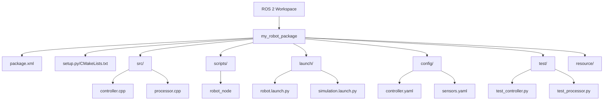

# ROS 2 Packages and Launch Systems: Organizing Your Robotic Applications

Building complex robotic systems requires organizing code into logical, reusable components. ROS 2 packages provide the fundamental unit of organization, while launch systems enable coordinated startup of multiple nodes with appropriate configurations. Mastering packages and launch files is essential for developing professional robotic applications that are maintainable, configurable, and deployable.

## Learning Objectives

By the end of this chapter, you will be able to:
1. Create properly structured ROS 2 packages with appropriate metadata
2. Use the colcon build system to compile and manage packages
3. Design Python launch files for coordinated system startup
4. Manage parameters effectively using YAML configuration files
5. Apply best practices for organizing humanoid robot packages

## Package Structure: The Foundation of ROS 2

A ROS 2 package is the basic building block of any ROS 2 application. It contains source code, configuration files, launch files, and metadata that define a specific capability or functionality. Understanding the proper structure of a ROS 2 package is fundamental to developing organized and maintainable robotic applications.

### Essential Package Files

Every ROS 2 package must include several key files:

- **package.xml**: The package manifest that defines metadata, dependencies, and build information
- **CMakeLists.txt** or **setup.py**: Build configuration files for C++ or Python packages respectively
- **src/**: Source code directory for C++ packages
- **scripts/** or **ros2_package_name/**: Python modules and executables
- **launch/**: Launch files for coordinating node startup
- **config/**: Configuration files including parameter definitions
- **test/**: Unit and integration tests

> [!NOTE]
> The package.xml file is crucial for dependency management and must accurately declare all dependencies, including build, execution, and test dependencies. This ensures that your package can be built and executed in different environments.

### package.xml: The Package Manifest

The package.xml file is an XML manifest that contains metadata about your package. Here's a comprehensive example:

```xml
<?xml version="1.0"?>
<?xml-model href="http://download.ros.org/schema/package_format3.xsd" schematypens="http://www.w3.org/2001/XMLSchema"?>
<package format="3">
  <name>my_robot_controller</name>
  <version>0.1.0</version>
  <description>A controller package for my robot</description>
  <maintainer email="developer@example.com">Robot Developer</maintainer>
  <license>Apache-2.0</license>

  <buildtool_depend>ament_cmake</buildtool_depend>

  <depend>rclcpp</depend>
  <depend>rclpy</depend>
  <depend>std_msgs</depend>
  <depend>sensor_msgs</depend>
  <depend>geometry_msgs</depend>
  <depend>nav_msgs</depend>
  <depend>tf2_ros</depend>

  <test_depend>ament_lint_auto</test_depend>
  <test_depend>ament_lint_common</test_depend>

  <export>
    <build_type>ament_cmake</build_type>
  </export>
</package>
```

### setup.py for Python Packages

For Python packages, the setup.py file defines how the package is built and installed:

```python
from setuptools import setup
import os
from glob import glob

package_name = 'my_robot_controller'

setup(
    name=package_name,
    version='0.1.0',
    packages=[package_name],
    data_files=[
        ('share/ament_index/resource_index/packages',
            ['resource/' + package_name]),
        ('share/' + package_name, ['package.xml']),
        # Include launch files
        (os.path.join('share', package_name, 'launch'),
         glob('launch/*.py')),
        # Include config files
        (os.path.join('share', package_name, 'config'),
         glob('config/*.yaml')),
    ],
    install_requires=['setuptools'],
    zip_safe=True,
    maintainer='Robot Developer',
    maintainer_email='developer@example.com',
    description='A controller package for my robot',
    license='Apache-2.0',
    tests_require=['pytest'],
    entry_points={
        'console_scripts': [
            'robot_controller = my_robot_controller.robot_controller:main',
            'sensor_processor = my_robot_controller.sensor_processor:main',
        ],
    },
)
```

> [!TIP]
> Use console_scripts in setup.py to define executable entry points for your nodes. This makes your nodes available as command-line commands after the package is installed.

## The colcon Build System

colcon is the build system used for ROS 2 packages. It's a command-line tool that can build multiple packages in a workspace, handling dependencies and build order automatically. Understanding colcon is essential for efficient development workflows.

### Basic colcon Commands

```bash
# Create a workspace
mkdir -p ~/ros2_ws/src
cd ~/ros2_ws

# Build all packages in the workspace
colcon build

# Build a specific package
colcon build --packages-select my_robot_controller

# Build with more verbose output
colcon build --event-handlers console_direct+

# Run tests after building
colcon test
colcon test-result --all

# Source the workspace to use built packages
source install/setup.bash
```

### colcon Build Options

colcon provides several options for controlling the build process:

- `--packages-select`: Build only specified packages
- `--packages-up-to`: Build specified packages and their dependencies
- `--parallel-workers`: Limit the number of parallel build jobs
- `--cmake-args`: Pass additional arguments to CMake
- `--symlink-install`: Create symbolic links instead of copying files (faster rebuilds)

> [!WARNING]
> When working with multiple terminals, remember to source the workspace setup file in each terminal where you want to use your built packages. The environment variables are terminal-specific.

## Python Launch Files: Coordinated System Startup

Launch files in ROS 2 allow you to start multiple nodes with specific configurations simultaneously. Python-based launch files provide the flexibility to programmatically configure and start complex robotic systems.

### Basic Launch File Structure

Here's a complete example of a Python launch file:

```python
from launch import LaunchDescription
from launch.actions import DeclareLaunchArgument, IncludeLaunchDescription
from launch.substitutions import LaunchConfiguration, PathJoinSubstitution
from launch.launch_description_sources import PythonLaunchDescriptionSource
from launch_ros.actions import Node
from launch_ros.substitutions import FindPackageShare
from launch.substitutions import TextSubstitution

def generate_launch_description():
    # Declare launch arguments
    use_sim_time = DeclareLaunchArgument(
        'use_sim_time',
        default_value='false',
        description='Use simulation clock if true'
    )

    # Get launch configuration
    use_sim_time_value = LaunchConfiguration('use_sim_time')

    # Define nodes
    robot_controller = Node(
        package='my_robot_controller',
        executable='robot_controller',
        name='robot_controller',
        parameters=[
            PathJoinSubstitution([FindPackageShare('my_robot_controller'), 'config', 'controller.yaml']),
            {'use_sim_time': use_sim_time_value}
        ],
        output='screen'
    )

    sensor_processor = Node(
        package='my_robot_controller',
        executable='sensor_processor',
        name='sensor_processor',
        parameters=[
            PathJoinSubstitution([FindPackageShare('my_robot_controller'), 'config', 'sensors.yaml']),
            {'use_sim_time': use_sim_time_value}
        ],
        output='screen'
    )

    # Include other launch files
    rviz_launch = IncludeLaunchDescription(
        PythonLaunchDescriptionSource([
            PathJoinSubstitution([
                FindPackageShare('my_robot_viz'),
                'launch',
                'view_robot.launch.py'
            ])
        ])
    )

    # Return launch description
    return LaunchDescription([
        use_sim_time,
        robot_controller,
        sensor_processor,
        rviz_launch
    ])
```

### Advanced Launch File Features

Launch files support many advanced features for complex system configuration:

```python
from launch import LaunchDescription
from launch.actions import (
    DeclareLaunchArgument,
    GroupAction,
    SetEnvironmentVariable
)
from launch.conditions import IfCondition
from launch.substitutions import LaunchConfiguration
from launch_ros.actions import Node, PushRosNamespace

def generate_launch_description():
    # Conditional launch arguments
    enable_gui = DeclareLaunchArgument(
        'enable_gui',
        default_value='true',
        description='Enable GUI components'
    )

    # Group nodes under a namespace
    robot_group = GroupAction(
        actions=[
            PushRosNamespace('my_robot'),
            # Nodes defined here will be under the 'my_robot' namespace
            Node(
                package='my_robot_controller',
                executable='robot_controller',
                name='controller'
            )
        ]
    )

    # Conditional nodes
    gui_node = Node(
        package='my_robot_gui',
        executable='robot_gui',
        name='robot_gui',
        condition=IfCondition(LaunchConfiguration('enable_gui'))
    )

    return LaunchDescription([
        enable_gui,
        robot_group,
        gui_node
    ])
```

> [!TIP]
> Use namespaces in launch files to organize nodes logically and avoid name conflicts when running multiple robots or instances of your system.

## Parameter Management with YAML

Effective parameter management is crucial for configuring robotic systems across different environments and use cases. ROS 2 uses YAML files for parameter configuration, providing a flexible and human-readable way to manage system settings.

### Parameter File Structure

Here's an example parameter file (config/controller.yaml):

```yaml
/**:  # Applies to all nodes by default
  ros__parameters:
    use_sim_time: false
    loop_rate: 50  # Hz
    safety_limits:
      max_velocity: 1.0
      max_acceleration: 2.0
    control_params:
      kp: 1.5
      ki: 0.2
      kd: 0.05

my_robot_controller:  # Applies to specific node
  ros__parameters:
    sensor_timeout: 0.1
    diagnostics_rate: 1.0
    logging_level: "INFO"
```

### Loading Parameters in Launch Files

Parameters can be loaded from YAML files in launch files:

```python
from launch import LaunchDescription
from launch_ros.actions import Node
from launch.substitutions import PathJoinSubstitution
from launch_ros.substitutions import FindPackageShare

def generate_launch_description():
    # Load parameters from YAML file
    controller_params_file = PathJoinSubstitution([
        FindPackageShare('my_robot_controller'),
        'config',
        'controller.yaml'
    ])

    robot_controller = Node(
        package='my_robot_controller',
        executable='robot_controller',
        name='robot_controller',
        parameters=[controller_params_file],
        output='screen'
    )

    return LaunchDescription([robot_controller])
```

### Parameter Best Practices

- Use descriptive names with clear hierarchies
- Group related parameters under logical sections
- Include units in parameter names where appropriate (e.g., `max_velocity_mps`)
- Use appropriate data types (avoid storing complex data as strings)
- Document parameter purposes in comments

> [!NOTE]
> Parameters loaded from YAML files override default values set in the node code, but can be further overridden by command-line arguments at runtime.

## Best Practices for Humanoid Packages

When developing packages for humanoid robots, additional considerations apply due to the complexity and safety requirements of these systems.

### Organization Principles

- **Modularity**: Separate locomotion, manipulation, perception, and planning into distinct packages
- **Safety**: Implement safety layers as separate packages that can be independently verified
- **Simulation**: Maintain separate packages for simulation-specific components
- **Hardware Abstraction**: Create clear interfaces between high-level behaviors and low-level hardware control

### Common Humanoid Package Structure

```
humanoid_robot_bringup/
├── launch/
│   ├── robot.launch.py
│   ├── simulation.launch.py
│   └── hardware.launch.py
├── config/
│   ├── controllers.yaml
│   ├── joint_limits.yaml
│   └── safety_limits.yaml
├── params/
│   ├── simulation_params.yaml
│   └── hardware_params.yaml
└── CMakeLists.txt / setup.py
```

> [!TIP]
> For humanoid robots, consider using the ROS Control framework for hardware abstraction and controller management. This provides standardized interfaces for joint control and safety management.

## Mermaid: Package Structure Tree



## Complete Launch File Example

Here's a complete launch file example that demonstrates best practices:

```python
import os
from launch import LaunchDescription
from launch.actions import DeclareLaunchArgument, RegisterEventHandler
from launch.conditions import IfCondition
from launch.event_handlers import OnProcessExit
from launch.substitutions import LaunchConfiguration, PathJoinSubstitution
from launch_ros.actions import Node
from launch_ros.substitutions import FindPackageShare

def generate_launch_description():
    # Declare launch arguments
    use_sim_time = DeclareLaunchArgument(
        'use_sim_time',
        default_value='false',
        description='Use simulation clock if true'
    )

    enable_rviz = DeclareLaunchArgument(
        'enable_rviz',
        default_value='true',
        description='Launch RViz for visualization'
    )

    # Get launch configurations
    use_sim_time_value = LaunchConfiguration('use_sim_time')
    enable_rviz_value = LaunchConfiguration('enable_rviz')

    # Define parameter file paths
    config_dir = PathJoinSubstitution([
        FindPackageShare('my_robot_bringup'),
        'config'
    ])

    controller_params_file = PathJoinSubstitution([
        config_dir,
        'controller.yaml'
    ])

    # Robot controller node
    robot_controller = Node(
        package='my_robot_controller',
        executable='robot_controller',
        name='robot_controller',
        parameters=[
            controller_params_file,
            {'use_sim_time': use_sim_time_value}
        ],
        output='screen',
        respawn=True,  # Restart if the node dies
        respawn_delay=2.0
    )

    # Sensor processor node
    sensor_processor = Node(
        package='my_robot_perception',
        executable='sensor_processor',
        name='sensor_processor',
        parameters=[
            PathJoinSubstitution([config_dir, 'sensors.yaml']),
            {'use_sim_time': use_sim_time_value}
        ],
        output='screen'
    )

    # RViz node (conditional)
    rviz_node = Node(
        package='rviz2',
        executable='rviz2',
        name='rviz2',
        arguments=['-d', PathJoinSubstitution([
            FindPackageShare('my_robot_viz'),
            'rviz',
            'robot_view.rviz'
        ])],
        condition=IfCondition(enable_rviz_value),
        output='screen'
    )

    # Setup event handlers
    # For example, start RViz after controllers are loaded
    delay_rviz_after_controller = RegisterEventHandler(
        event_handler=OnProcessExit(
            target_action=robot_controller,
            on_exit=[rviz_node],
        )
    )

    # Return launch description
    return LaunchDescription([
        use_sim_time,
        enable_rviz,
        robot_controller,
        sensor_processor,
        # delay_rviz_after_controller  # Uncomment to delay RViz start
        rviz_node
    ])
```

## Key Takeaways

📦 **Package Structure** provides organized code organization with proper metadata
🔧 **colcon Build** system manages dependencies and compilation efficiently
🚀 **Launch Files** coordinate complex system startup with configurations
⚙️ **YAML Parameters** enable flexible system configuration
🏷️ **Namespaces** organize nodes and avoid naming conflicts
🔄 **Parameter Loading** allows runtime configuration from files
🎯 **Best Practices** ensure maintainable, safe humanoid robot systems

## Further Reading

1. [ROS 2 Package Development](https://docs.ros.org/en/humble/How-To-Guides/Creating-Your-First-ROS2-Package.html) - Official guide to package creation
2. [Launch System Documentation](https://docs.ros.org/en/humble/How-To-Guides/Launch-system.html) - Comprehensive launch system guide
3. [ROS 2 Parameter System](https://docs.ros.org/en/humble/Tutorials/Parameters/Understanding-ROS2-Parameters.html) - Detailed parameter management

## Assessment

### Multiple Choice Questions

1. What is the primary purpose of the package.xml file in ROS 2?
   A) To define the build process
   B) To provide package metadata and dependencies
   C) To store configuration parameters
   D) To define launch sequences

2. Which command builds only a specific package in a workspace?
   A) colcon build
   B) colcon build --packages-select my_package
   C) colcon build my_package
   D) build my_package

3. What does the format="3" attribute in package.xml indicate?
   A) The package version
   B) The package format version
   C) The ROS 2 distribution
   D) The build system type

4. Which launch file feature allows nodes to be grouped under a common namespace?
   A) DeclareLaunchArgument
   B) Node action
   C) GroupAction with PushRosNamespace
   D) IncludeLaunchDescription

### Exercises

1. Create a new ROS 2 package named "my_robot_demo" with proper structure including package.xml, setup.py, and a simple Python node. Build the package using colcon and verify it works.

2. Create a launch file that starts two nodes with different configurations loaded from YAML parameter files. Test the launch file with different parameter sets.

### Mini-Project

Develop a complete ROS 2 package for a simple robot system that includes:
1. A properly structured package with all required files
2. A publisher node and a subscriber node
3. A launch file that starts both nodes with parameters from a YAML file
4. Unit tests for your nodes
5. Documentation for your package

> [!SOLUTION]
> Solution: The project should include:
> 1. A complete package structure with proper package.xml and setup.py
> 2. Two functional nodes communicating via topics
> 3. A launch file with parameter loading from YAML
> 4. Working tests that validate node functionality
> 5. Clear documentation explaining the package purpose and usage