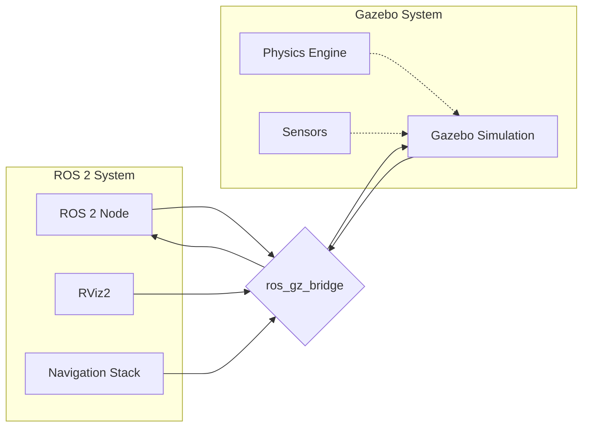

# Gazebo Simulation: Creating the Digital Twin Environment

Simulation is the cornerstone of modern robotics development, enabling engineers and researchers to test algorithms, validate designs, and train AI systems in a safe, cost-effective environment. Gazebo stands as one of the most powerful and widely-used simulation environments in robotics, providing realistic physics simulation and sensor modeling that bridges the gap between theoretical development and real-world deployment.

## Learning Objectives

By the end of this chapter, you will be able to:
1. Compare Gazebo Fortress/Garden with the classic version and understand their differences
2. Select appropriate physics engines (ODE, Bullet, DART) for different simulation scenarios
3. Create and configure world files using the SDF format
4. Simulate physical properties like gravity, collisions, and friction in Gazebo
5. Integrate Gazebo with ROS 2 using the ros_gz_bridge

## Gazebo Fortress/Garden vs Classic: Evolution of the Simulator

The evolution of Gazebo from its classic version to the modern Fortress and Garden distributions represents a significant architectural transformation. The classic Gazebo was built as a monolithic application with tightly coupled components, while the newer versions (Fortress and Garden) are built on the Ignition Gazebo framework, which follows a more modular, plugin-based architecture.

Gazebo Classic, while still functional, has limitations in terms of scalability and maintainability. It was built primarily as a standalone application with limited extensibility. The new Ignition-based versions (Fortress and Garden) offer better performance, more realistic physics simulation, and enhanced plugin architecture that allows for easier customization and extension.

> [!NOTE]
> Gazebo Fortress and Garden are part of the Ignition Robotics ecosystem, which provides a more modern, modular approach to robotics simulation. These versions offer better integration with modern ROS 2 distributions and improved performance compared to the classic version.

### Key Improvements in Modern Gazebo

The modern Gazebo versions introduce several key improvements:

1. **Modular Architecture**: Components are implemented as plugins, making the system more flexible and maintainable
2. **Better Performance**: Optimized rendering and physics simulation for complex scenarios
3. **Enhanced Physics**: Support for more advanced physics properties and interactions
4. **Improved Rendering**: Better graphics capabilities with support for advanced rendering techniques
5. **Modern API**: Cleaner, more intuitive APIs for programmatic control

### Choosing Between Versions

Gazebo Fortress (ROS 2 Humble) and Garden (ROS 2 Iron/Jazzy) are the current recommended versions for new projects. Fortress provides LTS support and stability, while Garden offers the latest features and improvements. For production systems requiring long-term support, Fortress is generally recommended, while Garden is ideal for research and development projects requiring cutting-edge features.

> [!TIP]
> When starting a new project, align your Gazebo version with your ROS 2 distribution. Use Gazebo Fortress with ROS 2 Humble and Gazebo Garden with ROS 2 Iron or Jazzy for optimal compatibility and support.

## Physics Engines: ODE, Bullet, and DART

Gazebo's physics simulation capabilities are powered by three different physics engines, each with its own strengths and optimal use cases. Understanding these engines is crucial for creating realistic simulations that match the behavior of real-world robots.

### Open Dynamics Engine (ODE)

ODE is the default physics engine for Gazebo Classic and remains a solid choice for many applications. It's known for its stability and performance with rigid body simulations. ODE excels at simulating contact between objects and provides reliable collision detection and response.

```cpp
// Example ODE configuration in SDF
<physics type="ode">
  <max_step_size>0.001</max_step_size>
  <real_time_factor>1.0</real_time_factor>
  <real_time_update_rate>1000</real_time_update_rate>
</physics>
```

### Bullet Physics

Bullet is a more modern physics engine that offers advanced features like soft body simulation and more sophisticated collision detection algorithms. It's particularly well-suited for simulations requiring high accuracy in complex contact scenarios. Bullet also provides better support for multi-body dynamics and constraint solving.

### Dynamic Animation and Robotics Toolkit (DART)

DART is the newest addition to Gazebo's physics engine options and offers the most advanced features for robotics simulation. It excels at simulating complex articulated systems and provides excellent support for inverse kinematics and constraint-based modeling. DART is particularly valuable for humanoid robot simulation due to its sophisticated handling of complex joint systems.

> [!WARNING]
> While DART offers advanced features, it can be more computationally intensive than ODE or Bullet. Consider your hardware capabilities and simulation requirements when selecting a physics engine. For real-time simulation of complex humanoid robots, DART may require more powerful hardware.

## World Files and SDF Format

Simulation environments in Gazebo are defined using the Simulation Description Format (SDF), an XML-based format that describes the entire simulation world, including models, physics properties, lighting, and environmental conditions.

### SDF Structure

An SDF file contains several key elements:

- **World**: The top-level container for the entire simulation environment
- **Models**: Physical objects in the simulation, including robots and static objects
- **Physics**: Configuration for the physics engine
- **Light**: Lighting properties for the environment
- **Scene**: Visual properties and rendering settings

### Basic World File Example

```xml
<?xml version="1.0" ?>
<sdf version="1.7">
  <world name="my_world">
    <!-- Physics configuration -->
    <physics type="ode">
      <max_step_size>0.001</max_step_size>
      <real_time_factor>1.0</real_time_factor>
      <real_time_update_rate>1000</real_time_update_rate>
    </physics>

    <!-- Gravity -->
    <gravity>0 0 -9.8</gravity>

    <!-- Include a ground plane -->
    <include>
      <uri>model://ground_plane</uri>
    </include>

    <!-- Include a sun light -->
    <include>
      <uri>model://sun</uri>
    </include>

    <!-- Define a simple box model -->
    <model name="box">
      <pose>0 0 0.5 0 0 0</pose>
      <link name="link">
        <collision name="collision">
          <geometry>
            <box>
              <size>1 1 1</size>
            </box>
          </geometry>
        </collision>
        <visual name="visual">
          <geometry>
            <box>
              <size>1 1 1</size>
            </box>
          </geometry>
          <material>
            <ambient>0.5 0.5 0.5 1</ambient>
            <diffuse>0.8 0.8 0.8 1</diffuse>
          </material>
        </visual>
        <inertial>
          <mass>1.0</mass>
          <inertia>
            <ixx>0.166667</ixx>
            <ixy>0</ixy>
            <ixz>0</ixz>
            <iyy>0.166667</iyy>
            <iyz>0</iyz>
            <izz>0.166667</izz>
          </inertia>
        </inertial>
      </link>
    </model>
  </world>
</sdf>
```

## Simulating Physical Properties

Creating realistic simulations requires careful attention to physical properties that govern how objects behave in the virtual world. These properties include gravity, collision detection, and friction parameters.

### Gravity Configuration

Gravity is a fundamental force in simulation that affects all objects with mass. The default gravity in Gazebo is set to Earth's gravity (9.8 m/s²) in the negative Z direction, but this can be customized for different environments:

```xml
<gravity>0 0 -9.8</gravity>  <!-- Earth gravity -->
<gravity>0 0 -1.62</gravity> <!-- Moon gravity -->
<gravity>0 0 0</gravity>     <!-- Zero gravity -->
```

### Collision Detection and Properties

Collision detection in Gazebo uses multiple algorithms to determine when objects intersect. The accuracy and performance of collision detection can be tuned through various parameters:

- **Surface Properties**: Define how objects interact when they collide
- **Contact Parameters**: Control the response to collisions
- **Friction Models**: Determine how surfaces interact

### Friction Modeling

Friction is crucial for realistic simulation of robot-environment interactions. Gazebo supports several friction models:

```xml
<surface>
  <friction>
    <ode>
      <mu>1.0</mu>    <!-- Static friction coefficient -->
      <mu2>1.0</mu2>  <!-- Secondary friction coefficient -->
    </ode>
  </friction>
</surface>
```

> [!TIP]
> For realistic ground contact simulation, adjust friction coefficients to match real-world materials. Rubber on concrete has a high friction coefficient (~1.0), while ice has a very low coefficient (~0.1).

## ros_gz_bridge: Connecting Simulation to ROS 2

The ros_gz_bridge package serves as the crucial link between Gazebo simulation and ROS 2, enabling seamless communication between simulated sensors and actuators and ROS 2 nodes. This bridge translates between Gazebo's native message types and ROS 2 message types, allowing the same code to work with both simulated and real robots.

### Bridge Configuration

The bridge can be configured to translate specific topics, services, and actions between the two systems. Common bridged topics include:

- Sensor data (LIDAR, cameras, IMU)
- Joint states and commands
- Robot transforms and odometry
- Clock synchronization

### Example Bridge Usage

```bash
# Bridge sensor data from Gazebo to ROS 2
ros2 run ros_gz_bridge parameter_bridge \
  --ros-args -p config_file:=/path/to/bridge_config.yaml

# Bridge clock for simulation time synchronization
ros2 run ros_gz_bridge parameter_bridge \
  /clock@rosgraph_msgs/msg/Clock@gz.msgs.Clock
```

## Mermaid: Gazebo-ROS 2 Communication Flow



## Key Takeaways

🏗️ **Modular Architecture** in modern Gazebo enables flexible, extensible simulations
⚙️ **Physics Engines** offer different capabilities for various simulation needs
📝 **SDF Format** provides comprehensive world description in XML
🌍 **Physical Properties** must be accurately configured for realism
🔗 **ros_gz_bridge** enables seamless ROS 2 integration
⚡ **Performance** considerations affect physics engine selection
🎯 **Realism** requires careful attention to friction and collision parameters

## Further Reading

1. [Gazebo Documentation](https://gazebosim.org/docs) - Official Gazebo simulation documentation
2. [SDF Specification](http://sdformat.org/spec) - Complete Simulation Description Format specification
3. [ros_gz_bridge Guide](https://github.com/gazebosim/ros_gz) - ROS-Gazebo bridge documentation

## Assessment

### Multiple Choice Questions

1. Which physics engine is best suited for complex articulated systems like humanoid robots?
   A) ODE
   B) Bullet
   C) DART
   D) All are equally suitable

2. What does SDF stand for in the context of Gazebo?
   A) Simulation Development Framework
   B) Simulation Description Format
   C) System Design File
   D) Sensor Data Format

3. What is the primary purpose of ros_gz_bridge?
   A) To improve rendering performance
   B) To connect Gazebo simulation with ROS 2
   C) To optimize physics simulation
   D) To manage world files

4. Which element in an SDF file defines the physics engine configuration?
   A) <world>
   B) <model>
   C) <physics>
   D) <engine>

### Exercises

1. Create a simple SDF world file that includes a ground plane, a light source, and two objects with different physical properties. Load the world in Gazebo and observe how they interact.

2. Configure the ros_gz_bridge to connect a simulated camera in Gazebo to a ROS 2 topic. Verify that you can visualize the camera feed in RViz2.

### Mini-Project

Design and implement a complete simulation environment for a mobile robot that includes:
1. A custom world with obstacles and terrain features
2. A robot model with appropriate physical properties
3. Proper physics configuration for realistic movement
4. ROS 2 bridge configuration for sensor and actuator communication

> [!SOLUTION]
> Solution: The project should include:
> 1. A properly structured SDF world file with multiple objects
> 2. A robot model with accurate physical properties
> 3. Physics configuration appropriate for the robot type
> 4. Working ros_gz_bridge setup for ROS 2 integration
> 5. Documentation explaining design choices and configuration parameters