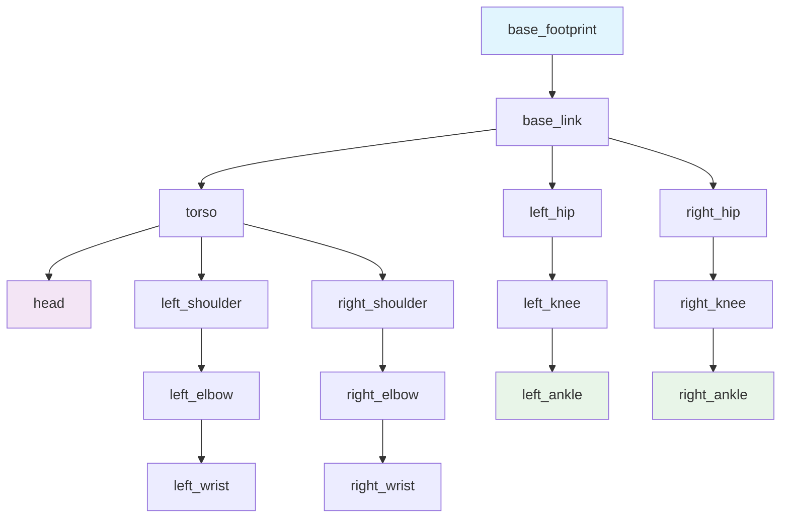

# URDF Robot Description: Building Digital Robot Models

The Unified Robot Description Format (URDF) serves as the fundamental language for describing robots in the ROS ecosystem. It provides a standardized way to define robot geometry, kinematics, and dynamics, enabling tools like Gazebo simulation, RViz visualization, and motion planning algorithms to understand and work with robot models. Mastering URDF is essential for any robotics professional who needs to create, modify, or work with robot models.

## Learning Objectives

By the end of this chapter, you will be able to:
1. Understand the structure of URDF files and their core components (links, joints, inertials)
2. Create different joint types (revolute, prismatic, fixed) for various robot mechanisms
3. Use Xacro macros to create modular and maintainable URDF descriptions
4. Visualize robot models in RViz2 and debug URDF issues
5. Compare URDF and SDF formats and understand their appropriate use cases

## URDF Structure: Links, Joints, and Inertials

URDF is an XML-based format that describes robots as a collection of rigid bodies (links) connected by joints. This tree-like structure represents the kinematic chain of the robot, from the base to the end effectors.

### Links: The Building Blocks

Links represent rigid bodies in the robot structure. Each link contains several key components:

- **Visual**: Defines how the link appears in visualization tools
- **Collision**: Defines the collision geometry for physics simulation
- **Inertial**: Defines the physical properties like mass and moments of inertia
- **Origin**: Defines the position and orientation of the link frame

```xml
<link name="base_link">
  <visual>
    <origin xyz="0 0 0" rpy="0 0 0"/>
    <geometry>
      <cylinder radius="0.2" length="0.1"/>
    </geometry>
    <material name="blue">
      <color rgba="0 0 1 1"/>
    </material>
  </visual>

  <collision>
    <origin xyz="0 0 0" rpy="0 0 0"/>
    <geometry>
      <cylinder radius="0.2" length="0.1"/>
    </geometry>
  </collision>

  <inertial>
    <mass value="1.0"/>
    <inertia ixx="0.1" ixy="0.0" ixz="0.0" iyy="0.1" iyz="0.0" izz="0.1"/>
  </inertial>
</link>
```

> [!NOTE]
> The visual and collision geometries can be different. Visual geometry focuses on appearance, while collision geometry focuses on computational efficiency and accuracy for physics simulation. Often, collision geometry is simplified compared to visual geometry.

### Joints: Connecting the Links

Joints define the kinematic relationships between links, specifying how they can move relative to each other. Each joint has:

- **Parent**: The link that the joint is attached to
- **Child**: The link that the joint connects to
- **Type**: The type of motion allowed (revolute, prismatic, etc.)
- **Limits**: Constraints on the joint motion (position, velocity, effort)

### Inertial Properties: Physical Reality

The inertial properties define how the link responds to forces and torques. These properties include:

- **Mass**: The total mass of the link
- **Inertia matrix**: How mass is distributed throughout the link
- **Center of mass**: The point where the mass can be considered concentrated

> [!TIP]
> Accurate inertial properties are crucial for realistic simulation and proper controller behavior. Use CAD tools to calculate these values when possible, as hand-calculated values often lead to simulation inaccuracies.

## Joint Types: Enabling Different Motions

URDF supports several joint types that enable different kinds of motion between connected links. Understanding these types is essential for modeling various robot mechanisms.

### Revolute Joints

Revolute joints allow rotation around a single axis, making them ideal for modeling rotational joints like robot arm joints or wheel axles. These joints have position limits that constrain the rotation range.

```xml
<joint name="joint1" type="revolute">
  <parent link="base_link"/>
  <child link="link1"/>
  <origin xyz="0 0 0.1" rpy="0 0 0"/>
  <axis xyz="0 0 1"/>
  <limit lower="-1.57" upper="1.57" effort="100" velocity="1"/>
</joint>
```

### Prismatic Joints

Prismatic joints allow linear motion along a single axis, making them suitable for modeling telescoping mechanisms, sliders, or linear actuators. Like revolute joints, they have position limits.

### Fixed Joints

Fixed joints connect two links without allowing any relative motion. They are useful for attaching sensors, mounting plates, or combining multiple parts that should be treated as a single rigid body.

### Continuous Joints

Continuous joints are similar to revolute joints but allow unlimited rotation. They're ideal for modeling wheels or other components that can rotate freely without limits.

### Other Joint Types

- **Planar**: Allows motion in a plane
- **Floating**: Allows motion in all six degrees of freedom
- **Spherical**: Allows rotation in all directions around a point

> [!WARNING]
> Be careful with joint limits and ensure they match the physical capabilities of your real robot. Overly restrictive limits may prevent valid motions, while overly permissive limits may cause damage to the physical robot.

## Xacro Macros: Modular URDF Design

Xacro (XML Macros) extends URDF by adding macro capabilities, variables, and mathematical expressions. This allows for more modular, maintainable, and reusable robot descriptions.

### Basic Xacro Features

Xacro enables several powerful features:

- **Macros**: Reusable blocks of XML that can be parameterized
- **Variables**: Named values that can be reused throughout the description
- **Mathematical expressions**: Calculations within the URDF
- **File inclusion**: Combining multiple files into a single robot description

### Example Xacro Macro for Arm Link

```xml
<?xml version="1.0"?>
<robot xmlns:xacro="http://www.ros.org/wiki/xacro" name="robot_arm">

  <!-- Define constants -->
  <xacro:property name="M_PI" value="3.1415926535897931" />
  <xacro:property name="link_length" value="0.3" />
  <xacro:property name="link_radius" value="0.05" />

  <!-- Macro for creating arm links -->
  <xacro:macro name="arm_link" params="name parent xyz rpy *origin">
    <joint name="${name}_joint" type="revolute">
      <xacro:insert_block name="origin"/>
      <parent link="${parent}"/>
      <child link="${name}_link"/>
      <axis xyz="0 0 1"/>
      <limit lower="${-2*M_PI}" upper="${2*M_PI}" effort="100" velocity="1"/>
    </joint>

    <link name="${name}_link">
      <visual>
        <geometry>
          <cylinder radius="${link_radius}" length="${link_length}"/>
        </geometry>
        <material name="light_grey">
          <color rgba="0.8 0.8 0.8 1.0"/>
        </material>
      </visual>

      <collision>
        <geometry>
          <cylinder radius="${link_radius}" length="${link_length}"/>
        </geometry>
      </collision>

      <inertial>
        <mass value="0.5"/>
        <inertia ixx="0.01" ixy="0" ixz="0" iyy="0.01" iyz="0" izz="0.005"/>
      </inertial>
    </link>
  </xacro:macro>

  <!-- Use the macro to create multiple arm links -->
  <xacro:arm_link name="shoulder" parent="base_link">
    <origin xyz="0 0 0.2" rpy="0 0 0"/>
  </xacro:arm_link>

  <xacro:arm_link name="elbow" parent="shoulder_link">
    <origin xyz="0 0 ${link_length}" rpy="0 0 0"/>
  </xacro:arm_link>

</robot>
```

## Visualizing with RViz2

RViz2 is the primary visualization tool for ROS 2, allowing you to view robot models, sensor data, and other ROS topics. The RobotModel display type is specifically designed for visualizing URDF robot descriptions.

### Setting Up RobotModel Display

To visualize a robot in RViz2:

1. Add a RobotModel display
2. Set the Robot Description parameter to the parameter name containing your URDF (typically "robot_description")
3. Ensure joint states are being published to the correct topic

### Joint State Visualization

For proper visualization of articulated robots, joint states must be published to the `/joint_states` topic. The Joint State Publisher package can help with this during development:

```bash
# Publish joint states for visualization
ros2 run joint_state_publisher joint_state_publisher --ros-args -p use_gui:=true
```

> [!TIP]
> Use the Joint State Publisher GUI to manually control joint positions and verify that your URDF model is correctly structured. This is invaluable for debugging kinematic chains and identifying issues with joint limits or directions.

## URDF vs SDF Comparison

Understanding the differences between URDF and SDF (Simulation Description Format) is crucial for choosing the right format for your application.

### URDF: Robot Description Focus

URDF is specifically designed for robot description within the ROS ecosystem. It excels at:
- Describing robot kinematics and dynamics
- Integration with ROS tools (TF, MoveIt, etc.)
- Motion planning and control applications

### SDF: General Simulation Focus

SDF is designed for complete simulation environments and excels at:
- Describing entire simulation worlds
- Complex physics properties and environments
- Multi-robot simulation scenarios

### When to Use Each

- **Use URDF** when describing individual robots for ROS applications
- **Use SDF** when describing complete simulation environments or when working with Gazebo directly
- **Convert between formats** using tools like `sdformat_urdf` when needed

## Mermaid: URDF Tree Structure for Humanoid



## Key Takeaways

🔗 **Links and Joints** form the fundamental structure of URDF robot descriptions
🔄 **Joint Types** enable different motion patterns for various mechanisms
🧩 **Xacro Macros** provide modularity and reusability in robot descriptions
👁️ **RViz2 Visualization** helps debug and validate URDF models
📐 **Inertial Properties** are crucial for accurate simulation
🔧 **URDF vs SDF** serves different purposes in robotics development
🎯 **Proper Structure** ensures compatibility with ROS tools and simulation

## Further Reading

1. [URDF Documentation](http://wiki.ros.org/urdf) - Official URDF specification and tutorials
2. [Xacro Guide](http://wiki.ros.org/xacro) - Complete guide to Xacro macros and features
3. [Robot Model Tutorials](https://docs.ros.org/en/humble/Tutorials/Intermediate/URDF/Using-Xacro-to-Clean-Up-a-URDF-File.html) - ROS 2 URDF and Xacro tutorials

## Assessment

### Multiple Choice Questions

1. What does URDF stand for?
   A) Universal Robot Design Format
   B) Unified Robot Description Format
   C) Universal Robot Development Framework
   D) Unified Robotics Data Format

2. Which joint type allows unlimited rotation around a single axis?
   A) Revolute
   B) Prismatic
   C) Fixed
   D) Continuous

3. What is the primary purpose of Xacro in URDF?
   A) To improve simulation performance
   B) To add macro capabilities and modularity to URDF
   C) To convert URDF to SDF
   D) To visualize robot models

4. Which component defines how a link appears in visualization tools?
   A) <collision>
   B) <inertial>
   C) <visual>
   D) <geometry>

### Exercises

1. Create a simple 3-DOF robot arm using Xacro macros. Include proper visual, collision, and inertial properties for each link.

2. Use RViz2 to visualize your robot model and use the Joint State Publisher GUI to test different joint configurations. Document any issues you encounter and how you resolved them.

### Mini-Project

Design a complete humanoid robot model using Xacro that includes:
1. A torso with head, arms, and legs
2. Proper joint types for all connections
3. Xacro macros for repetitive components (arms, legs)
4. Visualization in RViz2 with joint state control
5. Documentation explaining the design choices and kinematic structure

> [!SOLUTION]
> Solution: The project should include:
> 1. A complete humanoid URDF using Xacro macros
> 2. Proper joint types for all connections
> 3. Reasonable visual, collision, and inertial properties
> 4. Working visualization in RViz2
> 5. Documentation explaining the kinematic structure and design decisions