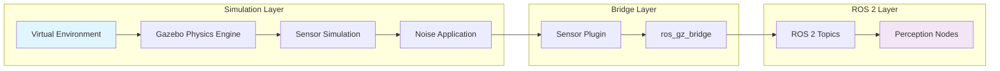

# Sensor Simulation: Creating Realistic Digital Sensors

Robots rely on sensors to perceive and understand their environment, making accurate sensor simulation crucial for developing and testing perception algorithms. In the digital twin paradigm, simulating sensors with realistic characteristics enables developers to create, validate, and refine algorithms in a safe, repeatable environment before deployment on physical robots. This chapter explores how to simulate various sensor types in Gazebo with realistic properties and noise models.

## Learning Objectives

By the end of this chapter, you will be able to:
1. Simulate LiDAR sensors using ray casting with realistic noise and performance characteristics
2. Configure camera sensors for both RGB and depth perception in simulation
3. Model IMU sensors with appropriate noise models and dynamics
4. Implement Gazebo sensor plugins for custom sensor types
5. Publish simulated sensor data to ROS 2 topics for integration with perception pipelines

## LiDAR Simulation with Ray Casting

Light Detection and Ranging (LiDAR) sensors are fundamental for many robotics applications, providing accurate 3D information about the environment. Simulating LiDAR sensors in Gazebo involves configuring ray casting algorithms that mimic the physical behavior of laser beams.

### Ray Casting Principles

Gazebo's LiDAR simulation uses ray casting to determine distances to objects in the environment. For each laser beam, Gazebo casts a ray from the sensor origin in the specified direction and calculates the distance to the nearest collision object. This approach accurately simulates the line-of-sight nature of real LiDAR sensors.

### LiDAR Sensor Configuration

A typical LiDAR sensor configuration in URDF/SDF includes parameters that define its physical and performance characteristics:

```xml
<gazebo reference="lidar_link">
  <sensor name="lidar_sensor" type="ray">
    <always_on>true</always_on>
    <visualize>true</visualize>
    <update_rate>10</update_rate>
    <ray>
      <scan>
        <horizontal>
          <samples>720</samples>
          <resolution>1</resolution>
          <min_angle>-3.14159</min_angle>
          <max_angle>3.14159</max_angle>
        </horizontal>
      </scan>
      <range>
        <min>0.1</min>
        <max>30.0</max>
        <resolution>0.01</resolution>
      </range>
    </ray>
    <plugin name="lidar_controller" filename="libgazebo_ros_ray_sensor.so">
      <ros>
        <namespace>/lidar</namespace>
        <remapping>~/out:=scan</remapping>
      </ros>
      <output_type>sensor_msgs/LaserScan</output_type>
      <frame_name>lidar_link</frame_name>
    </plugin>
  </sensor>
</gazebo>
```

> [!NOTE]
> The number of samples and resolution directly impact simulation performance. Higher resolution provides more detailed data but requires more computational resources. Balance accuracy needs with performance constraints based on your application requirements.

### Noise Modeling for LiDAR

Real LiDAR sensors have inherent noise and inaccuracies that must be modeled in simulation to ensure algorithms perform well in real-world conditions. Gazebo allows adding Gaussian noise to LiDAR measurements:

```xml
<noise type="gaussian">
  <mean>0.0</mean>
  <stddev>0.01</stddev>  <!-- 1cm standard deviation -->
</noise>
```

## Camera Simulation: RGB and Depth

Camera sensors are essential for visual perception tasks, and Gazebo provides sophisticated camera simulation capabilities that include both RGB and depth sensing. These simulations enable testing of computer vision algorithms and visual SLAM systems.

### RGB Camera Simulation

RGB cameras in Gazebo simulate the optical properties of real cameras, including focal length, field of view, and image resolution. The camera plugin captures color images that can be processed by computer vision algorithms.

```xml
<gazebo reference="camera_link">
  <sensor name="camera" type="camera">
    <update_rate>30</update_rate>
    <camera name="head">
      <horizontal_fov>1.3962634</horizontal_fov> <!-- 80 degrees -->
      <image>
        <width>640</width>
        <height>480</height>
        <format>R8G8B8</format>
      </image>
      <clip>
        <near>0.1</near>
        <far>100</far>
      </clip>
      <noise>
        <type>gaussian</type>
        <mean>0.0</mean>
        <stddev>0.007</stddev>
      </noise>
    </camera>
    <plugin name="camera_controller" filename="libgazebo_ros_camera.so">
      <ros>
        <namespace>/camera</namespace>
        <remapping>image_raw:=image_color</remapping>
        <remapping>camera_info:=camera_info</remapping>
      </ros>
      <frame_name>camera_link</frame_name>
      <min_depth>0.1</min_depth>
      <max_depth>100.0</max_depth>
    </plugin>
  </sensor>
</gazebo>
```

> [!TIP]
> When configuring camera sensors, consider the computational cost of processing high-resolution images. For real-time applications, balance image quality with processing requirements. Many vision algorithms can work effectively with lower resolution images during development.

### Depth Camera Simulation

Depth cameras provide both color and depth information, which is crucial for 3D perception tasks. Gazebo can simulate depth cameras by adding depth sensor capabilities to the camera configuration:

```xml
<sensor name="depth_camera" type="depth">
  <update_rate>30</update_rate>
  <camera name="depth_cam">
    <!-- Camera parameters similar to RGB camera -->
  </camera>
  <plugin name="depth_camera_controller" filename="libgazebo_ros_depth_camera.so">
    <ros>
      <namespace>/depth_camera</namespace>
      <remapping>image_raw:=image_rect_raw</remapping>
      <remapping>depth/image_raw:=depth/image_raw</remapping>
      <remapping>depth/camera_info:=depth/camera_info</remapping>
    </ros>
    <frame_name>depth_camera_link</frame_name>
  </plugin>
</sensor>
```

## IMU Simulation with Noise Models

Inertial Measurement Units (IMUs) provide crucial information about a robot's orientation, acceleration, and angular velocity. Simulating IMUs with realistic noise characteristics is essential for developing robust state estimation and control algorithms.

### IMU Physics and Modeling

IMUs typically contain accelerometers, gyroscopes, and sometimes magnetometers. In simulation, these components must be modeled with appropriate noise characteristics that match real sensors. The noise in IMUs typically includes:

- **Bias**: Long-term drift in sensor readings
- **Noise**: Random variations in measurements
- **Scale factor errors**: Inaccuracies in measurement scaling

### IMU Sensor Configuration

```xml
<gazebo reference="imu_link">
  <sensor name="imu_sensor" type="imu">
    <always_on>true</always_on>
    <update_rate>100</update_rate>
    <imu>
      <angular_velocity>
        <x>
          <noise type="gaussian">
            <mean>0.0</mean>
            <stddev>0.0017</stddev> <!-- ~0.1 deg/s -->
          </noise>
        </x>
        <y>
          <noise type="gaussian">
            <mean>0.0</mean>
            <stddev>0.0017</stddev>
          </noise>
        </y>
        <z>
          <noise type="gaussian">
            <mean>0.0</mean>
            <stddev>0.0017</stddev>
          </noise>
        </z>
      </angular_velocity>
      <linear_acceleration>
        <x>
          <noise type="gaussian">
            <mean>0.0</mean>
            <stddev>0.017</stddev> <!-- ~0.017 m/s² -->
          </noise>
        </x>
        <y>
          <noise type="gaussian">
            <mean>0.0</mean>
            <stddev>0.017</stddev>
          </noise>
        </y>
        <z>
          <noise type="gaussian">
            <mean>0.0</mean>
            <stddev>0.017</stddev>
          </noise>
        </z>
      </linear_acceleration>
    </imu>
    <plugin name="imu_controller" filename="libgazebo_ros_imu.so">
      <ros>
        <namespace>/imu</namespace>
      </ros>
      <frame_name>imu_link</frame_name>
      <topic_name>data</topic_name>
    </plugin>
  </sensor>
</gazebo>
```

> [!WARNING]
> IMU noise parameters should be carefully tuned to match the specifications of real sensors you plan to use. Using unrealistic noise levels can lead to algorithms that perform poorly on actual hardware.

## Gazebo Sensor Plugins

Gazebo's plugin architecture allows for custom sensor implementations and advanced sensor modeling. Sensor plugins handle the generation of sensor data, noise modeling, and ROS 2 integration.

### Plugin Architecture

Gazebo sensor plugins are shared libraries that:
- Interface with the Gazebo simulation engine
- Generate sensor data based on the simulated environment
- Apply noise models and sensor characteristics
- Publish data to ROS 2 topics through the bridge

### Common Sensor Plugins

- **libgazebo_ros_ray_sensor.so**: For LiDAR and other ray-based sensors
- **libgazebo_ros_camera.so**: For RGB cameras
- **libgazebo_ros_depth_camera.so**: For depth cameras
- **libgazebo_ros_imu.so**: For IMU sensors
- **libgazebo_ros_gps.so**: For GPS simulation

## Publishing to ROS 2 Topics

The ultimate goal of sensor simulation is to provide data that can be consumed by ROS 2 nodes in the same way as real sensors. This requires proper configuration of the ros_gz_bridge to translate between Gazebo message formats and ROS 2 message formats.

### Topic Configuration

Sensor plugins are configured to publish to specific ROS 2 topics:

```xml
<plugin name="camera_controller" filename="libgazebo_ros_camera.so">
  <ros>
    <namespace>/camera</namespace>
    <remapping>image_raw:=image_color</remapping>
    <remapping>camera_info:=camera_info</remapping>
  </ros>
  <frame_name>camera_link</frame_name>
</plugin>
```

### Sensor Data Pipeline

The complete pipeline from simulation to ROS 2 application involves:

1. **Gazebo Simulation**: Computes sensor data based on the virtual environment
2. **Sensor Plugin**: Formats data and applies noise models
3. **Gazebo-ROS Bridge**: Translates between message formats
4. **ROS 2 Topics**: Makes data available to perception and control nodes

## Mermaid: Sensor Data Pipeline



## URDF Sensor Plugin Configuration

Sensors are typically integrated into robot models through URDF with Gazebo-specific extensions. Here's a complete example of a robot with multiple sensor types:

```xml
<?xml version="1.0"?>
<robot xmlns:xacro="http://www.ros.org/wiki/xacro" name="sensor_robot">

  <!-- Base link -->
  <link name="base_link">
    <visual>
      <geometry>
        <cylinder radius="0.3" length="0.1"/>
      </geometry>
    </visual>
    <collision>
      <geometry>
        <cylinder radius="0.3" length="0.1"/>
      </geometry>
    </collision>
    <inertial>
      <mass value="10.0"/>
      <inertia ixx="1.0" ixy="0" ixz="0" iyy="1.0" iyz="0" izz="1.0"/>
    </inertial>
  </link>

  <!-- LiDAR mount -->
  <joint name="lidar_mount_joint" type="fixed">
    <parent link="base_link"/>
    <child link="lidar_link"/>
    <origin xyz="0 0 0.2" rpy="0 0 0"/>
  </joint>

  <link name="lidar_link">
    <visual>
      <geometry>
        <cylinder radius="0.05" length="0.05"/>
      </geometry>
    </visual>
  </link>

  <!-- Camera mount -->
  <joint name="camera_mount_joint" type="fixed">
    <parent link="base_link"/>
    <child link="camera_link"/>
    <origin xyz="0.2 0 0.1" rpy="0 0 0"/>
  </joint>

  <link name="camera_link">
    <visual>
      <geometry>
        <box size="0.05 0.1 0.05"/>
      </geometry>
    </visual>
  </link>

  <!-- Gazebo-specific configurations -->
  <gazebo reference="lidar_link">
    <sensor name="lidar" type="ray">
      <always_on>true</always_on>
      <visualize>true</visualize>
      <update_rate>10</update_rate>
      <ray>
        <scan>
          <horizontal>
            <samples>720</samples>
            <resolution>1</resolution>
            <min_angle>-3.14159</min_angle>
            <max_angle>3.14159</max_angle>
          </horizontal>
        </scan>
        <range>
          <min>0.1</min>
          <max>30.0</max>
          <resolution>0.01</resolution>
        </range>
      </ray>
      <plugin name="lidar_controller" filename="libgazebo_ros_ray_sensor.so">
        <ros>
          <namespace>/robot</namespace>
          <remapping>~/out:=scan</remapping>
        </ros>
        <output_type>sensor_msgs/LaserScan</output_type>
        <frame_name>lidar_link</frame_name>
      </plugin>
    </sensor>
  </gazebo>

  <gazebo reference="camera_link">
    <sensor name="camera" type="camera">
      <update_rate>30</update_rate>
      <camera name="narrow_stereo_camera">
        <horizontal_fov>1.3962634</horizontal_fov>
        <image>
          <width>640</width>
          <height>480</height>
          <format>R8G8B8</format>
        </image>
        <clip>
          <near>0.1</near>
          <far>100</far>
        </clip>
      </camera>
      <plugin name="camera_controller" filename="libgazebo_ros_camera.so">
        <ros>
          <namespace>/robot</namespace>
          <remapping>image_raw:=image_color</remapping>
          <remapping>camera_info:=camera_info</remapping>
        </ros>
        <frame_name>camera_link</frame_name>
      </plugin>
    </sensor>
  </gazebo>

</robot>
```

## Key Takeaways

📡 **LiDAR Simulation** uses ray casting to provide 3D environmental data
📷 **Camera Simulation** includes both RGB and depth sensing capabilities
⚖️ **IMU Modeling** requires realistic noise characteristics for accuracy
🔌 **Sensor Plugins** bridge Gazebo and ROS 2 systems
📊 **Data Pipeline** ensures realistic sensor-to-ROS data flow
⚙️ **Noise Models** make simulation match real-world sensor behavior
🎯 **Proper Configuration** enables seamless real-sim transfer of algorithms

## Further Reading

1. [Gazebo Sensors Documentation](https://gazebosim.org/api/sdf/1.7/sensor.html) - Complete SDF sensor specification
2. [ROS 2 Sensor Integration](https://github.com/gazebosim/ros_gz/tree/ros2/ros_gz_sensor) - ROS 2 sensor bridge documentation
3. [Robot Perception in Simulation](https://navigation.ros.org/tutorials/docs/get_back_to_real_robot.html) - Guide to real-sim perception development

## Assessment

### Multiple Choice Questions

1. What type of noise model is commonly used for LiDAR simulation in Gazebo?
   A) Uniform noise
   B) Gaussian noise
   C) Exponential noise
   D) Poisson noise

2. Which sensor type provides both color and depth information?
   A) LiDAR
   B) IMU
   C) Depth camera
   D) GPS

3. What is the primary purpose of sensor plugins in Gazebo?
   A) To improve rendering performance
   B) To handle sensor data generation and ROS 2 integration
   C) To optimize physics simulation
   D) To manage world files

4. Which ROS 2 message type is typically used for LiDAR data?
   A) sensor_msgs/Image
   B) sensor_msgs/LaserScan
   C) sensor_msgs/Imu
   D) geometry_msgs/Point

### Exercises

1. Create a robot model with both LiDAR and camera sensors using URDF. Configure realistic parameters for each sensor type and verify that data is published to appropriate ROS 2 topics.

2. Implement a custom noise model for an IMU sensor that includes bias drift over time. Test how this affects a simple state estimation algorithm.

### Mini-Project

Design a complete sensor suite for a mobile robot that includes:
1. A LiDAR for navigation and mapping
2. A camera for visual perception
3. An IMU for state estimation
4. Proper URDF integration with Gazebo plugins
5. Verification that all sensors publish to ROS 2 topics

> [!SOLUTION]
> Solution: The project should include:
> 1. A complete robot URDF with properly configured sensors
> 2. Appropriate Gazebo plugins for each sensor type
> 3. Realistic noise models for each sensor
> 4. Verification that sensor data is published to ROS 2 topics
> 5. Documentation explaining sensor configuration and validation