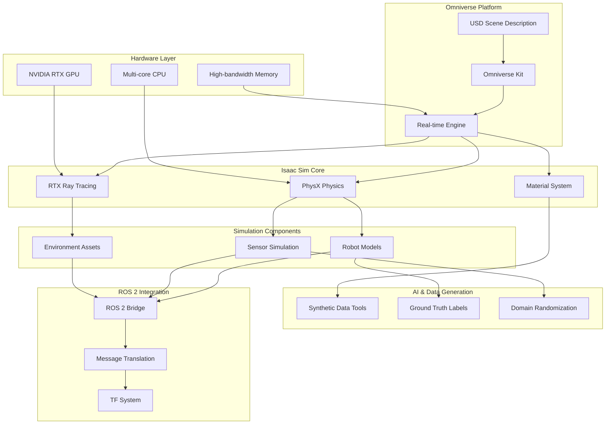

# Isaac Sim Introduction: The Omniverse-Powered Robotics Simulator

NVIDIA Isaac Sim represents a revolutionary leap in robotics simulation, harnessing the power of NVIDIA's Omniverse platform to deliver photorealistic environments and physically accurate simulations. Unlike traditional simulators, Isaac Sim bridges the gap between simulation and reality, enabling the generation of synthetic data that closely matches real-world sensor outputs—a critical capability for training AI systems that must operate in complex, unstructured environments.

## Learning Objectives

By the end of this chapter, you will be able to:
1. Explain the fundamental differences between Isaac Sim and traditional simulators like Gazebo
2. Identify the hardware requirements necessary for running Isaac Sim effectively
3. Understand the basics of Universal Scene Description (USD) and its role in Isaac Sim
4. Configure and utilize the ROS 2 bridge for Isaac Sim integration
5. Implement basic robot spawning and control in Isaac Sim environments

## What is Isaac Sim (Omniverse-Based)?

Isaac Sim is NVIDIA's advanced robotics simulator built on the Omniverse platform, which is designed for real-time 3D design collaboration and simulation. The Omniverse foundation provides Isaac Sim with capabilities that traditional simulators cannot match, including physically based rendering, real-time ray tracing, and support for complex materials and lighting conditions.

The Omniverse platform is built around Universal Scene Description (USD), a powerful scene description format developed by Pixar. USD enables Isaac Sim to create and manipulate complex 3D scenes with unprecedented fidelity, supporting features like:

- **Physically Based Rendering (PBR)**: Materials that respond to light realistically
- **Real-time Ray Tracing**: Accurate lighting, shadows, and reflections
- **Multi-GPU Support**: Scalable rendering across multiple graphics cards
- **Collaborative Editing**: Multiple users can work on the same scene simultaneously

> [!NOTE]
> The Omniverse architecture allows Isaac Sim to import and export scenes using USD, enabling seamless integration with other 3D tools like Blender, Maya, and 3ds Max. This makes it possible to create detailed environments using professional 3D modeling tools and import them directly into Isaac Sim.

### Core Architecture Components

Isaac Sim's architecture consists of several key components:

1. **Omniverse Kit**: The underlying framework that provides the real-time 3D engine
2. **PhysX Engine**: NVIDIA's physics simulation engine for realistic collision and dynamics
3. **RTX Ray Tracing**: Hardware-accelerated ray tracing for photorealistic rendering
4. **ROS 2 Bridge**: Integration layer for ROS 2 communication
5. **Synthetic Data Generation**: Tools for creating labeled training data

## Why Isaac Sim over Gazebo? (Photorealism and Synthetic Data)

The transition from traditional simulators like Gazebo to Isaac Sim represents more than just an upgrade—it's a paradigm shift in how we approach robotics simulation and AI training. While Gazebo excels at physics simulation, Isaac Sim adds a critical dimension: visual realism that enables the generation of synthetic data indistinguishable from real sensor data.

### Photorealistic Rendering

Isaac Sim's physically based rendering engine produces images that are virtually indistinguishable from real-world camera feeds. This photorealism is achieved through:

- **Real-time Ray Tracing**: Accurate simulation of light behavior
- **High Dynamic Range (HDR)**: Wide range of lighting conditions
- **Physically Accurate Materials**: Surfaces that respond to light like real materials
- **Advanced Shading Models**: Realistic appearance under various lighting conditions

### Synthetic Data Generation

The photorealistic rendering capabilities enable Isaac Sim to generate synthetic datasets that can be used to train AI models without requiring real-world data collection:

- **Perfect Ground Truth**: Accurate labels for every pixel in segmentation masks
- **Multiple Sensor Modalities**: RGB, depth, semantic segmentation, and more
- **Controlled Environments**: Precise control over lighting, weather, and scene composition
- **Infinite Variations**: Generate countless variations of the same scene with different parameters

> [!TIP]
> Synthetic data from Isaac Sim can significantly reduce the time and cost of collecting training data for perception systems. A single scene in Isaac Sim can generate thousands of training images with perfect annotations, which would take months to collect in the real world.

### Domain Randomization

Isaac Sim supports domain randomization techniques that help bridge the sim-to-real gap:

- **Randomized Textures**: Varying surface appearances to improve generalization
- **Lighting Variation**: Different times of day, weather conditions, and lighting setups
- **Camera Noise**: Adding realistic sensor noise to synthetic images
- **Dynamic Objects**: Moving elements to simulate real-world complexity

## Hardware Requirements: RTX 4070+, 64GB RAM

Isaac Sim's advanced rendering and simulation capabilities demand significant computational resources. The hardware requirements reflect the need to run real-time ray tracing, complex physics simulation, and potentially train AI models simultaneously.

### Minimum Requirements

- **GPU**: NVIDIA RTX 4070 (12GB VRAM) or equivalent
- **CPU**: Multi-core processor (8+ cores recommended)
- **RAM**: 64GB system memory (128GB recommended for complex scenes)
- **Storage**: High-speed NVMe SSD (2TB+ recommended)
- **OS**: Ubuntu 20.04 or 22.04 LTS

### Recommended Requirements

For optimal performance with complex humanoid robot simulations:

- **GPU**: NVIDIA RTX 4080/4090 or RTX A5000/A6000 for professional use
- **CPU**: AMD Ryzen 7000 series or Intel i9 with 16+ cores
- **RAM**: 128GB system memory
- **VRAM**: 16GB+ for complex scenes with high-resolution textures
- **Multi-GPU**: Support for SLI or multi-GPU setups for extreme scenarios

> [!WARNING]
> Running Isaac Sim with insufficient hardware can result in extremely low frame rates, making interactive development difficult. The RTX 4070 with 12GB VRAM is the absolute minimum for basic functionality; more complex humanoid robot simulations will require more powerful GPUs.

### Performance Considerations

Isaac Sim's performance scales significantly with hardware:

- **Ray Tracing Quality**: Higher-end GPUs can enable more complex lighting effects
- **Scene Complexity**: More VRAM allows for higher-resolution textures and more detailed geometry
- **Simulation Fidelity**: Better GPUs can maintain higher simulation update rates
- **Synthetic Data Generation**: Multiple sensor streams require significant computational resources

## USD (Universal Scene Description) Basics

Universal Scene Description (USD) is the foundational format that enables Isaac Sim's powerful scene composition and collaboration capabilities. Developed by Pixar, USD provides a comprehensive ecosystem for describing, composing, and interchanging 3D scenes and assets.

### USD Core Concepts

USD is built around several fundamental concepts:

- **Prims (Primitives)**: The basic building blocks of USD scenes
- **Properties**: Values associated with prims (position, color, material, etc.)
- **Relationships**: Connections between prims that define scene structure
- **Variants**: Different versions of the same asset that can be switched at runtime
- **Payloads**: Lazy-loaded content that can be loaded on demand

### USD File Structure

A typical USD file (with .usd, .usda, or .usdc extension) contains:

```usda
#usda 1.0
def Xform "Robot" (
    prepend references = @./robot.usd@
)
{
    def Xform "Body"
    {
        def Sphere "Head"
        {
            add xformOp:translate = (0, 1.5, 0)
        }
    }
}
```

### Working with USD in Isaac Sim

Isaac Sim provides several ways to work with USD:

1. **Import Existing USD Files**: Load pre-made scenes and assets
2. **Create Scenes Programmatically**: Use Python APIs to build scenes at runtime
3. **Export Scenes**: Save modified scenes for later use
4. **Stage Manipulation**: Modify scenes dynamically during simulation

### USD Advantages for Robotics

USD offers several advantages specifically for robotics applications:

- **Composition**: Combine multiple robot models and environments easily
- **Version Control**: USD files can be managed with git and other version control systems
- **Interchangeability**: Work with assets from different 3D modeling tools
- **Scalability**: Handle complex scenes with thousands of objects efficiently

> [!TIP]
> When creating robot models for Isaac Sim, consider using USD composition to separate robot components (base, arms, sensors) into different files. This enables easier modification and recombination of robot configurations.

## ROS 2 Bridge in Isaac Sim

The ROS 2 bridge in Isaac Sim provides seamless integration between the Omniverse simulation environment and the ROS 2 ecosystem, enabling the same code to work in both simulation and reality. This bridge translates between Isaac Sim's native message formats and ROS 2 message types, maintaining compatibility with existing ROS 2 tools and packages.

### Bridge Architecture

The Isaac Sim ROS 2 bridge operates through several key components:

- **Message Translation**: Converts between Isaac Sim and ROS 2 message formats
- **TF Integration**: Maintains coordinate transforms between robot frames
- **Service Bridges**: Exposes Isaac Sim functionality through ROS 2 services
- **Action Support**: Enables long-running operations with feedback

### Common ROS 2 Interfaces

The bridge typically handles these common ROS 2 interfaces:

- **Sensor Data**: Camera images, LiDAR scans, IMU readings
- **Robot Control**: Joint commands, velocity commands, pose goals
- **Navigation**: Waypoints, costmaps, path planning requests
- **Perception**: Object detection results, segmentation masks

### Example Python Script to Spawn Robot in Isaac

```python
import carb
import omni
import omni.graph.core as og
from omni.isaac.core import World
from omni.isaac.core.utils.nucleus import get_assets_root_path
from omni.isaac.core.utils.stage import add_reference_to_stage
from omni.isaac.core.utils.prims import get_prim_at_path
from omni.isaac.core.robots import Robot
from omni.isaac.core.utils.viewports import set_camera_view
import numpy as np

def spawn_robot_in_isaac():
    """
    Example script to spawn a robot in Isaac Sim programmatically
    """
    # Initialize the world
    world = World(stage_units_in_meters=1.0)

    # Set up the scene
    world.scene.add_default_ground_plane()

    # Add a robot from the NVIDIA robot library
    assets_root_path = get_assets_root_path()
    if assets_root_path is None:
        carb.log_error("Could not find NVIDIA Isaac Sim assets folder")
        return

    # Example: Spawn a simple wheeled robot
    robot_path = assets_root_path + "/Isaac/Robots/Franka/franka_alt_fingers.usd"

    # Add robot to the stage
    add_reference_to_stage(
        usd_path=robot_path,
        prim_path="/World/Robot"
    )

    # Create robot object
    robot = world.scene.add(
        Robot(
            prim_path="/World/Robot",
            name="franka_robot",
            position=np.array([0, 0, 0.5]),
            orientation=np.array([0, 0, 0, 1])
        )
    )

    # Set camera view for visualization
    set_camera_view(eye=np.array([2.5, 2.5, 2.5]), target=np.array([0, 0, 0]))

    # Reset the world to initialize everything
    world.reset()

    # Example: Move robot joints
    for i in range(100):
        world.step(render=True)
        if i == 50:
            # Example command to robot joints
            # robot.get_articulation_controller().apply_positions(np.array([0.5, 0.5, 0, 0, 0, 0, 0]))
            pass

if __name__ == "__main__":
    spawn_robot_in_isaac()
```

## Mermaid: Isaac Sim Architecture



## Key Takeaways

🌐 **Omniverse Foundation** provides unprecedented rendering and collaboration capabilities
📸 **Photorealism** enables synthetic data generation that matches real sensor data
⚡ **Hardware Requirements** demand RTX 4070+ and 64GB RAM for optimal performance
📦 **USD Format** enables flexible scene composition and asset management
🔗 **ROS 2 Bridge** ensures seamless integration with existing robotics tools
🎨 **Domain Randomization** helps bridge the sim-to-real gap
🎯 **Synthetic Data** accelerates AI training without real-world data collection

## Further Reading

1. [NVIDIA Isaac Sim Documentation](https://docs.omniverse.nvidia.com/isaacsim/latest/index.html) - Official Isaac Sim documentation
2. [Universal Scene Description Guide](https://graphics.pixar.com/usd/docs/index.html) - Complete USD specification and tutorials
3. [Omniverse Developer Guide](https://docs.omniverse.nvidia.com/dev-guide/latest/index.html) - Omniverse platform development resources

## Assessment

### Multiple Choice Questions

1. What is the primary advantage of Isaac Sim over traditional simulators like Gazebo?
   A) Better physics simulation
   B) Photorealistic rendering and synthetic data generation
   C) Lower computational requirements
   D) Simpler user interface

2. Which format is used as the foundation for Isaac Sim's scene description?
   A) SDF (Simulation Description Format)
   B) URDF (Unified Robot Description Format)
   C) USD (Universal Scene Description)
   D) OBJ (Wavefront Object)

3. What is the minimum recommended GPU for running Isaac Sim?
   A) NVIDIA RTX 3060
   B) NVIDIA RTX 4070
   C) NVIDIA RTX 4080
   D) NVIDIA RTX 4090

4. What does USD stand for in the context of Isaac Sim?
   A) Universal Simulation Description
   B) Unified Scene Definition
   C) Universal Scene Description
   D) Universal System Design

### Exercises

1. Install Isaac Sim on a system meeting the minimum hardware requirements and load a simple robot model. Document the installation process and any challenges encountered.

2. Create a simple USD scene with a robot and basic environment using Isaac Sim's Python API. Export the scene and verify that it can be loaded in other USD-compatible tools.

### Mini-Project

Design and implement a complete simulation environment in Isaac Sim that includes:
1. A humanoid robot model imported from the NVIDIA asset library
2. A photorealistic environment with varied lighting conditions
3. Multiple sensor types (camera, LiDAR) properly configured
4. ROS 2 bridge configuration for sensor and control data
5. Documentation explaining the setup and synthetic data generation capabilities

> [!SOLUTION]
> Solution: The project should include:
> 1. A properly configured Isaac Sim environment with humanoid robot
> 2. USD scene with realistic materials and lighting
> 3. Working sensor simulation with ROS 2 bridge
> 4. Verification that synthetic data matches real sensor characteristics
> 5. Documentation explaining the synthetic data generation process