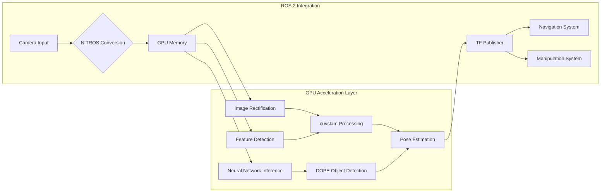

# Isaac ROS Perception: GPU-Accelerated Computer Vision

The NVIDIA Isaac ROS suite represents a paradigm shift in robotics perception, leveraging GPU acceleration to deliver real-time computer vision capabilities that were previously impossible on embedded platforms. By harnessing CUDA cores, Tensor cores, and specialized accelerators like the Optical Flow engine, Isaac ROS enables complex perception tasks to run efficiently on Jetson platforms, making advanced AI capabilities accessible for edge robotics applications.

## Learning Objectives

By the end of this chapter, you will be able to:
1. Compare Isaac ROS perception tools with traditional ROS 2 computer vision approaches
2. Implement GPU acceleration using the NVIDIA Isaac Transport for ROS (NITROS)
3. Configure and deploy Visual SLAM (VSLAM) systems using cuvslam
4. Set up object detection pipelines with DOPE (Dense Object Pose Estimation)
5. Optimize perception pipelines for deployment on NVIDIA Jetson platforms

## Isaac ROS vs Vanilla ROS 2: The GPU Advantage

Traditional ROS 2 perception pipelines rely primarily on CPU-based processing, which limits the complexity and frame rates of computer vision algorithms. Isaac ROS addresses these limitations by providing GPU-accelerated alternatives to common perception tasks, dramatically improving performance while maintaining compatibility with the ROS 2 ecosystem.

### Performance Differences

The performance gap between traditional CPU-based ROS 2 perception and Isaac ROS is substantial:

- **Image Processing**: GPU acceleration can provide 10-100x speedups for operations like image rectification, color conversion, and filtering
- **Feature Detection**: GPU-accelerated feature detection algorithms can process high-resolution images at real-time rates
- **Deep Learning**: Tensor Core acceleration enables real-time inference for complex neural networks
- **Sensor Fusion**: GPU-accelerated algorithms can combine multiple sensor streams with minimal latency

### Architecture Comparison

Traditional ROS 2 perception typically follows a message-passing architecture where sensor data is processed sequentially through a series of nodes. Each node receives messages, processes them on the CPU, and publishes results. This approach can create bottlenecks when multiple complex algorithms need to run simultaneously.

Isaac ROS introduces a more efficient architecture that leverages GPU memory and processing capabilities:

- **GPU Memory Management**: Data remains on GPU memory between processing stages, eliminating costly CPU-GPU transfers
- **Pipeline Optimization**: Multiple operations can be fused into a single GPU kernel for maximum efficiency
- **Hardware Acceleration**: Specialized hardware units (like the Optical Flow engine) are utilized for specific tasks

> [!NOTE]
> Isaac ROS maintains full compatibility with standard ROS 2 message types, ensuring that existing ROS 2 nodes can seamlessly integrate with Isaac ROS accelerated nodes. This allows for hybrid approaches where some perception tasks run on traditional CPU nodes while others leverage GPU acceleration.

### Use Cases for Isaac ROS

Isaac ROS is particularly beneficial for applications requiring:

- High-resolution image processing at real-time rates
- Simultaneous execution of multiple perception algorithms
- Real-time SLAM with high-quality sensors
- Complex deep learning inference on embedded platforms
- Multi-camera processing with minimal latency

## GPU Acceleration with NITROS

The NVIDIA Isaac Transport for ROS (NITROS) is a key technology that enables GPU acceleration in ROS 2 systems. NITROS provides a middleware layer that automatically handles the conversion between CPU-based ROS 2 messages and GPU-optimized data formats, allowing developers to leverage GPU acceleration without modifying their application logic.

### NITROS Architecture

NITROS operates as a plugin-based system that sits between traditional ROS 2 nodes and GPU-accelerated processing blocks:

1. **Message Conversion**: Automatically converts between ROS 2 message formats and GPU-optimized formats
2. **Memory Management**: Handles efficient transfers between CPU and GPU memory
3. **Pipeline Optimization**: Fuses compatible operations to minimize memory transfers
4. **Quality of Service**: Maintains ROS 2 QoS policies while optimizing for GPU processing

### NITROS Components

The NITROS framework consists of several key components:

- **Type Adapters**: Convert between ROS 2 and GPU data formats
- **Graph Optimizer**: Automatically optimize processing pipelines
- **Memory Pool**: Manage GPU memory allocation and reuse
- **Transport Layer**: Handle message passing between CPU and GPU components

### Example NITROS Configuration

```yaml
# Example configuration for NITROS-based image processing pipeline
camera_processing:
  ros__parameters:
    input_topic: "/camera/image_raw"
    output_topic: "/camera/image_processed"

    # NITROS configuration
    nitros:
      enabled: true
      queue_size: 1
      publisher_qos:
        reliability: reliable
        durability: volatile
        history: keep_last
      subscriber_qos:
        reliability: reliable
        durability: volatile
        history: keep_last
```

> [!TIP]
> When designing perception pipelines with NITROS, consider the memory requirements of GPU-accelerated components. High-resolution images and point clouds can consume significant GPU memory, so it's important to optimize memory usage and consider the available VRAM on your target platform.

### Performance Optimization

To maximize the benefits of NITROS:

- **Minimize CPU-GPU Transfers**: Keep data on GPU memory as long as possible
- **Batch Operations**: Process multiple frames simultaneously when possible
- **Optimize Data Formats**: Use GPU-optimized data layouts for maximum throughput
- **Pipeline Fusing**: Combine compatible operations to reduce overhead

## Visual SLAM (VSLAM) with cuvslam

Visual SLAM (Simultaneous Localization and Mapping) is a critical capability for autonomous robots, enabling them to navigate unknown environments while building a map of their surroundings. NVIDIA's cuvslam provides GPU-accelerated Visual SLAM that can process high-resolution images at real-time rates, making it suitable for complex robotics applications.

### cuvslam Architecture

cuvslam leverages GPU acceleration for several key SLAM components:

- **Feature Detection**: GPU-accelerated corner and edge detection
- **Feature Matching**: Fast GPU-based feature correspondence
- **Pose Estimation**: Real-time camera pose calculation
- **Map Building**: GPU-accelerated 3D map construction
- **Loop Closure**: Efficient detection and correction of map loops

### cuvslam Advantages

Compared to traditional CPU-based Visual SLAM systems, cuvslam offers:

- **Higher Frame Rates**: Can process high-resolution images at 30+ FPS
- **Better Feature Detection**: More robust feature extraction in challenging conditions
- **Real-time Performance**: Consistent performance even with complex scenes
- **Scalable Processing**: Can handle multiple camera streams simultaneously

### cuvslam Configuration Parameters

```yaml
# Example cuvslam configuration
cuvslam_node:
  ros__parameters:
    # Camera parameters
    camera_matrix: [615.16, 0.0, 320.0, 0.0, 615.16, 240.0, 0.0, 0.0, 1.0]
    distortion_coefficients: [0.0, 0.0, 0.0, 0.0, 0.0]
    image_width: 640
    image_height: 480

    # SLAM parameters
    tracking_rate_hz: 30.0
    mapping_rate_hz: 10.0
    max_features: 2000
    min_feature_distance: 10.0

    # GPU acceleration
    enable_gpu_acceleration: true
    feature_detector_type: "cuda_fast"
    descriptor_type: "cuda_brief"

    # Map management
    map_publish_rate_hz: 5.0
    keyframe_selection_type: "motion_based"
```

> [!WARNING]
> Visual SLAM systems can be sensitive to lighting conditions and texture-poor environments. When deploying cuvslam in real-world scenarios, ensure adequate lighting and distinctive visual features are present for reliable tracking.

### Integration with Navigation Systems

cuvslam integrates seamlessly with ROS 2 navigation systems:

- **TF Publishing**: Provides camera pose transforms for the TF tree
- **Map Services**: Exposes map data through ROS 2 services
- **Odometry Output**: Publishes visual odometry for navigation systems
- **Sensor Fusion**: Can be combined with IMU and other sensors for robust localization

## Object Detection with DOPE

Dense Object Pose Estimation (DOPE) is a GPU-accelerated object detection and pose estimation system that can identify and localize objects in 3D space from 2D camera images. DOPE is particularly valuable for manipulation tasks where robots need to understand the precise location and orientation of objects in their environment.

### DOPE Architecture

DOPE operates through several key components:

- **Neural Network Inference**: GPU-accelerated deep learning models
- **Pose Refinement**: Iterative pose optimization algorithms
- **Multi-view Fusion**: Combining information from multiple camera views
- **Post-processing**: Filtering and validation of pose estimates

### DOPE Advantages

- **Real-time Performance**: Can process images at 30+ FPS on Jetson platforms
- **Accurate Pose Estimation**: Provides 6-DOF pose information for objects
- **Multiple Object Detection**: Can detect and track multiple objects simultaneously
- **Robust to Occlusions**: Handles partial object visibility effectively

### DOPE Configuration

```yaml
# Example DOPE configuration for object detection
dope_node:
  ros__parameters:
    # Input configuration
    input_rgb: "/camera/rgb/image_raw"
    input_depth: "/camera/depth/image_raw"
    input_camera_info: "/camera/rgb/camera_info"

    # Object models
    objects:
      - name: "cube"
        filename: "package://dope/models/cube.yaml"
        dope_network:
          weights_file: "package://dope/models/cube.pth"
          topic: "/dope/cube"
          pub_dimension: [0.05, 0.05, 0.05]
          show_axis: true

    # Detection parameters
    confidence_threshold: 0.5
    nms_threshold: 0.5
    mask_threshold: 0.5

    # GPU acceleration
    enable_gpu_inference: true
    tensorrt_precision: "fp16"

    # Output configuration
    publish_tf: true
    tf_frame: "camera_link"
```

### Training DOPE Models

DOPE models can be trained using synthetic data generated in Isaac Sim:

1. **Synthetic Dataset Generation**: Create labeled training data in Isaac Sim
2. **Model Training**: Train neural networks using the synthetic dataset
3. **Model Optimization**: Optimize models for TensorRT inference
4. **Deployment**: Deploy optimized models to Jetson platforms

> [!TIP]
> When training DOPE models, use domain randomization techniques in Isaac Sim to improve real-world performance. Randomizing lighting, textures, and backgrounds during training helps the model generalize to different real-world conditions.

## Deploying to Jetson

Deploying Isaac ROS perception pipelines to NVIDIA Jetson platforms requires careful optimization to maximize performance while staying within power and thermal constraints. The Jetson platform's integrated GPU, CPU, and NPU provide a powerful platform for edge AI, but proper configuration is essential for optimal results.

### Jetson Platform Considerations

When deploying to Jetson, consider:

- **Power Management**: Balance performance with power consumption
- **Thermal Management**: Monitor temperatures and adjust performance accordingly
- **Memory Constraints**: Optimize memory usage for limited on-board memory
- **I/O Bandwidth**: Ensure sufficient bandwidth for sensor data streams

### Jetson Optimization Strategies

```bash
# Example Jetson optimization commands
# Set performance mode
sudo nvpmodel -m 0  # MAXN mode for maximum performance

# Set GPU clock to maximum
sudo jetson_clocks  # Lock all clocks to maximum frequency

# Monitor system status
sudo tegrastats  # Monitor power, temperature, and utilization
```

### Jetson-Specific Launch File

```xml
<!-- VSLAM launch file optimized for Jetson -->
<launch>
  <!-- Set environment variables for Jetson optimization -->
  <env name="CUDA_VISIBLE_DEVICES" value="0"/>
  <env name="NVIDIA_VISIBLE_DEVICES" value="all"/>

  <!-- cuvslam node with Jetson-specific parameters -->
  <node pkg="isaac_ros_cuvslam" exec="cuvslam_node" name="cuvslam" output="screen">
    <param name="enable_gpu_acceleration" value="true"/>
    <param name="tensorrt_precision" value="fp16"/>
    <param name="max_features" value="1500"/>  <!-- Reduced for Jetson memory -->
    <param name="tracking_rate_hz" value="20.0"/>  <!-- Adjusted for Jetson -->
  </node>

  <!-- DOPE node optimized for Jetson -->
  <node pkg="isaac_ros_dope" exec="dope_node" name="dope" output="screen">
    <param name="enable_gpu_inference" value="true"/>
    <param name="tensorrt_precision" value="fp16"/>
    <param name="confidence_threshold" value="0.6"/>  <!-- Adjusted for performance -->
  </node>
</launch>
```

## Mermaid: Isaac ROS Perception Pipeline



## Key Takeaways

🚀 **GPU Acceleration** provides 10-100x performance improvements over CPU
⚡ **NITROS Framework** enables seamless GPU-CPU data conversion
👁️ **cuvslam** delivers real-time Visual SLAM with high accuracy
🎯 **DOPE Detection** provides 6-DOF object pose estimation
🔧 **Jetson Optimization** maximizes edge AI performance
📊 **Synthetic Training** improves real-world robustness
🔗 **ROS 2 Compatibility** maintains ecosystem integration

## Further Reading

1. [NVIDIA Isaac ROS Documentation](https://nvidia-isaac-ros.github.io/repositories_and_packages/ros2_rolling_packages/index.html) - Complete Isaac ROS package documentation
2. [NITROS Developer Guide](https://nvidia-isaac-ros.github.io/concepts/nitros/index.html) - Detailed NITROS architecture and usage
3. [Jetson Performance Optimization](https://docs.nvidia.com/jetson/l4t/index.html) - Jetson platform optimization guides

## Assessment

### Multiple Choice Questions

1. What does NITROS stand for in the context of Isaac ROS?
   A) NVIDIA Isaac Transport for ROS
   B) Neural Inference and Transport for ROS
   C) NVIDIA Integrated Tensor for ROS
   D) Neural Information Transfer for ROS

2. What is the primary advantage of cuvslam over traditional CPU-based Visual SLAM?
   A) Lower computational requirements
   B) Higher frame rates and real-time performance
   C) Simpler implementation
   D) Better compatibility with existing code

3. Which of the following is NOT a component of the NITROS framework?
   A) Type Adapters
   B) Graph Optimizer
   C) Memory Pool
   D) Physics Engine

4. What does DOPE stand for in the context of object detection?
   A) Deep Object Pose Estimation
   B) Dense Object Pose Estimation
   C) Dynamic Object Pose Estimation
   D) Distributed Object Pose Estimation

### Exercises

1. Set up a simple Isaac ROS perception pipeline using NITROS that processes camera images and measures the performance improvement over a CPU-only approach.

2. Configure cuvslam with a camera stream and evaluate its performance in different lighting conditions and with varying scene complexity.

### Mini-Project

Develop a complete Isaac ROS perception system that includes:
1. A GPU-accelerated image processing pipeline using NITROS
2. cuvslam for Visual SLAM with proper configuration
3. DOPE for object detection and pose estimation
4. Optimization for Jetson deployment with performance monitoring
5. Integration with ROS 2 navigation and manipulation systems

> [!SOLUTION]
> Solution: The project should include:
> 1. Working NITROS-based image processing pipeline
> 2. Properly configured cuvslam system with performance evaluation
> 3. DOPE object detection with 6-DOF pose estimation
> 4. Jetson optimization with power and performance monitoring
> 5. Integration with navigation and manipulation systems