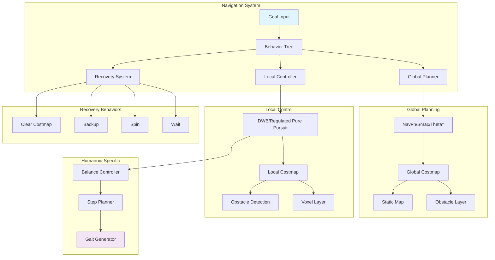

# Nav2 Path Planning: Navigation for Bipedal Humanoids

The Navigation2 (Nav2) stack represents the state-of-the-art in robotic navigation, providing a comprehensive framework for path planning, execution, and control. For bipedal humanoid robots, Nav2 requires specialized configuration and adaptation to account for the unique locomotion characteristics and stability requirements of legged systems. This chapter explores the Nav2 architecture, its core components, and how to adapt it for humanoid navigation challenges.

## Learning Objectives

By the end of this chapter, you will be able to:
1. Understand the Nav2 stack architecture and its core components
2. Configure and tune costmaps for humanoid robot navigation
3. Select and configure appropriate planners for bipedal locomotion
4. Implement and tune controllers suitable for humanoid movement
5. Adapt Nav2 behavior trees for humanoid-specific navigation requirements

## Nav2 Stack Overview

Navigation2 is the next-generation navigation stack for ROS 2, designed to provide robust, flexible, and configurable navigation capabilities for mobile robots. Built as a behavior tree-based system, Nav2 offers improved modularity, better performance, and enhanced configurability compared to its predecessor, ROS 1's navigation stack.

### Core Architecture

The Nav2 stack is organized around several key components that work together to provide complete navigation functionality:

- **Navigator**: The main executive that coordinates navigation tasks using behavior trees
- **Path Planner**: Computes global paths from start to goal positions
- **Controller**: Generates velocity commands to follow the global path
- **Recovery**: Handles navigation failures and obstacles
- **World Model**: Maintains the robot's understanding of the environment

### Behavior Tree Integration

Nav2's behavior tree architecture allows for complex navigation strategies that can adapt to different situations. The behavior tree nodes include:

- **Action Nodes**: Execute specific navigation tasks (planning, controlling, etc.)
- **Condition Nodes**: Check navigation conditions (goal reached, obstacle detected, etc.)
- **Decorator Nodes**: Modify behavior of other nodes (timeouts, loops, etc.)
- **Control Nodes**: Manage flow between child nodes (sequences, selectors, etc.)

> [!NOTE]
> The behavior tree approach in Nav2 provides significant flexibility for customizing navigation behavior. Unlike the monolithic approach of the original ROS navigation stack, Nav2 allows developers to modify specific components without affecting the entire system.

### Modular Design Benefits

The modular design of Nav2 provides several advantages:

- **Component Replacement**: Individual components can be swapped without affecting others
- **Customization**: New planners, controllers, and recovery behaviors can be implemented
- **Testing**: Components can be tested independently
- **Scalability**: The system can be scaled from simple differential drive to complex humanoid robots

## Costmaps: Global and Local

Costmaps in Nav2 represent the robot's knowledge of the environment, encoding information about obstacles, free space, and navigation costs. For humanoid robots, costmap configuration must account for the robot's unique size, shape, and locomotion requirements.

### Global Costmap

The global costmap provides a comprehensive view of the environment and is used by the global planner to compute paths. Key considerations for humanoid robots include:

- **Resolution**: Higher resolution maps provide more detail but require more computational resources
- **Size**: The map must be large enough to plan long-distance paths
- **Update Strategy**: Static maps for known environments vs. continuously updating maps

```yaml
global_costmap:
  global_costmap:
    ros__parameters:
      update_frequency: 1.0
      publish_frequency: 1.0
      global_frame: map
      robot_base_frame: base_link
      use_sim_time: true

      # Costmap resolution (m/cell) - higher for humanoid precision
      resolution: 0.05  # 5cm resolution for detailed planning

      # Robot footprint for collision checking
      footprint: [[-0.3, -0.2], [-0.3, 0.2], [0.3, 0.2], [0.3, -0.2]]
      footprint_padding: 0.01

      # Costmap plugins
      plugins: ["static_layer", "obstacle_layer", "inflation_layer"]
      obstacle_layer:
        plugin: "nav2_costmap_2d::ObstacleLayer"
        enabled: true
        observation_sources: scan
        scan:
          topic: /scan
          max_obstacle_height: 2.0
          clearing: true
          marking: true
          data_type: "LaserScan"
      static_layer:
        plugin: "nav2_costmap_2d::StaticLayer"
        map_topic: /map
        transform_tolerance: 0.5
      inflation_layer:
        plugin: "nav2_costmap_2d::InflationLayer"
        cost_scaling_factor: 3.0  # Higher for humanoid safety
        inflation_radius: 0.55    # Larger for humanoid stability
```

### Local Costmap

The local costmap focuses on the immediate vicinity of the robot and is used by the controller to avoid obstacles during path following. For humanoid robots, the local costmap must account for the robot's dynamic stability requirements.

```yaml
local_costmap:
  local_costmap:
    ros__parameters:
      update_frequency: 5.0
      publish_frequency: 2.0
      global_frame: odom
      robot_base_frame: base_link
      rolling_window: true
      width: 6  # Larger window for humanoid planning horizon
      height: 6
      resolution: 0.05  # Match global costmap resolution

      # Robot footprint for humanoid
      footprint: [[-0.3, -0.2], [-0.3, 0.2], [0.3, 0.2], [0.3, -0.2]]
      footprint_padding: 0.01

      plugins: ["obstacle_layer", "voxel_layer", "inflation_layer"]
      obstacle_layer:
        plugin: "nav2_costmap_2d::ObstacleLayer"
        enabled: true
        observation_sources: scan
        scan:
          topic: /scan
          max_obstacle_height: 2.0
          clearing: true
          marking: true
          data_type: "LaserScan"
      voxel_layer:
        plugin: "nav2_costmap_2d::VoxelLayer"
        enabled: true
        publish_voxel_map: true
        origin_z: 0.0
        z_resolution: 0.2
        z_voxels: 10
        max_obstacle_height: 2.0
      inflation_layer:
        plugin: "nav2_costmap_2d::InflationLayer"
        cost_scaling_factor: 5.0  # Higher for local safety
        inflation_radius: 0.5     # Appropriate for humanoid step planning
```

> [!TIP]
> For humanoid robots, consider increasing the inflation radius in both costmaps to account for the robot's balance requirements. Humanoids need more clearance from obstacles to maintain stability during walking.

### Costmap Parameters for Humanoids

Humanoid robots require specialized costmap parameters:

- **Inflation Radius**: Larger than wheeled robots to account for balance and step planning
- **Footprint**: Must accurately represent the robot's base for collision checking
- **Resolution**: Higher resolution for precise foot placement
- **Update Frequency**: May need to be adjusted based on walking speed

## Planners: NavFn, Smac, and Theta*

Path planners in Nav2 compute global paths from the robot's current position to the goal. Different planners offer various trade-offs between computational efficiency, path quality, and applicability to different robot types.

### NavFn (A* Implementation)

NavFn is a grid-based path planner based on Dijkstra's algorithm with an A* heuristic. It's reliable and produces good-quality paths for most scenarios.

```yaml
bt_navigator:
  ros__parameters:
    use_sim_time: true
    global_frame: map
    robot_base_frame: base_link
    odom_topic: /odom
    default_nav_through_poses_bt_xml: nav2_bt_navigator/nav_through_poses_w_replanning_and_recovery.xml
    default_nav_to_pose_bt_xml: nav2_bt_navigator/nav_to_pose_w_replanning_and_recovery.xml
    plugin_lib_names:
      - nav2_compute_path_to_pose_action
      - nav2_compute_path_through_poses_action

navfn_planner:
  ros__parameters:
    use_sim_time: true
    allow_unknown: true
    tolerance: 0.5  # Increased for humanoid flexibility
    use_astar: false
    visualize_potential: false
```

### Smac Planner (Spatio-Temporal Motion Planning)

The Smac planner is a more advanced grid-based planner that can handle 2.5D planning (x, y, yaw) and is particularly useful for robots with non-holonomic constraints.

```yaml
smac_planner:
  ros__parameters:
    use_sim_time: true
    motion_model: "DUBINSLIKE"  # For robots that can only move forward
    tolerance: 0.25
    downsample_costmap: false
    downsampling_factor: 1
    costmap_scale_factor: 1.0
    inflation_radius: 0.55
    heuristic_scale: 1.0
    cache_obstacles: true
    allow_unknown: true
    max_iterations: 1000000
    max_planning_time: 5.0
    smoother:
      max_iterations: 1000
      w_smooth: 0.3
      w_data: 0.2
```

### Theta* Planner

Theta* is an any-angle path planner that can produce shorter, more natural-looking paths by allowing diagonal movements through the grid.

```yaml
theta_star_planner:
  ros__parameters:
    use_sim_time: true
    tolerance: 0.1
    maximum_planning_time: 5.0
    maximum_iterations: 100000
    max_on_approach_iterations: 1000
    lookup_table_size: 20
    allow_unknown: true
    use_final_approach_orientation: false
    smooth_path: true
```

> [!WARNING]
> For humanoid robots, avoid planners that assume holonomic movement (ability to move in any direction). Humanoids have non-holonomic constraints similar to cars, so planners like Smac with Dubins-like motion models are more appropriate.

### Planner Selection for Humanoids

When selecting planners for humanoid robots, consider:

- **Non-holonomic Constraints**: Humanoids cannot move sideways like holonomic robots
- **Turning Radius**: Humanoids have limited ability to turn in place
- **Step Planning**: Need to consider individual foot placement
- **Balance Requirements**: Paths must allow for stable locomotion

## Controllers: DWB and Regulated Pure Pursuit

Controllers in Nav2 generate velocity commands to follow the global path while avoiding local obstacles. For humanoid robots, controllers must account for balance, step timing, and dynamic stability.

### DWB (Dynamic Window Approach) Controller

DWB is a local planner that uses the Dynamic Window Approach to generate velocity commands. It's particularly suitable for robots with dynamic constraints like humanoids.

```yaml
dwb_controller:
  ros__parameters:
    use_sim_time: true
    debug_trajectory_details: false
    min_vel_x: 0.0
    min_vel_y: 0.0
    max_vel_x: 0.5    # Slower for humanoid stability
    max_vel_y: 0.0
    max_vel_theta: 0.3
    min_speed_xy: 0.0
    max_speed_xy: 0.5
    min_speed_theta: 0.0
    acc_lim_x: 0.5    # Lower acceleration for humanoid balance
    acc_lim_y: 0.0
    acc_lim_theta: 0.3
    decel_lim_x: -0.5
    decel_lim_y: 0.0
    decel_lim_theta: -0.3
    vx_samples: 20
    vy_samples: 0
    vtheta_samples: 40
    sim_time: 1.7
    linear_granularity: 0.05
    angular_granularity: 0.025
    transform_tolerance: 0.2
    xy_goal_tolerance: 0.25  # Larger for humanoid
    yaw_goal_tolerance: 0.15
    stateful: true
    restore_defaults: false
    scaling_speed: 0.25
    scaling_factor: 0.003
    velocity_scaling_type: 0
    max_scaling_factor: 0.2
```

### Regulated Pure Pursuit Controller

The Regulated Pure Pursuit controller is designed for car-like robots and can be adapted for humanoid navigation with careful tuning.

```yaml
regulated_pp:
  ros__parameters:
    use_sim_time: true
    desired_linear_vel: 0.4      # Conservative for humanoid
    lookahead_dist: 0.6
    lookahead_time: 1.5
    rotate_to_heading_angular_vel: 1.0
    transform_tolerance: 0.1
    use_velocity_scaled_lookahead_dist: false
    min_lookahead_dist: 0.3
    max_lookahead_dist: 0.9
    use_interpolation: true
    velocity_scaling_type: 0
    scaling_lin_vel_with_controller_freq: true
    max_allowed_time_to_collision_up_to_carrot: 1.0
    carrot_planner:
      name: "carrot_planner"
      plugin: "nav2_navfn_planner/NavfnPlanner"
      tolerance: 0.5
      use_astar: false
      allow_unknown: true
```

> [!TIP]
> For humanoid robots, use lower velocity limits and acceleration values to maintain balance during navigation. The conservative values help prevent falls during path following.

### Humanoid-Specific Controller Considerations

Humanoid controllers must address:

- **Balance Maintenance**: Velocities and accelerations must not compromise stability
- **Step Timing**: Commands must align with the robot's walking gait
- **Foot Placement**: Path following should consider where feet can be placed
- **Recovery Behavior**: Fall prevention and recovery strategies

## Adapting Nav2 for Bipedal Humanoids

Bipedal humanoid robots present unique challenges for navigation systems due to their dynamic locomotion, balance requirements, and complex kinematics. Adapting Nav2 for humanoid robots requires modifications to standard parameters and potentially custom plugins.

### Humanoid-Specific Parameters

```yaml
# Complete Nav2 configuration for humanoid robot
bt_navigator:
  ros__parameters:
    use_sim_time: true
    global_frame: map
    robot_base_frame: base_link
    odom_topic: /odom
    bt_loop_duration: 10
    server_timeout: 20
    enable_groot_monitoring: true
    groot_zmq_publisher_port: 1666
    groot_zmq_server_port: 1667
    default_nav_through_poses_bt_xml: /opt/ros/humble/share/nav2_bt_navigator/behavior_trees/navigate_w_replanning_and_recovery.xml
    default_nav_to_pose_bt_xml: /opt/ros/humble/share/nav2_bt_navigator/behavior_trees/navigate_w_replanning_and_recovery.xml
    plugin_lib_names:
      - nav2_compute_path_to_pose_action
      - nav2_compute_path_through_poses_action
      - nav2_follow_path_action
      - nav2_back_up_action
      - nav2_spin_action
      - nav2_wait_action
      - nav2_clear_costmap_service
      - nav2_is_stuck_condition
      - nav2_goal_reached_condition
      - nav2_goal_updated_condition
      - nav2_initial_pose_received_condition
      - nav2_reinitialize_global_localization_on_displacement_condition
      - nav2_rate_controller
      - nav2_distance_controller
      - nav2_speed_controller
      - nav2_truncate_path_action
      - nav2_goal_updater_node
      - nav2_recovery_node
      - nav2_pipeline_sequence
      - nav2_round_robin_node
      - nav2_transform_available_condition
      - nav2_time_expired_condition
      - nav2_path_expiring_timer_condition
      - nav2_distance_traveled_condition
      - nav2_single_trigger
      - nav2_is_path_valid_condition
      - nav2_compute_path_through_poses_action
      - nav2_remove_passed_goals_action
      - nav2_planner_server
      - nav2_controller_server
      - nav2_recovery_server
      - nav2_bt_navigator
      - nav2_velocity_smoother
      - nav2_pose_smoother
      - nav2_lifecycle_manager
      - nav2_world_model
      - nav2_dwb_controller
      - nav2_smac_planner
      - nav2_navfn_planner
      - nav2_theta_star_planner
      - nav2_spatial_stats

# Humanoid-specific parameters
planner_server:
  ros__parameters:
    use_sim_time: true
    planner_plugins: ["GridBased"]
    GridBased:
      plugin: "nav2_navfn_planner/NavfnPlanner"
      tolerance: 0.5
      use_astar: false
      allow_unknown: true

controller_server:
  ros__parameters:
    use_sim_time: true
    controller_frequency: 20.0
    min_x_velocity_threshold: 0.001
    min_y_velocity_threshold: 0.5
    min_theta_velocity_threshold: 0.001
    failure_tolerance: 0.3
    progress_checker_plugin: "progress_checker"
    goal_checker_plugin: "goal_checker"
    controller_plugins: ["FollowPath"]

    # Humanoid-specific controller
    FollowPath:
      plugin: "nav2_dwb_controller/DWBLocalPlanner"
      debug_trajectory_details: false
      min_vel_x: 0.0
      min_vel_y: 0.0
      max_vel_x: 0.3      # Very conservative for humanoid
      max_vel_y: 0.0
      max_vel_theta: 0.2
      min_speed_xy: 0.0
      max_speed_xy: 0.3
      min_speed_theta: 0.0
      acc_lim_x: 0.3      # Low acceleration for balance
      acc_lim_y: 0.0
      acc_lim_theta: 0.2
      decel_lim_x: -0.3
      decel_lim_y: 0.0
      decel_lim_theta: -0.2
      vx_samples: 10      # Fewer samples for humanoid constraints
      vy_samples: 1
      vtheta_samples: 20
      sim_time: 1.5       # Shorter simulation horizon
      linear_granularity: 0.05
      angular_granularity: 0.025
      transform_tolerance: 0.2
      xy_goal_tolerance: 0.3  # Larger tolerance for humanoid
      yaw_goal_tolerance: 0.2
      stateful: true
      restore_defaults: false
      scaling_speed: 0.25
      scaling_factor: 0.005
      velocity_scaling_type: 0
      max_scaling_factor: 0.1

progress_checker:
  ros__parameters:
    use_sim_time: true
    plugin: "nav2_controller::SimpleProgressChecker"
    required_movement_radius: 0.5  # Larger for humanoid step size
    movement_time_allowance: 10.0

goal_checker:
  ros__parameters:
    use_sim_time: true
    plugin: "nav2_controller::SimpleGoalChecker"
    xy_goal_tolerance: 0.3
    yaw_goal_tolerance: 0.2
    stateful: true

velocity_smoother:
  ros__parameters:
    use_sim_time: true
    smoothing_frequency: 20.0
    scale_velocities: false
    velocity_timeout: 1.0
    max_velocity: [1.0, 1.0, 1.0]
    min_velocity: [-1.0, -1.0, -1.0]
    max_accel: [2.5, 2.5, 3.2]
    max_decel: [-2.5, -2.5, -3.2]
    odom_topic: "odom"
    velocity_topic: "cmd_vel"
```

### Behavior Tree Customization

For humanoid robots, the behavior tree may need customization to handle unique recovery behaviors:

```xml
<!-- Custom behavior tree for humanoid navigation -->
<root main_tree_to_execute="MainTree">
  <BehaviorTree ID="MainTree">
    <RecoveryNode number_of_retries="6" name="NavigateRecovery">
      <PipelineSequence name="NavigateWithReplanning">
        <RateController hz="1.0">
          <RecoveryNode number_of_retries="1" name="ComputePathToPose">
            <ComputePathToPose goal="{goal}" path="{path}" planner_id="GridBased"/>
            <ClearEntireCostmap name="ClearGlobalCostmap-Context" service_name="global_costmap/clear_entirely_global_costmap"/>
          </RecoveryNode>
        </RateController>
        <RecoveryNode number_of_retries="2" name="FollowPath">
          <FollowPath path="{path}" controller_id="FollowPath"/>
          <ClearEntireCostmap name="ClearLocalCostmap-Context" service_name="local_costmap/clear_entirely_local_costmap"/>
        </RecoveryNode>
      </PipelineSequence>
      <RecoveryNode number_of_retries="3" name="BackupHumanoid">
        <BackUp distance="0.3" speed="0.1"/>
      </RecoveryNode>
      <RecoveryNode number_of_retries="2" name="SpinHumanoid">
        <Spin spin_dist="1.57"/>
      </RecoveryNode>
    </RecoveryNode>
  </BehaviorTree>
</root>
```

## Mermaid: Nav2 Architecture + Behavior Tree



## Key Takeaways

🗺️ **Nav2 Architecture** provides modular, behavior tree-based navigation
📊 **Costmaps** require humanoid-specific inflation and resolution
🔄 **Planners** must account for non-holonomic humanoid constraints
🕹️ **Controllers** need conservative velocity/acceleration limits
🤖 **Humanoid Adaptation** requires custom parameters and recovery behaviors
🎯 **Path Planning** must consider balance and step constraints
🔗 **Behavior Trees** enable customizable navigation strategies

## Further Reading

1. [Nav2 Documentation](https://navigation.ros.org/) - Complete Nav2 stack documentation
2. [Nav2 Tutorials](https://navigation.ros.org/tutorials/index.html) - Practical Nav2 implementation guides
3. [Humanoid Navigation Research](https://ieeexplore.ieee.org/document/9145348) - Academic research on humanoid navigation

## Assessment

### Multiple Choice Questions

1. What does DWB stand for in the context of Nav2 controllers?
   A) Dynamic Waypoint Behavior
   B) Dynamic Window Based
   C) Dynamic Window Approach
   D) Direct Waypoint Behavior

2. Which planner is most appropriate for humanoid robots with non-holonomic constraints?
   A) NavFn with holonomic model
   B) Smac with Dubins-like motion model
   C) Theta* with any-angle movement
   D) All planners are equally suitable

3. What is the primary purpose of costmap inflation in Nav2?
   A) To reduce computational requirements
   B) To add safety margins around obstacles
   C) To improve map resolution
   D) To increase navigation speed

4. For humanoid robots, why are velocity limits typically set lower than for wheeled robots?
   A) To reduce power consumption
   B) To maintain balance and stability
   C) To improve accuracy
   D) To reduce wear on components

### Exercises

1. Configure Nav2 for a simulated humanoid robot with appropriate costmap, planner, and controller parameters. Test the navigation in various environments and document the performance.

2. Modify the behavior tree to include humanoid-specific recovery behaviors and evaluate their effectiveness in obstacle avoidance scenarios.

### Mini-Project

Implement a complete Nav2 navigation system for a humanoid robot that includes:
1. Custom costmap configuration with appropriate inflation for humanoid balance
2. Planner selection and configuration for non-holonomic humanoid movement
3. Controller tuning for stable humanoid locomotion
4. Behavior tree customization for humanoid-specific navigation
5. Comprehensive testing in simulation with performance evaluation

> [!SOLUTION]
> Solution: The project should include:
> 1. Properly configured Nav2 stack with humanoid-specific parameters
> 2. Validated costmap settings with appropriate inflation for balance
> 3. Suitable planner and controller for humanoid constraints
> 4. Customized behavior tree with humanoid recovery behaviors
> 5. Testing results demonstrating stable humanoid navigation