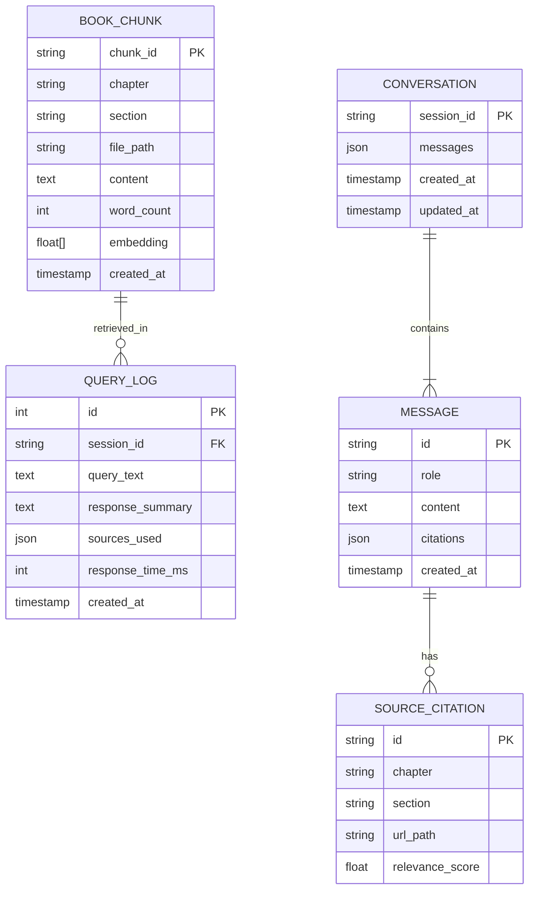
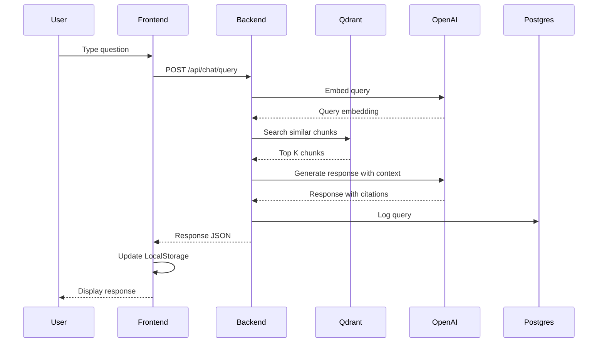
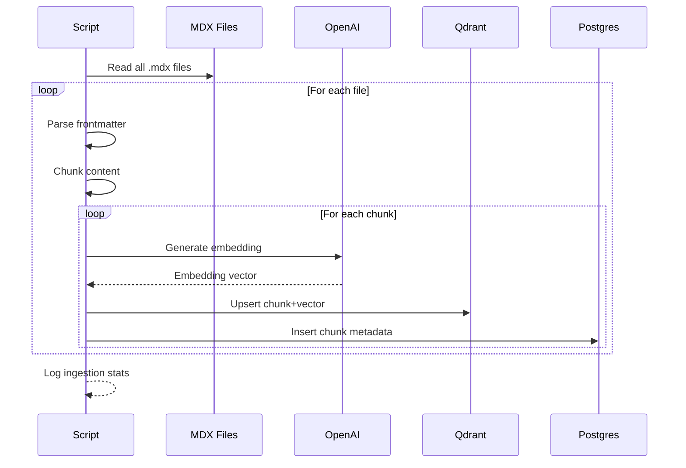

# Data Model: RAG Chatbot

**Feature**: 002-rag-chatbot
**Date**: 2025-12-17
**Status**: Complete

## Overview

This document defines the data entities, relationships, and storage strategy for the RAG chatbot system. The model spans three storage systems: Qdrant (vectors), Neon Postgres (relational), and browser LocalStorage (session).

---

## Entity Relationship Diagram



---

## Entity Definitions

### 1. BookChunk

**Description**: A segment of book content optimized for embedding and retrieval.

**Storage**:
- Metadata: Neon Postgres `book_chunks` table
- Vector + Content: Qdrant `physical-ai-book` collection

**Fields**:

| Field | Type | Required | Description |
|-------|------|----------|-------------|
| chunk_id | string | Yes | Unique identifier (format: `{file_path}#{chunk_index}`) |
| chapter | string | Yes | Chapter name (from frontmatter or H1) |
| section | string | Yes | Section name (from H2/H3 header) |
| file_path | string | Yes | Relative path to source MDX file |
| content | text | Yes | Raw text content of the chunk |
| word_count | integer | Yes | Number of words in chunk |
| embedding | float[1536] | Yes | OpenAI embedding vector |
| created_at | timestamp | Yes | When chunk was created |

**Constraints**:
- chunk_id must be unique
- word_count should be 400-900 (target 500-800 with flexibility)
- file_path must be valid MDX file in docs/

**Example**:
```json
{
  "chunk_id": "docs/03-kinematics/forward-kinematics.mdx#2",
  "chapter": "Robot Kinematics",
  "section": "Forward Kinematics",
  "file_path": "docs/03-kinematics/forward-kinematics.mdx",
  "content": "Forward kinematics is the computation of end-effector position...",
  "word_count": 612,
  "embedding": [0.0234, -0.0156, ...],
  "created_at": "2025-12-17T10:00:00Z"
}
```

---

### 2. QueryLog

**Description**: Record of user queries for analytics and debugging.

**Storage**: Neon Postgres `query_logs` table

**Fields**:

| Field | Type | Required | Description |
|-------|------|----------|-------------|
| id | serial | Yes | Auto-incrementing primary key |
| session_id | string | No | Browser session identifier |
| query_text | text | Yes | User's question (verbatim) |
| response_summary | text | No | First 500 chars of response |
| sources_used | jsonb | No | Array of chunk_ids used in response |
| response_time_ms | integer | Yes | Total response time in milliseconds |
| context_type | string | No | "full" or "selection" |
| selected_text | text | No | Text user selected (if applicable) |
| created_at | timestamp | Yes | When query was made |

**Constraints**:
- query_text must not be empty
- response_time_ms must be positive
- context_type enum: "full", "selection"

**Example**:
```json
{
  "id": 1234,
  "session_id": "abc123def456",
  "query_text": "What is inverse kinematics?",
  "response_summary": "Inverse kinematics (IK) is the mathematical process...",
  "sources_used": ["docs/03-kinematics/inverse-kinematics.mdx#1", "docs/03-kinematics/inverse-kinematics.mdx#2"],
  "response_time_ms": 1850,
  "context_type": "full",
  "selected_text": null,
  "created_at": "2025-12-17T14:30:00Z"
}
```

---

### 3. Conversation (Frontend)

**Description**: Session-based conversation state stored in browser.

**Storage**: Browser LocalStorage (key: `rag_conversation`)

**Fields**:

| Field | Type | Required | Description |
|-------|------|----------|-------------|
| session_id | string | Yes | UUID generated on first interaction |
| messages | Message[] | Yes | Array of messages in conversation |
| created_at | timestamp | Yes | Session start time |
| updated_at | timestamp | Yes | Last activity time |

**Constraints**:
- Cleared on page refresh/close (per spec)
- Maximum 50 messages (oldest removed if exceeded)
- Session expires after 30 minutes of inactivity

**Example**:
```json
{
  "session_id": "550e8400-e29b-41d4-a716-446655440000",
  "messages": [...],
  "created_at": "2025-12-17T14:00:00Z",
  "updated_at": "2025-12-17T14:30:00Z"
}
```

---

### 4. Message (Frontend)

**Description**: A single message in a conversation.

**Storage**: Embedded in Conversation (LocalStorage)

**Fields**:

| Field | Type | Required | Description |
|-------|------|----------|-------------|
| id | string | Yes | UUID for message |
| role | string | Yes | "user" or "assistant" |
| content | text | Yes | Message content (markdown for assistant) |
| citations | Citation[] | No | Source citations (assistant only) |
| context | object | No | Selected text context (user only) |
| created_at | timestamp | Yes | When message was sent |

**Constraints**:
- role must be "user" or "assistant"
- citations only present for assistant messages
- context only present for user messages with text selection

**Example (User)**:
```json
{
  "id": "msg-001",
  "role": "user",
  "content": "What is inverse kinematics?",
  "context": null,
  "created_at": "2025-12-17T14:30:00Z"
}
```

**Example (Assistant)**:
```json
{
  "id": "msg-002",
  "role": "assistant",
  "content": "**Inverse kinematics (IK)** is the mathematical process of calculating...",
  "citations": [
    {
      "chapter": "Robot Kinematics",
      "section": "Inverse Kinematics",
      "url": "/docs/03-kinematics/inverse-kinematics"
    }
  ],
  "created_at": "2025-12-17T14:30:02Z"
}
```

---

### 5. SourceCitation

**Description**: A reference to a book location used in a response.

**Storage**: Embedded in Message (LocalStorage) and QueryLog (Postgres)

**Fields**:

| Field | Type | Required | Description |
|-------|------|----------|-------------|
| chunk_id | string | Yes | Reference to BookChunk |
| chapter | string | Yes | Chapter display name |
| section | string | Yes | Section display name |
| url | string | Yes | Navigation URL in Docusaurus |
| relevance_score | float | No | Similarity score (0-1) |

**Example**:
```json
{
  "chunk_id": "docs/03-kinematics/inverse-kinematics.mdx#1",
  "chapter": "Robot Kinematics",
  "section": "Inverse Kinematics",
  "url": "/docs/03-kinematics/inverse-kinematics",
  "relevance_score": 0.89
}
```

---

## Storage Schema

### Neon Postgres Schema

```sql
-- Enable UUID extension
CREATE EXTENSION IF NOT EXISTS "uuid-ossp";

-- Book chunks metadata (vectors stored in Qdrant)
CREATE TABLE book_chunks (
    id SERIAL PRIMARY KEY,
    chunk_id VARCHAR(500) UNIQUE NOT NULL,
    chapter VARCHAR(255) NOT NULL,
    section VARCHAR(255) NOT NULL,
    file_path VARCHAR(500) NOT NULL,
    word_count INTEGER NOT NULL CHECK (word_count > 0),
    created_at TIMESTAMPTZ DEFAULT NOW()
);

CREATE INDEX idx_book_chunks_chapter ON book_chunks(chapter);
CREATE INDEX idx_book_chunks_file_path ON book_chunks(file_path);

-- Query logs for analytics
CREATE TABLE query_logs (
    id SERIAL PRIMARY KEY,
    session_id VARCHAR(255),
    query_text TEXT NOT NULL,
    response_summary TEXT,
    sources_used JSONB DEFAULT '[]',
    response_time_ms INTEGER NOT NULL CHECK (response_time_ms >= 0),
    context_type VARCHAR(50) DEFAULT 'full',
    selected_text TEXT,
    created_at TIMESTAMPTZ DEFAULT NOW()
);

CREATE INDEX idx_query_logs_session ON query_logs(session_id);
CREATE INDEX idx_query_logs_created ON query_logs(created_at DESC);
CREATE INDEX idx_query_logs_response_time ON query_logs(response_time_ms);

-- View for analytics
CREATE VIEW query_analytics AS
SELECT
    DATE(created_at) as query_date,
    COUNT(*) as total_queries,
    AVG(response_time_ms) as avg_response_time,
    COUNT(CASE WHEN context_type = 'selection' THEN 1 END) as selection_queries,
    COUNT(CASE WHEN context_type = 'full' THEN 1 END) as full_queries
FROM query_logs
GROUP BY DATE(created_at)
ORDER BY query_date DESC;
```

### Qdrant Collection Schema

```json
{
  "collection_name": "physical-ai-book",
  "vectors": {
    "size": 1536,
    "distance": "Cosine"
  },
  "payload_schema": {
    "chunk_id": "keyword",
    "chapter": "keyword",
    "section": "keyword",
    "file_path": "keyword",
    "content": "text",
    "word_count": "integer"
  }
}
```

### LocalStorage Schema

```typescript
interface LocalStorageSchema {
  // Conversation state
  rag_conversation: {
    session_id: string;
    messages: Message[];
    created_at: string;
    updated_at: string;
  };

  // User preferences (optional)
  rag_preferences: {
    theme: 'light' | 'dark' | 'system';
    panel_position: 'right' | 'bottom';
  };
}
```

---

## Data Flow

### Query Flow



### Ingestion Flow



---

## Validation Rules

### BookChunk Validation
- chunk_id: Non-empty, matches pattern `{path}#{index}`
- chapter: Non-empty, max 255 chars
- section: Non-empty, max 255 chars
- content: Non-empty, 100-5000 words
- word_count: Must match actual word count

### QueryLog Validation
- query_text: Non-empty, max 2000 chars
- response_time_ms: 0-60000 (max 1 minute)
- sources_used: Valid JSON array of chunk_ids
- context_type: Must be "full" or "selection"

### Message Validation
- role: Must be "user" or "assistant"
- content: Non-empty for user, may be empty for loading state
- citations: Must reference valid chapters/sections

---

## Migration Strategy

### Initial Setup
1. Create Neon Postgres database
2. Run schema creation SQL
3. Create Qdrant collection with proper config
4. Run ingestion script to populate both stores

### Schema Changes
- Use numbered migration files: `001_initial.sql`, `002_add_field.sql`
- Always add columns as nullable first, then backfill
- Never delete columns without deprecation period

### Data Refresh
- Content ingestion is idempotent (upsert)
- Re-run ingestion when book content changes
- No need to clear existing data (chunks are replaced)
