# Implementation Plan: RAG Chatbot for Physical AI Book

**Branch**: `002-rag-chatbot` | **Date**: 2025-12-17 | **Spec**: [spec.md](./spec.md)
**Input**: Feature specification from `/specs/002-rag-chatbot/spec.md`

## Summary

Build an embedded RAG chatbot for the Physical AI & Humanoid Robotics Docusaurus book that enables students to query book content with both full-text and text-selection modes. The system uses a FastAPI backend with OpenAI embeddings, Qdrant vector storage, and Neon Postgres for logging. The frontend is a custom React/TypeScript component integrated with Docusaurus, supporting text selection for contextual queries and mobile-responsive design.

## Technical Context

**Language/Version**: Python 3.11+ (backend), TypeScript (frontend)
**Primary Dependencies**: FastAPI, OpenAI SDK, qdrant-client, asyncpg, React, Docusaurus 3.x
**Storage**: Qdrant Cloud (vectors), Neon Serverless Postgres (logs/metadata)
**Testing**: pytest (backend), Jest (frontend), E2E manual testing
**Target Platform**: Web (GitHub Pages frontend, Railway backend)
**Project Type**: Web application (frontend + backend)
**Performance Goals**: <3s query response, <500ms embedding, <200ms search
**Constraints**: Free tier services only, CORS from GitHub Pages
**Scale/Scope**: ~15K chunks, 50 concurrent users

## Constitution Check

*GATE: Must pass before Phase 0 research. Re-check after Phase 1 design.*

| Principle | Status | Evidence |
|-----------|--------|----------|
| I. Excellence in Content Creation | N/A | Feature, not content |
| II. Reusable Intelligence | PASS | ChatBot component exportable |
| III. Full-Featured Implementation | PASS | Text selection + citations included |
| IV. RAG Chatbot Excellence | PASS | Full-book + selected-text queries |
| V. Deployment Perfection | PASS | Railway + GitHub Pages plan |
| VI. Technical Standards Compliance | PASS | FastAPI + Neon + Qdrant stack |

**Additional Constraints**:
- Free-tier services only: PASS (Qdrant Cloud, Neon, Railway)
- Time constraint (≤10 hours): Plan organized by phases for efficiency
- Production-ready code: No TODOs or placeholders

## Project Structure

### Documentation (this feature)

```text
specs/002-rag-chatbot/
├── spec.md              # Feature specification
├── plan.md              # This file
├── research.md          # Technical decisions
├── data-model.md        # Entity definitions
├── quickstart.md        # Developer guide
├── contracts/
│   └── openapi.yaml     # API specification
├── decisions/           # ADR documents
│   ├── ADR-001-embedding-model.md
│   ├── ADR-002-llm-model.md
│   ├── ADR-003-chunking-strategy.md
│   └── ADR-004-frontend-framework.md
├── checklists/
│   └── requirements.md  # Quality checklist
└── tasks.md             # Implementation tasks (via /sp.tasks)
```

### Source Code (repository root)

```text
backend/
├── main.py                    # FastAPI app entry point
├── config.py                  # Environment configuration
├── routers/
│   ├── __init__.py
│   ├── chat.py                # /api/chat/* endpoints
│   └── health.py              # /health endpoint
├── services/
│   ├── __init__.py
│   ├── rag.py                 # RAG pipeline orchestration
│   ├── embedding.py           # OpenAI embedding service
│   ├── vector_store.py        # Qdrant client wrapper
│   ├── llm.py                 # OpenAI chat completion
│   └── database.py            # Neon Postgres client
├── models/
│   ├── __init__.py
│   └── schemas.py             # Pydantic request/response models
├── scripts/
│   └── ingest_content.py      # MDX ingestion script
├── tests/
│   ├── __init__.py
│   ├── test_rag_service.py    # RAG pipeline tests
│   ├── test_chat_endpoint.py  # API endpoint tests
│   └── conftest.py            # Test fixtures
├── .env.example               # Environment template
├── requirements.txt           # Python dependencies
├── Dockerfile                 # Container definition
└── README.md                  # Backend documentation

website/src/components/ChatBot/
├── index.tsx                  # Main export, provider wrapper
├── ChatWidget.tsx             # Floating button + collapsible panel
├── ChatPanel.tsx              # Message list + input area
├── ChatMessage.tsx            # Individual message with citations
├── TextSelection.tsx          # Selection detection + floating button
├── LoadingIndicator.tsx       # Typing/loading animation
├── ErrorBoundary.tsx          # Error handling wrapper
├── hooks/
│   ├── useChat.ts             # Chat state and API calls
│   ├── useTextSelection.ts    # Selection API wrapper
│   └── useLocalStorage.ts     # Session persistence
├── types.ts                   # TypeScript interfaces
├── api.ts                     # Backend API client
├── constants.ts               # Configuration constants
└── styles.module.css          # CSS modules for styling
```

**Structure Decision**: Web application with separate backend (Python/FastAPI) and frontend (React/TypeScript in Docusaurus). Backend handles RAG pipeline and persistence; frontend handles UI and text selection.

## Architecture Overview


## Implementation Phases

### Phase 1: Backend Foundation

**Goal**: Working FastAPI server with health checks and database connections.

**Deliverables**:
- FastAPI app with CORS middleware
- `/health` endpoint with service status
- Qdrant client connection
- Neon Postgres connection with asyncpg
- Configuration via environment variables
- Basic error handling middleware

**Acceptance Criteria**:
- `GET /health` returns 200 with service status
- All external services report "connected"
- CORS allows requests from localhost and GitHub Pages
- Environment variables properly loaded

**Files**:
- `backend/main.py`
- `backend/config.py`
- `backend/routers/health.py`
- `backend/services/database.py`
- `backend/services/vector_store.py`
- `backend/.env.example`
- `backend/requirements.txt`

---

### Phase 2: RAG Pipeline

**Goal**: Core retrieval and generation pipeline working end-to-end.

**Deliverables**:
- Embedding service (OpenAI text-embedding-3-small)
- Vector store service (Qdrant search)
- LLM service (gpt-4o-mini with Groq fallback)
- RAG pipeline orchestration
- Citation extraction from retrieved chunks
- Context assembly for LLM

**Acceptance Criteria**:
- Query embedding completes in <500ms
- Vector search returns top-k results in <200ms
- LLM generates response with citations
- Total pipeline <3s for standard queries
- Citations include chapter, section, URL

**Files**:
- `backend/services/embedding.py`
- `backend/services/llm.py`
- `backend/services/rag.py`
- `backend/models/schemas.py`

---

### Phase 3: Content Ingestion

**Goal**: All book content indexed and searchable.

**Deliverables**:
- MDX parser for frontmatter and headers
- Hybrid chunking strategy (markdown-aware + fixed-size)
- Batch embedding generation
- Qdrant collection population
- Postgres metadata storage
- Ingestion script with progress reporting

**Acceptance Criteria**:
- All MDX files from `website/docs/` processed
- Chunks are 500-800 words (with flexibility)
- No content lost or duplicated
- Metadata correctly extracted
- Ingestion is idempotent (re-runnable)

**Files**:
- `backend/scripts/ingest_content.py`
- SQL migrations in `backend/migrations/`

---

### Phase 4: Chat Endpoint

**Goal**: Production-ready API endpoint for chat queries.

**Deliverables**:
- `POST /api/chat/query` endpoint
- Request validation (Pydantic)
- Context handling (selected text)
- Conversation history support
- Query logging to Postgres
- Rate limiting
- Comprehensive error responses

**Acceptance Criteria**:
- Valid queries return responses with citations
- Invalid queries return 400 with helpful message
- Rate limiting prevents abuse
- All queries logged with timing
- Errors never expose internal details

**Files**:
- `backend/routers/chat.py`
- `backend/models/schemas.py` (extended)
- `backend/tests/test_chat_endpoint.py`

---

### Phase 5: Frontend Component

**Goal**: Chat UI integrated with Docusaurus.

**Deliverables**:
- ChatWidget (floating button + panel)
- ChatPanel (message list + input)
- ChatMessage (content + citations)
- useChat hook (state + API)
- Theme integration (light/dark)
- Mobile responsive layout
- Keyboard accessibility

**Acceptance Criteria**:
- Chat widget visible on all pages
- Messages render with markdown support
- Citations are clickable links
- Theme matches Docusaurus
- Usable on 320px screens
- Keyboard navigable

**Files**:
- `website/src/components/ChatBot/*.tsx`
- `website/src/components/ChatBot/hooks/*.ts`
- `website/src/components/ChatBot/styles.module.css`

---

### Phase 6: Text Selection

**Goal**: Contextual queries via text selection.

**Deliverables**:
- useTextSelection hook
- TextSelection component
- Floating "Ask about this" button
- Context passing to chat
- Mobile touch support
- Selection clearing on chat close

**Acceptance Criteria**:
- Button appears near selected text
- Click opens chat with context
- Context shows in chat panel
- Works on desktop and mobile
- No interference with normal selection

**Files**:
- `website/src/components/ChatBot/TextSelection.tsx`
- `website/src/components/ChatBot/hooks/useTextSelection.ts`

---

### Phase 7: Integration & Deployment

**Goal**: Full system deployed and operational.

**Deliverables**:
- ChatBot added to Docusaurus Root
- Backend deployed to Railway
- Environment variables configured
- CORS origins updated
- GitHub Actions workflow (if needed)
- End-to-end testing completed

**Acceptance Criteria**:
- Full query flow works in production
- Text selection works on deployed site
- No console errors
- Response times meet targets
- All success criteria from spec pass

**Files**:
- `website/src/theme/Root.tsx` (or equivalent)
- `backend/Dockerfile`
- `.github/workflows/deploy-backend.yml` (optional)

---

## Testing Strategy

### Unit Tests (Backend)

```python
# test_embedding.py
def test_embed_query_returns_vector():
    """Query embedding returns 1536-dimensional vector"""

def test_embed_query_handles_empty_string():
    """Empty query raises validation error"""

# test_vector_store.py
def test_search_returns_top_k():
    """Search returns exactly k results ordered by score"""

def test_search_filters_by_chapter():
    """Chapter filter restricts results correctly"""

# test_rag.py
def test_rag_pipeline_returns_citations():
    """Full pipeline returns response with citations"""

def test_rag_handles_no_results():
    """Graceful handling when no relevant content found"""
```

### Integration Tests (Backend)

```python
# test_chat_endpoint.py
def test_query_endpoint_success():
    """POST /api/chat/query returns valid response"""

def test_query_with_context():
    """Query with selected text context works"""

def test_query_logging():
    """Query is logged to database"""

def test_rate_limiting():
    """Rate limit returns 429 after threshold"""
```

### E2E Testing (Manual Checklist)

| Test | Expected Result |
|------|-----------------|
| Ask "What is inverse kinematics?" | Response with IK explanation, cites kinematics chapter |
| Ask about topic not in book | Polite message suggesting available topics |
| Select text, click "Ask about this" | Chat opens with selection as context |
| Ask follow-up "explain simpler" | Response simplifies previous topic |
| Click citation link | Navigates to correct chapter/section |
| Open on mobile (375px) | Chat panel usable, touch-friendly |
| Toggle dark mode | Chat UI matches theme |
| Rapid-fire 10 queries | All succeed, no timeouts |
| Backend restart mid-query | Graceful error, retry works |

### Performance Testing

| Metric | Target | Test Method |
|--------|--------|-------------|
| Query response | <3s | Measure 10 queries, avg |
| Embedding latency | <500ms | Time embedding call |
| Vector search | <200ms | Time Qdrant query |
| Cold start | <5s | First request after idle |
| Concurrent users | 50 | Load test with k6 |

---

## Risk Mitigation

| Risk | Probability | Impact | Mitigation |
|------|-------------|--------|------------|
| OpenAI rate limits | Medium | High | Groq fallback, request queuing |
| Railway credit exhaustion | Low | Medium | Monitor usage, Render backup |
| Qdrant downtime | Low | High | Local cache, error message |
| Cold start >3s | Medium | Medium | Keep-alive cron job |
| Text selection browser quirks | Medium | Low | Feature detection, fallback |
| Chunking misses content | Low | Medium | Validation script, manual review |

---

## ADR Summary

The following architectural decisions are documented in `decisions/`:

| ADR | Decision | Rationale |
|-----|----------|-----------|
| ADR-001 | OpenAI text-embedding-3-small | Quality + consistency with LLM |
| ADR-002 | gpt-4o-mini + Groq fallback | Speed + quality + backup |
| ADR-003 | Hybrid chunking (MD-aware + fixed) | Context preservation |
| ADR-004 | Custom React component | Theme + customization |

---

## Complexity Tracking

> **No constitution violations detected. All choices align with principles.**

| Consideration | Decision | Justification |
|---------------|----------|---------------|
| External services (3) | Required | RAG needs vector DB, embeddings, LLM |
| Custom frontend | Required | Theme matching, text selection |
| Hybrid chunking | Worth complexity | Better retrieval quality |

---

## Implementation Order

```mermaid
gantt
    title RAG Chatbot Implementation
    dateFormat  HH:mm
    axisFormat %H:%M

    section Backend
    Phase 1 - Foundation    :p1, 00:00, 1h
    Phase 2 - RAG Pipeline  :p2, after p1, 2h
    Phase 3 - Ingestion     :p3, after p2, 1h
    Phase 4 - Chat Endpoint :p4, after p3, 1h

    section Frontend
    Phase 5 - Chat UI       :p5, after p4, 2h
    Phase 6 - Text Select   :p6, after p5, 1h

    section Deploy
    Phase 7 - Integration   :p7, after p6, 1h
    Testing & Polish        :p8, after p7, 1h
```



**Estimated Total**: ~10 hours (within constitution constraint)

---

## Next Steps

1. Run `/sp.tasks` to generate detailed implementation tasks
2. Create ADR documents in `decisions/` directory
3. Begin Phase 1 implementation
4. Follow Red-Green-Refactor cycle per task
