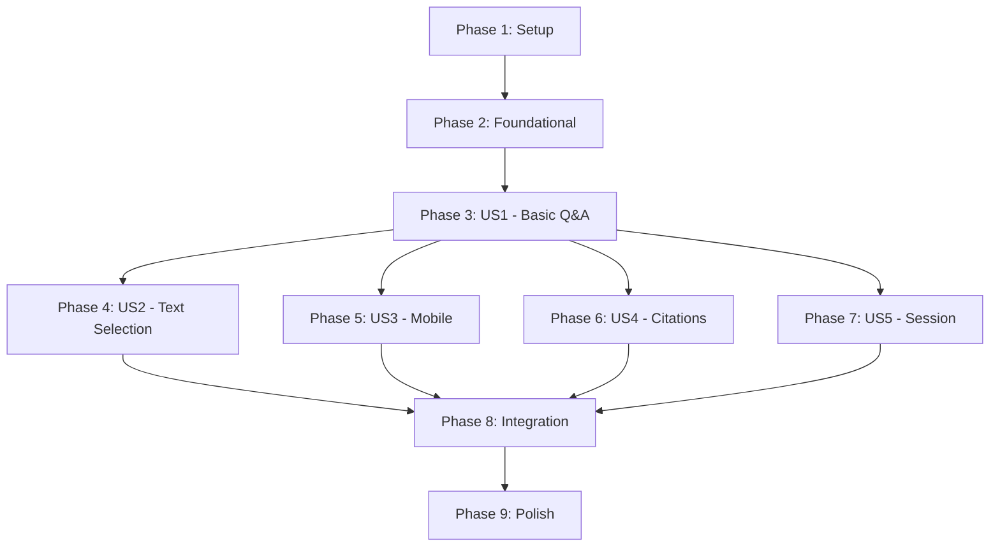

# Tasks: RAG Chatbot for Physical AI Book

**Input**: Design documents from `/specs/002-rag-chatbot/`
**Prerequisites**: plan.md, spec.md, research.md, data-model.md, contracts/openapi.yaml
**Branch**: `002-rag-chatbot`
**Date**: 2025-12-17

**Tests**: Backend unit and integration tests included as specified in plan.md testing strategy.

**Organization**: Tasks grouped by user story to enable independent implementation and testing.

## Format: `[ID] [P?] [Story] Description`

- **[P]**: Can run in parallel (different files, no dependencies)
- **[Story]**: Which user story (US1-US5) - only in story phases
- Include exact file paths in descriptions

## Path Conventions

- **Backend**: `backend/` (FastAPI Python)
- **Frontend**: `website/src/components/ChatBot/` (React TypeScript)
- **Docs**: `website/docs/` (MDX content for ingestion)

---

## Phase 1: Setup (Shared Infrastructure)

**Purpose**: Project initialization, dependencies, and configuration

- [ ] T001 Create backend directory structure per plan: `backend/{routers,services,models,scripts,tests}/`
- [ ] T002 [P] Create `backend/requirements.txt` with FastAPI, uvicorn, openai, qdrant-client, asyncpg, python-dotenv, pydantic
- [ ] T003 [P] Create `backend/.env.example` with OPENAI_API_KEY, QDRANT_URL, QDRANT_API_KEY, DATABASE_URL, CORS_ORIGINS placeholders
- [ ] T004 [P] Create `backend/config.py` with Pydantic Settings for environment variable loading
- [ ] T005 Create `backend/main.py` with FastAPI app, CORS middleware for GitHub Pages origins
- [ ] T006 [P] Create frontend component directory: `website/src/components/ChatBot/`
- [ ] T007 [P] Create `website/src/components/ChatBot/types.ts` with Message, Citation, Conversation interfaces per data-model.md
- [ ] T008 [P] Create `website/src/components/ChatBot/constants.ts` with API_URL, MAX_MESSAGES, SESSION_TIMEOUT configs

**Checkpoint**: Project structure ready, environment configured

---

## Phase 2: Foundational (Blocking Prerequisites)

**Purpose**: Core backend services that ALL user stories depend on

**CRITICAL**: No user story work can begin until this phase is complete

### Database & Vector Store Connections

- [ ] T009 Create `backend/services/__init__.py` with service exports
- [ ] T010 [P] Create `backend/services/database.py` with asyncpg connection pool for Neon Postgres
- [ ] T011 [P] Create `backend/services/vector_store.py` with Qdrant client initialization and collection setup
- [ ] T012 Create `backend/migrations/001_initial.sql` with book_chunks and query_logs tables per data-model.md schema

### Embedding & LLM Services

- [ ] T013 [P] Create `backend/services/embedding.py` with OpenAI text-embedding-3-small integration per ADR-001
- [ ] T014 [P] Create `backend/services/llm.py` with gpt-4o-mini + Groq fallback per ADR-002
- [ ] T015 Create `backend/models/__init__.py` with model exports
- [ ] T016 Create `backend/models/schemas.py` with Pydantic models: ChatQueryRequest, ChatQueryResponse, Citation, ErrorResponse per openapi.yaml

### Health Endpoint

- [ ] T017 Create `backend/routers/__init__.py` with router exports
- [ ] T018 Create `backend/routers/health.py` with GET /health endpoint checking Qdrant, Postgres, OpenAI connectivity per openapi.yaml

### Content Ingestion

- [ ] T019 Create `backend/scripts/ingest_content.py` with MDX parser, hybrid chunking (ADR-003), embedding generation, Qdrant/Postgres population
- [ ] T020 Run ingestion script to populate Qdrant collection `physical-ai-book` with all `website/docs/**/*.mdx` content

**Checkpoint**: Foundation ready - all services connected, content indexed

---

## Phase 3: User Story 1 - Ask Question About Book Content (Priority: P1)

**Goal**: Student types question, receives accurate answer with citations within 3 seconds

**Independent Test**: Ask "What is inverse kinematics?" → Get response with kinematics chapter citation

### Tests for User Story 1

- [ ] T021 [P] [US1] Create `backend/tests/__init__.py` and `backend/tests/conftest.py` with pytest fixtures
- [ ] T022 [P] [US1] Create `backend/tests/test_embedding.py` with test_embed_query_returns_vector, test_embed_handles_empty
- [ ] T023 [P] [US1] Create `backend/tests/test_vector_store.py` with test_search_returns_top_k, test_search_filters_by_chapter
- [ ] T024 [P] [US1] Create `backend/tests/test_rag_service.py` with test_rag_returns_citations, test_rag_handles_no_results

### Implementation for User Story 1

- [ ] T025 [US1] Create `backend/services/rag.py` with RAG pipeline: embed query → search Qdrant → assemble context → generate response with citations
- [ ] T026 [US1] Create `backend/routers/chat.py` with POST /api/chat/query endpoint per openapi.yaml
- [ ] T027 [US1] Add query logging to `backend/services/database.py` - insert query_logs on each request
- [ ] T028 [P] [US1] Create `backend/tests/test_chat_endpoint.py` with test_query_success, test_query_validation, test_query_logging
- [ ] T029 [P] [US1] Create `website/src/components/ChatBot/api.ts` with chatQuery() function calling POST /api/chat/query
- [ ] T030 [P] [US1] Create `website/src/components/ChatBot/hooks/useChat.ts` with messages state, sendMessage(), session management
- [ ] T031 [US1] Create `website/src/components/ChatBot/ChatMessage.tsx` with markdown rendering and citation display
- [ ] T032 [US1] Create `website/src/components/ChatBot/ChatPanel.tsx` with message list, input field, send button, loading state
- [ ] T033 [US1] Create `website/src/components/ChatBot/ChatWidget.tsx` with floating button and collapsible panel
- [ ] T034 [US1] Create `website/src/components/ChatBot/LoadingIndicator.tsx` with typing animation
- [ ] T035 [US1] Create `website/src/components/ChatBot/ErrorBoundary.tsx` with error state and retry button
- [ ] T036 [US1] Create `website/src/components/ChatBot/styles.module.css` with base styling matching Docusaurus theme variables
- [ ] T037 [US1] Create `website/src/components/ChatBot/index.tsx` main export wrapping ChatWidget

**Checkpoint**: User Story 1 complete - basic Q&A with citations working

---

## Phase 4: User Story 2 - Text Selection Contextual Query (Priority: P2)

**Goal**: Student selects text, clicks "Ask about this", gets contextual answer

**Independent Test**: Select text on any chapter page → Click floating button → Chat opens with selection as context

### Implementation for User Story 2

- [ ] T038 [P] [US2] Create `website/src/components/ChatBot/hooks/useTextSelection.ts` with Selection API listener, position calculation
- [ ] T039 [US2] Create `website/src/components/ChatBot/TextSelection.tsx` with floating "Ask about this" button near selection
- [ ] T040 [US2] Update `website/src/components/ChatBot/hooks/useChat.ts` to accept context parameter with selected_text
- [ ] T041 [US2] Update `website/src/components/ChatBot/ChatPanel.tsx` to display selected text context in conversation
- [ ] T042 [US2] Update `backend/services/rag.py` to prioritize same-chapter content when context.source_chapter provided
- [ ] T043 [US2] Update `website/src/components/ChatBot/styles.module.css` with selection button styling

**Checkpoint**: User Story 2 complete - text selection triggers contextual chat

---

## Phase 5: User Story 3 - Mobile-Responsive Chat Experience (Priority: P3)

**Goal**: Chat interface works on mobile devices (320px+) with touch-friendly interactions

**Independent Test**: Access book on 375px viewport → Open chat → Type and receive response without layout issues

### Implementation for User Story 3

- [ ] T044 [P] [US3] Update `website/src/components/ChatBot/styles.module.css` with mobile breakpoints, full-screen panel at <768px
- [ ] T045 [US3] Update `website/src/components/ChatBot/ChatWidget.tsx` with mobile-optimized FAB (56x56px touch target)
- [ ] T046 [US3] Update `website/src/components/ChatBot/ChatPanel.tsx` with mobile layout (bottom sheet), virtual keyboard handling
- [ ] T047 [US3] Update `website/src/components/ChatBot/TextSelection.tsx` with touch-friendly selection handling

**Checkpoint**: User Story 3 complete - mobile experience polished

---

## Phase 6: User Story 4 - Source Citation and Navigation (Priority: P4)

**Goal**: Citations in responses are clickable links that navigate to the source chapter/section

**Independent Test**: Ask question → Click citation → Browser navigates to correct Docusaurus page section

### Implementation for User Story 4

- [ ] T048 [US4] Update `website/src/components/ChatBot/ChatMessage.tsx` with clickable citation links using Docusaurus Link
- [ ] T049 [US4] Update `backend/services/rag.py` to generate correct Docusaurus URLs for citations (e.g., /docs/03-kinematics/inverse-kinematics)
- [ ] T050 [US4] Update `website/src/components/ChatBot/styles.module.css` with citation link styling (hover, visited states)

**Checkpoint**: User Story 4 complete - citations navigate to source

---

## Phase 7: User Story 5 - Conversation Within Session (Priority: P5)

**Goal**: Follow-up questions understand previous context within session

**Independent Test**: Ask question → Ask follow-up "explain simpler" → Response references previous topic

### Implementation for User Story 5

- [ ] T051 [P] [US5] Create `website/src/components/ChatBot/hooks/useLocalStorage.ts` with session persistence utilities
- [ ] T052 [US5] Update `website/src/components/ChatBot/hooks/useChat.ts` to include conversation_history in API requests
- [ ] T053 [US5] Update `backend/routers/chat.py` to pass conversation_history to RAG pipeline
- [ ] T054 [US5] Update `backend/services/rag.py` to include conversation context in LLM prompt
- [ ] T055 [US5] Update `backend/services/llm.py` to format multi-turn conversation for gpt-4o-mini

**Checkpoint**: User Story 5 complete - session context maintained

---

## Phase 8: Integration & Deployment

**Purpose**: Full system integration, deployment to production

### Docusaurus Integration

- [ ] T056 Create `website/src/theme/Root.tsx` to wrap all pages with ChatBot component
- [ ] T057 Update `website/docusaurus.config.js` customFields with chatbotApiUrl environment variable

### Backend Deployment

- [ ] T058 Create `backend/Dockerfile` with Python 3.11, uvicorn, production settings
- [ ] T059 Create `backend/README.md` with setup instructions, API docs, deployment guide
- [ ] T060 Deploy backend to Railway.app with environment variables configured
- [ ] T061 Update `backend/config.py` CORS_ORIGINS with production GitHub Pages URL

### End-to-End Validation

- [ ] T062 Run E2E test: Ask question → Receive cited answer → Click citation → Navigate to source
- [ ] T063 Run E2E test: Select text → Click "Ask about this" → Receive contextual answer
- [ ] T064 Run mobile test: 375px viewport → Complete full query flow
- [ ] T065 Run performance test: Verify <3s query response time on production

**Checkpoint**: All user stories deployed and validated

---

## Phase 9: Polish & Cross-Cutting Concerns

**Purpose**: Final improvements affecting multiple stories

- [ ] T066 [P] Add rate limiting middleware to `backend/main.py` (60 requests/minute per IP)
- [ ] T067 [P] Add request logging middleware to `backend/main.py` for debugging
- [ ] T068 [P] Update `website/src/components/ChatBot/styles.module.css` with dark mode support using --ifm-* variables
- [ ] T069 Add keyboard navigation to `website/src/components/ChatBot/ChatPanel.tsx` (Enter to send, Escape to close)
- [ ] T070 Add ARIA labels to all ChatBot components for screen reader accessibility
- [ ] T071 [P] Create `specs/002-rag-chatbot/user-guide.md` with end-user documentation
- [ ] T072 Run final Lighthouse audit - verify zero console errors, good accessibility score

---

## Dependencies & Execution Order

### Phase Dependencies



### User Story Dependencies

| Story | Depends On | Can Parallelize With |
|-------|------------|----------------------|
| US1 (P1) | Phase 2 Foundational | None (must complete first) |
| US2 (P2) | US1 complete | US3, US4, US5 |
| US3 (P3) | US1 complete | US2, US4, US5 |
| US4 (P4) | US1 complete | US2, US3, US5 |
| US5 (P5) | US1 complete | US2, US3, US4 |

### Within Each User Story

1. Tests written FIRST (fail before implementation)
2. Backend services before frontend components
3. Core functionality before styling
4. Integration tested before moving to next story

### Parallel Opportunities

**Phase 1 (Setup)**: T002, T003, T004 can run in parallel (different files)
**Phase 2 (Foundational)**: T010, T011, T013, T014 can run in parallel
**Phase 3 (US1) Tests**: T021, T022, T023, T024 can run in parallel
**Phase 3 (US1) Frontend**: T029, T030 can run in parallel
**After US1 Complete**: US2, US3, US4, US5 can all start in parallel

---

## Parallel Example: Phase 2 Foundational

```bash
# Launch database and vector store setup in parallel:
Task: "Create backend/services/database.py with asyncpg connection pool"
Task: "Create backend/services/vector_store.py with Qdrant client"
Task: "Create backend/services/embedding.py with OpenAI integration"
Task: "Create backend/services/llm.py with gpt-4o-mini + Groq fallback"
```

## Parallel Example: After US1 Complete

```bash
# Team can split across user stories:
Developer A: "Phase 4: US2 - Text Selection" (T038-T043)
Developer B: "Phase 5: US3 - Mobile" (T044-T047)
Developer C: "Phase 6: US4 - Citations" (T048-T050)
Developer D: "Phase 7: US5 - Session" (T051-T055)
```

---

## Implementation Strategy

### MVP First (User Story 1 Only)

1. Complete Phase 1: Setup (~30 min)
2. Complete Phase 2: Foundational (~2 hours)
3. Complete Phase 3: User Story 1 (~2 hours)
4. **STOP and VALIDATE**: Test basic Q&A with citations
5. Deploy MVP to Railway + GitHub Pages
6. **Hackathon evaluators can verify core RAG functionality**

### Incremental Delivery

1. MVP (US1): Basic Q&A with citations ✓
2. +US2: Text selection contextual queries
3. +US3: Mobile responsive experience
4. +US4: Clickable citation navigation
5. +US5: Multi-turn conversation context
6. Polish: Rate limiting, accessibility, dark mode

### Estimated Time

| Phase | Tasks | Estimated Time |
|-------|-------|----------------|
| Setup | T001-T008 | 30 min |
| Foundational | T009-T020 | 2 hours |
| US1 (MVP) | T021-T037 | 2 hours |
| US2 | T038-T043 | 1 hour |
| US3 | T044-T047 | 45 min |
| US4 | T048-T050 | 30 min |
| US5 | T051-T055 | 45 min |
| Integration | T056-T065 | 1.5 hours |
| Polish | T066-T072 | 1 hour |
| **Total** | 72 tasks | ~10 hours |

---

## Summary

| Category | Count |
|----------|-------|
| Total Tasks | 72 |
| Setup Phase | 8 |
| Foundational Phase | 12 |
| User Story 1 (P1) | 17 |
| User Story 2 (P2) | 6 |
| User Story 3 (P3) | 4 |
| User Story 4 (P4) | 3 |
| User Story 5 (P5) | 5 |
| Integration | 10 |
| Polish | 7 |
| Parallelizable [P] | 28 |

---

## Notes

- [P] tasks = different files, safe to run in parallel
- [US#] label maps task to user story for traceability
- Each story independently testable after completion
- Backend tests in `backend/tests/`, run with `pytest`
- Frontend in `website/src/components/ChatBot/`
- Commit after each task or logical group
- Stop at any checkpoint to validate independently
