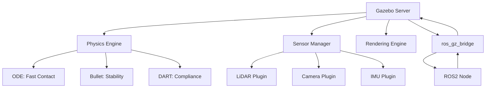
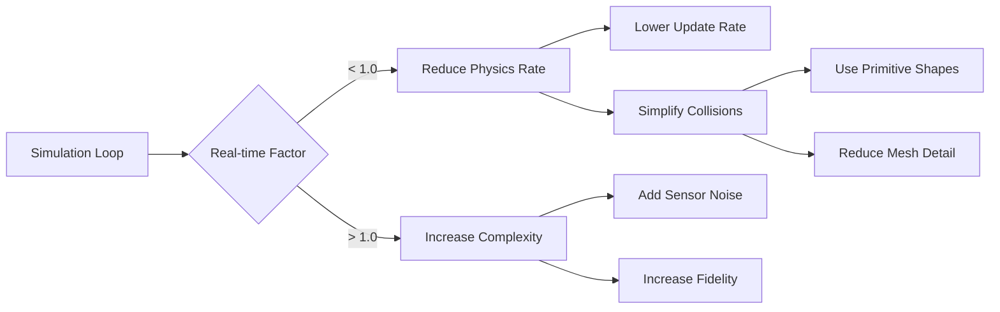

# Gazebo Simulation for Humanoid Robotics

Before deploying a humanoid robot that costs hundreds of thousands of dollars, you need absolute confidence that your control algorithms won't cause catastrophic failures. Gazebo Fortress provides a physically accurate simulation environment where you can break virtual robots thousands of times, iterate rapidly, and validate behaviors that would be dangerous or impossible to test on hardware. This chapter teaches you to build simulation environments that bridge the reality gap between virtual testing and physical deployment.

> **By the end of this chapter, you will:**
> - Configure Gazebo Fortress with appropriate physics engines for humanoid simulation
> - Create SDF world files with realistic environments and model spawning
> - Integrate ROS2 and Gazebo using ros_gz_bridge for bidirectional communication
> - Select and tune physics engine parameters for stability and performance

## Why Gazebo Fortress for Humanoid Robotics

Gazebo has evolved from a simple 3D visualizer to a production-grade simulation platform used by Boston Dynamics, Agility Robotics, and research labs worldwide. Fortress, the current LTS release, supports modern ROS2 integration, GPU-accelerated rendering, and multiple physics engines optimized for different simulation requirements.

Unlike lightweight simulators, Gazebo models contact dynamics, friction, and joint constraints with sufficient fidelity to transfer learned behaviors to real hardware. For humanoid robotics, this means you can develop bipedal locomotion controllers, manipulation strategies, and perception pipelines entirely in simulation before risking expensive hardware.



## Physics Engine Selection

Gazebo supports three physics engines, each with distinct tradeoffs for humanoid simulation:

**ODE (Open Dynamics Engine)**: Fast iterative solver optimized for rigid body contact. Excellent for wheeled robots and manipulation with many contact points. Struggles with stiff constraints in humanoid joints, leading to jitter and energy drift during long simulations.

**Bullet**: Stable constraint solver with robust collision detection. Better for humanoid bipedal locomotion where joint stability is critical. Higher computational cost than ODE but maintains energy conservation over extended simulations.

**DART (Dynamic Animation and Robotics Toolkit)**: State-of-the-art solver supporting compliant contact models and analytical gradients. Ideal for optimization-based control and contact-rich manipulation. Required for modern reinforcement learning workflows where gradient information accelerates training.

> **TIP**: Start with Bullet for general humanoid development. Switch to DART when implementing model-based control or policy optimization that requires differentiable physics.

## SDF World Configuration

Simulation Description Format (SDF) defines worlds, models, and their physics properties. Unlike URDF (covered in Chapter 2), SDF supports complete world descriptions including lighting, terrain, and multiple independent models.

```xml
<?xml version="1.0"?>
<sdf version="1.9">
  <world name="humanoid_lab">
    <physics name="bullet_physics" type="bullet">
      <max_step_size>0.001</max_step_size>
      <real_time_factor>1.0</real_time_factor>
      <real_time_update_rate>1000</real_time_update_rate>
      <bullet>
        <solver>
          <type>sequential_impulse</type>
          <iters>200</iters>
          <sor>1.3</sor>
        </solver>
        <constraints>
          <cfm>0.00001</cfm>
          <erp>0.2</erp>
          <contact_surface_layer>0.001</contact_surface_layer>
        </constraints>
      </bullet>
    </physics>

    <scene>
      <ambient>0.4 0.4 0.4 1.0</ambient>
      <shadows>true</shadows>
      <grid>false</grid>
    </scene>

    <model name="ground_plane">
      <static>true</static>
      <link name="link">
        <collision name="collision">
          <geometry>
            <plane><normal>0 0 1</normal></plane>
          </geometry>
          <surface>
            <friction>
              <ode><mu>0.8</mu><mu2>0.8</mu2></ode>
              <bullet><friction>0.8</friction><friction2>0.8</friction2></bullet>
            </friction>
          </surface>
        </collision>
      </link>
    </model>

    <light name="sun" type="directional">
      <pose>0 0 10 0 0 0</pose>
      <diffuse>0.8 0.8 0.8 1</diffuse>
      <specular>0.2 0.2 0.2 1</specular>
    </light>

    <include>
      <uri>model://obstacles_course</uri>
      <pose>5 0 0 0 0 0</pose>
    </include>
  </world>
</sdf>
```

> **WARNING**: Setting `max_step_size` below 0.001 (1ms) rarely improves accuracy but drastically increases computation. For humanoid simulation, 1ms steps balance stability and performance.

Key parameters explained:

- **max_step_size**: Physics integration timestep. Smaller values increase accuracy but reduce real-time performance.
- **cfm** (Constraint Force Mixing): Softens constraints, preventing numerical instability. Too high causes spongy joints.
- **erp** (Error Reduction Parameter): How aggressively the solver corrects constraint violations. Balance between stability (low values) and responsiveness (high values).

## ROS2 Integration with ros_gz_bridge

The `ros_gz_bridge` package translates between Gazebo's internal messaging (Ignition Transport) and ROS2's DDS middleware. This enables ROS2 nodes to command simulated robots and consume sensor data as if interacting with real hardware.

```python
from launch import LaunchDescription
from launch_ros.actions import Node
from launch.actions import IncludeLaunchDescription
from launch.launch_description_sources import PythonLaunchDescriptionSource
from ament_index_python.packages import get_package_share_directory
import os

def generate_launch_description():
    pkg_ros_gz_sim = get_package_share_directory('ros_gz_sim')

    # Launch Gazebo
    gazebo = IncludeLaunchDescription(
        PythonLaunchDescriptionSource(
            os.path.join(pkg_ros_gz_sim, 'launch', 'gz_sim.launch.py')
        ),
        launch_arguments={
            'gz_args': '-r humanoid_lab.sdf'
        }.items()
    )

    # Bridge joint states from Gazebo to ROS2
    bridge_joint_states = Node(
        package='ros_gz_bridge',
        executable='parameter_bridge',
        arguments=[
            '/model/humanoid/joint_state@sensor_msgs/msg/JointState[gz.msgs.Model',
            '--ros-args', '-r', '/model/humanoid/joint_state:=/joint_states'
        ],
        output='screen'
    )

    # Bridge joint commands from ROS2 to Gazebo
    bridge_joint_cmds = Node(
        package='ros_gz_bridge',
        executable='parameter_bridge',
        arguments=[
            '/model/humanoid/joint/cmd_pos@std_msgs/msg/Float64MultiArray]gz.msgs.Double'
        ],
        output='screen'
    )

    # Bridge IMU sensor data
    bridge_imu = Node(
        package='ros_gz_bridge',
        executable='parameter_bridge',
        arguments=[
            '/model/humanoid/imu@sensor_msgs/msg/Imu[gz.msgs.IMU'
        ],
        output='screen'
    )

    return LaunchDescription([
        gazebo,
        bridge_joint_states,
        bridge_joint_cmds,
        bridge_imu
    ])
```

> **NOTE**: The bridge uses a specific syntax: `<topic>@<ros_msg_type>[<gz_msg_type>` for Gazebo-to-ROS or `]<gz_msg_type>` for ROS-to-Gazebo. The `@` symbol separates topic from message types.

## Performance Optimization Strategies



Achieving real-time simulation (RTF = 1.0) for complex humanoids requires:

1. **Collision Geometry Simplification**: Replace high-poly meshes with primitive collision shapes (boxes, cylinders, spheres) that approximate the visual model.

2. **Adaptive Physics Rates**: Run physics at 1000Hz but render and sensor updates at 30-60Hz. Most control algorithms don't require kilohertz sensor data.

3. **GPU Offloading**: Enable GPU-based ray tracing for LiDAR and depth cameras when available. Can achieve 10-100x speedup for sensor simulation.

4. **Parallel Simulation**: For reinforcement learning, run multiple Gazebo instances in parallel, each simulating different scenarios. Tools like Isaac Gym demonstrate 1000+ parallel environments.

> **IMPORTANT**: Real-time factor below 0.5 indicates the simulation cannot keep pace with wall-clock time. This breaks ROS2 time synchronization and invalidates timing-dependent controllers. Always monitor RTF and adjust complexity accordingly.

## Deterministic Simulation for Testing

Robotics CI/CD pipelines require deterministic simulation where identical inputs produce identical outputs across runs. Configure Gazebo for determinism:

```bash
# Set fixed random seed
export GZ_RANDOM_SEED=42

# Disable real-time clock synchronization
gz sim -r --iterations 10000 humanoid_test.sdf

# Run headless for faster execution
gz sim -s -r --iterations 5000 humanoid_test.sdf
```

This enables regression testing where you verify that controller updates don't break existing behaviors by comparing joint trajectories frame-by-frame.

> **Key Takeaways**
> - Physics engine selection impacts stability: Bullet for general use, DART for optimization-based control
> - SDF defines complete worlds including physics solvers, lighting, and multi-model environments
> - ros_gz_bridge enables seamless ROS2 integration with bidirectional topic translation
> - Constraint parameters (CFM/ERP) balance joint stiffness and numerical stability
> - Real-time factor monitoring is critical: RTF < 0.5 breaks timing assumptions
> - Collision simplification using primitive shapes dramatically improves performance
> - Deterministic simulation with fixed seeds enables automated regression testing
> - GPU acceleration for sensors provides 10-100x speedup for ray-based perception
> - Parallel simulation instances scale reinforcement learning to thousands of environments

## Further Reading

- [Gazebo Simulation Documentation](https://gazebosim.org/docs/fortress) — Official reference for SDF specification, plugin development, and physics configuration
- [ros_gz Integration Guide](https://github.com/gazebosim/ros_gz) — Detailed examples of ROS2-Gazebo bridge patterns and launch file configurations
- [Physics Engine Comparison for Robotics (Erez et al.)](https://homes.cs.washington.edu/~todorov/papers/ErezICRA15.pdf) — Empirical evaluation of ODE, Bullet, and MuJoCo for contact-rich manipulation

## Assessment

#### Multiple Choice Questions

**Q1 (Easy)**: What is the primary advantage of using Bullet physics over ODE for humanoid simulation?
- A) Faster computation speed
- B) Better joint constraint stability
- C) More accurate sensor simulation
- D) Built-in GPU acceleration

<details>
<summary>Answer</summary>
**B) Better joint constraint stability** — Bullet's constraint solver maintains energy conservation and prevents drift in articulated structures like humanoid skeletons, which is critical for bipedal locomotion over extended simulations.
</details>

**Q2 (Medium)**: A simulation runs with RTF = 0.3. What does this indicate?
- A) Simulation runs 30% faster than real-time
- B) Simulation runs at 30% of real-time speed
- C) Physics accuracy is 30% of maximum
- D) Sensor data is sampled at 30 Hz

<details>
<summary>Answer</summary>
**B) Simulation runs at 30% of real-time speed** — Real-time factor (RTF) is the ratio of simulation time to wall-clock time. RTF < 1.0 means the simulation cannot keep pace with real-time, indicating computational bottlenecks.
</details>

**Q3 (Medium)**: Which SDF parameter controls how aggressively constraint violations are corrected?
- A) max_step_size
- B) cfm (Constraint Force Mixing)
- C) erp (Error Reduction Parameter)
- D) real_time_factor

<details>
<summary>Answer</summary>
**C) erp (Error Reduction Parameter)** — ERP determines the fraction of constraint error corrected per timestep. Higher values provide faster correction but can cause instability; lower values are more stable but may allow constraint drift.
</details>

**Q4 (Hard)**: You need to run 500 parallel humanoid simulations for reinforcement learning. Which approach provides the best performance?
- A) Single Gazebo instance with 500 models in one world
- B) 500 separate Gazebo instances with GPU sensor offloading
- C) 500 Gazebo instances sharing a single physics server
- D) Distributed Gazebo across multiple machines with network synchronization

<details>
<summary>Answer</summary>
**B) 500 separate Gazebo instances with GPU sensor offloading** — Parallel independent instances avoid inter-process communication overhead and leverage multi-core CPUs. GPU sensor offloading accelerates ray-based sensors (LiDAR, cameras). Option A creates dependency bottlenecks; Option C isn't architecturally supported; Option D adds network latency.
</details>

#### Coding Exercises

**Exercise 1**: Create an SDF world file that uses DART physics with a 500Hz update rate and includes a 10x10m ground plane with friction coefficient 0.6.

```xml
<!-- TODO: Complete the SDF world configuration -->
<sdf version="1.9">
  <world name="dart_test_world">
    <!-- Add physics configuration here -->

    <!-- Add ground plane with friction here -->

  </world>
</sdf>
```

<details>
<summary>Solution</summary>

```xml
<?xml version="1.0"?>
<sdf version="1.9">
  <world name="dart_test_world">
    <physics name="dart_physics" type="dart">
      <max_step_size>0.002</max_step_size>
      <real_time_factor>1.0</real_time_factor>
      <real_time_update_rate>500</real_time_update_rate>
      <dart>
        <collision_detector>bullet</collision_detector>
        <solver>
          <solver_type>dantzig</solver_type>
        </solver>
      </dart>
    </physics>

    <model name="ground_plane">
      <static>true</static>
      <link name="link">
        <collision name="collision">
          <geometry>
            <box><size>10 10 0.1</size></box>
          </geometry>
          <surface>
            <friction>
              <ode><mu>0.6</mu><mu2>0.6</mu2></ode>
              <bullet><friction>0.6</friction><friction2>0.6</friction2></bullet>
            </friction>
          </surface>
        </collision>
        <visual name="visual">
          <geometry>
            <box><size>10 10 0.1</size></box>
          </geometry>
        </visual>
      </link>
    </model>
  </world>
</sdf>
```

Note: 500Hz update rate requires `max_step_size = 1/500 = 0.002` seconds. DART uses external collision detectors; Bullet detector provides good performance. Ground plane uses box geometry for efficiency.
</details>

**Exercise 2**: Write a ROS2 launch file that starts Gazebo and bridges a camera topic `/camera/image` from Gazebo to ROS2.

```python
from launch import LaunchDescription
from launch_ros.actions import Node

def generate_launch_description():
    # TODO: Add Gazebo launch
    # TODO: Add ros_gz_bridge for camera

    return LaunchDescription([
        # Add nodes here
    ])
```

<details>
<summary>Solution</summary>

```python
from launch import LaunchDescription
from launch_ros.actions import Node
from launch.actions import IncludeLaunchDescription
from launch.launch_description_sources import PythonLaunchDescriptionSource
from ament_index_python.packages import get_package_share_directory
import os

def generate_launch_description():
    pkg_ros_gz_sim = get_package_share_directory('ros_gz_sim')

    # Launch Gazebo with specific world
    gazebo = IncludeLaunchDescription(
        PythonLaunchDescriptionSource(
            os.path.join(pkg_ros_gz_sim, 'launch', 'gz_sim.launch.py')
        ),
        launch_arguments={
            'gz_args': '-r camera_world.sdf'
        }.items()
    )

    # Bridge camera image from Gazebo to ROS2
    bridge_camera = Node(
        package='ros_gz_bridge',
        executable='parameter_bridge',
        arguments=[
            '/camera/image@sensor_msgs/msg/Image[gz.msgs.Image'
        ],
        remappings=[
            ('/camera/image', '/camera/image_raw')
        ],
        output='screen'
    )

    return LaunchDescription([
        gazebo,
        bridge_camera
    ])
```

The bridge translates Gazebo's `gz.msgs.Image` to ROS2's `sensor_msgs/msg/Image`. The `[` indicates Gazebo-to-ROS direction. Remapping demonstrates renaming topics for compatibility with existing ROS2 packages.
</details>

#### Mini-Project

**Humanoid Drop Test Simulation**

Create a complete simulation environment to test a humanoid robot's fall detection and emergency stop system.

**Requirements**:
1. SDF world with Bullet physics at 1000Hz
2. Spawn a simple humanoid model (3 links: torso, upper leg, lower leg) at 1m height
3. Configure realistic ground friction (0.8) and contact parameters
4. Bridge IMU data from the torso link to ROS2 topic `/imu/data`
5. Create a ROS2 node that monitors IMU acceleration and triggers emergency stop when detecting freefall (acceleration < 2 m/s² for > 100ms)
6. Log joint positions and IMU data to CSV for post-analysis

**Deliverables**:
- `drop_test.sdf` world file
- `simple_humanoid.sdf` model file
- `drop_test.launch.py` launch file
- `fall_detector.py` ROS2 node
- README.md with instructions to run and expected output

**Success Criteria**:
- Simulation achieves RTF > 0.8
- Fall detection triggers within 150ms of model spawn
- CSV log contains synchronized timestamps, joint angles, and IMU readings
- Model exhibits realistic tumbling behavior after ground impact

This project integrates SDF authoring, physics tuning, ROS2 bridge configuration, and safety-critical sensor processing — all fundamental skills for humanoid simulation development.
