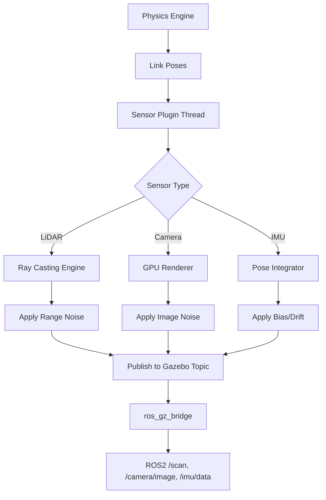
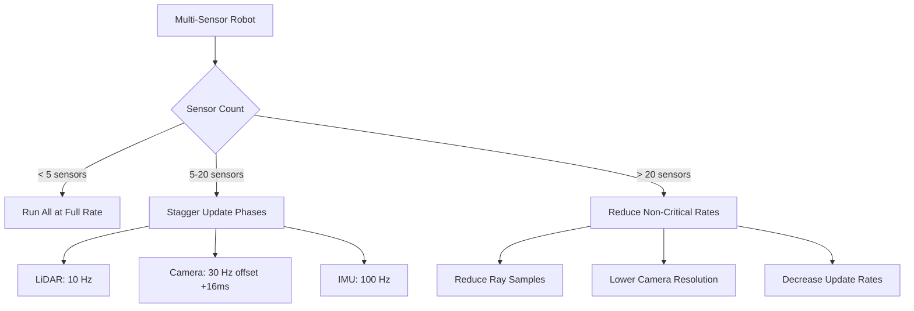

# Sensor Simulation and Noise Modeling

Perception algorithms trained on perfect synthetic data fail catastrophically on real robots. Simulated LiDAR with zero noise produces pristine point clouds that never miss returns or suffer from ambient light interference. Simulated cameras render images with perfect focus, zero motion blur, and no lens distortion. The reality gap between simulation and hardware is widest in sensor data—and closing this gap requires sophisticated noise models, accurate ray tracing, and careful calibration. This chapter teaches you to simulate sensors with sufficient realism that perception pipelines transfer to physical robots.

> **By the end of this chapter, you will:**
> - Configure Gazebo sensor plugins for LiDAR, cameras, and IMUs with realistic parameters
> - Apply noise models (Gaussian, Poisson, salt-and-pepper) to simulate sensor imperfections
> - Validate sensor simulation accuracy by comparing synthetic and real-world data distributions
> - Optimize sensor update rates and ray counts for real-time simulation performance

## The Sensor Simulation Pipeline

Gazebo's sensor plugins operate as separate threads, generating data at configured rates independent of the physics loop. Each sensor type implements domain-specific simulation: ray tracing for LiDAR and depth cameras, GPU rendering for RGB cameras, numerical integration for IMUs.



The critical insight: sensor noise isn't merely additive Gaussian noise on perfect data. Real sensors exhibit correlated errors, systematic biases, temporal drift, and environmental dependencies. Effective simulation models these characteristics.

## LiDAR Simulation with Ray-Based Sensing

LiDAR (Light Detection and Ranging) measures distances by timing laser pulse reflections. Gazebo simulates this via GPU-accelerated ray casting, checking collisions between sensor rays and world geometry.

```xml
<gazebo reference="lidar_link">
  <sensor name="lidar" type="gpu_lidar">
    <pose>0 0 0.05 0 0 0</pose>
    <update_rate>10</update_rate>
    <topic>scan</topic>
    <visualize>true</visualize>

    <ray>
      <scan>
        <horizontal>
          <samples>720</samples>
          <resolution>1</resolution>
          <min_angle>-3.14159</min_angle>
          <max_angle>3.14159</max_angle>
        </horizontal>
        <vertical>
          <samples>16</samples>
          <resolution>1</resolution>
          <min_angle>-0.2618</min_angle>
          <max_angle>0.2618</max_angle>
        </vertical>
      </scan>

      <range>
        <min>0.1</min>
        <max>30.0</max>
        <resolution>0.01</resolution>
      </range>

      <noise>
        <type>gaussian</type>
        <mean>0.0</mean>
        <stddev>0.01</stddev>
      </noise>
    </ray>

    <plugin filename="gz-sim-sensors-system" name="gz::sim::systems::Sensors">
      <render_engine>ogre2</render_engine>
    </plugin>
  </sensor>
</gazebo>
```

This configuration simulates a 16-beam rotating LiDAR (similar to Velodyne VLP-16) with 720 horizontal samples per revolution, 10Hz update rate, and 1cm range noise.

> **IMPORTANT**: `gpu_lidar` offloads ray casting to GPU, achieving 10-100x speedup versus CPU-based `ray` sensors. Always use GPU variants for multi-beam LiDAR in real-time simulation.

### Advanced LiDAR Noise Models

Real LiDAR exhibits multiple error sources beyond Gaussian range noise:

**Miss Detection**: Rays fail to return on dark, angled, or distant surfaces. Model with probabilistic ray dropping:

```xml
<noise>
  <type>gaussian</type>
  <mean>0.0</mean>
  <stddev>0.02</stddev>
</noise>
<!-- Add custom plugin for miss detection -->
<plugin filename="libgazebo_lidar_noise.so" name="lidar_noise">
  <miss_probability>0.01</miss_probability>
  <miss_distance_threshold>25.0</miss_distance_threshold>
</plugin>
```

**Multi-Path Reflections**: Laser bounces create ghost points. Simulate with secondary rays at reduced intensity.

**Temporal Correlation**: Consecutive scans aren't independent. Add low-pass filtered noise for drift:

```python
import numpy as np
from scipy.ndimage import gaussian_filter1d

def add_correlated_noise(ranges: np.ndarray, sigma: float, correlation_length: int) -> np.ndarray:
    """Add temporally correlated noise to LiDAR ranges."""
    # Generate white noise
    noise = np.random.normal(0, sigma, ranges.shape)
    # Apply Gaussian smoothing for temporal correlation
    correlated_noise = gaussian_filter1d(noise, sigma=correlation_length, axis=0)
    return ranges + correlated_noise
```

## Camera Simulation with Realistic Image Noise

Cameras in Gazebo use the same rendering pipeline as visual display, producing RGB or depth images. Accurate simulation requires modeling lens effects, sensor characteristics, and processing artifacts.

```xml
<gazebo reference="camera_link">
  <sensor name="camera" type="camera">
    <pose>0 0 0 0 0 0</pose>
    <update_rate>30</update_rate>
    <topic>camera/image_raw</topic>
    <camera name="front_camera">
      <horizontal_fov>1.396</horizontal_fov>
      <image>
        <width>1280</width>
        <height>720</height>
        <format>R8G8B8</format>
      </image>
      <clip>
        <near>0.1</near>
        <far>100</far>
      </clip>

      <noise>
        <type>gaussian</type>
        <mean>0.0</mean>
        <stddev>0.007</stddev>
      </noise>

      <distortion>
        <k1>-0.1</k1>
        <k2>0.05</k2>
        <k3>-0.01</k3>
        <p1>0.001</p1>
        <p2>-0.002</p2>
        <center>0.5 0.5</center>
      </distortion>

      <lens>
        <type>custom</type>
        <scale_to_hfov>true</scale_to_hfov>
        <custom_function>
          <c1>1.05</c1>
          <c2>4</c2>
          <f>1.0</f>
          <fun>tan</fun>
        </custom_function>
      </lens>
    </camera>

    <plugin filename="gz-sim-sensors-system" name="gz::sim::systems::Sensors">
      <render_engine>ogre2</render_engine>
    </plugin>
  </sensor>
</gazebo>
```

Key parameters:

- **horizontal_fov**: 1.396 radians = 80 degrees, typical for robot cameras
- **distortion**: Brown-Conrady model with radial (k1, k2, k3) and tangential (p1, p2) coefficients
- **lens/custom_function**: Models lens projection (rectilinear, equidistant, stereographic)

> **TIP**: Extract distortion coefficients from real camera calibration (using ROS2 camera_calibration package) and apply them in simulation. This ensures vision algorithms see geometrically consistent images in sim and reality.

### Image Noise Beyond Gaussian

Gaussian noise approximates sensor read noise but misses important artifacts:

**Poisson (Shot) Noise**: Photon counting statistics cause signal-dependent noise. Variance proportional to intensity:

```python
def add_shot_noise(image: np.ndarray, scaling: float = 1.0) -> np.ndarray:
    """Add Poisson shot noise to image (models photon statistics)."""
    # Scale to photon counts, apply Poisson noise, scale back
    scaled = image * scaling
    noisy = np.random.poisson(scaled)
    return (noisy / scaling).clip(0, 255).astype(np.uint8)
```

**Salt-and-Pepper Noise**: Dead or stuck pixels create isolated min/max values:

```python
def add_salt_pepper(image: np.ndarray, amount: float = 0.01) -> np.ndarray:
    """Add salt-and-pepper noise (dead/stuck pixels)."""
    noisy = image.copy()
    # Salt (white pixels)
    num_salt = int(amount * image.size * 0.5)
    coords = [np.random.randint(0, i, num_salt) for i in image.shape]
    noisy[coords[0], coords[1]] = 255
    # Pepper (black pixels)
    num_pepper = int(amount * image.size * 0.5)
    coords = [np.random.randint(0, i, num_pepper) for i in image.shape]
    noisy[coords[0], coords[1]] = 0
    return noisy
```

**Motion Blur**: Camera movement during exposure creates streaking. Simulate with directional blur kernels:

```python
from scipy.ndimage import convolve

def add_motion_blur(image: np.ndarray, kernel_size: int, angle: float) -> np.ndarray:
    """Add motion blur from camera movement."""
    kernel = np.zeros((kernel_size, kernel_size))
    kernel[kernel_size // 2, :] = 1 / kernel_size
    # Rotate kernel to match motion direction
    from scipy.ndimage import rotate
    kernel = rotate(kernel, angle, reshape=False)
    return convolve(image, kernel)
```

## IMU Simulation with Bias and Drift

Inertial Measurement Units (IMUs) measure linear acceleration and angular velocity. Unlike ray-based sensors, IMUs compute outputs from the physics engine's pose derivatives, making them deterministic but sensitive to integration errors.

```xml
<gazebo reference="imu_link">
  <sensor name="imu" type="imu">
    <pose>0 0 0 0 0 0</pose>
    <update_rate>100</update_rate>
    <topic>imu/data</topic>
    <imu>
      <angular_velocity>
        <x>
          <noise type="gaussian">
            <mean>0.0</mean>
            <stddev>0.009</stddev>
            <bias_mean>0.00075</bias_mean>
            <bias_stddev>0.0000008</bias_stddev>
          </noise>
        </x>
        <y>
          <noise type="gaussian">
            <mean>0.0</mean>
            <stddev>0.009</stddev>
            <bias_mean>0.00075</bias_mean>
            <bias_stddev>0.0000008</bias_stddev>
          </noise>
        </y>
        <z>
          <noise type="gaussian">
            <mean>0.0</mean>
            <stddev>0.009</stddev>
            <bias_mean>0.00075</bias_mean>
            <bias_stddev>0.0000008</bias_stddev>
          </noise>
        </z>
      </angular_velocity>

      <linear_acceleration>
        <x>
          <noise type="gaussian">
            <mean>0.0</mean>
            <stddev>0.017</stddev>
            <bias_mean>0.1</bias_mean>
            <bias_stddev>0.001</bias_stddev>
          </noise>
        </x>
        <y>
          <noise type="gaussian">
            <mean>0.0</mean>
            <stddev>0.017</stddev>
            <bias_mean>0.1</bias_mean>
            <bias_stddev>0.001</bias_stddev>
          </noise>
        </y>
        <z>
          <noise type="gaussian">
            <mean>0.0</mean>
            <stddev>0.017</stddev>
            <bias_mean>0.1</bias_mean>
            <bias_stddev>0.001</bias_stddev>
          </noise>
        </z>
      </linear_acceleration>
    </imu>

    <plugin filename="gz-sim-sensors-system" name="gz::sim::systems::Sensors">
      <render_engine>ogre2</render_engine>
    </plugin>
  </sensor>
</gazebo>
```

These parameters model an industrial-grade IMU (similar to Xsens MTi-3):

- **Angular velocity noise**: 0.009 rad/s ≈ 0.5 deg/s (random walk)
- **Angular velocity bias**: 0.00075 rad/s ≈ 0.043 deg/s (constant offset)
- **Linear acceleration noise**: 0.017 m/s² (random walk)
- **Linear acceleration bias**: 0.1 m/s² (gravity estimation error)

> **WARNING**: IMU bias accumulates during dead reckoning. A 0.1 deg/s gyro bias causes 360-degree heading error after 1 hour. Always fuse IMU with absolute sensors (GPS, vision) for long-duration operation.

### IMU Noise Characterization

To match simulation to real hardware, characterize your physical IMU:

```python
import rclpy
from rclpy.node import Node
from sensor_msgs.msg import Imu
import numpy as np

class IMUCharacterizer(Node):
    def __init__(self):
        super().__init__('imu_characterizer')
        self.subscription = self.create_subscription(
            Imu, '/imu/data', self.imu_callback, 100)
        self.samples = []

    def imu_callback(self, msg: Imu):
        self.samples.append([
            msg.angular_velocity.x,
            msg.angular_velocity.y,
            msg.angular_velocity.z,
            msg.linear_acceleration.x,
            msg.linear_acceleration.y,
            msg.linear_acceleration.z
        ])

        if len(self.samples) >= 1000:
            self.analyze_noise()

    def analyze_noise(self):
        """Compute Allan variance to identify bias stability and random walk."""
        data = np.array(self.samples)

        # Compute mean (bias) and std dev (noise) for each axis
        gyro_bias = np.mean(data[:, 0:3], axis=0)
        gyro_noise = np.std(data[:, 0:3], axis=0)
        accel_bias = np.mean(data[:, 3:6], axis=0)
        accel_noise = np.std(data[:, 3:6], axis=0)

        self.get_logger().info(f'Gyro bias: {gyro_bias}')
        self.get_logger().info(f'Gyro noise: {gyro_noise}')
        self.get_logger().info(f'Accel bias: {accel_bias}')
        self.get_logger().info(f'Accel noise: {accel_noise}')

        # Use these values in Gazebo <noise> tags
        rclpy.shutdown()

def main():
    rclpy.init()
    node = IMUCharacterizer()
    rclpy.spin(node)
```

Place the robot stationary, collect 1000 samples, compute statistics, and transfer to simulation config.

## Depth Camera Simulation

Depth cameras (stereo, structured light, time-of-flight) are critical for manipulation and obstacle avoidance. Gazebo simulates depth via GPU rendering of the depth buffer.

```xml
<gazebo reference="depth_camera_link">
  <sensor name="depth_camera" type="depth">
    <update_rate>15</update_rate>
    <topic>depth_camera</topic>
    <camera>
      <horizontal_fov>1.047</horizontal_fov>
      <image>
        <width>640</width>
        <height>480</height>
        <format>R_FLOAT32</format>
      </image>
      <clip>
        <near>0.3</near>
        <far>10.0</far>
      </clip>

      <noise>
        <type>gaussian</type>
        <mean>0.0</mean>
        <stddev>0.007</stddev>
      </noise>
    </camera>

    <plugin filename="gz-sim-sensors-system" name="gz::sim::systems::Sensors">
      <render_engine>ogre2</render_engine>
    </plugin>
  </sensor>
</gazebo>
```

Depth noise is distance-dependent. For better realism, apply quadratic noise model:

```python
def add_depth_noise(depth: np.ndarray, baseline: float, focal_length: float) -> np.ndarray:
    """Add distance-dependent noise to depth image (models stereo disparity error)."""
    # Noise variance proportional to depth²
    noise_stddev = 0.001 * (depth ** 2) / (baseline * focal_length)
    noise = np.random.normal(0, noise_stddev, depth.shape)
    return np.clip(depth + noise, 0.3, 10.0)
```

> **NOTE**: Depth cameras struggle with reflective surfaces, transparent objects, and edge discontinuities. Advanced simulation requires custom plugins that model these failure modes based on material properties.

## Performance Optimization for Multi-Sensor Simulation



Humanoids with full sensor suites (multiple cameras, LiDAR, IMUs, force-torque sensors) can bottleneck simulation. Optimization strategies:

1. **Phase-Staggered Updates**: Offset sensor update times to spread computational load across frames
2. **Adaptive Rates**: Run critical sensors (IMU for control) at high rates, reduce non-critical sensors (environment cameras)
3. **GPU Batching**: Group similar sensor types (all cameras) to leverage GPU parallelism
4. **Sensor Zones**: Disable distant sensors when robot is in confined spaces

Benchmark sensor performance:

```bash
# Monitor simulation real-time factor with all sensors active
gz topic -e -t /stats

# Profile sensor update times
gz log record --topic /world/default/stats
gz log playback --stats stats.log
```

Target RTF > 0.8 for real-time operation. If below, systematically reduce sensor fidelity until performance recovers.

> **Key Takeaways**
> - GPU-accelerated sensors (gpu_lidar, depth cameras) provide 10-100x speedup versus CPU variants
> - Realistic sensor noise requires domain-specific models: Poisson for cameras, bias drift for IMUs, miss detection for LiDAR
> - Camera distortion coefficients should match real hardware calibration for vision algorithm transfer
> - IMU bias accumulates during integration; always fuse with absolute position sensors
> - Depth camera noise scales quadratically with distance due to stereo disparity mathematics
> - Sensor update rates should match hardware specifications; 100Hz for IMU, 10-30Hz for cameras
> - Phase-staggered sensor updates distribute computational load and improve real-time factor
> - Allan variance analysis on static data characterizes real IMU noise for accurate simulation tuning
> - Validation requires comparing statistical distributions of sim and real sensor data, not just visual inspection

## Further Reading

- [Gazebo Sensor Plugin API](https://gazebosim.org/api/sensors/8/index.html) — Complete reference for configuring LiDAR, cameras, IMUs, and custom sensors
- [Camera Calibration Toolbox for ROS2](https://navigation.ros.org/tutorials/docs/camera_calibration.html) — Extract real lens distortion parameters for simulation matching
- [IMU Noise Model (Woodman 2007)](https://www.cl.cam.ac.uk/techreports/UCAM-CL-TR-696.pdf) — Mathematical foundations of Allan variance and stochastic error models

## Assessment

#### Multiple Choice Questions

**Q1 (Easy)**: What is the primary advantage of `gpu_lidar` over `ray` sensor type in Gazebo?
- A) More accurate physics simulation
- B) Support for higher resolution scans
- C) GPU-accelerated ray casting for faster computation
- D) Automatic noise model generation

<details>
<summary>Answer</summary>
**C) GPU-accelerated ray casting for faster computation** — GPU-based sensors offload ray-geometry intersection tests to the graphics card, achieving 10-100x speedup for multi-beam LiDAR. Physics accuracy and resolution are identical; the difference is computational performance.
</details>

**Q2 (Medium)**: Why does depth camera noise increase quadratically with distance?
- A) GPU rendering artifacts accumulate
- B) Stereo disparity error is inversely proportional to depth²
- C) Photon count decreases with distance²
- D) Lens distortion increases at range

<details>
<summary>Answer</summary>
**B) Stereo disparity error is inversely proportional to depth²** — Stereo depth Z = (baseline × focal_length) / disparity. Fixed disparity measurement error δd causes depth error δZ = Z² × δd / (baseline × focal_length), creating quadratic relationship. This is fundamental to triangulation geometry.
</details>

**Q3 (Medium)**: What does `bias_mean` represent in IMU sensor configuration?
- A) Random noise added to each measurement
- B) Constant systematic offset in sensor readings
- C) Measurement uncertainty standard deviation
- D) Calibration error variance

<details>
<summary>Answer</summary>
**B) Constant systematic offset in sensor readings** — Bias is a deterministic offset that persists across measurements. Unlike random noise (stddev), bias accumulates during integration. For example, 0.1 m/s² accelerometer bias causes 180m position error after 60 seconds of dead reckoning.
</details>

**Q4 (Hard)**: A humanoid has 4 cameras at 30Hz, 1 LiDAR at 10Hz, and 3 IMUs at 100Hz. Simulation RTF drops to 0.4. Which optimization provides the greatest speedup?
- A) Reduce IMU update rate to 50Hz
- B) Switch cameras from 1280x720 to 640x480
- C) Reduce LiDAR from 720 to 360 horizontal samples
- D) Disable two of the three IMUs

<details>
<summary>Answer</summary>
**B) Switch cameras from 1280x720 to 640x480** — Cameras have O(width × height) rendering cost. Halving resolution reduces pixels by 75% (1280×720=921k → 640×480=307k), cutting camera load by ~75%. LiDAR ray reduction helps but starts at lower baseline cost. IMU computation is negligible (pose differentiation). Disabling IMUs removes functionality without major performance gain.
</details>

#### Coding Exercises

**Exercise 1**: Create a Gazebo sensor configuration for a 64-beam LiDAR (like Ouster OS1-64) with 1024 horizontal samples, 20Hz update rate, 120m max range, and 2cm range noise.

```xml
<gazebo reference="lidar_link">
  <sensor name="ouster_lidar" type="gpu_lidar">
    <!-- TODO: Configure pose, update rate, topic -->
    <ray>
      <scan>
        <!-- TODO: Set horizontal and vertical scan parameters -->
      </scan>
      <range>
        <!-- TODO: Set min/max range and resolution -->
      </range>
      <noise>
        <!-- TODO: Add range noise -->
      </noise>
    </ray>
    <!-- TODO: Add sensor plugin -->
  </sensor>
</gazebo>
```

<details>
<summary>Solution</summary>

```xml
<gazebo reference="lidar_link">
  <sensor name="ouster_lidar" type="gpu_lidar">
    <pose>0 0 0.05 0 0 0</pose>
    <update_rate>20</update_rate>
    <topic>ouster/points</topic>
    <visualize>false</visualize>

    <ray>
      <scan>
        <horizontal>
          <samples>1024</samples>
          <resolution>1</resolution>
          <min_angle>-3.14159</min_angle>
          <max_angle>3.14159</max_angle>
        </horizontal>
        <vertical>
          <samples>64</samples>
          <resolution>1</resolution>
          <min_angle>-0.3927</min_angle>  <!-- -22.5 degrees -->
          <max_angle>0.3927</max_angle>    <!-- +22.5 degrees -->
        </vertical>
      </scan>

      <range>
        <min>0.5</min>
        <max>120.0</max>
        <resolution>0.01</resolution>
      </range>

      <noise>
        <type>gaussian</type>
        <mean>0.0</mean>
        <stddev>0.02</stddev>  <!-- 2cm noise -->
      </noise>
    </ray>

    <plugin filename="gz-sim-sensors-system" name="gz::sim::systems::Sensors">
      <render_engine>ogre2</render_engine>
    </plugin>
  </sensor>
</gazebo>
```

Notes: Ouster OS1-64 has ±22.5° vertical FOV (0.7854 rad total, split ±0.3927). 1024 horizontal samples with 64 beams at 20Hz = 1.3M points/sec, typical for high-end automotive LiDAR.
</details>

**Exercise 2**: Write a Python function that adds realistic camera noise combining shot noise (Poisson) and read noise (Gaussian) with 1% salt-and-pepper.

```python
import numpy as np

def apply_realistic_camera_noise(image: np.ndarray,
                                 shot_scaling: float = 25.0,
                                 read_noise_stddev: float = 5.0,
                                 salt_pepper_amount: float = 0.01) -> np.ndarray:
    """
    Apply realistic camera noise model to image.

    Args:
        image: Input image (0-255 uint8)
        shot_scaling: Photon count scaling factor (higher = less shot noise)
        read_noise_stddev: Gaussian read noise standard deviation
        salt_pepper_amount: Fraction of pixels affected by dead/stuck pixels

    Returns:
        Noisy image (0-255 uint8)
    """
    # TODO: Apply Poisson shot noise
    # TODO: Add Gaussian read noise
    # TODO: Add salt-and-pepper noise
    # TODO: Clip to valid range and return
    pass
```

<details>
<summary>Solution</summary>

```python
import numpy as np

def apply_realistic_camera_noise(image: np.ndarray,
                                 shot_scaling: float = 25.0,
                                 read_noise_stddev: float = 5.0,
                                 salt_pepper_amount: float = 0.01) -> np.ndarray:
    """
    Apply realistic camera noise model combining shot, read, and defect noise.

    Args:
        image: Input image (0-255 uint8)
        shot_scaling: Photon count scaling factor (higher = less shot noise)
        read_noise_stddev: Gaussian read noise standard deviation
        salt_pepper_amount: Fraction of pixels affected by dead/stuck pixels

    Returns:
        Noisy image (0-255 uint8)
    """
    # Convert to float for processing
    noisy = image.astype(np.float32)

    # 1. Apply Poisson shot noise (signal-dependent)
    # Scale to photon counts, apply Poisson, scale back
    photon_counts = noisy * shot_scaling
    shot_noisy = np.random.poisson(photon_counts)
    noisy = shot_noisy / shot_scaling

    # 2. Add Gaussian read noise (signal-independent)
    read_noise = np.random.normal(0, read_noise_stddev, noisy.shape)
    noisy = noisy + read_noise

    # 3. Add salt-and-pepper noise (dead/stuck pixels)
    # Salt (white pixels)
    num_salt = int(salt_pepper_amount * image.size * 0.5)
    coords = tuple([np.random.randint(0, i, num_salt) for i in image.shape])
    noisy[coords] = 255

    # Pepper (black pixels)
    num_pepper = int(salt_pepper_amount * image.size * 0.5)
    coords = tuple([np.random.randint(0, i, num_pepper) for i in image.shape])
    noisy[coords] = 0

    # Clip to valid range and convert back to uint8
    return np.clip(noisy, 0, 255).astype(np.uint8)

# Example usage:
# original_image = np.random.randint(0, 255, (480, 640, 3), dtype=np.uint8)
# noisy_image = apply_realistic_camera_noise(original_image)
```

This combines three independent noise sources that occur in real cameras: shot noise from photon counting statistics (Poisson process), read noise from sensor electronics (Gaussian), and pixel defects (salt-and-pepper). Order matters: apply signal-dependent noise first, then signal-independent.
</details>

#### Mini-Project

**Sensor Simulation Validation Framework**

Create a system to quantitatively validate that simulated sensors match real hardware characteristics.

**Requirements**:

1. **Data Collection**: ROS2 nodes to record sensor data from both simulation and real robot:
   - LiDAR scans (10 seconds, stationary position)
   - Camera images (100 frames, fixed scene)
   - IMU readings (60 seconds, static mounting)

2. **Statistical Analysis**: Python scripts to compute and compare:
   - LiDAR: mean range, range std dev, miss rate per distance bin
   - Camera: pixel intensity histogram, noise variance vs intensity, edge sharpness
   - IMU: Allan variance plot, bias stability, random walk coefficients

3. **Noise Model Tuning**: Iterative process to adjust Gazebo noise parameters until statistical metrics match within 10%

4. **Automated Validation**: CI/CD test that fails if sensor distributions drift beyond tolerance

**Deliverables**:
- `sensor_recorder.py` (ROS2 node for data collection)
- `analyze_lidar.py`, `analyze_camera.py`, `analyze_imu.py` (statistical analysis scripts)
- `tune_noise.py` (automated parameter search to minimize distribution mismatch)
- `sensor_validation.yaml` (target statistics from real hardware)
- `validate_sensors.launch.py` (runs simulation, collects data, compares to baseline)
- Technical report comparing sim vs real sensor characteristics

**Success Criteria**:
- Statistical tests show no significant difference (p > 0.05) between sim and real distributions
- LiDAR range histograms match within 10% per distance bin
- Camera noise variance follows same relationship to intensity (Poisson model validation)
- IMU Allan variance curves overlap within 15% across all timescales
- Validation test runs in < 5 minutes for CI/CD integration

**Bonus Challenges**:
- Implement temperature-dependent IMU drift (bias changes with thermal state)
- Add material-dependent LiDAR reflectivity (dark surfaces have higher miss rates)
- Simulate camera auto-exposure (brightness adaptation changes noise characteristics)
- Create sim-to-real transfer learning pipeline showing perception algorithm performance gap

This project bridges the reality gap systematically, teaching you to measure and minimize simulation-to-hardware differences—a critical skill for deploying algorithms trained in virtual environments to physical robots.
