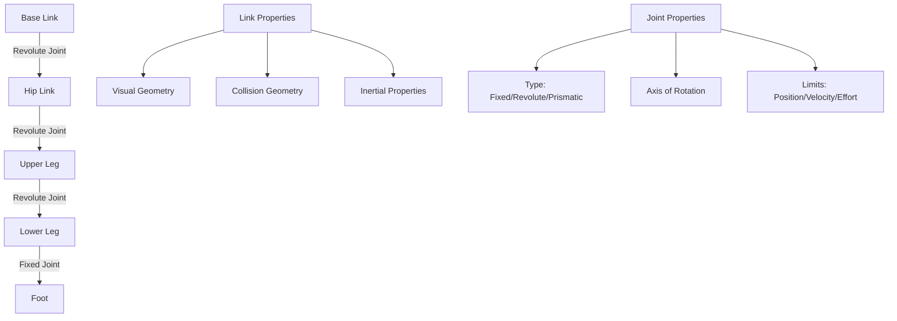

# URDF and Robot Description

Every robot control algorithm, motion planner, and visualization tool needs to answer: where are the joints, what are the link masses, and how do parts connect? The Unified Robot Description Format (URDF) provides the definitive answer—a machine-readable XML specification that encodes kinematic chains, inertial properties, collision geometries, and visual meshes. Mastering URDF unlocks the ability to describe any robot from simple manipulators to complex humanoids, enabling seamless integration across the ROS2 ecosystem.

> **By the end of this chapter, you will:**
> - Author URDF files with correct kinematic trees, inertial matrices, and collision geometries
> - Use Xacro macros to eliminate repetition and parameterize robot variants
> - Visualize and debug robot descriptions in RViz2 with joint state publishers
> - Validate URDF correctness using check_urdf and geometric constraint tools

## URDF Fundamentals: Links and Joints

URDF models robots as kinematic trees composed of rigid links connected by joints. Each link has inertial properties (mass, center of mass, moment of inertia), visual geometry (for rendering), and collision geometry (for physics simulation). Joints define motion constraints between parent and child links.



A minimal humanoid leg in URDF:

```xml
<?xml version="1.0"?>
<robot name="humanoid_leg">

  <!-- Base link (pelvis attachment point) -->
  <link name="base_link">
    <inertial>
      <mass value="0.5"/>
      <origin xyz="0 0 0" rpy="0 0 0"/>
      <inertia ixx="0.001" ixy="0.0" ixz="0.0"
               iyy="0.001" iyz="0.0" izz="0.001"/>
    </inertial>
    <visual>
      <geometry>
        <box size="0.1 0.15 0.08"/>
      </geometry>
      <material name="gray">
        <color rgba="0.5 0.5 0.5 1.0"/>
      </material>
    </visual>
    <collision>
      <geometry>
        <box size="0.1 0.15 0.08"/>
      </geometry>
    </collision>
  </link>

  <!-- Upper leg link -->
  <link name="upper_leg">
    <inertial>
      <mass value="2.0"/>
      <origin xyz="0 0 -0.2" rpy="0 0 0"/>
      <inertia ixx="0.05" ixy="0.0" ixz="0.0"
               iyy="0.05" iyz="0.0" izz="0.005"/>
    </inertial>
    <visual>
      <origin xyz="0 0 -0.2" rpy="0 0 0"/>
      <geometry>
        <cylinder radius="0.06" length="0.4"/>
      </geometry>
      <material name="blue">
        <color rgba="0.2 0.2 0.8 1.0"/>
      </material>
    </visual>
    <collision>
      <origin xyz="0 0 -0.2" rpy="0 0 0"/>
      <geometry>
        <cylinder radius="0.06" length="0.4"/>
      </geometry>
    </collision>
  </link>

  <!-- Hip joint (revolute, pitch axis) -->
  <joint name="hip_pitch" type="revolute">
    <parent link="base_link"/>
    <child link="upper_leg"/>
    <origin xyz="0 0 -0.04" rpy="0 0 0"/>
    <axis xyz="0 1 0"/>
    <limit lower="-1.57" upper="1.57" effort="100.0" velocity="5.0"/>
    <dynamics damping="0.7" friction="0.0"/>
  </joint>

  <!-- Lower leg link -->
  <link name="lower_leg">
    <inertial>
      <mass value="1.5"/>
      <origin xyz="0 0 -0.2" rpy="0 0 0"/>
      <inertia ixx="0.04" ixy="0.0" ixz="0.0"
               iyy="0.04" iyz="0.0" izz="0.004"/>
    </inertial>
    <visual>
      <origin xyz="0 0 -0.2" rpy="0 0 0"/>
      <geometry>
        <cylinder radius="0.05" length="0.4"/>
      </geometry>
      <material name="blue"/>
    </visual>
    <collision>
      <origin xyz="0 0 -0.2" rpy="0 0 0"/>
      <geometry>
        <cylinder radius="0.05" length="0.4"/>
      </geometry>
    </collision>
  </link>

  <!-- Knee joint (revolute, pitch axis) -->
  <joint name="knee_pitch" type="revolute">
    <parent link="upper_leg"/>
    <child link="lower_leg"/>
    <origin xyz="0 0 -0.4" rpy="0 0 0"/>
    <axis xyz="0 1 0"/>
    <limit lower="0.0" upper="2.35" effort="80.0" velocity="5.0"/>
    <dynamics damping="0.5" friction="0.0"/>
  </joint>

</robot>
```

> **IMPORTANT**: Inertia tensors must be positive definite (all eigenvalues positive) or physics engines will diverge. Use CAD software or the parallel axis theorem to compute accurate inertias from geometry.

## Joint Types and Constraints

URDF supports six joint types, each defining specific kinematic constraints:

| Joint Type | DOF | Description | Use Case |
|------------|-----|-------------|----------|
| `fixed` | 0 | Rigidly connects links | Sensor mounts, cosmetic parts |
| `revolute` | 1 | Rotation around axis with limits | Robot joints (hip, knee, elbow) |
| `continuous` | 1 | Unlimited rotation around axis | Wheels, continuous rotary actuators |
| `prismatic` | 1 | Linear translation along axis | Linear actuators, telescoping links |
| `floating` | 6 | Unconstrained 6-DOF motion | Free-flying robots, simulation base |
| `planar` | 2 | Translation in plane | Specialized mobile bases |

> **TIP**: Use `continuous` joints for wheels to avoid hitting joint limits during long drives. Use `revolute` with wide limits for actuated joints where you need to detect and handle limit violations.

## Xacro: Parameterized Robot Descriptions

Real robots have symmetry: left and right legs are mirror images, multiple identical fingers, repeated sensor mounts. Writing raw URDF for a 40-joint humanoid creates thousands of lines of repetitive XML. Xacro (XML Macros) eliminates this through parameterization, macros, and includes.

```xml
<?xml version="1.0"?>
<robot xmlns:xacro="http://www.ros.org/wiki/xacro" name="humanoid">

  <!-- Parameters for easy tuning -->
  <xacro:property name="leg_mass" value="3.5"/>
  <xacro:property name="leg_length" value="0.4"/>
  <xacro:property name="leg_radius" value="0.06"/>

  <!-- Macro for a complete leg (reuse for left and right) -->
  <xacro:macro name="leg" params="prefix reflect">

    <link name="${prefix}_upper_leg">
      <inertial>
        <mass value="${leg_mass}"/>
        <origin xyz="0 0 ${-leg_length/2}" rpy="0 0 0"/>
        <inertia ixx="${leg_mass * (3*leg_radius*leg_radius + leg_length*leg_length) / 12}"
                 iyy="${leg_mass * (3*leg_radius*leg_radius + leg_length*leg_length) / 12}"
                 izz="${leg_mass * leg_radius*leg_radius / 2}"
                 ixy="0.0" ixz="0.0" iyz="0.0"/>
      </inertial>
      <visual>
        <origin xyz="0 0 ${-leg_length/2}" rpy="0 0 0"/>
        <geometry>
          <cylinder radius="${leg_radius}" length="${leg_length}"/>
        </geometry>
        <material name="leg_material">
          <color rgba="0.3 0.3 0.7 1.0"/>
        </material>
      </visual>
      <collision>
        <origin xyz="0 0 ${-leg_length/2}" rpy="0 0 0"/>
        <geometry>
          <cylinder radius="${leg_radius}" length="${leg_length}"/>
        </geometry>
      </collision>
    </link>

    <joint name="${prefix}_hip_pitch" type="revolute">
      <parent link="base_link"/>
      <child link="${prefix}_upper_leg"/>
      <origin xyz="0 ${reflect*0.15} 0" rpy="0 0 0"/>
      <axis xyz="0 1 0"/>
      <limit lower="-1.57" upper="1.57" effort="100.0" velocity="5.0"/>
      <dynamics damping="0.7"/>
    </joint>

  </xacro:macro>

  <!-- Base link -->
  <link name="base_link">
    <inertial>
      <mass value="5.0"/>
      <inertia ixx="0.1" iyy="0.1" izz="0.1" ixy="0" ixz="0" iyz="0"/>
    </inertial>
    <visual>
      <geometry><box size="0.3 0.4 0.2"/></geometry>
      <material name="torso_material">
        <color rgba="0.7 0.7 0.7 1.0"/>
      </material>
    </visual>
    <collision>
      <geometry><box size="0.3 0.4 0.2"/></geometry>
    </collision>
  </link>

  <!-- Instantiate left and right legs -->
  <xacro:leg prefix="left" reflect="1"/>
  <xacro:leg prefix="right" reflect="-1"/>

</robot>
```

> **NOTE**: The `reflect` parameter mirrors the leg position. For left leg `reflect=1`, hip is at `y=+0.15`; for right leg `reflect=-1`, hip is at `y=-0.15`. This single macro generates both legs with correct mirroring.

Xacro also supports mathematical expressions, conditional blocks, and file includes:

```xml
<!-- Calculate cylinder inertia using formulas -->
<xacro:property name="cyl_ixx" value="${mass * (3*radius*radius + length*length) / 12}"/>

<!-- Conditional inclusion based on robot variant -->
<xacro:if value="${has_hands}">
  <xacro:include filename="$(find robot_description)/urdf/hand.xacro"/>
</xacro:if>

<!-- Include sensor definitions from separate file -->
<xacro:include filename="$(find robot_description)/urdf/sensors.xacro"/>
```

Convert Xacro to URDF for processing:

```bash
# Process Xacro to generate URDF
ros2 run xacro xacro humanoid.urdf.xacro > humanoid.urdf

# Validate URDF structure
check_urdf humanoid.urdf
```

## Visualization in RViz2

RViz2 is ROS2's 3D visualization tool, essential for debugging robot descriptions. The `robot_state_publisher` node consumes URDF and joint states, broadcasting transforms for every link.

```mermaid
flowchart LR
    A[URDF File] --> B[robot_state_publisher]
    C[/joint_states topic] --> B
    B --> D[TF2 Transform Tree]
    D --> E[RViz2]
    F[joint_state_publisher_gui] --> C
    G[Joint Sliders] --> F
```

Launch file for URDF visualization:

```python
from launch import LaunchDescription
from launch_ros.actions import Node
from launch.substitutions import Command, PathJoinSubstitution
from launch_ros.substitutions import FindPackageShare

def generate_launch_description():

    # Path to URDF/Xacro file
    urdf_path = PathJoinSubstitution([
        FindPackageShare('humanoid_description'),
        'urdf',
        'humanoid.urdf.xacro'
    ])

    # Process xacro to get URDF content
    robot_description = Command(['xacro ', urdf_path])

    # Publish robot description
    robot_state_publisher = Node(
        package='robot_state_publisher',
        executable='robot_state_publisher',
        name='robot_state_publisher',
        output='screen',
        parameters=[{
            'robot_description': robot_description,
            'publish_frequency': 30.0
        }]
    )

    # GUI to manually control joint positions
    joint_state_publisher_gui = Node(
        package='joint_state_publisher_gui',
        executable='joint_state_publisher_gui',
        name='joint_state_publisher_gui',
        output='screen'
    )

    # RViz with custom config
    rviz_config = PathJoinSubstitution([
        FindPackageShare('humanoid_description'),
        'rviz',
        'view_robot.rviz'
    ])

    rviz = Node(
        package='rviz2',
        executable='rviz2',
        name='rviz2',
        arguments=['-d', rviz_config],
        output='screen'
    )

    return LaunchDescription([
        robot_state_publisher,
        joint_state_publisher_gui,
        rviz
    ])
```

> **TIP**: Create custom RViz configs that include RobotModel display, TF display with link names, and appropriate camera angles. Save configs in your package's `rviz/` directory for reproducible debugging sessions.

## URDF Validation and Common Errors

Invalid URDF files cause cryptic errors in downstream tools. Always validate before debugging visualization or simulation issues:

```bash
# Check syntactic correctness and kinematic tree structure
check_urdf humanoid.urdf

# Visualize TF tree to detect disconnected links
ros2 run rqt_tf_tree rqt_tf_tree

# View URDF as graphical tree
urdf_to_graphviz humanoid.urdf
```

Common errors and fixes:

| Error | Symptom | Fix |
|-------|---------|-----|
| Non-positive definite inertia | Physics divergence, NaN positions | Recalculate using CAD or analytical formulas |
| Disconnected kinematic tree | Missing links in RViz | Ensure single root link, all joints connected |
| Incorrect joint axis | Joint moves wrong direction | Verify axis vector and origin transform |
| Missing collision geometry | Objects pass through robot | Add `<collision>` elements matching visual |
| Overlapping collision meshes | Jittery simulation, contact forces | Simplify collision with primitives, add clearance |

> **WARNING**: Setting joint limits too tight can cause control instability. Leave at least 5-degree margin from mechanical hard stops to avoid control algorithms fighting limit enforcement.

## Advanced URDF Features

**Transmission Elements**: Define actuator-to-joint mappings for ros_control:

```xml
<transmission name="hip_pitch_trans">
  <type>transmission_interface/SimpleTransmission</type>
  <joint name="left_hip_pitch">
    <hardwareInterface>hardware_interface/EffortJointInterface</hardwareInterface>
  </joint>
  <actuator name="left_hip_motor">
    <mechanicalReduction>100</mechanicalReduction>
    <hardwareInterface>hardware_interface/EffortJointInterface</hardwareInterface>
  </actuator>
</transmission>
```

**Gazebo-Specific Tags**: Configure simulation properties in URDF:

```xml
<gazebo reference="lower_leg">
  <material>Gazebo/Blue</material>
  <mu1>0.8</mu1>
  <mu2>0.8</mu2>
  <kp>1000000.0</kp>
  <kd>1.0</kd>
</gazebo>
```

**Mimic Joints**: Couple joint motions (e.g., differential mechanisms):

```xml
<joint name="finger_2" type="revolute">
  <mimic joint="finger_1" multiplier="1.0" offset="0.0"/>
  <!-- finger_2 tracks finger_1 position -->
</joint>
```

> **Key Takeaways**
> - URDF encodes kinematic trees with links (inertial, visual, collision) and joints (type, limits, axis)
> - Inertia tensors must be physically valid (positive definite) to prevent simulation divergence
> - Xacro macros eliminate repetition and enable parameterized robot variants
> - robot_state_publisher converts URDF + joint states into TF transforms for visualization
> - check_urdf validates syntax and tree structure before debugging complex issues
> - Collision geometry should use primitives when possible for performance and stability
> - Joint limits should include safety margins to prevent control instability at boundaries
> - Transmission elements define actuator mappings required by ros2_control
> - RViz2 with joint_state_publisher_gui enables interactive URDF debugging and validation

## Further Reading

- [ROS2 URDF Tutorial](https://docs.ros.org/en/humble/Tutorials/Intermediate/URDF/URDF-Main.html) — Comprehensive guide to URDF creation and best practices
- [Xacro Documentation](http://wiki.ros.org/xacro) — Complete reference for macros, properties, and conditional logic
- [Robot Modeling and Kinematics (Lynch & Park)](https://hades.mech.northwestern.edu/images/7/7f/MR.pdf) — Mathematical foundations of kinematic representations and coordinate transformations

## Assessment

#### Multiple Choice Questions

**Q1 (Easy)**: What are the three required geometry definitions for a URDF link used in simulation?
- A) Visual, inertial, material
- B) Visual, collision, inertial
- C) Collision, material, mass
- D) Visual, mass, origin

<details>
<summary>Answer</summary>
**B) Visual, collision, inertial** — Visual geometry defines appearance, collision defines physics interactions, and inertial defines mass properties. Material is part of visual but not a top-level requirement. Simulators need all three for correct rendering and physics.
</details>

**Q2 (Medium)**: When would you use a `continuous` joint instead of a `revolute` joint?
- A) When the joint has physical hard stops
- B) When implementing a wheel or continuous rotary actuator
- C) When you need to limit joint velocity
- D) When the joint connects to a fixed link

<details>
<summary>Answer</summary>
**B) When implementing a wheel or continuous rotary actuator** — Continuous joints allow unlimited rotation without hitting limits. Revolute joints require position limits, causing errors when exceeded during wheel rotation. Both types support velocity limits; choice depends on whether physical rotation is bounded.
</details>

**Q3 (Medium)**: In Xacro, what does this expression evaluate to: `${leg_length/2}` when `leg_length = 0.4`?
- A) 0.4/2 (string)
- B) 0.2 (number)
- C) An error (division not supported)
- D) leg_length/2 (unevaluated)

<details>
<summary>Answer</summary>
**B) 0.2 (number)** — Xacro evaluates mathematical expressions inside `${}` blocks. The division operator works on numeric properties, producing 0.4/2 = 0.2. This enables computed geometry and inertia values based on parameterized dimensions.
</details>

**Q4 (Hard)**: A humanoid's TF tree shows `base_link -> left_leg -> left_foot` but `right_leg` appears disconnected. What is the most likely cause?
- A) Missing `<collision>` element in right_leg link
- B) right_leg joint's parent references non-existent link
- C) Incorrect inertia tensor for right_leg
- D) right_leg visual geometry missing material definition

<details>
<summary>Answer</summary>
**B) right_leg joint's parent references non-existent link** — TF tree disconnection indicates broken kinematic chain, caused by joints referencing undefined parent or child links. Missing collision/material affects physics/rendering but not TF structure. Incorrect inertia causes simulation issues but doesn't break transforms.
</details>

#### Coding Exercises

**Exercise 1**: Complete the URDF link definition for a humanoid torso with mass 10kg, box dimensions 0.3x0.4x0.5m (x,y,z), centered at origin.

```xml
<link name="torso">
  <inertial>
    <mass value="TODO"/>
    <origin xyz="0 0 0" rpy="0 0 0"/>
    <!-- Use box inertia formula: I_xx = m(h²+d²)/12, I_yy = m(w²+d²)/12, I_zz = m(w²+h²)/12 -->
    <inertia ixx="TODO" iyy="TODO" izz="TODO"
             ixy="0.0" ixz="0.0" iyz="0.0"/>
  </inertial>
  <visual>
    <!-- TODO: Add visual geometry -->
  </visual>
  <collision>
    <!-- TODO: Add collision geometry -->
  </collision>
</link>
```

<details>
<summary>Solution</summary>

```xml
<link name="torso">
  <inertial>
    <mass value="10.0"/>
    <origin xyz="0 0 0" rpy="0 0 0"/>
    <!-- Box inertia: I_xx = m(h²+d²)/12 where w=0.3, h=0.4, d=0.5 -->
    <inertia ixx="0.3416" iyy="0.2833" izz="0.2083"
             ixy="0.0" ixz="0.0" iyz="0.0"/>
  </inertial>
  <visual>
    <geometry>
      <box size="0.3 0.4 0.5"/>
    </geometry>
    <material name="torso_gray">
      <color rgba="0.6 0.6 0.6 1.0"/>
    </material>
  </visual>
  <collision>
    <geometry>
      <box size="0.3 0.4 0.5"/>
    </geometry>
  </collision>
</link>
```

Inertia calculations:
- I_xx = 10 * (0.4² + 0.5²) / 12 = 10 * 0.41 / 12 = 0.3416
- I_yy = 10 * (0.3² + 0.5²) / 12 = 10 * 0.34 / 12 = 0.2833
- I_zz = 10 * (0.3² + 0.4²) / 12 = 10 * 0.25 / 12 = 0.2083
</details>

**Exercise 2**: Create a Xacro macro for a finger with three joints (proximal, middle, distal), each 0.03m long, parameterized by finger name.

```xml
<xacro:macro name="finger" params="name">
  <!-- TODO: Create three links (proximal, middle, distal) -->
  <!-- TODO: Create three revolute joints connecting them -->
  <!-- Each joint should have limits: -0.2 to 1.57 radians -->
</xacro:macro>
```

<details>
<summary>Solution</summary>

```xml
<?xml version="1.0"?>
<robot xmlns:xacro="http://www.ros.org/wiki/xacro">

  <xacro:macro name="finger" params="name">

    <xacro:property name="segment_length" value="0.03"/>
    <xacro:property name="segment_radius" value="0.008"/>
    <xacro:property name="segment_mass" value="0.01"/>

    <!-- Proximal segment -->
    <link name="${name}_proximal">
      <inertial>
        <mass value="${segment_mass}"/>
        <origin xyz="0 0 ${segment_length/2}"/>
        <inertia ixx="${segment_mass * (3*segment_radius**2 + segment_length**2) / 12}"
                 iyy="${segment_mass * (3*segment_radius**2 + segment_length**2) / 12}"
                 izz="${segment_mass * segment_radius**2 / 2}"
                 ixy="0" ixz="0" iyz="0"/>
      </inertial>
      <visual>
        <origin xyz="0 0 ${segment_length/2}"/>
        <geometry>
          <cylinder radius="${segment_radius}" length="${segment_length}"/>
        </geometry>
        <material name="finger_material">
          <color rgba="0.9 0.8 0.7 1.0"/>
        </material>
      </visual>
      <collision>
        <origin xyz="0 0 ${segment_length/2}"/>
        <geometry>
          <cylinder radius="${segment_radius}" length="${segment_length}"/>
        </geometry>
      </collision>
    </link>

    <!-- Middle segment -->
    <link name="${name}_middle">
      <inertial>
        <mass value="${segment_mass}"/>
        <origin xyz="0 0 ${segment_length/2}"/>
        <inertia ixx="${segment_mass * (3*segment_radius**2 + segment_length**2) / 12}"
                 iyy="${segment_mass * (3*segment_radius**2 + segment_length**2) / 12}"
                 izz="${segment_mass * segment_radius**2 / 2}"
                 ixy="0" ixz="0" iyz="0"/>
      </inertial>
      <visual>
        <origin xyz="0 0 ${segment_length/2}"/>
        <geometry>
          <cylinder radius="${segment_radius}" length="${segment_length}"/>
        </geometry>
        <material name="finger_material"/>
      </visual>
      <collision>
        <origin xyz="0 0 ${segment_length/2}"/>
        <geometry>
          <cylinder radius="${segment_radius}" length="${segment_length}"/>
        </geometry>
      </collision>
    </link>

    <!-- Distal segment -->
    <link name="${name}_distal">
      <inertial>
        <mass value="${segment_mass}"/>
        <origin xyz="0 0 ${segment_length/2}"/>
        <inertia ixx="${segment_mass * (3*segment_radius**2 + segment_length**2) / 12}"
                 iyy="${segment_mass * (3*segment_radius**2 + segment_length**2) / 12}"
                 izz="${segment_mass * segment_radius**2 / 2}"
                 ixy="0" ixz="0" iyz="0"/>
      </inertial>
      <visual>
        <origin xyz="0 0 ${segment_length/2}"/>
        <geometry>
          <cylinder radius="${segment_radius}" length="${segment_length}"/>
        </geometry>
        <material name="finger_material"/>
      </visual>
      <collision>
        <origin xyz="0 0 ${segment_length/2}"/>
        <geometry>
          <cylinder radius="${segment_radius}" length="${segment_length}"/>
        </geometry>
      </collision>
    </link>

    <!-- Proximal joint -->
    <joint name="${name}_proximal_joint" type="revolute">
      <parent link="palm"/>
      <child link="${name}_proximal"/>
      <origin xyz="0 0 0" rpy="0 0 0"/>
      <axis xyz="0 1 0"/>
      <limit lower="-0.2" upper="1.57" effort="2.0" velocity="3.0"/>
      <dynamics damping="0.1"/>
    </joint>

    <!-- Middle joint -->
    <joint name="${name}_middle_joint" type="revolute">
      <parent link="${name}_proximal"/>
      <child link="${name}_middle"/>
      <origin xyz="0 0 ${segment_length}" rpy="0 0 0"/>
      <axis xyz="0 1 0"/>
      <limit lower="-0.2" upper="1.57" effort="1.5" velocity="3.0"/>
      <dynamics damping="0.1"/>
    </joint>

    <!-- Distal joint -->
    <joint name="${name}_distal_joint" type="revolute">
      <parent link="${name}_middle"/>
      <child link="${name}_distal"/>
      <origin xyz="0 0 ${segment_length}" rpy="0 0 0"/>
      <axis xyz="0 1 0"/>
      <limit lower="-0.2" upper="1.57" effort="1.0" velocity="3.0"/>
      <dynamics damping="0.1"/>
    </joint>

  </xacro:macro>

</robot>
```

Usage: `<xacro:finger name="index"/>` generates index_proximal, index_middle, index_distal links with connecting joints. The macro assumes a `palm` parent link exists.
</details>

#### Mini-Project

**Complete Humanoid Robot Description**

Create a full URDF/Xacro description for a simplified bipedal humanoid robot.

**Requirements**:
1. Torso (base_link): 10kg, 0.3x0.4x0.5m box
2. Two legs (left/right), each with:
   - Hip joint (3-DOF: roll, pitch, yaw using three revolute joints)
   - Knee joint (1-DOF: pitch)
   - Ankle joint (2-DOF: pitch, roll)
   - Foot link with collision geometry
3. Use Xacro macros to eliminate duplication
4. Include realistic joint limits based on human biomechanics
5. Proper inertial properties for all links
6. Simplified collision geometry (primitives only)
7. Launch file that displays robot in RViz2 with joint sliders

**Deliverables**:
- `humanoid.urdf.xacro` main file
- `leg.xacro` macro definition
- `view_humanoid.launch.py` launch file
- `humanoid.rviz` RViz configuration
- README.md with assembly instructions and joint limit justification

**Success Criteria**:
- `check_urdf` passes without errors
- TF tree shows all links properly connected with base_link as root
- Joint sliders in RViz2 move robot without visual artifacts
- Robot stands upright with zero joint angles
- Total robot mass approximately 25-30kg (realistic for small humanoid)

**Bonus Challenges**:
- Add arms with shoulder (3-DOF) and elbow (1-DOF) joints
- Include camera and IMU sensors as fixed links
- Create second Xacro variant with different leg lengths for different robot sizes
- Add Gazebo tags for simulation materials and friction properties

This project synthesizes URDF authoring, Xacro templating, kinematic design, and ROS2 visualization—fundamental skills for any robotics engineer working with articulated systems.
