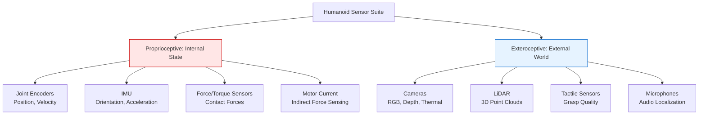
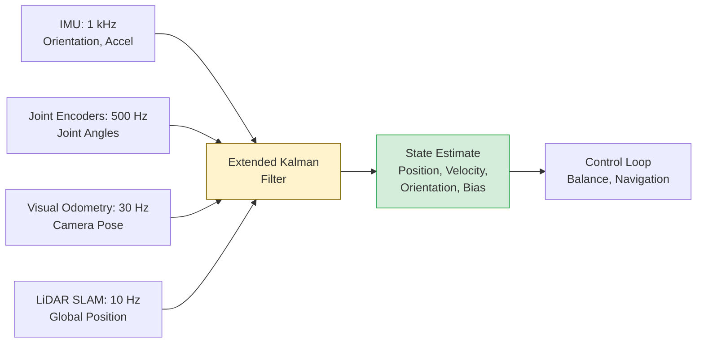

# Hardware and Sensors: Building Your Physical AI Platform

A humanoid robot without sensors is a statue. The perception layer—cameras, LiDAR, IMUs, force sensors—transforms mechanical hardware into an intelligent agent that understands its environment and its own body. This chapter surveys the sensor suite and compute hardware powering modern humanoid systems, with specific focus on accessible components for learning and research.

## Learning Objectives

By the end of this chapter, you will:
- Compare LiDAR, depth cameras, and stereo vision for spatial perception in humanoid systems
- Configure an Intel RealSense D435i depth camera with ROS2 for real-time point cloud processing
- Design a sensor fusion architecture combining IMU, cameras, and joint encoders for state estimation
- Specify a complete $700 starter hardware kit suitable for Physical AI education and prototyping

## The Sensor Taxonomy for Humanoids

Humanoid robots require proprioceptive sensors (internal state awareness) and exteroceptive sensors (external environment perception). The balance between these categories determines the robot's capabilities and failure modes.



### Proprioceptive Sensors: Knowing Thyself

**IMU (Inertial Measurement Unit)**: The humanoid's inner ear. Measures linear acceleration (3-axis accelerometer) and angular velocity (3-axis gyroscope), often with magnetometer for absolute heading. Modern IMUs like the BMI088 or ICM-42688 sample at 1-4 kHz with noise densities below 100 µg/√Hz.

- **Use case**: Balance control, fall detection, orientation estimation
- **Failure mode**: Gyro drift (1-10°/hour), accelerometer bias shift with temperature
- **Mitigation**: Fuse with external references (visual odometry, known gravity vector)

**Joint Encoders**: Measure actuator position and velocity. Absolute encoders (e.g., magnetic AS5048) provide position without homing; incremental encoders (optical quadrature) offer higher resolution but require calibration.

- **Use case**: Forward kinematics, closed-loop control, collision detection (via unexpected resistance)
- **Failure mode**: Encoder slip on mechanical shocks, quantization noise at low velocities
- **Mitigation**: Redundant sensing (motor-side and link-side encoders), velocity smoothing filters

**Force/Torque Sensors**: Six-axis load cells at feet, wrists, or joints. Measure contact forces for stable manipulation and locomotion. High-quality sensors (ATI Mini45) cost $2,000-$3,000; strain-gauge alternatives run $100-$300.

- **Use case**: Ground reaction force for walking, grasp force control, external force estimation
- **Failure mode**: Drift, hysteresis, temperature sensitivity
- **Mitigation**: Frequent zero-force calibration, temperature compensation

> **TIP**: For student projects, motor current sensing provides a zero-cost force estimate. Unexpected current spikes indicate collisions or external loads, enabling basic compliance without dedicated force sensors.

### Exteroceptive Sensors: Perceiving the World

**Depth Cameras**: Structured light (Intel RealSense D435i, $200) or time-of-flight (Azure Kinect, $400) cameras project patterns or light pulses to measure depth at each pixel. Output: aligned RGB-D images at 30-90 fps, range 0.3-10m.

| Sensor | Technology | Resolution | Range | FPS | Cost | Best For |
|--------|-----------|------------|-------|-----|------|----------|
| RealSense D435i | Stereo IR + IMU | 1280×720 | 0.3-10m | 90 | $200 | Indoor navigation, manipulation |
| Azure Kinect | ToF + RGB | 1024×1024 | 0.5-5m | 30 | $400 | Body tracking, gesture recognition |
| OAK-D | Stereo + AI chip | 1280×800 | 0.5-15m | 60 | $200 | Onboard inference, low-latency |

**LiDAR**: Laser rangefinders measure time-of-flight for 100K+ points/second. Velodyne VLP-16 ($4,000) and Ouster OS1 ($3,500) dominated robotics, but 2024 saw solid-state LiDARs (Livox Mid-360, $500) achieve comparable performance at 1/7th cost.

- **Advantages**: Long range (50-200m), excellent in varied lighting, precise geometry
- **Disadvantages**: Struggles with transparent/reflective surfaces, higher cost/power than cameras
- **Use case**: Outdoor navigation, SLAM in large environments, obstacle detection

**RGB Cameras**: Standard color cameras (Logitech C920, $70) provide semantic information—object identity, text, color—that depth sensors miss. Modern humanoids use 2-4 cameras for 180-270° field of view.

> **NOTE**: Tesla Optimus uses vision-only perception (no LiDAR), leveraging eight cameras and neural networks trained on Tesla vehicle data. This approach prioritizes data scale and cost reduction over raw sensor accuracy.

## Intel RealSense D435i: The Workhorse Depth Camera

The D435i combines stereo depth, RGB imaging, and a 6-axis IMU in a $200 package, making it the de facto standard for educational robotics and research prototypes.

**Specifications**:
- Depth resolution: 1280×720 up to 90 fps
- RGB resolution: 1920×1080 at 30 fps
- IMU: BMI055 (accel + gyro), synchronized with images
- Depth technology: Active IR stereo (works in low light)
- Interface: USB 3.0 (5 Gbps required for full resolution)

### ROS2 Integration

The RealSense ROS2 wrapper provides out-of-box point cloud publishing:

```bash
# Install RealSense ROS2 package (Ubuntu 22.04, ROS2 Humble)
sudo apt install ros-humble-realsense2-camera ros-humble-realsense2-description

# Launch camera with aligned depth-to-color and point cloud
ros2 launch realsense2_camera rs_launch.py \
    align_depth.enable:=true \
    pointcloud.enable:=true \
    enable_gyro:=true \
    enable_accel:=true
```

**Published Topics**:
- `/camera/color/image_raw` — RGB image (1920×1080)
- `/camera/aligned_depth_to_color/image_raw` — Depth map aligned to RGB
- `/camera/depth/color/points` — Colored point cloud (sensor_msgs/PointCloud2)
- `/camera/imu` — IMU data at 200 Hz
- `/camera/camera_info` — Intrinsic calibration parameters

### Real-Time Obstacle Detection Example

This node subscribes to the point cloud and detects obstacles within 1.5m using simple range filtering:

```python
import rclpy
from rclpy.node import Node
from sensor_msgs.msg import PointCloud2
from sensor_msgs_py import point_cloud2
from geometry_msgs.msg import PolygonStamped, Point32
import numpy as np

class ObstacleDetector(Node):
    """
    Detects obstacles in front of humanoid using RealSense depth cloud.
    Projects 3D points to 2D ground plane and computes convex hull.
    """
    def __init__(self):
        super().__init__('obstacle_detector')

        self.cloud_sub = self.create_subscription(
            PointCloud2,
            '/camera/depth/color/points',
            self.cloud_callback,
            10
        )

        self.obstacle_pub = self.create_publisher(
            PolygonStamped,
            '/obstacles/footprint',
            10
        )

        # Detection parameters
        self.min_range = 0.3  # meters (ignore robot body)
        self.max_range = 1.5  # meters (detection radius)
        self.height_threshold = 0.1  # meters above ground

        self.get_logger().info('Obstacle detector initialized')

    def cloud_callback(self, msg: PointCloud2):
        """Process point cloud and extract obstacle footprint."""
        # Convert ROS PointCloud2 to numpy array
        points = np.array(list(point_cloud2.read_points(
            msg,
            field_names=("x", "y", "z"),
            skip_nans=True
        )))

        if len(points) == 0:
            return

        # Filter by range (ignore too close/far points)
        distances = np.linalg.norm(points[:, :2], axis=1)  # XY distance
        in_range = (distances > self.min_range) & (distances < self.max_range)
        points = points[in_range]

        # Filter by height (remove ground and ceiling)
        heights = points[:, 2]  # Z coordinate
        obstacles = points[np.abs(heights) > self.height_threshold]

        if len(obstacles) == 0:
            return

        # Project to 2D and compute convex hull (simplified footprint)
        from scipy.spatial import ConvexHull
        xy_points = obstacles[:, :2]

        if len(xy_points) < 3:  # Need at least 3 points for hull
            return

        try:
            hull = ConvexHull(xy_points)
            hull_points = xy_points[hull.vertices]

            # Publish as PolygonStamped for visualization in RViz
            polygon = PolygonStamped()
            polygon.header = msg.header
            polygon.polygon.points = [
                Point32(x=float(p[0]), y=float(p[1]), z=0.0)
                for p in hull_points
            ]
            self.obstacle_pub.publish(polygon)

            self.get_logger().info(
                f'Detected obstacle footprint: {len(hull_points)} vertices'
            )

        except Exception as e:
            self.get_logger().warn(f'Convex hull computation failed: {e}')

def main(args=None):
    rclpy.init(args=args)
    detector = ObstacleDetector()
    rclpy.spin(detector)
    detector.destroy_node()
    rclpy.shutdown()

if __name__ == '__main__':
    main()
```

> **WARNING**: Point cloud processing is computationally expensive (1M+ points at 30 Hz). Use spatial filtering (`min_range`, `max_range`) and downsampling (voxel grids) before complex algorithms. Unoptimized processing causes frame drops and stale perception data.

## Sensor Fusion Architecture

Individual sensors lie, drift, and fail. Sensor fusion combines multiple imperfect measurements into a more accurate state estimate. For humanoids, the Extended Kalman Filter (EKF) or Unscented Kalman Filter (UKF) fuses IMU, joint encoders, and visual odometry.



**Sensor Characteristics**:
- **IMU**: High rate, low latency, but drifts over time (position error grows as t²)
- **Visual Odometry**: Bounded error, but fails in textureless environments or motion blur
- **LiDAR SLAM**: Accurate global position, but computationally expensive and low rate
- **Joint Encoders**: Accurate relative motion, but errors accumulate without external reference

The EKF runs a prediction step at IMU rate (1 kHz) and correction steps when slower sensors (cameras, LiDAR) provide measurements. This maintains low-latency estimates while incorporating accurate but delayed information.

> **IMPORTANT**: Sensor timestamps must be synchronized to within 1-5ms for effective fusion. Use hardware-triggered capture or IEEE 1588 PTP (Precision Time Protocol) for multi-sensor systems. Unsynchronized sensors cause oscillation or divergence in the filter.

## The $700 Student Starter Kit

Building a Physical AI development platform requires balancing capability, cost, and learning value. This kit targets students and hobbyists with a complete sensor suite and compute platform:

| Component | Model | Function | Cost |
|-----------|-------|----------|------|
| **Depth Camera** | Intel RealSense D435i | RGB-D + IMU | $200 |
| **Compute** | NVIDIA Jetson Orin Nano 8GB | 1024 CUDA cores, 40 TOPs AI | $250 |
| **LiDAR** | Slamtec RPLidar A1 | 2D 360° scanning, 12m range | $100 |
| **IMU** | Bosch BNO055 | 9-axis absolute orientation | $35 |
| **Force Sensors** | HX711 + Load Cells (4x) | Foot force measurement | $40 |
| **Power** | Talentcell 12V 6Ah LiPo + Regulator | 72Wh, 5-12V outputs | $50 |
| **Misc** | Cables, mounts, USB hub | Integration hardware | $25 |
| **Total** | | | **$700** |

### Why NVIDIA Jetson Orin Nano?

The Jetson Orin Nano delivers desktop-class AI inference in a 70×45mm form factor consuming 5-15W. Key specifications:

- **GPU**: 1024 CUDA cores, 32 Tensor Cores (Ampere architecture)
- **AI Performance**: 40 TOPS (INT8), sufficient for real-time vision models
- **CPU**: 6-core Arm Cortex-A78AE (up to 1.5 GHz)
- **Memory**: 8GB LPDDR5 (68 GB/s bandwidth)
- **Software**: Ubuntu 20.04, ROS2 Foxy/Humble, CUDA, TensorRT

**Alternatives**:
- **Raspberry Pi 4 (8GB, $75)**: 1/8th the AI performance, but adequate for sensor acquisition and simple control loops
- **Intel NUC (i5, $400)**: More CPU power, but no GPU acceleration for vision models
- **Xavier NX ($450)**: Previous-gen Jetson with 21 TOPS, still capable for many applications

> **TIP**: Start with Raspberry Pi for ROS2 fundamentals and sensor integration. Upgrade to Jetson when vision models or real-time inference become bottlenecks. The software stack (ROS2, Python) is identical, easing migration.

## Setting Up the Starter Kit

Here's a complete setup script for the Jetson Orin Nano with ROS2 Humble and all sensor drivers:

```bash
#!/bin/bash
# Physical AI Starter Kit Setup Script
# Target: NVIDIA Jetson Orin Nano with Ubuntu 20.04
# ROS2: Humble Hawksbill

set -e  # Exit on any error

echo "=== Physical AI Starter Kit Setup ==="

# 1. Install ROS2 Humble
sudo apt update
sudo apt install -y software-properties-common
sudo add-apt-repository universe
sudo curl -sSL https://raw.githubusercontent.com/ros/rosdistro/master/ros.key \
    -o /usr/share/keyrings/ros-archive-keyring.gpg

echo "deb [arch=$(dpkg --print-architecture) \
signed-by=/usr/share/keyrings/ros-archive-keyring.gpg] \
http://packages.ros.org/ros2/ubuntu \
$(. /etc/os-release && echo $UBUNTU_CODENAME) main" \
    | sudo tee /etc/apt/sources.list.d/ros2.list > /dev/null

sudo apt update
sudo apt install -y ros-humble-desktop ros-humble-ros-base
echo "source /opt/ros/humble/setup.bash" >> ~/.bashrc

# 2. Install RealSense SDK and ROS2 wrapper
sudo apt-key adv --keyserver keyserver.ubuntu.com --recv-key F6E65AC044F831AC80A06380C8B3A55A6F3EFCDE
sudo add-apt-repository "deb https://librealsense.intel.com/Debian/apt-repo \
$(lsb_release -cs) main"
sudo apt update
sudo apt install -y librealsense2-dkms librealsense2-utils \
    ros-humble-realsense2-camera

# 3. Install RPLidar ROS2 driver
sudo apt install -y ros-humble-rplidar-ros

# 4. Install BNO055 Python library (I2C communication)
pip3 install adafruit-circuitpython-bno055

# 5. Install Python dependencies for sensor processing
pip3 install numpy scipy opencv-python

# 6. Install visualization tools
sudo apt install -y ros-humble-rviz2 ros-humble-rqt*

# 7. Set up udev rules for USB devices (RealSense, RPLidar)
sudo cp /opt/ros/humble/share/realsense2_camera/config/99-realsense-libusb.rules \
    /etc/udev/rules.d/
echo 'KERNEL=="ttyUSB*", ATTRS{idVendor}=="10c4", ATTRS{idProduct}=="ea60", \
MODE:="0666", GROUP:="dialout", SYMLINK+="rplidar"' \
    | sudo tee /etc/udev/rules.d/99-rplidar.rules
sudo udevadm control --reload-rules && sudo udevadm trigger

# 8. Create workspace
mkdir -p ~/physical_ai_ws/src
cd ~/physical_ai_ws/src
git clone https://github.com/ros-perception/vision_opencv.git --branch humble
cd ~/physical_ai_ws
source /opt/ros/humble/setup.bash
colcon build --symlink-install
echo "source ~/physical_ai_ws/install/setup.bash" >> ~/.bashrc

echo "=== Setup Complete! ==="
echo "Test sensors:"
echo "  RealSense: ros2 launch realsense2_camera rs_launch.py"
echo "  RPLidar: ros2 launch rplidar_ros rplidar.launch.py"
echo "  Visualization: ros2 run rviz2 rviz2"
```

**Execution**:
```bash
chmod +x setup_starter_kit.sh
./setup_starter_kit.sh
```

**Verification**: After setup, verify all sensors publish data:
```bash
# Terminal 1: Launch RealSense
ros2 launch realsense2_camera rs_launch.py

# Terminal 2: Check topics
ros2 topic list
ros2 topic hz /camera/color/image_raw  # Should show ~30 Hz
```

## Key Takeaways

> **Key Takeaways**
> - Proprioceptive sensors (IMU, encoders) provide high-rate internal state, while exteroceptive sensors (cameras, LiDAR) measure environment at lower rates
> - Intel RealSense D435i delivers depth + RGB + IMU in a $200 package, making it the standard for educational robotics and research prototypes
> - LiDAR provides superior range and accuracy (50-200m vs 10m for cameras) but costs 5-10x more; solid-state LiDARs are closing the gap
> - Sensor fusion with Extended Kalman Filters combines fast-but-drifting IMUs with slow-but-accurate vision, running prediction at 1 kHz and correction at sensor rates
> - The NVIDIA Jetson Orin Nano (40 TOPS, $250) enables real-time vision model inference at 30 fps, sufficient for navigation and manipulation
> - A complete $700 starter kit (depth camera + Jetson + LiDAR + IMU + force sensors) provides enterprise-grade sensing for education and prototyping
> - Point cloud processing at 30 Hz requires spatial filtering and downsampling; naive algorithms cause 100+ ms latency and frame drops

## Further Reading

- [Intel RealSense D435i Datasheet and Technical Specs](https://www.intelrealsense.com/depth-camera-d435i/) — Official documentation covering depth accuracy, IMU specifications, and calibration procedures for the D435i stereo camera
- [NVIDIA Jetson Orin Nano Developer Kit Documentation](https://developer.nvidia.com/embedded/jetson-orin-nano-developer-kit) — Setup guides, performance benchmarks, and AI model deployment tutorials for the Jetson Orin Nano platform
- [Probabilistic Robotics by Thrun, Burgard, Fox (Chapter 3: Gaussian Filters)](http://www.probabilistic-robotics.org/) — Definitive textbook covering Kalman filters, Extended Kalman Filters, and sensor fusion mathematics for mobile robots

## Assessment

### Multiple Choice Questions

**Q1 (Easy)**: Which sensor type provides absolute orientation estimates without drift, unlike gyroscopes?

- A) Accelerometer
- B) Magnetometer
- C) Optical encoder
- D) Force/torque sensor

<details>
<summary>Answer</summary>

**B) Magnetometer** — Magnetometers measure Earth's magnetic field to determine absolute heading (compass direction), providing a drift-free reference. Gyroscopes measure angular velocity and integrate to orientation, accumulating drift over time. Accelerometers measure gravity's direction for pitch/roll but cannot determine heading (yaw).

</details>

**Q2 (Medium)**: The Intel RealSense D435i publishes point clouds at 30 Hz with ~1 million points per frame. If your obstacle detection algorithm processes 10,000 points per second, what is the maximum processing latency per frame?

- A) 33 ms (real-time)
- B) 100 ms
- C) 333 ms
- D) 3000 ms

<details>
<summary>Answer</summary>

**D) 3000 ms** — At 1 million points per frame and 10,000 points/second processing rate, each frame requires 1,000,000 ÷ 10,000 = 100 seconds to process. This is catastrophically slow for real-time robotics. The question highlights the need for spatial filtering (reducing to ~10K points) or GPU acceleration (1000x speedup). Real-time requires processing to complete within the frame period (33ms at 30 Hz).

</details>

**Q3 (Medium)**: In sensor fusion, why does the Extended Kalman Filter run prediction steps at IMU rate (1 kHz) but correction steps at camera rate (30 Hz)?

- A) Cameras are more accurate than IMUs
- B) IMUs provide high-rate motion estimates; cameras provide bounded-error corrections
- C) Camera data requires more computation to process
- D) IMUs are cheaper than cameras

<details>
<summary>Answer</summary>

**B) IMUs provide high-rate motion estimates; cameras provide bounded-error corrections** — The EKF's two-step process matches sensor characteristics: IMUs deliver fast but drifting motion data (prediction), while cameras deliver slower but absolute position data (correction). Running prediction at 1 kHz maintains low-latency estimates, while 30 Hz corrections prevent drift accumulation. Answer A is partially true but misses the rate matching; C and D are irrelevant to the filter structure.

</details>

**Q4 (Hard)**: A humanoid's foot force sensors report [0, 0, 0, 0] Newtons on all four corners during known ground contact. Which failure mode is most likely, and what is the appropriate mitigation?

- A) Sensor saturation; reduce applied force
- B) Zero-point drift; recalibrate with known load
- C) Wiring fault; check electrical connections
- D) Temperature sensitivity; wait for thermal equilibrium

<details>
<summary>Answer</summary>

**C) Wiring fault; check electrical connections** — Zero readings on all sensors during known loading indicates a systemic failure, most likely a wiring issue (disconnected power, ground, or signal). Zero-point drift (B) would show non-zero readings that don't correspond to load. Saturation (A) produces maximum readings, not zeros. Temperature sensitivity (D) causes gradual drift, not sudden zeros. The diagnostic sequence: (1) check wiring/power, (2) verify sensor excitation voltage, (3) test with known loads.

</details>

### Coding Exercises

**Exercise 1**: Modify the `ObstacleDetector` to publish a warning message (std_msgs/String) when obstacles are detected within 0.5m directly in front of the robot (±30° cone).

```python
# Add to ObstacleDetector class:
from std_msgs.msg import String
import math

def __init__(self):
    # ... (existing initialization) ...

    self.warning_pub = self.create_publisher(String, '/warnings', 10)
    self.warning_distance = 0.5  # meters
    self.warning_angle = math.radians(30)  # cone half-angle

def cloud_callback(self, msg: PointCloud2):
    # ... (existing obstacle detection) ...

    # TODO: Check if obstacles in warning zone
    # Compute angle: atan2(y, x) for each obstacle point
    # If distance < 0.5m AND |angle| < 30°, publish warning
    pass
```

<details>
<summary>Solution</summary>

```python
from std_msgs.msg import String
import math

class ObstacleDetector(Node):
    def __init__(self):
        super().__init__('obstacle_detector')

        self.cloud_sub = self.create_subscription(
            PointCloud2, '/camera/depth/color/points',
            self.cloud_callback, 10
        )
        self.obstacle_pub = self.create_publisher(
            PolygonStamped, '/obstacles/footprint', 10
        )
        self.warning_pub = self.create_publisher(
            String, '/warnings', 10
        )

        self.min_range = 0.3
        self.max_range = 1.5
        self.height_threshold = 0.1
        self.warning_distance = 0.5
        self.warning_angle = math.radians(30)

    def cloud_callback(self, msg: PointCloud2):
        points = np.array(list(point_cloud2.read_points(
            msg, field_names=("x", "y", "z"), skip_nans=True
        )))

        if len(points) == 0:
            return

        # Filter by range
        distances = np.linalg.norm(points[:, :2], axis=1)
        in_range = (distances > self.min_range) & (distances < self.max_range)
        points = points[in_range]

        heights = points[:, 2]
        obstacles = points[np.abs(heights) > self.height_threshold]

        if len(obstacles) == 0:
            return

        # Check for close obstacles in frontal cone
        xy_points = obstacles[:, :2]
        distances = np.linalg.norm(xy_points, axis=1)
        angles = np.arctan2(xy_points[:, 1], xy_points[:, 0])

        # Warning zone: distance < 0.5m AND |angle| < 30°
        in_warning_zone = (distances < self.warning_distance) & \
                          (np.abs(angles) < self.warning_angle)

        if np.any(in_warning_zone):
            min_dist = np.min(distances[in_warning_zone])
            warning = String()
            warning.data = f"WARNING: Obstacle at {min_dist:.2f}m ahead!"
            self.warning_pub.publish(warning)
            self.get_logger().warn(warning.data)

        # ... (rest of existing code for polygon publishing) ...
```

**Explanation**: We compute angles using `arctan2(y, x)`, where x is forward (camera optical axis) and y is lateral. The warning condition `(distances < 0.5) & (np.abs(angles) < 30°)` selects points in the frontal cone. Broadcasting `&` across numpy arrays enables efficient vectorized computation.

</details>

**Exercise 2**: Write a ROS2 node that subscribes to the RealSense IMU (`/camera/imu`) and logs orientation in Euler angles (roll, pitch, yaw) at 10 Hz to a CSV file for offline analysis.

```python
# imu_logger.py
import rclpy
from rclpy.node import Node
from sensor_msgs.msg import Imu
import csv
import math

class ImuLogger(Node):
    def __init__(self):
        super().__init__('imu_logger')
        # TODO: Subscribe to /camera/imu
        # TODO: Open CSV file for writing
        # TODO: Convert quaternion to Euler angles
        # TODO: Write timestamp, roll, pitch, yaw every 100ms
        pass
```

<details>
<summary>Solution</summary>

```python
import rclpy
from rclpy.node import Node
from sensor_msgs.msg import Imu
import csv
import math
from datetime import datetime

class ImuLogger(Node):
    def __init__(self):
        super().__init__('imu_logger')

        self.imu_sub = self.create_subscription(
            Imu, '/camera/imu', self.imu_callback, 10
        )

        # Open CSV file with timestamp in filename
        timestamp = datetime.now().strftime('%Y%m%d_%H%M%S')
        self.csv_file = open(f'imu_log_{timestamp}.csv', 'w', newline='')
        self.csv_writer = csv.writer(self.csv_file)
        self.csv_writer.writerow(['timestamp_ns', 'roll_deg', 'pitch_deg', 'yaw_deg'])

        # Throttle to 10 Hz
        self.log_timer = self.create_timer(0.1, self.log_data)
        self.latest_imu = None

        self.get_logger().info(f'Logging IMU data to imu_log_{timestamp}.csv')

    def imu_callback(self, msg: Imu):
        """Store latest IMU message."""
        self.latest_imu = msg

    def log_data(self):
        """Write Euler angles to CSV at 10 Hz."""
        if self.latest_imu is None:
            return

        # Convert quaternion to Euler angles
        q = self.latest_imu.orientation
        roll, pitch, yaw = self.quaternion_to_euler(q.w, q.x, q.y, q.z)

        # Get timestamp (nanoseconds since epoch)
        timestamp_ns = self.latest_imu.header.stamp.sec * 1e9 + \
                       self.latest_imu.header.stamp.nanosec

        # Write to CSV
        self.csv_writer.writerow([
            int(timestamp_ns),
            math.degrees(roll),
            math.degrees(pitch),
            math.degrees(yaw)
        ])

    def quaternion_to_euler(self, w, x, y, z):
        """Convert quaternion to Euler angles (roll, pitch, yaw)."""
        # Roll (x-axis rotation)
        sinr_cosp = 2 * (w * x + y * z)
        cosr_cosp = 1 - 2 * (x * x + y * y)
        roll = math.atan2(sinr_cosp, cosr_cosp)

        # Pitch (y-axis rotation)
        sinp = 2 * (w * y - z * x)
        pitch = math.asin(np.clip(sinp, -1.0, 1.0))  # Clamp to [-1,1] for asin

        # Yaw (z-axis rotation)
        siny_cosp = 2 * (w * z + x * y)
        cosy_cosp = 1 - 2 * (y * y + z * z)
        yaw = math.atan2(siny_cosp, cosy_cosp)

        return roll, pitch, yaw

    def __del__(self):
        """Close CSV file on node destruction."""
        if hasattr(self, 'csv_file'):
            self.csv_file.close()
            self.get_logger().info('CSV file closed')

def main(args=None):
    rclpy.init(args=args)
    logger = ImuLogger()
    try:
        rclpy.spin(logger)
    except KeyboardInterrupt:
        pass
    finally:
        logger.destroy_node()
        rclpy.shutdown()

if __name__ == '__main__':
    main()
```

**Usage**:
```bash
ros2 run physical_ai_tutorial imu_logger
# Press Ctrl+C to stop logging
# Output: imu_log_20250610_143022.csv
```

**Analysis**: Load the CSV in Python/MATLAB to visualize orientation over time, compute angular velocity from finite differences, or analyze IMU drift by comparing static periods.

</details>

### Mini-Project: Multi-Sensor Calibration and Synchronization

**Objective**: Build a ROS2 system that calibrates the spatial relationship between a RealSense D435i camera and an RPLidar A1, then publishes synchronized, fused data for SLAM or obstacle avoidance.

**Background**: Physical AI systems often combine cameras (rich semantic information, limited range) with LiDAR (long range, geometric precision). To fuse these sensors, you must:
1. Calibrate the 6-DOF transform (translation + rotation) between sensor frames
2. Synchronize measurements despite different rates (camera 30 Hz, LiDAR 10 Hz)
3. Project data into a common coordinate frame for downstream processing

**Requirements**:

1. **Calibration**:
   - Use a checkerboard pattern visible to both camera and LiDAR
   - Implement a calibration node that computes the static transform between sensors
   - Publish the transform to `/tf_static` for RViz visualization

2. **Synchronization**:
   - Use `message_filters::ApproximateTimeSynchronizer` to align camera and LiDAR messages
   - Handle different message rates (camera 30 Hz, LiDAR 10 Hz)
   - Publish synchronized pairs with matched timestamps

3. **Fusion**:
   - Project LiDAR points onto the camera image to create a colored 3D point cloud
   - Combine LiDAR long-range data with camera semantic information
   - Publish fused cloud to `/fused_pointcloud` for visualization

4. **Validation**:
   - Verify calibration accuracy by overlaying LiDAR points on camera image
   - Measure synchronization error (timestamp difference < 50ms)
   - Test with dynamic scenes (moving objects) to demonstrate fusion utility

**Deliverables**:

- `calibrate_sensors.py`: Calibration node with checkerboard detection
- `sync_and_fuse.py`: Synchronization and fusion node
- `launch/sensor_fusion.launch.py`: Launch file starting all nodes
- `README.md`: Setup instructions, calibration procedure, and accuracy results
- Recorded ROS2 bag file demonstrating calibration and fusion

**Starter Code**:

```python
# calibrate_sensors.py (skeleton)
import rclpy
from rclpy.node import Node
from sensor_msgs.msg import Image, LaserScan
from geometry_msgs.msg import TransformStamped
from tf2_ros import StaticTransformBroadcaster

class SensorCalibrator(Node):
    def __init__(self):
        super().__init__('sensor_calibrator')
        self.tf_broadcaster = StaticTransformBroadcaster(self)
        # TODO: Subscribe to camera and LiDAR, detect checkerboard, compute transform
        pass

# sync_and_fuse.py (skeleton)
from message_filters import ApproximateTimeSynchronizer, Subscriber

class SensorFusion(Node):
    def __init__(self):
        super().__init__('sensor_fusion')

        # Subscribers with message_filters
        image_sub = Subscriber(self, Image, '/camera/color/image_raw')
        lidar_sub = Subscriber(self, LaserScan, '/scan')

        # Synchronizer (50ms tolerance)
        self.sync = ApproximateTimeSynchronizer(
            [image_sub, lidar_sub],
            queue_size=10,
            slop=0.05
        )
        self.sync.registerCallback(self.fusion_callback)

    def fusion_callback(self, image_msg, lidar_msg):
        # TODO: Project LiDAR onto image, create colored point cloud
        pass
```

**Expected Time**: 3-5 hours

**Hints**:
- Use OpenCV's `findChessboardCorners()` for camera calibration
- LiDAR calibration: manually position checkerboard at known distance, measure LiDAR range
- For projection: use camera intrinsics from `/camera/camera_info` and transform from `/tf`
- Test synchronization accuracy: `ros2 bag play --rate 0.1` slows playback for inspection
- Visualize in RViz: Add TF display, Image, and PointCloud2 panels

**Stretch Goals**:
- Implement automatic checkerboard pose estimation from LiDAR scan lines
- Add temporal filtering (Kalman filter) to smooth fused point cloud
- Extend to 3-sensor fusion: camera + LiDAR + IMU for full 6-DOF pose estimation
