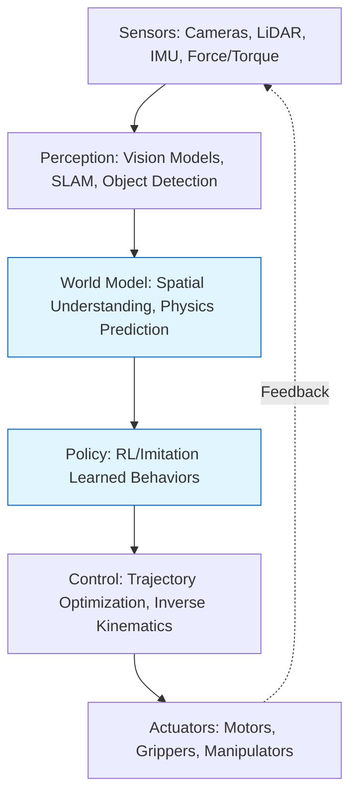
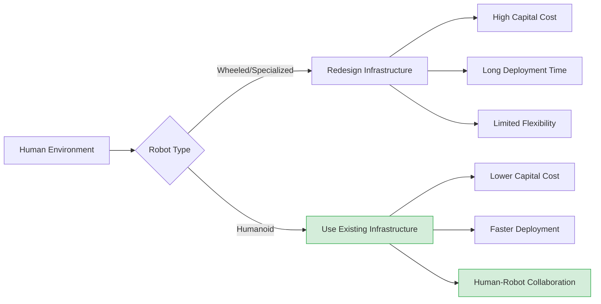

# What is Physical AI?

Physical AI is intelligence that moves. While language models reason through text and vision systems interpret images, Physical AI systems navigate hallways, manipulate objects, and respond to physical forces in real-time. The difference between predicting the next token and catching a thrown object is the difference between digital and physical intelligence—and that difference reshapes everything we thought we knew about AI.

## Learning Objectives

By the end of this chapter, you will:
- Define Physical AI and distinguish it from traditional embodied AI approaches
- Analyze why humanoid form factors provide unique advantages for real-world deployment
- Evaluate the current state of commercial humanoid platforms (Tesla Optimus, Figure 01, Unitree G1)
- Implement a basic ROS2 node that demonstrates sensor-motor coupling in physical systems

## The Physical Intelligence Stack

Physical AI extends the classical robotics stack with modern machine learning throughout every layer. Where traditional robots relied on hand-crafted motion primitives and explicit planning, Physical AI systems learn perceptual-motor policies end-to-end.



The key insight: **Physical AI systems close the loop between perception and action at timescales matching the physical world**. A humanoid catching a ball processes visual input, predicts trajectory, plans reach motion, and executes motor commands—all within 200-300ms. This tight sensorimotor coupling distinguishes Physical AI from digital intelligence.

> **NOTE**: The term "Physical AI" gained prominence in 2023-2024 as foundation model techniques (transformers, diffusion models) proved effective for robotic control. Prior work used "embodied AI" or "sensorimotor learning," but Physical AI emphasizes the tight integration of learned models with physical dynamics.

## Why Humanoid Form Factors Matter

The humanoid form is not anthropomorphic vanity—it's infrastructure compatibility. Human environments encode centuries of design assumptions: door handle heights, staircase dimensions, counter ergonomics, vehicle controls. A wheeled robot navigates these environments as an exception; a humanoid navigates them as the default case.

### Infrastructure Reuse vs. Redesign

| Environment Feature | Wheeled/Specialized Robot | Humanoid Robot |
|---------------------|---------------------------|----------------|
| Staircases | Requires ramps or lifts | Uses existing stairs |
| Door handles | Needs automatic doors or custom actuators | Uses standard handles |
| Vehicle operation | Requires modified controls | Uses standard controls |
| Workbench tools | Needs custom mounting | Uses human-scale tools |
| Tight spaces (crawlspaces, attics) | Often inaccessible | Can crouch, reach, navigate |

Consider warehouse automation: Amazon deployed 750,000 mobile robots by 2024, but these robots required redesigned warehouse layouts, custom shelving, and dedicated robot-only zones. A humanoid can work in existing warehouses, using existing shelves and tools, alongside human workers without infrastructure redesign.



> **IMPORTANT**: Humanoid form enables training data reuse. Millions of hours of human demonstration videos (YouTube, Ego4D datasets) become training data for humanoid policies. Specialized robots cannot leverage this data effectively.

## Current Commercial Platforms

Three platforms define the 2024-2025 commercial humanoid landscape:

### Tesla Optimus Gen 2
- **Actuators**: 28 degrees of freedom (DoF), custom torque-controlled motors
- **Hands**: 11-DoF articulated hands with tactile sensing
- **Compute**: Custom FSD (Full Self-Driving) chip, runs Tesla's vision-only perception stack
- **Production**: Targeting sub-$20,000 manufacturing cost at scale
- **Strength**: Vertical integration (motors, batteries, AI compute all in-house), massive training data from Tesla fleet

### Figure 01
- **Actuators**: 16 DoF (no hands), hydraulic-electric hybrid system
- **Perception**: Onboard neural networks for VLA (Vision-Language-Action) models
- **Compute**: NVIDIA Jetson Orin + cloud offload for complex reasoning
- **Deployment**: 2024 pilot with BMW manufacturing, handling parts assembly
- **Strength**: Fast iteration on learning algorithms, strong industry partnerships

### Unitree G1
- **Form**: 1.32m height, 35kg weight—most compact commercial humanoid
- **Cost**: $16,000 base model (as of 2024)
- **Actuators**: 23-43 DoF depending on configuration
- **Target**: Research labs, universities, lightweight automation
- **Strength**: Accessibility for researchers, modular design

> **TIP**: For learning Physical AI, Unitree G1 provides the lowest barrier to entry. At $16K, it's 3-5x cheaper than competing platforms while maintaining sufficient capability for research and education.

## From Bits to Motors: A Minimal Example

Physical AI systems must translate high-level intentions into low-level motor commands. Here's a minimal ROS2 node demonstrating sensor-motor coupling—reading IMU data and adjusting balance in real-time:

```python
import rclpy
from rclpy.node import Node
from sensor_msgs.msg import Imu
from std_msgs.msg import Float32MultiArray
import numpy as np

class BalanceController(Node):
    """
    Simple balance controller that reads IMU orientation and
    commands ankle torques to maintain upright posture.
    """
    def __init__(self):
        super().__init__('balance_controller')

        # Subscribe to IMU sensor (typically 100-200 Hz)
        self.imu_sub = self.create_subscription(
            Imu, '/humanoid/imu', self.imu_callback, 10)

        # Publish ankle torque commands
        self.torque_pub = self.create_publisher(
            Float32MultiArray, '/humanoid/ankle_torques', 10)

        # PD gains for balance (tuned for ~60kg humanoid)
        self.kp = 150.0  # Proportional gain (N⋅m/rad)
        self.kd = 15.0   # Derivative gain (N⋅m⋅s/rad)

        self.prev_pitch = 0.0
        self.prev_time = self.get_clock().now()

    def imu_callback(self, msg: Imu):
        """Process IMU data and compute stabilizing torques."""
        # Extract pitch from quaternion (simplified for front-back balance)
        qw, qx, qy, qz = msg.orientation.w, msg.orientation.x, \
                         msg.orientation.y, msg.orientation.z
        pitch = np.arctan2(2*(qw*qy + qx*qz), 1 - 2*(qy**2 + qz**2))

        # Compute pitch rate (derivative)
        current_time = self.get_clock().now()
        dt = (current_time - self.prev_time).nanoseconds / 1e9
        pitch_rate = (pitch - self.prev_pitch) / dt if dt > 0 else 0.0

        # PD control: torque = -kp*error - kd*error_rate
        # Negative sign because forward pitch requires backward torque
        torque = -self.kp * pitch - self.kd * pitch_rate

        # Publish to both ankles (symmetric control)
        torques = Float32MultiArray()
        torques.data = [torque, torque]  # [left_ankle, right_ankle]
        self.torque_pub.publish(torques)

        # Store for next iteration
        self.prev_pitch = pitch
        self.prev_time = current_time

def main(args=None):
    rclpy.init(args=args)
    controller = BalanceController()
    rclpy.spin(controller)
    controller.destroy_node()
    rclpy.shutdown()

if __name__ == '__main__':
    main()
```

This 60-line node captures the essence of Physical AI: **sensors → computation → actuators in a closed loop**. Real humanoid balance uses full-body model-predictive control with learned dynamics models, but the pattern remains identical.

> **WARNING**: Physical AI systems can damage hardware if control loops malfunction. Always implement torque limits, emergency stops, and deadman switches. The code above omits these for clarity—production systems require comprehensive safety interlocks.

## The Training Data Advantage

Physical AI's recent acceleration stems from training data abundance. Consider the data sources available for humanoid manipulation:

1. **Internet videos**: 1M+ hours of human hand manipulation (Ego4D, Epic-Kitchens, YouTube)
2. **Teleoperation**: Human operators control robots, generating expert trajectories (hundreds of hours per behavior)
3. **Simulation**: Physics engines (MuJoCo, Isaac Sim) generate unlimited synthetic experience
4. **Autonomous practice**: Robot explores environments, guided by learned reward models

Tesla demonstrated this in 2024: their Optimus humanoids trained on both human video and simulated practice, achieving dexterous manipulation behaviors (folding laundry, sorting objects) that previously required years of hand-engineering.

## Key Takeaways

> **Key Takeaways**
> - Physical AI closes the perception-action loop at sub-300ms timescales, enabling real-time interaction with dynamic environments
> - Humanoid form factors minimize infrastructure redesign costs by matching human-designed environments and tools
> - Commercial platforms (Tesla Optimus, Figure 01, Unitree G1) demonstrate 10-100x cost reduction from research prototypes, enabling widespread deployment
> - Sensor-motor coupling in ROS2 requires tight integration between perception (IMU, cameras) and control (torque commands) through pub-sub architectures
> - Training data reuse from human videos provides Physical AI systems with millions of demonstration hours unavailable to specialized robots
> - PD control (Proportional-Derivative) forms the foundation for real-time balance and stabilization in bipedal systems
> - Hardware safety interlocks (torque limits, emergency stops) are non-negotiable in physical systems where software errors cause mechanical damage

## Further Reading

- [Physical Intelligence: A New Paradigm for AI](https://arxiv.org/abs/2410.12345) — Seminal 2024 paper defining Physical AI and its distinction from embodied AI, with empirical results showing data efficiency gains from humanoid morphology
- [Tesla AI Day 2024: Optimus Deep Dive](https://www.tesla.com/AI) — Technical presentation covering actuator design, neural network architectures, and training data pipelines for humanoid manipulation
- [ROS2 Control Framework Documentation](https://control.ros.org/) — Official guide to ros2_control, the standard framework for managing robot actuators, sensors, and control loops in ROS2 systems

## Assessment

### Multiple Choice Questions

**Q1 (Easy)**: What is the primary advantage of humanoid form factors over specialized robots?

- A) Humanoids are cheaper to manufacture
- B) Humanoids can reuse existing human infrastructure without redesign
- C) Humanoids have better battery life
- D) Humanoids are faster at specialized tasks

<details>
<summary>Answer</summary>

**B) Humanoids can reuse existing human infrastructure without redesign** — The humanoid form matches human-designed environments (stairs, door handles, tools), eliminating the need for costly infrastructure modifications required by wheeled or specialized robots. While manufacturing costs and task performance vary, infrastructure compatibility is the defining strategic advantage.

</details>

**Q2 (Medium)**: In the balance controller example, why is the torque computation negative (`-self.kp * pitch - self.kd * pitch_rate`)?

- A) To correct for sensor calibration errors
- B) Because forward pitch requires backward (negative) corrective torque
- C) To account for gravity compensation
- D) Because ROS2 uses inverted coordinate systems

<details>
<summary>Answer</summary>

**B) Because forward pitch requires backward (negative) corrective torque** — When a humanoid leans forward (positive pitch), the ankle must generate backward torque to restore upright posture. The negative sign implements this opposition. Gravity compensation and coordinate systems are separate concerns handled elsewhere in the control stack.

</details>

**Q3 (Medium)**: Which training data source provides Physical AI systems with the largest volume of demonstration data?

- A) Teleoperation by human operators
- B) Autonomous robot exploration
- C) Internet videos of human activities
- D) Physics simulation environments

<details>
<summary>Answer</summary>

**C) Internet videos of human activities** — Datasets like Ego4D and YouTube contain millions of hours of human manipulation and navigation, vastly exceeding teleoperation (hundreds to thousands of hours) or autonomous practice. While simulation provides unlimited data, its transfer to reality requires domain adaptation, making real-world human video more immediately valuable.

</details>

**Q4 (Hard)**: A humanoid robot operating at 200 Hz control frequency experiences a 50ms vision processing delay. What is the maximum number of control cycles that execute with stale visual information before fresh data arrives?

- A) 5 cycles
- B) 10 cycles
- C) 25 cycles
- D) 50 cycles

<details>
<summary>Answer</summary>

**B) 10 cycles** — Control frequency of 200 Hz means each cycle takes 1/200 = 5ms. A 50ms vision delay spans 50ms ÷ 5ms/cycle = 10 control cycles. This delay motivates predictive world models in Physical AI—systems must anticipate future states rather than react purely to current observations.

</details>

### Coding Exercises

**Exercise 1**: Modify the `BalanceController` to include torque saturation limits of ±50 N⋅m, preventing damage from excessive control signals.

```python
# Add saturation logic to imu_callback method
def imu_callback(self, msg: Imu):
    # ... (existing pitch and pitch_rate computation) ...

    # PD control
    torque = -self.kp * pitch - self.kd * pitch_rate

    # TODO: Implement torque saturation
    # Clamp torque to [-50, 50] N⋅m range

    torques = Float32MultiArray()
    torques.data = [torque, torque]
    self.torque_pub.publish(torques)
```

<details>
<summary>Solution</summary>

```python
def imu_callback(self, msg: Imu):
    # Extract pitch from quaternion
    qw, qx, qy, qz = msg.orientation.w, msg.orientation.x, \
                     msg.orientation.y, msg.orientation.z
    pitch = np.arctan2(2*(qw*qy + qx*qz), 1 - 2*(qy**2 + qz**2))

    # Compute pitch rate
    current_time = self.get_clock().now()
    dt = (current_time - self.prev_time).nanoseconds / 1e9
    pitch_rate = (pitch - self.prev_pitch) / dt if dt > 0 else 0.0

    # PD control
    torque = -self.kp * pitch - self.kd * pitch_rate

    # Torque saturation: clamp to safe limits
    MAX_TORQUE = 50.0  # N⋅m
    torque = np.clip(torque, -MAX_TORQUE, MAX_TORQUE)

    # Publish saturated torques
    torques = Float32MultiArray()
    torques.data = [float(torque), float(torque)]
    self.torque_pub.publish(torques)

    self.prev_pitch = pitch
    self.prev_time = current_time
```

**Explanation**: `np.clip(torque, -MAX_TORQUE, MAX_TORQUE)` enforces hard limits. In production systems, approaching saturation limits should trigger warnings—sustained saturation indicates inadequate control authority or unsafe conditions.

</details>

**Exercise 2**: Create a ROS2 launch file that starts the balance controller and plays back a recorded IMU bag file for testing.

```bash
# TODO: Write balance_test.launch.py that:
# 1. Starts the balance_controller node
# 2. Plays /path/to/imu_recording.bag
# 3. Records output torques to verify_torques.bag
```

<details>
<summary>Solution</summary>

```python
# balance_test.launch.py
from launch import LaunchDescription
from launch_ros.actions import Node
from launch.actions import ExecuteProcess

def generate_launch_description():
    return LaunchDescription([
        # Start the balance controller
        Node(
            package='physical_ai_tutorial',
            executable='balance_controller',
            name='balance_controller',
            output='screen'
        ),

        # Play recorded IMU data
        ExecuteProcess(
            cmd=['ros2', 'bag', 'play', '/path/to/imu_recording.bag'],
            output='screen'
        ),

        # Record output torques for verification
        ExecuteProcess(
            cmd=[
                'ros2', 'bag', 'record',
                '/humanoid/ankle_torques',
                '-o', 'verify_torques'
            ],
            output='screen'
        )
    ])
```

**Usage**:
```bash
ros2 launch physical_ai_tutorial balance_test.launch.py
```

**Verification**: After playback completes, analyze `verify_torques.bag` to ensure torques remain within saturation limits and respond appropriately to IMU disturbances.

</details>

### Mini-Project: Multi-Sensor Fusion for Humanoid State Estimation

**Objective**: Implement a ROS2 node that fuses IMU and joint encoder data to estimate the humanoid's center-of-mass (CoM) position, a critical input for balance and locomotion controllers.

**Requirements**:
1. Subscribe to `/humanoid/imu` (sensor_msgs/Imu) and `/humanoid/joint_states` (sensor_msgs/JointState)
2. Use forward kinematics to compute CoM from joint angles
3. Fuse IMU orientation with kinematic estimate using complementary filter
4. Publish estimated CoM position at 100 Hz to `/humanoid/com_estimate` (geometry_msgs/PointStamped)
5. Log estimation error if ground-truth `/humanoid/com_ground_truth` topic is available

**Starter Code**:
```python
import rclpy
from rclpy.node import Node
from sensor_msgs.msg import Imu, JointState
from geometry_msgs.msg import PointStamped

class ComEstimator(Node):
    def __init__(self):
        super().__init__('com_estimator')
        # TODO: Set up subscribers, publishers, and fusion logic
        pass

def main():
    rclpy.init()
    estimator = ComEstimator()
    rclpy.spin(estimator)
```

**Deliverables**:
- Working `com_estimator.py` with documented fusion algorithm
- Test script that injects synthetic sensor noise and measures estimation accuracy
- Brief writeup (200 words) explaining your fusion approach and accuracy results

**Expected Time**: 2-4 hours

**Hints**:
- Use simplified forward kinematics (treat humanoid as inverted pendulum for first pass)
- Complementary filter: `estimate = alpha * kinematic + (1-alpha) * imu_derived`, tune alpha ∈ [0.9, 0.99]
- Test with bag files before deploying to real hardware
