# Isaac ROS Perception

When Boston Dynamics' Spot navigates autonomously, it processes LiDAR, camera, and IMU data at 30 Hz while maintaining millimeter-accurate localization. Achieving this performance on embedded platforms requires hardware acceleration. NVIDIA's Isaac ROS packages bring GPU-accelerated perception to ROS2, delivering 10-100x speedups over CPU implementations. For humanoid robots with limited onboard compute budgets, this acceleration difference determines whether real-time perception is possible.

> **By the end of this chapter, you will:**
> - Deploy Isaac ROS packages for visual SLAM, object detection, and depth estimation on Jetson platforms
> - Configure NITROS (NVIDIA Isaac Transport for ROS) for zero-copy message passing between GPU-accelerated nodes
> - Integrate stereo camera pipelines with DNN-based depth estimation for manipulation tasks
> - Optimize perception graphs to meet real-time deadlines on resource-constrained hardware

## Isaac ROS Architecture

Isaac ROS packages wrap NVIDIA's CUDA-accelerated perception libraries as ROS2 nodes. The critical innovation is NITROS, a transport layer that eliminates CPU-GPU memory copies when chaining Isaac ROS nodes together.


Traditional ROS2 perception pipelines suffer from three bottlenecks:
1. **Serialization overhead**: Converting images to ROS messages
2. **Memory copies**: Moving data between CPU and GPU
3. **CPU preprocessing**: Resize, normalize, color conversion on CPU cores

NITROS eliminates all three by keeping data in GPU memory and using shared pointers.

> 💡 **TIP**: Isaac ROS nodes can interoperate with standard ROS2 nodes, but you lose zero-copy benefits at the boundary. Design perception graphs to maximize consecutive Isaac ROS node chains before converting back to standard messages.

### Installation on Jetson Orin

Isaac ROS targets NVIDIA Jetson platforms (Orin Nano, Orin NX, AGX Orin) and discrete GPUs (RTX, A-series). Install via Docker for dependency isolation:

```bash
# Install NVIDIA Container Toolkit
distribution=$(. /etc/os-release;echo $ID$VERSION_ID)
curl -fsSL https://nvidia.github.io/libnvidia-container/gpgkey | sudo gpg --dearmor -o /usr/share/keyrings/nvidia-container-toolkit-keyring.gpg
curl -s -L https://nvidia.github.io/libnvidia-container/$distribution/libnvidia-container.list | \
    sed 's#deb https://#deb [signed-by=/usr/share/keyrings/nvidia-container-toolkit-keyring.gpg] https://#g' | \
    sudo tee /etc/apt/sources.list.d/nvidia-container-toolkit.list
sudo apt-get update && sudo apt-get install -y nvidia-container-toolkit

# Pull Isaac ROS Docker image
docker pull nvcr.io/nvidia/isaac/ros:aarch64-ros2_humble_nav2_3b64a5d08ba5e4c0e4e8f5a2c3e6d1f2

# Run with GPU access
docker run --privileged --network host \
    --runtime nvidia \
    -v /dev:/dev \
    -v ~/ros2_ws:/workspace \
    -it nvcr.io/nvidia/isaac/ros:aarch64-ros2_humble_nav2_3b64a5d08ba5e4c0e4e8f5a2c3e6d1f2
```

> ⚠️ **WARNING**: Isaac ROS requires JetPack 5.1+ on Jetson platforms. Older JetPack versions lack CUDA libraries needed by NITROS. Verify with `sudo apt-cache show nvidia-jetpack`.

## Visual SLAM with Isaac ROS

Visual SLAM (Simultaneous Localization and Mapping) estimates robot pose from camera data. Isaac ROS Visual SLAM implements NVIDIA's cuVSLAM algorithm, processing stereo or depth camera streams at 30+ Hz on Jetson Orin.

```mermaid
sequenceDiagram
    participant Camera
    participant VSLAM
    participant Map
    participant Odom

    Camera->>VSLAM: Stereo Images (30 Hz)
    VSLAM->>VSLAM: Feature Extraction (GPU)
    VSLAM->>VSLAM: Stereo Matching (GPU)
    VSLAM->>VSLAM: Pose Estimation (GPU)
    VSLAM->>Map: Update Point Cloud
    VSLAM->>Odom: Publish /visual_slam/tracking/odometry
    Odom->>Nav2: TF Transform (map → odom)
```



### Launching Visual SLAM

Create a launch file that connects a RealSense D435i stereo camera to Isaac ROS Visual SLAM:

```python
from launch import LaunchDescription
from launch_ros.actions import Node
from launch.actions import DeclareLaunchArgument
from launch.substitutions import LaunchConfiguration

def generate_launch_description():
    return LaunchDescription([
        # Camera driver
        Node(
            package='realsense2_camera',
            executable='realsense2_camera_node',
            name='realsense',
            parameters=[{
                'enable_infra1': True,
                'enable_infra2': True,
                'enable_depth': True,
                'depth_module.profile': '640x480x30',
                'enable_gyro': True,
                'enable_accel': True,
                'unite_imu_method': 2,  # Linear interpolation
            }]
        ),

        # Visual SLAM node
        Node(
            package='isaac_ros_visual_slam',
            executable='isaac_ros_visual_slam',
            name='visual_slam',
            parameters=[{
                'enable_rectified_pose': True,
                'denoise_input_images': False,
                'rectified_images': True,
                'enable_imu_fusion': True,
                'gyro_noise_density': 0.000244,
                'gyro_random_walk': 0.000019393,
                'accel_noise_density': 0.001862,
                'accel_random_walk': 0.003,
                'calibration_frequency': 200.0,
                'img_jitter_threshold_ms': 34.0,
            }],
            remappings=[
                ('/stereo_camera/left/image', '/realsense/infra1/image_rect_raw'),
                ('/stereo_camera/right/image', '/realsense/infra2/image_rect_raw'),
                ('/stereo_camera/left/camera_info', '/realsense/infra1/camera_info'),
                ('/stereo_camera/right/camera_info', '/realsense/infra2/camera_info'),
                ('/visual_slam/imu', '/realsense/imu'),
            ]
        ),

        # Visualization in RViz
        Node(
            package='rviz2',
            executable='rviz2',
            name='rviz2',
            arguments=['-d', '$(find isaac_ros_visual_slam)/config/visual_slam.rviz']
        ),
    ])
```

> 📌 **NOTE**: IMU fusion requires careful calibration. The noise density and random walk parameters must match your sensor's datasheet. For RealSense D435i, the values above are factory-calibrated defaults.

## Object Detection with DNN Inference

Isaac ROS DNN Inference runs TensorRT-optimized models for object detection, segmentation, and pose estimation. It supports popular architectures (YOLO, EfficientDet, PeopleNet) with minimal code.

```python
#!/usr/bin/env python3
import rclpy
from rclpy.node import Node
from sensor_msgs.msg import Image
from vision_msgs.msg import Detection2DArray
from cv_bridge import CvBridge
import cv2

class ObjectDetectionNode(Node):
    """Subscribe to Isaac ROS object detections and visualize."""

    def __init__(self):
        super().__init__('object_detection_visualizer')

        self.bridge = CvBridge()

        # Subscribe to raw images and detections
        self.image_sub = self.create_subscription(
            Image,
            '/image_raw',
            self.image_callback,
            10
        )

        self.detection_sub = self.create_subscription(
            Detection2DArray,
            '/detections',
            self.detection_callback,
            10
        )

        self.latest_image = None
        self.latest_detections = None

        # Publish annotated images
        self.annotated_pub = self.create_publisher(Image, '/annotated_image', 10)

        self.get_logger().info("Object detection visualizer started")

    def image_callback(self, msg: Image):
        self.latest_image = msg
        self.render_detections()

    def detection_callback(self, msg: Detection2DArray):
        self.latest_detections = msg
        self.render_detections()

    def render_detections(self):
        if self.latest_image is None or self.latest_detections is None:
            return

        # Convert ROS image to OpenCV
        cv_image = self.bridge.imgmsg_to_cv2(self.latest_image, 'bgr8')

        # Draw bounding boxes
        for detection in self.latest_detections.detections:
            bbox = detection.bbox
            center_x = int(bbox.center.position.x)
            center_y = int(bbox.center.position.y)
            width = int(bbox.size_x)
            height = int(bbox.size_y)

            # Calculate corners
            x1 = center_x - width // 2
            y1 = center_y - height // 2
            x2 = center_x + width // 2
            y2 = center_y + height // 2

            # Get class and confidence
            if detection.results:
                class_id = detection.results[0].hypothesis.class_id
                score = detection.results[0].hypothesis.score

                # Draw rectangle and label
                cv2.rectangle(cv_image, (x1, y1), (x2, y2), (0, 255, 0), 2)
                label = f"{class_id}: {score:.2f}"
                cv2.putText(cv_image, label, (x1, y1 - 10),
                           cv2.FONT_HERSHEY_SIMPLEX, 0.5, (0, 255, 0), 2)

        # Publish annotated image
        annotated_msg = self.bridge.cv2_to_imgmsg(cv_image, 'bgr8')
        annotated_msg.header = self.latest_image.header
        self.annotated_pub.publish(annotated_msg)

def main(args=None):
    rclpy.init(args=args)
    node = ObjectDetectionNode()
    rclpy.spin(node)
    node.destroy_node()
    rclpy.shutdown()

if __name__ == '__main__':
    main()
```

### TensorRT Model Optimization

Isaac ROS requires models in TensorRT format. Convert PyTorch or ONNX models using `trtexec`:

```bash
# Download YOLOv8 ONNX model
wget https://github.com/ultralytics/assets/releases/download/v0.0.0/yolov8n.onnx

# Convert to TensorRT (FP16 precision for Jetson)
/usr/src/tensorrt/bin/trtexec \
    --onnx=yolov8n.onnx \
    --saveEngine=yolov8n_fp16.engine \
    --fp16 \
    --workspace=4096 \
    --minShapes=input:1x3x640x640 \
    --optShapes=input:1x3x640x640 \
    --maxShapes=input:1x3x640x640

# Copy to Isaac ROS model directory
mkdir -p ~/ros2_ws/src/isaac_ros_dnn_inference/models/yolov8n
mv yolov8n_fp16.engine ~/ros2_ws/src/isaac_ros_dnn_inference/models/yolov8n/
```

> ✅ **TIP**: Use FP16 precision on Jetson for 2x speedup over FP32 with minimal accuracy loss. Discrete GPUs (RTX 4090) support INT8 quantization for 4x speedup, but require calibration data.

## NITROS Performance Optimization

NITROS achieves zero-copy by standardizing GPU memory layouts. When all nodes in a chain use NITROS-compatible types, data stays in GPU memory across the entire pipeline.


Check NITROS compatibility with the Isaac ROS health monitor:

```bash
ros2 run isaac_ros_nitros nitros_health_monitor

# Output shows compatible message types:
# sensor_msgs/Image (NITROS-compatible)
# vision_msgs/Detection2DArray (NITROS-compatible)
# nav_msgs/Odometry (NITROS-compatible)
# geometry_msgs/PoseStamped (standard ROS2)
```

> ⚠️ **WARNING**: Adding a standard ROS2 node in the middle of an Isaac ROS chain breaks zero-copy. Data is copied to CPU, processed, then copied back to GPU. Latency increases by 5-10ms per boundary crossing.

## Depth Estimation for Manipulation

Humanoid manipulation requires accurate depth perception. Isaac ROS provides two approaches:

1. **Stereo disparity**: Classical block matching on GPU (50+ FPS)
2. **DNN depth**: Learning-based monocular depth (30 FPS, works with single camera)

```python
from launch import LaunchDescription
from launch_ros.actions import ComposableNodeContainer
from launch_ros.descriptions import ComposableNode

def generate_launch_description():
    """Stereo depth estimation pipeline."""

    container = ComposableNodeContainer(
        name='depth_container',
        namespace='',
        package='rclcpp_components',
        executable='component_container',
        composable_node_descriptions=[
            # Stereo image rectification
            ComposableNode(
                package='isaac_ros_stereo_image_proc',
                plugin='nvidia::isaac_ros::stereo_image_proc::RectifyNode',
                name='rectify_node',
                parameters=[{
                    'input_width': 1280,
                    'input_height': 720,
                }]
            ),
            # GPU-accelerated stereo matching
            ComposableNode(
                package='isaac_ros_ess',
                plugin='nvidia::isaac_ros::dnn_stereo_depth::ESSDisparityNode',
                name='ess_disparity',
                parameters=[{
                    'engine_file_path': '/workspaces/isaac_ros-dev/models/ess.engine',
                    'threshold': 0.9,
                }]
            ),
            # Convert disparity to depth
            ComposableNode(
                package='isaac_ros_stereo_image_proc',
                plugin='nvidia::isaac_ros::stereo_image_proc::DisparityToDepthNode',
                name='disparity_to_depth'
            ),
        ],
        output='screen'
    )

    return LaunchDescription([container])
```

> 📌 **Key Takeaways**
> - Isaac ROS delivers 10-100x perception speedups by running CV and DNN operations on GPU with CUDA acceleration
> - NITROS zero-copy transport eliminates CPU-GPU memory copies, reducing latency by 5-10ms per node boundary
> - Visual SLAM with cuVSLAM achieves 30+ Hz stereo processing on Jetson Orin for real-time localization
> - TensorRT model optimization requires converting ONNX/PyTorch models with FP16 precision for Jetson platforms
> - Mixing Isaac ROS and standard ROS2 nodes breaks zero-copy benefits, adding serialization overhead at boundaries
> - Stereo depth estimation runs at 50+ FPS on GPU versus 5-10 FPS for CPU implementations
> - IMU fusion in Visual SLAM requires sensor-specific noise parameters from hardware datasheets for accurate calibration
> - Composable node containers maximize NITROS efficiency by running multiple nodes in the same process address space
> - Object detection with TensorRT-optimized YOLO models achieves sub-20ms inference on Jetson Orin NX

## Further Reading

- [Isaac ROS Documentation](https://nvidia-isaac-ros.github.io/concepts/index.html) — Official NVIDIA documentation with package references and tutorials
- [NITROS Technical White Paper](https://developer.nvidia.com/blog/improve-perception-performance-for-ros-2-applications-with-nvidia-isaac-transport-for-ros/) — Deep dive into zero-copy transport architecture
- [Davison et al., "SLAM with a Single Camera"](https://www.doc.ic.ac.uk/~ajd/Publications/davison_etal_pami2007.pdf) — Foundational MonoSLAM paper explaining visual odometry principles

## Assessment

#### Multiple Choice Questions

**Q1 (Easy)**: What is the primary performance benefit of NITROS in Isaac ROS?

- A) Faster DNN inference
- B) Zero-copy GPU memory sharing between nodes
- C) Automatic parameter tuning
- D) Multi-threaded CPU processing

<details>
<summary>Answer</summary>

**B)** — NITROS eliminates memory copies between CPU and GPU when chaining Isaac ROS nodes. Standard ROS2 serializes messages to CPU memory, which Isaac nodes must copy to GPU. NITROS keeps data in GPU memory and passes shared pointers, reducing latency by 5-10ms per node.

</details>

**Q2 (Medium)**: Why does Isaac ROS Visual SLAM require IMU noise density and random walk parameters?

- A) To filter out sensor errors during pose estimation
- B) To calibrate the Kalman filter fusion between visual and inertial measurements
- C) To synchronize image and IMU timestamps
- D) To detect IMU hardware failures

<details>
<summary>Answer</summary>

**B)** — Visual-inertial SLAM fuses camera pose estimates with IMU acceleration/gyroscope data using an Extended Kalman Filter. The filter's measurement covariance matrices depend on sensor noise characteristics. Incorrect noise parameters cause the filter to over-trust or under-trust IMU data, degrading pose accuracy.

</details>

**Q3 (Medium)**: What happens when you insert a standard ROS2 node between two Isaac ROS nodes in a perception pipeline?

- A) The pipeline fails to compile
- B) NITROS automatically disables for the entire chain
- C) Data is copied to CPU at the boundary, breaking zero-copy performance
- D) The standard node runs on GPU automatically

<details>
<summary>Answer</summary>

**C)** — Standard ROS2 nodes expect CPU memory. When an Isaac ROS node publishes to a standard node, NITROS copies GPU tensors to CPU and serializes them as ROS messages. The next Isaac node must then copy data back to GPU. Each boundary crossing adds 5-10ms latency, negating NITROS benefits.

</details>

**Q4 (Hard)**: When converting a YOLOv8 model to TensorRT for Jetson Orin, which optimization provides the best latency/accuracy tradeoff?

- A) FP32 precision with default workspace
- B) FP16 precision with 4GB workspace
- C) INT8 quantization with calibration cache
- D) Dynamic shapes with batch size 1-8

<details>
<summary>Answer</summary>

**B)** — FP16 precision provides 2x speedup over FP32 with less than 1% accuracy loss on Jetson platforms. INT8 quantization offers 4x speedup but requires calibration data and can degrade accuracy by 2-5% on detection tasks. Larger workspace (4GB) allows TensorRT to explore more optimization strategies, improving latency by an additional 10-20%.

</details>

#### Coding Exercises

**Exercise 1**: Create a ROS2 node that subscribes to Isaac ROS Visual SLAM odometry and publishes a filtered pose using a simple moving average.

```python
#!/usr/bin/env python3
import rclpy
from rclpy.node import Node
from nav_msgs.msg import Odometry
from geometry_msgs.msg import PoseStamped
from collections import deque

class PoseFilter(Node):
    def __init__(self):
        super().__init__('pose_filter')

        # TODO: Create subscription to /visual_slam/tracking/odometry
        # TODO: Create publisher for /filtered_pose
        # TODO: Initialize deque for last 5 poses
        # TODO: Implement callback that computes moving average
        pass

def main(args=None):
    rclpy.init(args=args)
    node = PoseFilter()
    rclpy.spin(node)
    rclpy.shutdown()

if __name__ == '__main__':
    main()
```

<details>
<summary>Solution</summary>

```python
#!/usr/bin/env python3
import rclpy
from rclpy.node import Node
from nav_msgs.msg import Odometry
from geometry_msgs.msg import PoseStamped
from collections import deque
import numpy as np

class PoseFilter(Node):
    """Apply moving average filter to Visual SLAM odometry."""

    def __init__(self, window_size: int = 5):
        super().__init__('pose_filter')

        self.window_size = window_size
        self.pose_buffer = deque(maxlen=window_size)

        # Subscribe to Visual SLAM odometry
        self.odom_sub = self.create_subscription(
            Odometry,
            '/visual_slam/tracking/odometry',
            self.odometry_callback,
            10
        )

        # Publish filtered pose
        self.pose_pub = self.create_publisher(PoseStamped, '/filtered_pose', 10)

        self.get_logger().info(f"Pose filter started (window={window_size})")

    def odometry_callback(self, msg: Odometry):
        # Extract position from odometry
        position = msg.pose.pose.position
        pos_array = np.array([position.x, position.y, position.z])

        # Add to buffer
        self.pose_buffer.append(pos_array)

        # Compute moving average if buffer is full
        if len(self.pose_buffer) >= self.window_size:
            filtered_pos = np.mean(self.pose_buffer, axis=0)

            # Create filtered pose message
            filtered_msg = PoseStamped()
            filtered_msg.header = msg.header
            filtered_msg.pose.position.x = filtered_pos[0]
            filtered_msg.pose.position.y = filtered_pos[1]
            filtered_msg.pose.position.z = filtered_pos[2]

            # Keep original orientation (averaging quaternions requires SLERP)
            filtered_msg.pose.orientation = msg.pose.pose.orientation

            self.pose_pub.publish(filtered_msg)

def main(args=None):
    rclpy.init(args=args)
    node = PoseFilter(window_size=5)
    rclpy.spin(node)
    node.destroy_node()
    rclpy.shutdown()

if __name__ == '__main__':
    main()
```

</details>

**Exercise 2**: Write a launch file that runs object detection and visual SLAM simultaneously, using composable nodes for maximum performance.

```python
from launch import LaunchDescription
from launch_ros.actions import ComposableNodeContainer
from launch_ros.descriptions import ComposableNode

def generate_launch_description():
    """Launch VSLAM and object detection in composable container."""

    # TODO: Create ComposableNodeContainer
    # TODO: Add Visual SLAM composable node
    # TODO: Add DNN inference composable node
    # TODO: Add camera driver node
    # TODO: Return LaunchDescription
    pass
```

<details>
<summary>Solution</summary>

```python
from launch import LaunchDescription
from launch_ros.actions import ComposableNodeContainer, Node
from launch_ros.descriptions import ComposableNode

def generate_launch_description():
    """Launch VSLAM and object detection in composable container."""

    # Create container for Isaac ROS nodes (zero-copy)
    isaac_container = ComposableNodeContainer(
        name='isaac_perception_container',
        namespace='',
        package='rclcpp_components',
        executable='component_container',
        composable_node_descriptions=[
            # Visual SLAM
            ComposableNode(
                package='isaac_ros_visual_slam',
                plugin='nvidia::isaac_ros::visual_slam::VisualSlamNode',
                name='visual_slam',
                parameters=[{
                    'enable_rectified_pose': True,
                    'enable_imu_fusion': True,
                    'denoise_input_images': False,
                }],
                remappings=[
                    ('/stereo_camera/left/image', '/camera/infra1/image_rect_raw'),
                    ('/stereo_camera/right/image', '/camera/infra2/image_rect_raw'),
                ]
            ),

            # Object detection with TensorRT
            ComposableNode(
                package='isaac_ros_dnn_inference',
                plugin='nvidia::isaac_ros::dnn_inference::TensorRTNode',
                name='tensorrt_node',
                parameters=[{
                    'model_file_path': '/workspaces/models/yolov8n_fp16.engine',
                    'engine_file_path': '/workspaces/models/yolov8n_fp16.engine',
                    'input_tensor_names': ['input'],
                    'output_tensor_names': ['output'],
                    'output_binding_names': ['output'],
                    'force_engine_update': False,
                }]
            ),

            # Detection decoder
            ComposableNode(
                package='isaac_ros_yolov8',
                plugin='nvidia::isaac_ros::yolov8::YoloV8DecoderNode',
                name='yolov8_decoder',
                parameters=[{
                    'confidence_threshold': 0.5,
                    'nms_threshold': 0.45,
                }]
            ),
        ],
        output='screen',
    )

    # Camera driver runs as separate node (hardware interface)
    camera_node = Node(
        package='realsense2_camera',
        executable='realsense2_camera_node',
        name='camera',
        parameters=[{
            'enable_infra1': True,
            'enable_infra2': True,
            'enable_depth': True,
            'enable_gyro': True,
            'enable_accel': True,
            'depth_module.profile': '640x480x30',
            'unite_imu_method': 2,
        }]
    )

    return LaunchDescription([
        camera_node,
        isaac_container,
    ])
```

</details>

#### Mini-Project

**Real-Time Humanoid Perception Stack**

Build a complete perception pipeline for a humanoid robot using Isaac ROS packages.

**Requirements**:
1. Visual SLAM for localization (stereo camera + IMU fusion)
2. Object detection for obstacle avoidance (YOLOv8 or PeopleNet)
3. Depth estimation for manipulation zones (ESS stereo or DNN depth)
4. Performance monitoring node that logs:
   - SLAM pose accuracy (compare to ground truth if available)
   - Detection latency (timestamp diff between image and detections)
   - GPU memory usage
   - Frame rate for each pipeline stage

**Deliverables**:
- `perception_bringup.launch.py` - Main launch file
- `performance_monitor.py` - Monitoring node with ROS2 logging
- `config/perception_params.yaml` - Centralized parameter file
- `README.md` - Setup instructions, hardware requirements, expected performance
- `results/benchmarks.csv` - Performance data from 5-minute test run

**Estimated time**: 4 hours

**Success criteria**:
- All nodes run without errors on Jetson Orin or RTX GPU
- Visual SLAM maintains less than 1cm drift over 10m trajectory
- Object detection runs at 20+ FPS with under 50ms latency
- NITROS zero-copy confirmed via memory profiling
- Benchmark CSV shows consistent performance metrics

