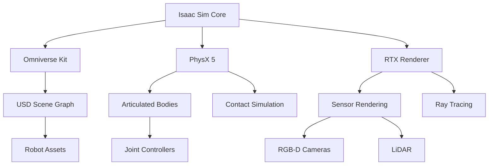
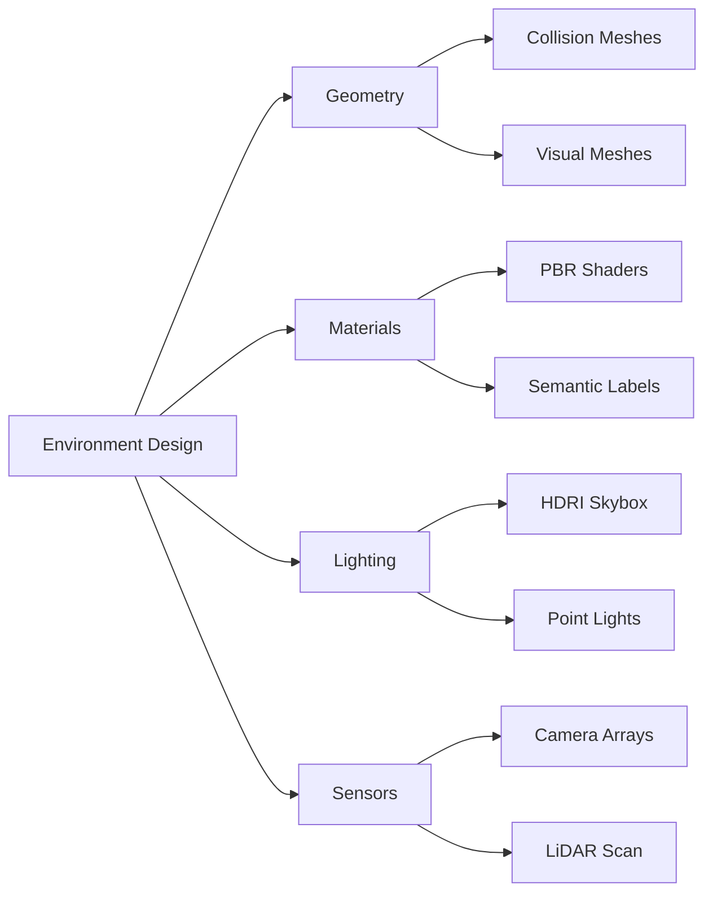

# Isaac Sim Introduction

NVIDIA's Isaac Sim transforms how humanoid robots are developed. Rather than risking expensive hardware during early development, engineers can iterate in a physically accurate, photorealistic simulation environment where a single RTX GPU generates years of training data in hours. This capability has made Isaac Sim the simulation platform of choice for companies like Boston Dynamics, Agility Robotics, and Figure AI.

> **By the end of this chapter, you will:**
> - Set up Isaac Sim on local or cloud infrastructure with proper GPU configuration
> - Create physically accurate robot models using USD and URDF conversion pipelines
> - Design realistic environments with materials, lighting, and sensor simulation
> - Generate synthetic training datasets for perception and manipulation tasks

## The Isaac Sim Ecosystem

Isaac Sim sits at the intersection of three NVIDIA technologies: Omniverse (collaborative 3D platform), PhysX (real-time physics engine), and RTX (ray-traced rendering). This convergence enables simulation fidelity that was impossible five years ago.



### Universal Scene Description (USD)

Pixar's USD format is the foundation of Isaac Sim. Unlike traditional game engine formats, USD supports:

- **Non-destructive composition**: Layer robot variants without duplicating geometry
- **Lazy loading**: Stream massive environments from disk or network
- **Time-sampled data**: Record entire simulation trajectories as animatable assets
- **Schema extensibility**: Define custom physics, sensor, or semantic properties

> ⚠️ **WARNING**: USD files use Y-up coordinate systems by default, but ROS uses Z-up. Isaac Sim handles this conversion automatically via the ROS bridge, but custom scripts must account for axis remapping.

Here's how USD represents a simple humanoid torso with articulated joints:

```python
from pxr import Usd, UsdGeom, UsdPhysics, UsdSkel

stage = Usd.Stage.CreateNew("humanoid_torso.usd")

# Create skeletal root
skel_root = UsdSkel.Root.Define(stage, "/Humanoid")
skeleton = UsdSkel.Skeleton.Define(stage, "/Humanoid/Skeleton")

# Define joint hierarchy
joints = [
    "pelvis",
    "torso_lower",
    "torso_upper",
    "neck",
    "left_shoulder",
    "right_shoulder"
]
skeleton.CreateJointsAttr(joints)

# Add collision geometry to torso
torso_geom = UsdGeom.Capsule.Define(stage, "/Humanoid/TorsoCollider")
torso_geom.CreateHeightAttr(0.6)
torso_geom.CreateRadiusAttr(0.15)

# Apply rigid body physics
UsdPhysics.RigidBodyAPI.Apply(torso_geom.GetPrim())
mass_api = UsdPhysics.MassAPI.Apply(torso_geom.GetPrim())
mass_api.CreateMassAttr(15.0)  # 15kg torso

stage.Save()
```

## Hardware Requirements and Performance

Isaac Sim demands significant computational resources. The minimum RTX 3060 (12GB VRAM) handles single-robot scenarios, but production workflows require RTX 4090 or A6000 GPUs.

| Use Case | GPU | VRAM | Typical Performance |
|----------|-----|------|---------------------|
| Single humanoid, simple environment | RTX 3060 | 12GB | 30-60 Hz physics |
| Multi-robot warehouse | RTX 4090 | 24GB | 60 Hz with 5 robots |
| Photorealistic synthetic data | A6000 | 48GB | 10-30 Hz ray-traced |
| Large-scale parallel training | 8x A100 | 640GB | 1000+ environments |

> 💡 **TIP**: Use headless mode for training workloads. Disabling the viewport renderer reduces VRAM usage by 40% and increases physics throughput by 2-3x.

### Installation and Configuration

Isaac Sim ships as an Omniverse application. Install via Omniverse Launcher or Docker for reproducible cloud deployments:

```bash
# Install Omniverse Launcher (desktop)
wget https://install.launcher.omniverse.nvidia.com/installers/omniverse-launcher-linux.AppImage
chmod +x omniverse-launcher-linux.AppImage
./omniverse-launcher-linux.AppImage

# Or use Docker (cloud/CI)
docker pull nvcr.io/nvidia/isaac-sim:2023.1.1
docker run --gpus all -it \
  -v ~/isaac_sim_cache:/root/.cache \
  -v ~/workspace:/workspace \
  nvcr.io/nvidia/isaac-sim:2023.1.1
```

After installation, verify GPU detection and physics performance:

```python
import omni.isaac.core.utils.nucleus as nucleus
from omni.isaac.core import SimulationContext

# Initialize simulation
sim_context = SimulationContext(physics_dt=1.0/60.0, rendering_dt=1.0/60.0)

# Check GPU availability
from pxr import Usd
print(f"GPU Compute: {Usd.GetGpuComputeEnabled()}")
print(f"RTX Render: {Usd.GetRayTracingEnabled()}")

# Run 1000 steps benchmark
sim_context.play()
for _ in range(1000):
    sim_context.step(render=False)
sim_context.stop()
print("Benchmark complete - check console for timing")
```

## Building Simulation Environments

Realistic environments combine procedural generation with hand-crafted assets. Isaac Sim provides warehouse templates, outdoor terrains, and material libraries that match real-world sensors.



### Creating a Training Environment

This example builds a procedural obstacle course with semantic segmentation labels:

```python
from omni.isaac.core.utils.prims import create_prim
from omni.isaac.core.materials import PreviewSurface
import random

def generate_obstacle_course(stage_path="/World/ObstacleCourse"):
    """Generate randomized obstacles with semantic labels."""

    # Create floor plane
    floor = create_prim(
        prim_path=f"{stage_path}/Floor",
        prim_type="Cube",
        position=(0, 0, -0.05),
        scale=(10, 10, 0.1),
        semantic_label="floor"
    )

    # Add PBR material
    floor_mat = PreviewSurface(prim_path=f"{stage_path}/FloorMat")
    floor_mat.set_color(rgb=(0.3, 0.3, 0.3))
    floor_mat.set_roughness(0.8)

    # Spawn random boxes
    for i in range(20):
        x = random.uniform(-4, 4)
        y = random.uniform(-4, 4)
        height = random.uniform(0.1, 0.5)

        box = create_prim(
            prim_path=f"{stage_path}/Obstacle_{i}",
            prim_type="Cube",
            position=(x, y, height/2),
            scale=(0.3, 0.3, height),
            semantic_label="obstacle"
        )

    print(f"Generated obstacle course at {stage_path}")
```

> 📌 **NOTE**: Semantic labels are stored in USD prims as custom attributes. These labels survive rendering and appear in ground-truth annotations for training object detectors and segmentation models.

## Synthetic Data Generation

Isaac Sim's replicator framework generates annotated datasets at GPU speeds. A single A100 produces 10,000+ labeled images per hour with pixel-perfect ground truth.

```python
import omni.replicator.core as rep

# Set up camera randomization
camera = rep.create.camera(position=(2, 2, 1.5), look_at=(0, 0, 0.5))

# Randomize lighting
def randomize_lights():
    lights = rep.create.light(
        light_type="Sphere",
        temperature=rep.distribution.uniform(3000, 6500),
        intensity=rep.distribution.uniform(1000, 5000),
        position=rep.distribution.uniform((-5, -5, 2), (5, 5, 5))
    )
    return lights.node

# Define data collection
with rep.trigger.on_frame(num_frames=1000):
    rep.randomizer.register(randomize_lights)

# Attach annotators
rp = rep.create.render_product(camera, resolution=(1280, 720))
rgb_writer = rep.WriterRegistry.get("BasicWriter")
rgb_writer.initialize(
    output_dir="~/synthetic_data/rgb",
    rgb=True,
    bounding_box_2d_tight=True,
    semantic_segmentation=True,
    instance_segmentation=True
)
rgb_writer.attach([rp])

# Run data generation
rep.orchestrator.run()
```

> 📌 **Key Takeaways**
> - Isaac Sim combines PhysX physics, RTX rendering, and USD scene graphs for production-grade robot simulation
> - USD's non-destructive composition enables team collaboration and variant management without asset duplication
> - RTX GPUs are mandatory for acceptable performance - minimum RTX 3060 12GB for development, RTX 4090+ for production
> - Headless rendering mode doubles physics throughput by disabling viewport updates during training
> - Semantic labels embedded in USD prims generate pixel-perfect ground truth for perception models
> - Replicator synthetic data generation produces 10,000+ annotated images per hour on modern GPUs
> - Docker containers ensure reproducible simulation environments across development and cloud infrastructure
> - Y-up to Z-up coordinate conversion happens automatically in ROS bridges but requires manual handling in custom code
> - Procedural environment generation with domain randomization reduces sim-to-real transfer gaps

## Further Reading

- [NVIDIA Isaac Sim Documentation](https://docs.omniverse.nvidia.com/app_isaacsim/app_isaacsim/overview.html) — Official reference with tutorials and API documentation
- [USD Introduction and Specification](https://openusd.org/release/index.html) — Pixar's comprehensive guide to Universal Scene Description
- [Tobin et al., "Domain Randomization for Transferring Deep Neural Networks from Simulation to the Real World"](https://arxiv.org/abs/1703.06907) — Foundational paper on synthetic data strategies

## Assessment

#### Multiple Choice Questions

**Q1 (Easy)**: What is the primary advantage of using USD format in Isaac Sim over traditional game engine formats?

- A) Faster rendering performance
- B) Non-destructive composition and layering
- C) Smaller file sizes
- D) Built-in physics simulation

<details>
<summary>Answer</summary>

**B)** — USD's non-destructive composition allows teams to create robot variants, environments, and configurations as separate layers that combine without duplicating geometry. This is critical for collaborative workflows where multiple engineers modify different aspects of the same robot.

</details>

**Q2 (Medium)**: Why does Isaac Sim recommend headless mode for reinforcement learning training workloads?

- A) It reduces network bandwidth usage
- B) It prevents GPU driver crashes
- C) It eliminates viewport rendering overhead, increasing physics throughput by 2-3x
- D) It enables multi-GPU parallelism

<details>
<summary>Answer</summary>

**C)** — Headless mode disables the real-time viewport renderer, freeing up GPU compute and VRAM for physics simulation. This typically doubles or triples the number of physics steps per second, which is critical when running thousands of parallel training environments.

</details>

**Q3 (Medium)**: What coordinate system convention does Isaac Sim use, and how does it differ from ROS?

- A) Isaac uses X-up, ROS uses Z-up
- B) Isaac uses Y-up, ROS uses Z-up
- C) Isaac uses Z-up, ROS uses Y-up
- D) Both use Z-up

<details>
<summary>Answer</summary>

**B)** — USD and Isaac Sim follow graphics industry standards with Y-up coordinate systems (inherited from Pixar and film production), while ROS uses robotics convention of Z-up. The Isaac ROS bridge handles this conversion automatically, but custom scripts must perform manual axis remapping.

</details>

**Q4 (Hard)**: When generating synthetic training data for a humanoid robot grasping task, which domain randomization parameters have the highest impact on sim-to-real transfer for RGB-based perception?

- A) Object geometry variations
- B) Lighting temperature, intensity, and position randomization
- C) Camera focal length
- D) Physics material friction coefficients

<details>
<summary>Answer</summary>

**B)** — Lighting randomization is the most critical factor for RGB-based perception transfer. Real-world lighting varies dramatically (sunlight, indoor fluorescent, shadows), and models trained on fixed lighting fail catastrophically in new conditions. Geometry and physics matter for manipulation policies, but perception robustness depends primarily on photometric variation.

</details>

#### Coding Exercises

**Exercise 1**: Create a USD stage with a humanoid robot pelvis that has proper collision geometry and mass properties.

```python
from pxr import Usd, UsdGeom, UsdPhysics

def create_humanoid_pelvis(output_path: str) -> None:
    """
    Create a USD stage with humanoid pelvis.

    Args:
        output_path: File path for output USD file
    """
    # TODO: Create stage
    # TODO: Define capsule geometry (height=0.25m, radius=0.12m)
    # TODO: Apply rigid body physics
    # TODO: Set mass to 8.0 kg
    # TODO: Save stage
    pass
```

<details>
<summary>Solution</summary>

```python
from pxr import Usd, UsdGeom, UsdPhysics, Gf

def create_humanoid_pelvis(output_path: str) -> None:
    """
    Create a USD stage with humanoid pelvis.

    Args:
        output_path: File path for output USD file
    """
    # Create new USD stage
    stage = Usd.Stage.CreateNew(output_path)

    # Define capsule geometry for pelvis collision
    pelvis = UsdGeom.Capsule.Define(stage, "/Humanoid/Pelvis")
    pelvis.CreateHeightAttr(0.25)
    pelvis.CreateRadiusAttr(0.12)
    pelvis.CreateAxisAttr("Y")  # Capsule aligned along Y-axis

    # Set initial position
    pelvis.AddTranslateOp().Set(Gf.Vec3d(0, 0, 1.0))

    # Apply rigid body physics
    rigid_body_api = UsdPhysics.RigidBodyAPI.Apply(pelvis.GetPrim())

    # Set mass properties (adult human pelvis ~8kg)
    mass_api = UsdPhysics.MassAPI.Apply(pelvis.GetPrim())
    mass_api.CreateMassAttr(8.0)

    # Enable collision
    collision_api = UsdPhysics.CollisionAPI.Apply(pelvis.GetPrim())

    # Save to disk
    stage.Save()
    print(f"Created humanoid pelvis at {output_path}")

# Test the function
create_humanoid_pelvis("humanoid_pelvis.usd")
```

</details>

**Exercise 2**: Write a script that captures 100 RGB images with randomized lighting and saves semantic segmentation masks.

```python
import omni.replicator.core as rep

def capture_semantic_dataset(num_frames: int, output_dir: str) -> None:
    """
    Capture RGB and semantic segmentation data.

    Args:
        num_frames: Number of images to capture
        output_dir: Directory for output data
    """
    # TODO: Create camera at position (3, 3, 2) looking at origin
    # TODO: Register light randomizer (temperature 3000-6500K)
    # TODO: Set up trigger for num_frames
    # TODO: Attach RGB and semantic segmentation writers
    # TODO: Run orchestrator
    pass
```

<details>
<summary>Solution</summary>

```python
import omni.replicator.core as rep
from pathlib import Path

def capture_semantic_dataset(num_frames: int, output_dir: str) -> None:
    """
    Capture RGB and semantic segmentation data.

    Args:
        num_frames: Number of images to capture
        output_dir: Directory for output data
    """
    # Ensure output directory exists
    Path(output_dir).mkdir(parents=True, exist_ok=True)

    # Create camera with isometric view
    camera = rep.create.camera(
        position=(3, 3, 2),
        look_at=(0, 0, 0.5)
    )

    # Define lighting randomization
    def randomize_lighting():
        light = rep.create.light(
            light_type="Sphere",
            temperature=rep.distribution.uniform(3000, 6500),
            intensity=rep.distribution.uniform(2000, 8000),
            position=rep.distribution.uniform((-3, -3, 2), (3, 3, 5)),
            scale=rep.distribution.uniform(0.5, 1.5)
        )
        return light.node

    # Register randomizer and trigger
    rep.randomizer.register(randomize_lighting)

    with rep.trigger.on_frame(num_frames=num_frames):
        rep.randomizer.randomize_lighting()

    # Create render product
    render_product = rep.create.render_product(camera, resolution=(1280, 720))

    # Attach writer with RGB and semantic annotations
    writer = rep.WriterRegistry.get("BasicWriter")
    writer.initialize(
        output_dir=output_dir,
        rgb=True,
        semantic_segmentation=True,
        bounding_box_2d_tight=True,
        colorize_semantic_segmentation=True
    )
    writer.attach([render_product])

    # Execute data generation
    rep.orchestrator.run()
    print(f"Captured {num_frames} frames to {output_dir}")

# Test the function
capture_semantic_dataset(num_frames=100, output_dir="~/isaac_dataset")
```

</details>

#### Mini-Project

**Humanoid Training Environment Builder**

Build a complete Isaac Sim environment for training a humanoid robot to navigate obstacle courses.

**Requirements**:
1. Create a 10x10m floor with PBR material (concrete texture)
2. Spawn 15-25 random obstacles (boxes, cylinders) with semantic labels
3. Add domain randomization for lighting (3 light sources, varying position/intensity)
4. Place a camera rig with 3 viewpoints (front, side, top-down)
5. Implement a replicator script that captures 500 frames with:
   - RGB images
   - Depth maps
   - Semantic segmentation
   - 2D bounding boxes

**Deliverables**:
- `environment_builder.py` - Environment construction script
- `data_collector.py` - Replicator data generation script
- `config.yaml` - Configuration file for randomization parameters
- README with setup instructions and sample outputs

**Estimated time**: 3-4 hours

**Success criteria**:
- Environment loads in Isaac Sim without errors
- Data generation runs at >10 FPS on RTX 4090
- Output dataset contains all specified annotations
- Lighting and obstacle positions vary across frames

