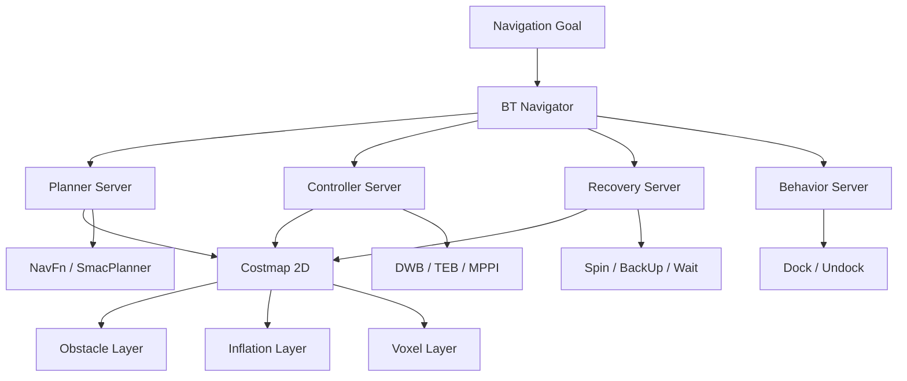
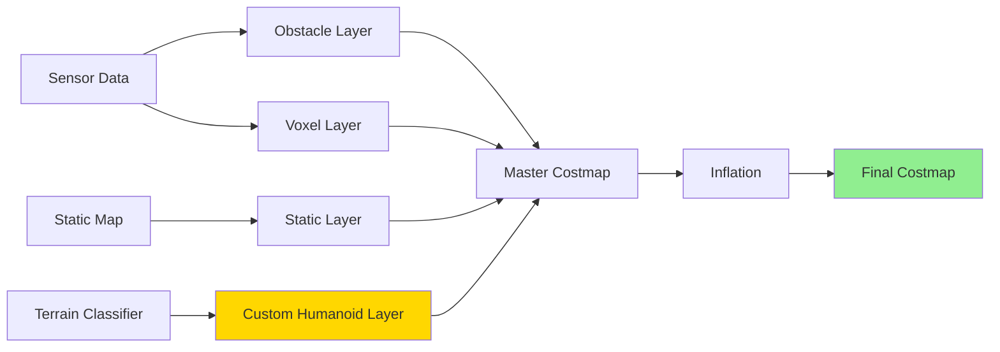

# Nav2 Path Planning

When Figure AI's humanoid robot navigates warehouse aisles, it must plan collision-free paths while accounting for bipedal dynamics that wheeled robots ignore. Nav2, ROS2's navigation framework, provides the planning infrastructure, but humanoid adaptation requires custom footstep planners, stability-aware costmaps, and recovery behaviors that maintain balance. Understanding Nav2's architecture enables you to extend it from wheeled platforms to bipedal walkers.

> **By the end of this chapter, you will:**
> - Configure Nav2's behavior tree system for humanoid-specific navigation logic
> - Implement custom costmap plugins that encode bipedal stability constraints
> - Integrate footstep planners that respect zero-moment point (ZMP) dynamics
> - Design recovery behaviors that prevent falls during navigation failures

## Nav2 Architecture Overview

Nav2 separates navigation into modular servers that communicate via ROS2 actions. This design allows replacing individual components (e.g., swapping Dijkstra for A* planners) without rewriting the entire stack.



Key servers:
- **Planner Server**: Computes global paths from start to goal
- **Controller Server**: Generates velocity commands to follow paths
- **Behavior Server**: Executes atomic actions (docking, waiting)
- **Recovery Server**: Handles failures (clearing costmaps, spinning in place)
- **BT Navigator**: Orchestrates servers using behavior trees

> 📌 **NOTE**: Nav2's behavior trees use XML configuration files that define navigation logic as hierarchical state machines. This approach eliminates hardcoded state transitions, making navigation strategies reconfigurable without recompilation.

### Costmaps: The Foundation

Costmaps represent the world as 2D grids where cell values encode traversal cost. Wheeled robots use simple circular inflation around obstacles. Humanoid robots require:

1. **Footstep-aware layers**: Cells must be large enough for foot placement
2. **Slope constraints**: Bipedal walkers cannot traverse steep inclines
3. **Terrain classification**: Grass, gravel, stairs require different gaits
4. **Dynamic stability zones**: Areas too narrow for recovery steps



## Configuring Nav2 for Humanoids

Start with the standard Nav2 parameter structure, then add humanoid-specific constraints. This configuration uses the MPPI controller, which handles dynamic systems better than DWB's differential drive assumptions.

```yaml
# humanoid_nav2_params.yaml
bt_navigator:
  ros__parameters:
    use_sim_time: false
    global_frame: map
    robot_base_frame: base_link
    odom_topic: /odom
    bt_loop_duration: 10
    default_server_timeout: 20
    enable_groot_monitoring: true
    groot_zmq_publisher_port: 1666
    groot_zmq_server_port: 1667
    plugin_lib_names:
    - nav2_compute_path_to_pose_action_bt_node
    - nav2_follow_path_action_bt_node
    - nav2_back_up_action_bt_node
    - nav2_spin_action_bt_node
    - nav2_wait_action_bt_node
    - nav2_clear_costmap_service_bt_node

planner_server:
  ros__parameters:
    expected_planner_frequency: 1.0
    planner_plugins: ["GridBased"]
    GridBased:
      plugin: "nav2_smac_planner/SmacPlannerHybrid"
      tolerance: 0.5
      downsample_costmap: false
      downsampling_factor: 1
      allow_unknown: true
      max_iterations: 1000000
      max_on_approach_iterations: 1000
      max_planning_time: 3.5
      motion_model_for_search: "REEDS_SHEPP"  # Better for humanoid turning
      cost_travel_multiplier: 2.0
      angle_quantization_bins: 72
      analytic_expansion_ratio: 3.5
      analytic_expansion_max_length: 3.0
      minimum_turning_radius: 0.40  # Humanoid footstep constraint
      reverse_penalty: 2.1
      change_penalty: 0.0
      non_straight_penalty: 1.2
      retrospective_penalty: 0.025

controller_server:
  ros__parameters:
    controller_frequency: 30.0
    min_x_velocity_threshold: 0.001
    min_y_velocity_threshold: 0.001
    min_theta_velocity_threshold: 0.001
    failure_tolerance: 0.3
    progress_checker_plugin: "progress_checker"
    goal_checker_plugins: ["general_goal_checker"]
    controller_plugins: ["FollowPath"]

    progress_checker:
      plugin: "nav2_controller::SimpleProgressChecker"
      required_movement_radius: 0.5
      movement_time_allowance: 10.0

    general_goal_checker:
      stateful: true
      plugin: "nav2_controller::SimpleGoalChecker"
      xy_goal_tolerance: 0.15  # Tighter for bipedal precision
      yaw_goal_tolerance: 0.25

    FollowPath:
      plugin: "nav2_mppi_controller::MPPIController"
      time_steps: 56
      model_dt: 0.05
      batch_size: 2000
      vx_std: 0.2
      vy_std: 0.2
      wz_std: 0.4
      vx_max: 0.5  # Conservative for bipedal stability
      vx_min: -0.35
      vy_max: 0.0  # No lateral motion (use footsteps instead)
      wz_max: 1.0
      iteration_count: 1
      prune_distance: 1.7
      transform_tolerance: 0.1
      temperature: 0.3
      gamma: 0.015
      motion_model: "Omni"  # Can move in any direction

local_costmap:
  local_costmap:
    ros__parameters:
      update_frequency: 5.0
      publish_frequency: 2.0
      global_frame: odom
      robot_base_frame: base_link
      use_sim_time: false
      rolling_window: true
      width: 3
      height: 3
      resolution: 0.05
      robot_radius: 0.22  # Approximate humanoid footprint
      plugins: ["voxel_layer", "inflation_layer"]
      inflation_layer:
        plugin: "nav2_costmap_2d::InflationLayer"
        cost_scaling_factor: 3.0
        inflation_radius: 0.55
      voxel_layer:
        plugin: "nav2_costmap_2d::VoxelLayer"
        enabled: true
        publish_voxel_map: true
        origin_z: 0.0
        z_resolution: 0.05
        z_voxels: 16
        max_obstacle_height: 2.0
        mark_threshold: 0
        observation_sources: scan
        scan:
          sensor_frame: lidar_link
          data_type: LaserScan
          topic: /scan
          marking: true
          clearing: true
          min_obstacle_height: 0.1
          max_obstacle_height: 2.0

global_costmap:
  global_costmap:
    ros__parameters:
      update_frequency: 1.0
      publish_frequency: 1.0
      global_frame: map
      robot_base_frame: base_link
      use_sim_time: false
      robot_radius: 0.22
      resolution: 0.05
      track_unknown_space: true
      plugins: ["static_layer", "obstacle_layer", "inflation_layer"]
      obstacle_layer:
        plugin: "nav2_costmap_2d::ObstacleLayer"
        enabled: true
        observation_sources: scan
        scan:
          sensor_frame: lidar_link
          data_type: LaserScan
          topic: /scan
          marking: true
          clearing: true
      static_layer:
        plugin: "nav2_costmap_2d::StaticLayer"
        map_subscribe_transient_local: true
      inflation_layer:
        plugin: "nav2_costmap_2d::InflationLayer"
        cost_scaling_factor: 3.0
        inflation_radius: 0.55
```

> ⚠️ **WARNING**: The `robot_radius` parameter assumes a circular footprint. Humanoid robots have elongated foot shapes. Use `footprint: [[x1,y1], [x2,y2], ...]` to define a rectangular or polygonal footprint matching actual foot dimensions.

## Launching Nav2

Create a launch file that starts all Nav2 nodes with the humanoid configuration:

```python
import os
from launch import LaunchDescription
from launch_ros.actions import Node
from launch.actions import DeclareLaunchArgument, IncludeLaunchDescription
from launch.substitutions import LaunchConfiguration
from launch.launch_description_sources import PythonLaunchDescriptionSource
from ament_index_python.packages import get_package_share_directory

def generate_launch_description():
    # Paths
    nav2_bringup_dir = get_package_share_directory('nav2_bringup')
    params_file = LaunchConfiguration('params_file')
    use_sim_time = LaunchConfiguration('use_sim_time')
    autostart = LaunchConfiguration('autostart')

    declare_params_file_cmd = DeclareLaunchArgument(
        'params_file',
        default_value=os.path.join(
            get_package_share_directory('humanoid_navigation'),
            'config',
            'humanoid_nav2_params.yaml'
        ),
        description='Full path to Nav2 parameters file'
    )

    declare_use_sim_time_cmd = DeclareLaunchArgument(
        'use_sim_time',
        default_value='false',
        description='Use simulation clock if true'
    )

    declare_autostart_cmd = DeclareLaunchArgument(
        'autostart',
        default_value='true',
        description='Automatically start lifecycle nodes'
    )

    # Nav2 bringup
    nav2_bringup_cmd = IncludeLaunchDescription(
        PythonLaunchDescriptionSource(
            os.path.join(nav2_bringup_dir, 'launch', 'navigation_launch.py')
        ),
        launch_arguments={
            'params_file': params_file,
            'use_sim_time': use_sim_time,
            'autostart': autostart,
        }.items()
    )

    # Custom humanoid stability monitor
    stability_monitor_cmd = Node(
        package='humanoid_navigation',
        executable='stability_monitor',
        name='stability_monitor',
        output='screen',
        parameters=[{
            'com_height': 0.85,  # Center of mass height
            'foot_length': 0.25,
            'foot_width': 0.12,
            'max_com_velocity': 0.5,
            'zmp_margin': 0.02,
        }]
    )

    ld = LaunchDescription()
    ld.add_action(declare_params_file_cmd)
    ld.add_action(declare_use_sim_time_cmd)
    ld.add_action(declare_autostart_cmd)
    ld.add_action(nav2_bringup_cmd)
    ld.add_action(stability_monitor_cmd)

    return ld
```

## Custom Costmap Plugin: Stability Zones

Standard costmaps ignore bipedal stability. This custom plugin marks areas where the robot cannot recover from disturbances (e.g., narrow hallways where sidesteps are impossible).

```python
#!/usr/bin/env python3
"""
Stability-aware costmap layer for humanoid robots.
Marks zones where ZMP cannot be maintained.
"""

import rclpy
from rclpy.node import Node
from nav_msgs.msg import OccupancyGrid
from geometry_msgs.msg import PolygonStamped, Point32
import numpy as np

class StabilityLayer(Node):
    """Custom costmap layer encoding bipedal stability constraints."""

    def __init__(self):
        super().__init__('stability_layer')

        # Parameters
        self.declare_parameter('foot_length', 0.25)
        self.declare_parameter('foot_width', 0.12)
        self.declare_parameter('min_support_polygon_area', 0.015)
        self.declare_parameter('max_slope_degrees', 15.0)

        self.foot_length = self.get_parameter('foot_length').value
        self.foot_width = self.get_parameter('foot_width').value
        self.min_area = self.get_parameter('min_support_polygon_area').value
        self.max_slope = np.radians(self.get_parameter('max_slope_degrees').value)

        # Subscribe to terrain classification
        self.terrain_sub = self.create_subscription(
            OccupancyGrid,
            '/terrain_classification',
            self.terrain_callback,
            10
        )

        # Publish stability costmap
        self.costmap_pub = self.create_publisher(
            OccupancyGrid,
            '/stability_costmap',
            10
        )

        # Publish support polygon visualization
        self.polygon_pub = self.create_publisher(
            PolygonStamped,
            '/support_polygon',
            10
        )

        self.get_logger().info("Stability layer initialized")

    def terrain_callback(self, msg: OccupancyGrid):
        """Compute stability costs from terrain classification."""

        # Extract terrain data
        width = msg.info.width
        height = msg.info.height
        resolution = msg.info.resolution
        terrain_data = np.array(msg.data).reshape((height, width))

        # Initialize stability costmap
        stability_costs = np.zeros_like(terrain_data, dtype=np.int8)

        # Compute gradients (slope estimation)
        grad_y, grad_x = np.gradient(terrain_data.astype(float) * resolution)
        slope = np.sqrt(grad_x**2 + grad_y**2)

        # Mark unstable regions
        # Rule 1: Slope too steep
        stability_costs[slope > np.tan(self.max_slope)] = 100

        # Rule 2: Area too narrow for foot placement
        # Use morphological operations to detect narrow passages
        from scipy import ndimage
        footprint_size = int(self.foot_length / resolution)
        eroded = ndimage.binary_erosion(
            terrain_data == 0,  # Free space
            structure=np.ones((footprint_size, footprint_size))
        )
        stability_costs[~eroded] = 100

        # Rule 3: Terrain type constraints
        # Assume terrain_data encodes: 0=free, 50=rough, 100=obstacle
        stability_costs[terrain_data == 50] = 75  # Rough terrain penalty

        # Publish stability costmap
        stability_msg = OccupancyGrid()
        stability_msg.header = msg.header
        stability_msg.info = msg.info
        stability_msg.data = stability_costs.flatten().tolist()
        self.costmap_pub.publish(stability_msg)

        # Visualize current support polygon
        self.publish_support_polygon(msg.header)

    def publish_support_polygon(self, header):
        """Publish foot support polygon for visualization."""
        polygon_msg = PolygonStamped()
        polygon_msg.header = header

        # Rectangular foot
        half_length = self.foot_length / 2
        half_width = self.foot_width / 2

        polygon_msg.polygon.points = [
            Point32(x=half_length, y=half_width, z=0.0),
            Point32(x=half_length, y=-half_width, z=0.0),
            Point32(x=-half_length, y=-half_width, z=0.0),
            Point32(x=-half_length, y=half_width, z=0.0),
        ]

        self.polygon_pub.publish(polygon_msg)

def main(args=None):
    rclpy.init(args=args)
    node = StabilityLayer()
    rclpy.spin(node)
    node.destroy_node()
    rclpy.shutdown()

if __name__ == '__main__':
    main()
```

> 💡 **TIP**: Integrate slope estimation with Isaac ROS depth maps. Modern depth cameras provide 640x480 resolution at 30 Hz, enabling real-time terrain classification for outdoor navigation.

## Footstep Planning Integration

Nav2's global path is a geometric curve. Humanoid robots must convert this curve into discrete footstep sequences. This planner bridges Nav2 and footstep execution.

```python
#!/usr/bin/env python3
"""
Footstep planner that converts Nav2 paths to humanoid footstep sequences.
"""

import rclpy
from rclpy.node import Node
from rclpy.action import ActionServer
from nav_msgs.msg import Path
from geometry_msgs.msg import PoseStamped
from humanoid_msgs.action import ExecuteFootsteps  # Custom action
from humanoid_msgs.msg import FootstepArray, Footstep
import numpy as np

class FootstepPlanner(Node):
    """Convert Nav2 global paths to footstep sequences."""

    def __init__(self):
        super().__init__('footstep_planner')

        self.declare_parameter('step_length', 0.3)
        self.declare_parameter('step_width', 0.2)
        self.declare_parameter('max_step_height', 0.15)

        self.step_length = self.get_parameter('step_length').value
        self.step_width = self.get_parameter('step_width').value
        self.max_step_height = self.get_parameter('max_step_height').value

        # Subscribe to Nav2 global plan
        self.path_sub = self.create_subscription(
            Path,
            '/plan',
            self.plan_callback,
            10
        )

        # Publish footsteps
        self.footstep_pub = self.create_publisher(
            FootstepArray,
            '/planned_footsteps',
            10
        )

        # Action server for execution
        self.action_server = ActionServer(
            self,
            ExecuteFootsteps,
            'execute_footsteps',
            self.execute_callback
        )

        self.latest_footsteps = None
        self.get_logger().info("Footstep planner ready")

    def plan_callback(self, msg: Path):
        """Convert Nav2 path to footsteps."""
        if len(msg.poses) < 2:
            return

        footsteps = FootstepArray()
        footsteps.header = msg.header

        # Start with left foot forward
        is_left = True
        current_pos = np.array([
            msg.poses[0].pose.position.x,
            msg.poses[0].pose.position.y
        ])

        for i in range(1, len(msg.poses)):
            target_pos = np.array([
                msg.poses[i].pose.position.x,
                msg.poses[i].pose.position.y
            ])

            # Compute direction vector
            direction = target_pos - current_pos
            distance = np.linalg.norm(direction)

            if distance < self.step_length / 2:
                continue  # Skip waypoints too close together

            direction = direction / distance  # Normalize

            # Generate footstep
            step = Footstep()
            step.is_left_foot = is_left

            # Lateral offset for alternating feet
            lateral = np.array([-direction[1], direction[0]])  # Perpendicular
            offset = lateral * (self.step_width / 2) * (1 if is_left else -1)

            step_pos = current_pos + direction * self.step_length + offset
            step.pose.position.x = float(step_pos[0])
            step.pose.position.y = float(step_pos[1])
            step.pose.position.z = 0.0  # Assume flat ground (enhance with terrain)

            # Orientation aligned with path
            yaw = np.arctan2(direction[1], direction[0])
            step.pose.orientation.z = np.sin(yaw / 2)
            step.pose.orientation.w = np.cos(yaw / 2)

            footsteps.footsteps.append(step)

            current_pos = step_pos
            is_left = not is_left

        self.latest_footsteps = footsteps
        self.footstep_pub.publish(footsteps)
        self.get_logger().info(f"Generated {len(footsteps.footsteps)} footsteps")

    def execute_callback(self, goal_handle):
        """Execute footstep sequence."""
        self.get_logger().info("Executing footstep plan...")

        # In production, this sends footsteps to whole-body controller
        # For now, simulate execution
        result = ExecuteFootsteps.Result()
        result.success = True
        goal_handle.succeed()
        return result

def main(args=None):
    rclpy.init(args=args)
    node = FootstepPlanner()
    rclpy.spin(node)
    rclpy.shutdown()

if __name__ == '__main__':
    main()
```

> 📌 **Key Takeaways**
> - Nav2 separates navigation into modular servers (planner, controller, recovery) that communicate via ROS2 actions
> - MPPI controller handles humanoid dynamics better than DWB, which assumes differential drive kinematics
> - Custom costmap layers encode bipedal stability constraints like slope limits and minimum support polygon area
> - Footstep planners convert Nav2's geometric paths into discrete foot placements for humanoid execution
> - Behavior trees defined in XML allow reconfiguring navigation logic without recompiling code
> - Voxel layers provide 3D obstacle representation critical for humanoid head and arm clearance
> - Stability monitoring prevents navigation commands that exceed zero-moment point margins
> - Recovery behaviors for humanoids must maintain balance, unlike spinning in place which works for wheeled robots
> - Terrain classification from depth maps enables gait adaptation to surfaces like stairs, grass, or gravel

## Further Reading

- [Nav2 Documentation](https://navigation.ros.org/) — Official ROS2 navigation stack documentation and tutorials
- [Kajita et al., "Biped Walking Pattern Generation by using Preview Control of Zero-Moment Point"](https://ieeexplore.ieee.org/document/1241826) — Classic paper on ZMP-based bipedal locomotion
- [Behavior Trees in Robotics and AI](https://arxiv.org/abs/1709.00084) — Comprehensive guide to behavior tree design patterns

## Assessment

#### Multiple Choice Questions

**Q1 (Easy)**: What is the primary advantage of Nav2's behavior tree system over traditional finite state machines?

- A) Faster execution speed
- B) Reconfigurable logic without recompilation
- C) Lower memory usage
- D) Built-in obstacle avoidance

<details>
<summary>Answer</summary>

**B)** — Behavior trees use XML configuration files that define navigation logic as composable, hierarchical nodes. You can change navigation strategies (e.g., add a "check battery" condition before planning) by editing the XML without recompiling the Nav2 stack. FSMs require code changes for logic modifications.

</details>

**Q2 (Medium)**: Why is MPPI controller preferred over DWB for humanoid robot navigation?

- A) MPPI uses less CPU resources
- B) MPPI can handle non-differential drive dynamics and optimize over arbitrary cost functions
- C) MPPI produces smoother paths
- D) DWB doesn't support ROS2

<details>
<summary>Answer</summary>

**B)** — Model Predictive Path Integral (MPPI) controller samples thousands of trajectory rollouts and scores them against arbitrary cost functions. It naturally handles omnidirectional or bipedal kinematics. DWB (Dynamic Window Approach) assumes differential drive and generates velocity samples in (v, w) space, which doesn't map well to humanoid footstep dynamics.

</details>

**Q3 (Medium)**: What problem does a custom stability costmap layer solve for bipedal navigation?

- A) It reduces path planning computation time
- B) It encodes regions where the robot cannot maintain balance or recover from disturbances
- C) It improves localization accuracy
- D) It enables multi-floor navigation

<details>
<summary>Answer</summary>

**B)** — Standard costmaps mark obstacles as "occupied" or "free" based on collision geometry. Humanoid robots need additional constraints: areas too narrow for recovery steps, slopes exceeding ankle torque limits, or terrain unsuitable for bipedal gaits. A stability layer encodes these as high-cost zones, preventing the planner from generating dangerous paths.

</details>

**Q4 (Hard)**: When converting a Nav2 global path to footsteps, what is the most critical consideration for ensuring dynamic feasibility?

- A) Minimizing total number of steps
- B) Ensuring each footstep respects ZMP constraints and maintains center of mass within the support polygon
- C) Keeping foot orientation aligned with the path tangent
- D) Maximizing step length for faster execution

<details>
<summary>Answer</summary>

**B)** — A geometrically valid footstep sequence can still be dynamically infeasible if executing it would move the center of mass (COM) outside the support polygon formed by the stance foot. This violates zero-moment point (ZMP) stability and causes falls. Footstep planners must check that each step allows the COM to transition safely between support polygons, accounting for dynamic effects during swing phase.

</details>

#### Coding Exercises

**Exercise 1**: Write a ROS2 node that monitors Nav2 path execution and publishes a warning if the robot approaches a steep slope (>15 degrees).

```python
#!/usr/bin/env python3
import rclpy
from rclpy.node import Node
from nav_msgs.msg import Path, Odometry
from sensor_msgs.msg import PointCloud2
from std_msgs.msg import String

class SlopeMonitor(Node):
    def __init__(self):
        super().__init__('slope_monitor')

        # TODO: Subscribe to /plan and /odom
        # TODO: Subscribe to terrain point cloud
        # TODO: Publish warnings to /navigation_warnings
        # TODO: Implement slope calculation from point cloud
        pass

def main(args=None):
    rclpy.init(args=args)
    node = SlopeMonitor()
    rclpy.spin(node)
    rclpy.shutdown()
```

<details>
<summary>Solution</summary>

```python
#!/usr/bin/env python3
import rclpy
from rclpy.node import Node
from nav_msgs.msg import Path, Odometry
from sensor_msgs.msg import PointCloud2
from std_msgs.msg import String
import numpy as np
import sensor_msgs_py.point_cloud2 as pc2

class SlopeMonitor(Node):
    """Monitor upcoming terrain slope and warn if too steep."""

    def __init__(self, max_slope_degrees: float = 15.0):
        super().__init__('slope_monitor')

        self.max_slope = np.radians(max_slope_degrees)
        self.current_odom = None
        self.current_path = None

        # Subscribe to navigation inputs
        self.odom_sub = self.create_subscription(
            Odometry,
            '/odom',
            self.odom_callback,
            10
        )

        self.path_sub = self.create_subscription(
            Path,
            '/plan',
            self.path_callback,
            10
        )

        self.cloud_sub = self.create_subscription(
            PointCloud2,
            '/terrain_cloud',
            self.cloud_callback,
            10
        )

        # Publish warnings
        self.warning_pub = self.create_publisher(String, '/navigation_warnings', 10)

        self.get_logger().info(f"Slope monitor started (max={max_slope_degrees}°)")

    def odom_callback(self, msg: Odometry):
        self.current_odom = msg

    def path_callback(self, msg: Path):
        self.current_path = msg

    def cloud_callback(self, msg: PointCloud2):
        """Analyze terrain slope along planned path."""
        if self.current_path is None or self.current_odom is None:
            return

        # Extract points from cloud
        points = []
        for point in pc2.read_points(msg, field_names=("x", "y", "z"), skip_nans=True):
            points.append(point)

        if len(points) < 10:
            return

        points = np.array(points)

        # Check slope at upcoming waypoints
        lookahead_distance = 2.0  # Check 2m ahead
        current_pos = np.array([
            self.current_odom.pose.pose.position.x,
            self.current_odom.pose.pose.position.y
        ])

        for pose in self.current_path.poses:
            waypoint_pos = np.array([
                pose.pose.position.x,
                pose.pose.position.y
            ])

            distance = np.linalg.norm(waypoint_pos - current_pos)
            if distance > lookahead_distance:
                break

            # Find nearby terrain points
            dists = np.linalg.norm(points[:, :2] - waypoint_pos, axis=1)
            nearby = points[dists < 0.5]  # 0.5m radius

            if len(nearby) < 3:
                continue

            # Fit plane to nearby points and compute slope
            A = np.c_[nearby[:, :2], np.ones(nearby.shape[0])]
            C, _, _, _ = np.linalg.lstsq(A, nearby[:, 2], rcond=None)

            # Slope is angle of normal vector from vertical
            normal = np.array([C[0], C[1], -1])
            normal = normal / np.linalg.norm(normal)
            slope = np.arccos(np.abs(normal[2]))

            if slope > self.max_slope:
                warning = String()
                warning.data = f"WARNING: Slope {np.degrees(slope):.1f}° exceeds limit at ({waypoint_pos[0]:.2f}, {waypoint_pos[1]:.2f})"
                self.warning_pub.publish(warning)
                self.get_logger().warn(warning.data)
                return

def main(args=None):
    rclpy.init(args=args)
    node = SlopeMonitor(max_slope_degrees=15.0)
    rclpy.spin(node)
    node.destroy_node()
    rclpy.shutdown()

if __name__ == '__main__':
    main()
```

</details>

**Exercise 2**: Implement a recovery behavior that commands a humanoid to take stabilizing sidesteps when navigation gets stuck.

```python
#!/usr/bin/env python3
import rclpy
from rclpy.action import ActionServer
from nav2_msgs.action import Spin  # Use Nav2 recovery action interface

class SidestepRecovery:
    """Recovery behavior: sidestep to regain stability."""

    def __init__(self):
        # TODO: Initialize action server
        # TODO: Define sidestep sequence (left, right, center)
        # TODO: Implement execute_callback that sends footstep commands
        pass

    def execute_callback(self, goal_handle):
        # TODO: Execute 3-step sidestep sequence
        # TODO: Check stability after each step
        # TODO: Return success/failure
        pass
```

<details>
<summary>Solution</summary>

```python
#!/usr/bin/env python3
import rclpy
from rclpy.node import Node
from rclpy.action import ActionServer, GoalResponse
from nav2_msgs.action import Spin
from humanoid_msgs.msg import FootstepArray, Footstep
from geometry_msgs.msg import Pose
import time

class SidestepRecovery(Node):
    """Recovery behavior: sidestep to regain stability when stuck."""

    def __init__(self):
        super().__init__('sidestep_recovery')

        self.declare_parameter('sidestep_distance', 0.15)
        self.sidestep_dist = self.get_parameter('sidestep_distance').value

        # Action server (reusing Spin interface for simplicity)
        self.action_server = ActionServer(
            self,
            Spin,
            'sidestep_recovery',
            execute_callback=self.execute_callback,
            goal_callback=self.goal_callback
        )

        # Footstep publisher
        self.footstep_pub = self.create_publisher(
            FootstepArray,
            '/recovery_footsteps',
            10
        )

        self.get_logger().info("Sidestep recovery behavior ready")

    def goal_callback(self, goal_request):
        """Accept all recovery goals."""
        self.get_logger().info("Sidestep recovery triggered")
        return GoalResponse.ACCEPT

    def execute_callback(self, goal_handle):
        """Execute sidestep recovery sequence."""
        self.get_logger().info("Executing sidestep recovery...")

        # Create 3-step sequence: left, right, center
        footsteps = FootstepArray()
        footsteps.header.stamp = self.get_clock().now().to_msg()
        footsteps.header.frame_id = "base_link"

        # Step 1: Left foot sidestep
        step_left = Footstep()
        step_left.is_left_foot = True
        step_left.pose.position.x = 0.0
        step_left.pose.position.y = self.sidestep_dist
        step_left.pose.position.z = 0.0
        step_left.pose.orientation.w = 1.0
        footsteps.footsteps.append(step_left)

        # Step 2: Right foot follows
        step_right = Footstep()
        step_right.is_left_foot = False
        step_right.pose.position.x = 0.0
        step_right.pose.position.y = self.sidestep_dist
        step_right.pose.position.z = 0.0
        step_right.pose.orientation.w = 1.0
        footsteps.footsteps.append(step_right)

        # Step 3: Return to center
        step_center = Footstep()
        step_center.is_left_foot = True
        step_center.pose.position.x = 0.0
        step_center.pose.position.y = 0.0
        step_center.pose.position.z = 0.0
        step_center.pose.orientation.w = 1.0
        footsteps.footsteps.append(step_center)

        # Publish footsteps
        self.footstep_pub.publish(footsteps)

        # Simulate execution time
        time.sleep(3.0)

        # Return success
        goal_handle.succeed()
        result = Spin.Result()
        result.total_elapsed_time.sec = 3
        return result

def main(args=None):
    rclpy.init(args=args)
    node = SidestepRecovery()
    rclpy.spin(node)
    node.destroy_node()
    rclpy.shutdown()

if __name__ == '__main__':
    main()
```

</details>

#### Mini-Project

**Humanoid Nav2 Stack with Footstep Planning**

Build a complete Nav2-based navigation system for a simulated humanoid robot.

**Requirements**:
1. Configure Nav2 with MPPI controller and custom parameters for bipedal constraints
2. Implement a stability costmap layer that marks slopes >15° and narrow passages
3. Create a footstep planner that converts Nav2 paths to discrete foot placements
4. Add a recovery behavior that executes stabilizing sidesteps
5. Visualize in RViz:
   - Global and local costmaps with stability overlay
   - Planned footsteps as MarkerArray
   - Current robot footprint and support polygon
   - Nav2 global path and local trajectory

**Deliverables**:
- `nav2_humanoid_params.yaml` - Complete Nav2 configuration
- `footstep_planner.py` - Path to footstep conversion node
- `stability_layer.py` - Custom costmap plugin
- `recovery_sidestep.py` - Recovery behavior implementation
- `humanoid_nav_bringup.launch.py` - Main launch file
- `rviz_config.rviz` - RViz configuration for visualization
- `README.md` - Setup instructions and parameter explanations
- `test_results/` - Screenshots and rosbag of navigation demo

**Estimated time**: 4-5 hours

**Success criteria**:
- Robot navigates 10m path without collisions in simulation
- Footstep plan contains valid stance/swing alternation
- Stability layer correctly marks steep slopes as high-cost
- Recovery behavior executes when robot gets stuck
- All visualizations display correctly in RViz
- System runs at 10+ Hz with Gazebo simulation

