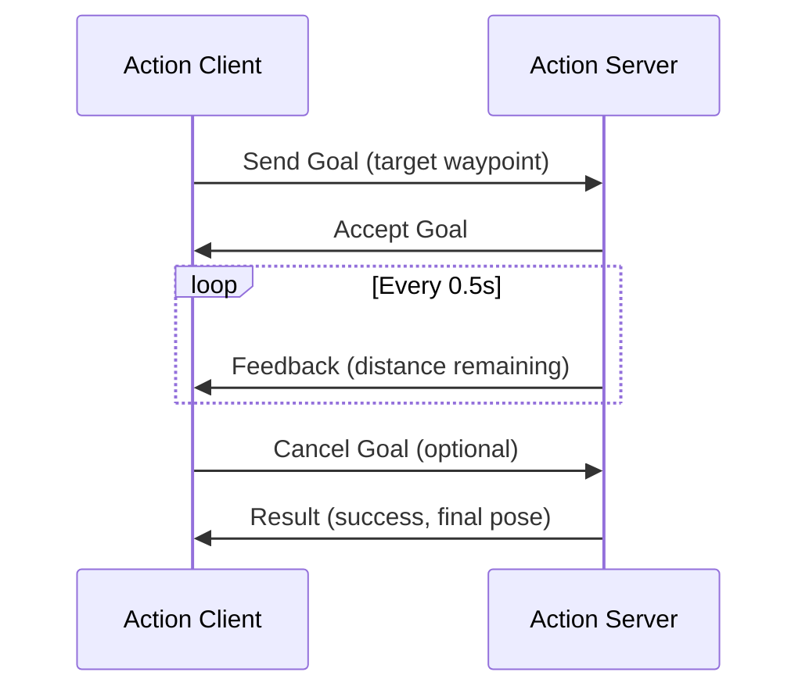

# Nodes, Topics, Services, and Actions

A humanoid robot walking across a room involves dozens of simultaneous processes: cameras publishing images, a SLAM node building a map, a planner computing footsteps, a controller stabilizing balance, and joint actuators executing commands. These processes must communicate without blocking each other—a slow planner can't freeze the balance controller. ROS 2 provides three communication primitives that match how robots actually work: topics for streaming data, services for request-response interactions, and actions for cancelable long-running tasks. Choosing the right primitive determines whether your robot responds in milliseconds or stumbles.

## Learning Objectives

> **By the end of this chapter, you will:**
> - Implement ROS 2 nodes in Python using rclpy with proper lifecycle management
> - Choose between topics, services, and actions based on communication requirements and timing constraints
> - Configure Quality of Service profiles to handle unreliable networks and real-time deadlines
> - Build a publisher-subscriber pair that streams sensor data and a service that processes requests synchronously

## Nodes: The Atomic Unit of Computation

A ROS 2 node is a single-purpose process that performs one task: reading a sensor, planning a path, controlling a joint. Nodes are independently deployable, replaceable, and testable. Good node design follows the Unix philosophy—do one thing well. A camera node publishes raw images. A separate detection node subscribes to images and publishes bounding boxes. A third tracking node subscribes to detections and publishes tracked objects. Each node can crash and restart without affecting others.

Nodes have names (must be unique per domain), namespaces (for multi-robot systems), and parameters (runtime configuration). They communicate exclusively through topics, services, and actions—no shared memory, no direct function calls. This isolation enables distributed deployment: run perception on an edge GPU, planning on the robot's onboard computer, and visualization on a remote workstation.

```python
import rclpy
from rclpy.node import Node
from std_msgs.msg import String


class MinimalPublisher(Node):
    """Publishes a message every 0.5 seconds."""

    def __init__(self):
        super().__init__('minimal_publisher')
        # Create publisher: topic name, message type, queue size
        self.publisher_ = self.create_publisher(String, 'chatter', 10)
        # Create timer: period in seconds, callback function
        self.timer = self.create_timer(0.5, self.timer_callback)
        self.counter = 0

    def timer_callback(self):
        msg = String()
        msg.data = f'Message {self.counter}'
        self.publisher_.publish(msg)
        self.get_logger().info(f'Publishing: "{msg.data}"')
        self.counter += 1


def main(args=None):
    rclpy.init(args=args)
    node = MinimalPublisher()
    try:
        rclpy.spin(node)  # Keeps node alive, processes callbacks
    except KeyboardInterrupt:
        pass
    finally:
        node.destroy_node()
        rclpy.shutdown()


if __name__ == '__main__':
    main()
```

This pattern—init, create resources, spin—appears in every ROS 2 node. The `spin()` call blocks until shutdown, processing timer callbacks, incoming messages, and service requests. For more control, use `spin_once()` or integrate with an async event loop.

> 💡 **TIP**: Name nodes descriptively: `camera_driver`, `lidar_processor`, `footstep_planner`. Avoid generic names like `node1` or `processor`. When debugging a 50-node system, names are your map.

## Topics: Streaming Data Flow

Topics implement publish-subscribe: publishers send messages without knowing who receives them; subscribers receive messages without knowing who sent them. This decoupling means you can swap a hardware camera driver for a simulated camera without changing downstream nodes. It also means a single sensor can feed multiple consumers—a camera image might go to both object detection and visual odometry.

Topics are named (e.g., `/camera/image_raw`, `/cmd_vel`, `/joint_states`) and typed (each topic carries one message type: `sensor_msgs/Image`, `geometry_msgs/Twist`). Publishers and subscribers on the same topic must use matching types or they won't connect.

```mermaid
graph LR
    A[Camera Driver] -->|sensor_msgs/Image| T1[/camera/image_raw]
    T1 --> B[Object Detector]
    T1 --> C[Visual Odometry]
    B -->|vision_msgs/Detection2DArray| T2[/detections]
    T2 --> D[Tracker]
    T2 --> E[Visualization]
```

Here's a subscriber that processes incoming messages:

```python
import rclpy
from rclpy.node import Node
from std_msgs.msg import String


class MinimalSubscriber(Node):
    """Subscribes to the 'chatter' topic."""

    def __init__(self):
        super().__init__('minimal_subscriber')
        self.subscription = self.create_subscription(
            String,
            'chatter',
            self.listener_callback,
            10  # QoS queue depth
        )

    def listener_callback(self, msg: String):
        self.get_logger().info(f'Received: "{msg.data}"')


def main(args=None):
    rclpy.init(args=args)
    node = MinimalSubscriber()
    try:
        rclpy.spin(node)
    except KeyboardInterrupt:
        pass
    finally:
        node.destroy_node()
        rclpy.shutdown()


if __name__ == '__main__':
    main()
```

Callbacks execute in the executor's thread. Heavy processing blocks other callbacks, so either keep callbacks fast (under 1ms) or use a `MultiThreadedExecutor` to process messages concurrently.

> ⚠️ **WARNING**: Topic callbacks are not reentrant by default. If a callback takes 100ms and messages arrive every 10ms, the queue fills up and messages are dropped. Monitor queue depths with `ros2 topic info -v /topic_name`.

## Quality of Service Profiles

QoS policies control reliability, durability, and timing. The defaults work for many cases, but understanding QoS is mandatory for production robots. There are four key policies:

**Reliability**: `RELIABLE` (TCP-like, guarantees delivery) vs. `BEST_EFFORT` (UDP-like, drops messages under load). Use reliable for commands and critical state; best effort for high-frequency sensors.

**Durability**: `VOLATILE` (late subscribers get only new messages) vs. `TRANSIENT_LOCAL` (late subscribers receive last N messages). Use transient local for slow-changing data like maps or parameters.

**History**: `KEEP_LAST(N)` (buffer last N messages) vs. `KEEP_ALL` (infinite buffer, dangerous). Most topics use KEEP_LAST(10).

**Deadline**: Maximum allowed period between messages. If violated, a callback fires. Critical for detecting sensor failures.

```python
from rclpy.qos import QoSProfile, ReliabilityPolicy, DurabilityPolicy, HistoryPolicy


# High-frequency sensor: prioritize throughput over reliability
sensor_qos = QoSProfile(
    reliability=ReliabilityPolicy.BEST_EFFORT,
    durability=DurabilityPolicy.VOLATILE,
    history=HistoryPolicy.KEEP_LAST,
    depth=5  # Small buffer for latest data
)

# Critical command: guarantee delivery
command_qos = QoSProfile(
    reliability=ReliabilityPolicy.RELIABLE,
    durability=DurabilityPolicy.TRANSIENT_LOCAL,
    history=HistoryPolicy.KEEP_LAST,
    depth=10
)

# Create publishers with explicit QoS
self.sensor_pub = self.create_publisher(LaserScan, '/scan', sensor_qos)
self.cmd_pub = self.create_publisher(Twist, '/cmd_vel', command_qos)
```

QoS mismatches prevent connections. If a publisher uses RELIABLE and a subscriber uses BEST_EFFORT, they won't communicate (by design—this prevents silent reliability degradation). Use `ros2 topic info -v /topic` to inspect QoS settings of active publishers and subscribers.

> ✅ **TIP**: ROS 2 provides predefined profiles: `qos_profile_sensor_data`, `qos_profile_system_default`, `qos_profile_services_default`. Start with these before creating custom profiles.

## Services: Synchronous Request-Response

Services implement the request-response pattern: a client sends a request and blocks until receiving a response. Use services for infrequent operations that need confirmation: "compute inverse kinematics for this pose," "save current map to disk," "reset odometry to origin." Services should complete in under 100ms; longer operations belong in actions.

Service types (`.srv` files) define request and response structures:

```
# Example: AddTwoInts.srv
int64 a
int64 b
---
int64 sum
```

Implementing a service server:

```python
import rclpy
from rclpy.node import Node
from example_interfaces.srv import AddTwoInts


class MinimalService(Node):
    """Service that adds two integers."""

    def __init__(self):
        super().__init__('minimal_service')
        self.srv = self.create_service(
            AddTwoInts,
            'add_two_ints',
            self.add_callback
        )

    def add_callback(self, request: AddTwoInts.Request,
                     response: AddTwoInts.Response) -> AddTwoInts.Response:
        response.sum = request.a + request.b
        self.get_logger().info(f'{request.a} + {request.b} = {response.sum}')
        return response


def main(args=None):
    rclpy.init(args=args)
    node = MinimalService()
    rclpy.spin(node)
    node.destroy_node()
    rclpy.shutdown()


if __name__ == '__main__':
    main()
```

Calling a service from code:

```python
import rclpy
from rclpy.node import Node
from example_interfaces.srv import AddTwoInts


class MinimalClient(Node):
    """Client that calls the add_two_ints service."""

    def __init__(self):
        super().__init__('minimal_client')
        self.client = self.create_client(AddTwoInts, 'add_two_ints')
        # Wait for service to be available
        while not self.client.wait_for_service(timeout_sec=1.0):
            self.get_logger().info('Waiting for service...')

    def send_request(self, a: int, b: int) -> int:
        request = AddTwoInts.Request()
        request.a = a
        request.b = b
        # Synchronous call (blocks until response)
        future = self.client.call_async(request)
        rclpy.spin_until_future_complete(self, future)
        return future.result().sum


def main(args=None):
    rclpy.init(args=args)
    node = MinimalClient()
    result = node.send_request(10, 32)
    node.get_logger().info(f'Result: {result}')
    node.destroy_node()
    rclpy.shutdown()


if __name__ == '__main__':
    main()
```

Services timeout if the server doesn't respond. Always check `future.result()` for exceptions. Unlike topics, services guarantee one-to-one communication—exactly one server handles each request.

> 🔴 **IMPORTANT**: Don't use services in high-frequency control loops. Service call latency varies (1-50ms depending on network and load). For control commands at 100Hz+, use topics with RELIABLE QoS instead.

## Actions: Long-Running Cancelable Tasks

Actions combine topics and services to handle tasks that take seconds or minutes: navigating to a waypoint, executing a motion plan, grasping an object. Actions provide three features that services lack: feedback (progress updates), cancellation (client can abort), and result (final outcome).

An action has three message types:
- **Goal**: What to do (e.g., target pose)
- **Feedback**: Progress updates (e.g., distance remaining)
- **Result**: Final outcome (e.g., success/failure, final pose)



Action servers run in the background while providing real-time feedback. Clients can monitor progress and cancel if needed (e.g., user clicks "stop" during autonomous navigation). This is impossible with services, which block until completion and can't be canceled.

For humanoid robots, actions are used for:
- Whole-body motion execution (takes 1-10 seconds)
- Autonomous navigation (takes seconds to minutes)
- Object manipulation (grasp planning and execution)
- Behavior tree actions (high-level task coordination)

Example action definition (`Fibonacci.action`):

```
# Goal
int32 order
---
# Result
int32[] sequence
---
# Feedback
int32[] partial_sequence
```

Actions are more complex than topics and services but essential for coordinating long-running robot behaviors. Most humanoid robot frameworks (MoveIt 2, Nav2, Behavior Trees) expose actions as their primary interface.

> 💡 **TIP**: Use the `rqt_action` GUI tool to test action servers interactively. Send goals, monitor feedback, and practice cancellation without writing client code.

## Choosing the Right Communication Pattern

**Use Topics when:**
- Data flows continuously (sensor readings, odometry, joint states)
- Multiple subscribers need the same data
- Publishers don't care about delivery confirmation
- Latency must be minimal (under 1ms)

**Use Services when:**
- Operation is request-response (compute IK, save file, trigger calibration)
- Client needs confirmation of completion
- Operation completes in under 100ms
- One-to-one communication required

**Use Actions when:**
- Task takes >1 second
- Client needs progress feedback
- Client might need to cancel
- Complex state machine (pending, active, succeeded, aborted, canceled)

A typical humanoid robot uses all three: topics for sensor data and control commands, services for configuration and one-off computations, actions for motion planning and navigation.

## Key Takeaways

> - Nodes are single-purpose processes that communicate only through topics, services, and actions—no shared memory
> - Topics implement publish-subscribe with decoupling: publishers and subscribers don't know about each other
> - QoS profiles control reliability vs. performance: BEST_EFFORT for sensors, RELIABLE for commands, TRANSIENT_LOCAL for slow-changing data
> - Services provide synchronous request-response for quick operations (under 100ms) with guaranteed delivery
> - Actions extend services with feedback, cancellation, and state machines for long-running tasks (seconds to minutes)
> - Callbacks must be fast (under 1ms) or processed in separate threads to avoid blocking the executor
> - QoS mismatches prevent connections by design—use `ros2 topic info -v` to debug compatibility
> - Service calls block the client until completion—never call services in high-frequency control loops
> - Action feedback enables progress monitoring and user interfaces for long-running robot behaviors

## Further Reading

- [ROS 2 QoS Policies Design](https://design.ros2.org/articles/qos.html) — Deep dive into QoS policy combinations and their DDS mappings
- [rclpy API Documentation](https://docs.ros2.org/latest/api/rclpy/) — Complete Python client library reference with examples
- [Understanding ROS 2 Actions](https://docs.ros.org/en/humble/Tutorials/Beginner-CLI-Tools/Understanding-ROS2-Actions/Understanding-ROS2-Actions.html) — Official tutorial covering action architecture and use cases

## Assessment

#### Multiple Choice Questions

**Q1 (Easy)**: What is the primary difference between a topic and a service in ROS 2?

- A) Topics are faster than services
- B) Topics support one-to-many communication; services are one-to-one
- C) Topics use TCP; services use UDP
- D) Topics require QoS configuration; services don't

<details>
<summary>Answer</summary>

**B) Topics support one-to-many communication; services are one-to-one** — Topics implement publish-subscribe where one publisher can send to multiple subscribers. Services implement request-response where exactly one server handles each client request. While topics are often faster, the key architectural difference is the communication pattern and cardinality.
</details>

**Q2 (Medium)**: A LiDAR sensor publishes at 40Hz but your subscriber callback takes 100ms to process each scan. What happens?

- A) Messages queue up indefinitely until memory runs out
- B) The publisher slows down to match subscriber speed
- C) Old messages are dropped based on QoS history depth
- D) ROS 2 automatically spawns more threads

<details>
<summary>Answer</summary>

**C) Old messages are dropped based on QoS history depth** — With default QoS (KEEP_LAST with depth 10), the subscriber's queue holds 10 messages. Messages arrive every 25ms but callbacks take 100ms, so the queue fills in 250ms. After that, old messages are dropped to make room for new ones. Solution: use MultiThreadedExecutor, reduce processing time, or increase queue depth (which delays detection of the problem).
</details>

**Q3 (Medium)**: You need to implement a "capture_image" operation that triggers a camera, waits for auto-exposure, then returns the image. This takes 2-5 seconds. What communication pattern should you use?

- A) Topic with RELIABLE QoS
- B) Service with extended timeout
- C) Action with feedback for progress
- D) Direct function call between nodes

<details>
<summary>Answer</summary>

**C) Action with feedback for progress** — 2-5 seconds exceeds the typical service timeout window and blocks the client. Actions are designed for long-running operations. Feedback could report "adjusting exposure" or "capturing." This also allows cancellation if the user aborts the request. While you could use a service with very long timeout, actions provide better UX through feedback and cancellation.
</details>

**Q4 (Hard)**: A publisher uses QoS with RELIABLE reliability and VOLATILE durability. A subscriber starts after 100 messages have been published and uses RELIABLE/TRANSIENT_LOCAL. What happens?

- A) Subscriber receives all 100 historical messages
- B) Subscriber receives only new messages
- C) Publisher and subscriber don't connect due to QoS mismatch
- D) Subscriber receives the last N messages based on depth

<details>
<summary>Answer</summary>

**C) Publisher and subscriber don't connect due to QoS mismatch** — Durability policy must be compatible for connections to form. A TRANSIENT_LOCAL subscriber expects stored historical messages, but a VOLATILE publisher doesn't store them. ROS 2 DDS prevents this connection to avoid silent data loss. The publisher would need TRANSIENT_LOCAL durability to match. Check compatibility with `ros2 topic info -v`.
</details>

#### Coding Exercises

**Exercise 1**: Create a publisher-subscriber pair where the publisher sends random numbers and the subscriber calculates and prints the running average.

```python
# publisher_random.py
import rclpy
from rclpy.node import Node
from std_msgs.msg import Float32
import random

class RandomPublisher(Node):
    def __init__(self):
        super().__init__('random_publisher')
        # TODO: Create publisher on /random_numbers topic
        # TODO: Create timer that publishes random float every 0.1s
        pass

# TODO: Implement main()
```

```python
# subscriber_average.py
import rclpy
from rclpy.node import Node
from std_msgs.msg import Float32

class AverageSubscriber(Node):
    def __init__(self):
        super().__init__('average_subscriber')
        # TODO: Create subscriber to /random_numbers
        # TODO: Maintain running sum and count
        pass

    def callback(self, msg: Float32):
        # TODO: Update running average and print
        pass

# TODO: Implement main()
```

<details>
<summary>Solution</summary>

```python
# publisher_random.py
import rclpy
from rclpy.node import Node
from std_msgs.msg import Float32
import random


class RandomPublisher(Node):
    """Publishes random floats at 10Hz."""

    def __init__(self):
        super().__init__('random_publisher')
        self.publisher_ = self.create_publisher(Float32, 'random_numbers', 10)
        self.timer = self.create_timer(0.1, self.timer_callback)
        self.get_logger().info('Random number publisher started')

    def timer_callback(self):
        msg = Float32()
        msg.data = random.uniform(0.0, 100.0)
        self.publisher_.publish(msg)
        self.get_logger().debug(f'Published: {msg.data:.2f}')


def main(args=None):
    rclpy.init(args=args)
    node = RandomPublisher()
    try:
        rclpy.spin(node)
    except KeyboardInterrupt:
        pass
    finally:
        node.destroy_node()
        rclpy.shutdown()


if __name__ == '__main__':
    main()
```

```python
# subscriber_average.py
import rclpy
from rclpy.node import Node
from std_msgs.msg import Float32


class AverageSubscriber(Node):
    """Subscribes to random numbers and computes running average."""

    def __init__(self):
        super().__init__('average_subscriber')
        self.subscription = self.create_subscription(
            Float32,
            'random_numbers',
            self.callback,
            10
        )
        self.sum = 0.0
        self.count = 0
        self.get_logger().info('Average calculator started')

    def callback(self, msg: Float32):
        self.sum += msg.data
        self.count += 1
        average = self.sum / self.count
        self.get_logger().info(
            f'Received: {msg.data:.2f} | '
            f'Running average: {average:.2f} ({self.count} samples)'
        )


def main(args=None):
    rclpy.init(args=args)
    node = AverageSubscriber()
    try:
        rclpy.spin(node)
    except KeyboardInterrupt:
        pass
    finally:
        node.destroy_node()
        rclpy.shutdown()


if __name__ == '__main__':
    main()
```
</details>

**Exercise 2**: Implement a service that computes the Euclidean distance between two 2D points.

```python
# Define PointDistance.srv first:
# geometry_msgs/Point p1
# geometry_msgs/Point p2
# ---
# float64 distance

import rclpy
from rclpy.node import Node
# Assume you've created custom_interfaces/srv/PointDistance.srv

class DistanceService(Node):
    def __init__(self):
        super().__init__('distance_service')
        # TODO: Create service
        pass

    def calculate_callback(self, request, response):
        # TODO: Compute Euclidean distance
        # distance = sqrt((x2-x1)^2 + (y2-y1)^2)
        pass

# TODO: Implement main()
```

<details>
<summary>Solution</summary>

```python
#!/usr/bin/env python3
"""
Service that computes Euclidean distance between two 2D points.
For simplicity, using basic request/response without custom message.
"""
import rclpy
from rclpy.node import Node
from example_interfaces.srv import AddTwoInts  # Using as template
import math


# In production, define custom_interfaces/srv/PointDistance.srv:
# float64 x1
# float64 y1
# float64 x2
# float64 y2
# ---
# float64 distance

# For this example, we'll create a simple version using basic types


class DistanceService(Node):
    """Service that calculates 2D Euclidean distance."""

    def __init__(self):
        super().__init__('distance_service')
        # Note: In real implementation, use custom PointDistance.srv
        self.srv = self.create_service(
            AddTwoInts,  # Placeholder - would be PointDistance
            'calculate_distance',
            self.calculate_callback
        )
        self.get_logger().info('Distance service ready')

    def calculate_callback(self, request, response):
        # In real implementation, extract p1.x, p1.y, p2.x, p2.y from request
        # For demo with AddTwoInts: treat 'a' and 'b' as simplified coordinates
        distance = math.sqrt(request.a**2 + request.b**2)
        response.sum = int(distance)  # Would be response.distance in real srv

        self.get_logger().info(
            f'Calculated distance: {distance:.3f}'
        )
        return response


def main(args=None):
    rclpy.init(args=args)
    node = DistanceService()
    try:
        rclpy.spin(node)
    except KeyboardInterrupt:
        pass
    finally:
        node.destroy_node()
        rclpy.shutdown()


if __name__ == '__main__':
    main()


# Proper implementation with custom message:
"""
# custom_interfaces/srv/PointDistance.srv
float64 x1
float64 y1
float64 x2
float64 y2
---
float64 distance

# Then in code:
from custom_interfaces.srv import PointDistance

def calculate_callback(self, request, response):
    dx = request.x2 - request.x1
    dy = request.y2 - request.y1
    response.distance = math.sqrt(dx*dx + dy*dy)
    return response
"""
```
</details>

#### Mini-Project

**Sensor Monitor Dashboard**

Build a multi-node system that simulates sensor failures and monitors health using topics, services, and QoS policies.

**Requirements:**

1. **Sensor Simulator Node** (`sensor_simulator.py`):
   - Publishes sensor data (temperature, humidity) at 5Hz on `/sensors/environment`
   - Uses custom message: `float32 temperature, float32 humidity, time stamp`
   - Randomly simulates sensor failures (stops publishing) 10% of the time
   - Provides service `/sensor/reset` to restart failed sensor

2. **Monitor Node** (`sensor_monitor.py`):
   - Subscribes to `/sensors/environment` with QoS deadline of 300ms
   - Detects missed deadlines and logs warnings
   - Calls `/sensor/reset` service when 3 consecutive deadlines are missed
   - Publishes health status on `/system/health` (HEALTHY/DEGRADED/FAILED)

3. **Visualization Node** (`visualizer.py`):
   - Subscribes to `/sensors/environment` and `/system/health`
   - Prints formatted dashboard to terminal every second
   - Uses TRANSIENT_LOCAL durability to get last health status on startup

**Deliverables:**
- Three Python node files with proper error handling
- Custom message definition for sensor data
- Service definition for reset command
- Launch file that starts all three nodes
- README explaining QoS choices and failure scenarios

**Success Criteria:**
- System correctly detects and recovers from simulated failures
- QoS policies are used appropriately (deadline detection, durability for status)
- Service calls succeed with proper timeout handling
- Nodes handle Ctrl+C gracefully

**Estimated Time:** 3-4 hours
