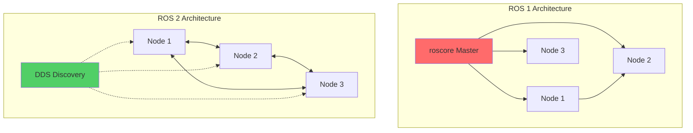
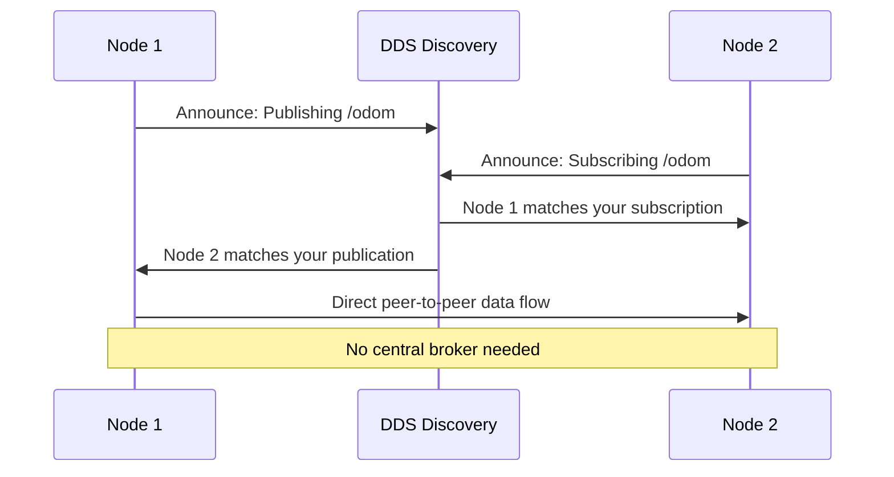

# ROS 2 Architecture and Installation

Modern humanoid robots like Boston Dynamics' Atlas and Figure AI's Figure 01 run on distributed systems where dozens of processes must communicate in real-time—perception feeding planning, planning triggering control, control commanding actuators at 1kHz. ROS 2 emerged because ROS 1's single-master architecture couldn't handle this scale, couldn't guarantee message delivery, and couldn't run on safety-critical systems. Understanding why ROS 2 was built differently reveals how to build robots that actually work in production.

## Learning Objectives

> **By the end of this chapter, you will:**
> - Understand the architectural differences between ROS 1 and ROS 2 and when each matters
> - Install and configure ROS 2 Humble on Ubuntu 22.04 with proper environment setup
> - Explain how DDS middleware enables peer-to-peer communication without a single point of failure
> - Identify which ROS 2 distribution to use for different project requirements

## Why ROS 2 Exists: The Limitations of ROS 1

ROS 1 served research robotics well for over a decade, but production systems exposed critical flaws. The roscore master node created a single point of failure—if it crashes, your entire robot stops. ROS 1 had no message delivery guarantees; a dropped perception message means your robot might walk into a wall. It lacked built-in security, making it unsuitable for commercial deployments. Real-time performance was impossible because TCPROS doesn't support deterministic timing.

ROS 2 addressed these issues by replacing the custom TCPROS protocol with DDS (Data Distribution Service), an OMG standard used in military and industrial systems. Instead of a central master, nodes discover each other peer-to-peer. Instead of "best-effort" delivery, you configure Quality of Service policies. Instead of hoping messages arrive in time, you get microsecond-level control over priorities and deadlines.



## The DDS Middleware Layer

DDS is the secret weapon that makes ROS 2 production-ready. It's a publish-subscribe middleware that handles discovery, message serialization, network transport, and reliability—all the hard distributed systems problems that roboticists shouldn't have to solve. ROS 2 supports multiple DDS implementations (Fast DDS, Cyclone DDS, RTI Connext) through the rmw (ROS middleware) abstraction layer. You can swap DDS vendors without changing your code.

When a ROS 2 node starts, it announces itself via UDP multicast. Other nodes receive this announcement and establish direct peer-to-peer connections. No central broker. No single point of failure. If Node A crashes, Nodes B and C continue operating. This is critical for humanoid robots where a vision node crash shouldn't kill the balance controller.

Quality of Service (QoS) profiles let you tune reliability vs. performance. A sensor publishing at 200Hz might use "best effort" delivery—if a message is lost, the next one arrives in 5ms anyway. A safety-critical command uses "reliable" delivery with acknowledgments and retries. DDS handles all this transparently.



## ROS 2 Distributions: Humble vs. Iron vs. Rolling

ROS 2 follows a time-based release schedule with a new distribution every six months. Long-Term Support (LTS) releases like Humble (May 2022) receive five years of support. Non-LTS releases like Iron (May 2023) get 18 months. Rolling is the bleeding-edge development branch.

For production humanoid robots in 2025, use **Humble**. It's the current LTS release, targets Ubuntu 22.04, and will receive patches until 2027. The ecosystem has matured—MoveIt 2, Nav2, and ros2_control all support Humble with extensive documentation. Iron introduced Performance Improvements and better type support, but unless you need specific features, Humble's stability wins.

> ⚠️ **WARNING**: Mixing ROS 2 distributions on the same network causes cryptic failures. All robots and workstations must run identical ROS versions and DDS implementations. Use Docker containers to enforce consistency.

## Installing ROS 2 Humble on Ubuntu 22.04

ROS 2 requires Ubuntu 22.04 (Jammy Jellyfish) for Humble. Don't try to build on Ubuntu 20.04 or 24.04—dependency hell awaits. Virtual machines work for learning, but real robot development needs bare metal for hardware access and real-time performance.

```bash
# Set up sources
sudo apt update && sudo apt install -y software-properties-common
sudo add-apt-repository universe
sudo apt update && sudo apt install -y curl gnupg lsb-release

# Add ROS 2 GPG key
sudo curl -sSL https://raw.githubusercontent.com/ros/rosdistro/master/ros.key \
    -o /usr/share/keyrings/ros-archive-keyring.gpg

# Add repository to sources list
echo "deb [arch=$(dpkg --print-architecture) \
signed-by=/usr/share/keyrings/ros-archive-keyring.gpg] \
http://packages.ros.org/ros2/ubuntu $(lsb_release -cs) main" | \
sudo tee /etc/apt/sources.list.d/ros2.list > /dev/null

# Install ROS 2 Humble Desktop (includes RViz, demos, tutorials)
sudo apt update
sudo apt install -y ros-humble-desktop

# Install development tools
sudo apt install -y \
    python3-colcon-common-extensions \
    python3-rosdep \
    python3-argcomplete

# Initialize rosdep (manages dependencies)
sudo rosdep init
rosdep update
```

After installation, verify by sourcing the setup script and checking the ROS version:

```bash
source /opt/ros/humble/setup.bash
ros2 --version
# Should output: ros2 cli version 0.18.x
```

> 💡 **TIP**: Add `source /opt/ros/humble/setup.bash` to your `~/.bashrc` so every terminal session has ROS 2 available. For multi-distribution development, use shell aliases or tools like `direnv` to switch contexts.

## Environment Configuration and Workspace Setup

ROS 2 uses environment variables to locate packages, configure DDS, and set runtime parameters. The most critical is `ROS_DOMAIN_ID`, which isolates ROS 2 networks. Set this to a unique number (0-101) to prevent your robot from receiving messages from someone else's robot on the same WiFi network.

```bash
# In ~/.bashrc
export ROS_DOMAIN_ID=42
export RMW_IMPLEMENTATION=rmw_cyclonedds_cpp  # Or rmw_fastrtps_cpp
export RCUTILS_COLORIZED_OUTPUT=1  # Colored log output
```

The `RMW_IMPLEMENTATION` variable selects your DDS vendor. Cyclone DDS is the default in Humble and performs well for most use cases. Fast DDS offers more configurability and is required for some commercial applications. RTI Connext requires a commercial license but provides the best real-time performance.

> ✅ **TIP**: For multi-robot systems, assign each robot a unique `ROS_DOMAIN_ID`. For robot-to-laptop development, use the same ID. Firewall rules can block inter-domain traffic for security.

## Verifying Your Installation

Test your ROS 2 setup with the talker-listener demo, which creates two nodes communicating over a topic:

```bash
# Terminal 1: Start the talker
ros2 run demo_nodes_cpp talker

# Terminal 2: Start the listener
ros2 run demo_nodes_py listener
```

You should see the talker publishing messages and the listener receiving them. This confirms DDS discovery, message serialization, and cross-language communication (C++ to Python) all work.

Inspect active nodes and topics with introspection tools:

```bash
ros2 node list          # Shows /talker and /listener
ros2 topic list         # Shows /chatter topic
ros2 topic echo /chatter  # Displays messages in real-time
ros2 topic hz /chatter    # Measures publication frequency
```

If nodes don't discover each other, check:
1. `ROS_DOMAIN_ID` matches across terminals
2. Firewall allows UDP multicast (ports 7400-7500)
3. DDS implementation is installed: `apt list --installed | grep rmw`

> 🔴 **IMPORTANT**: DDS discovery uses UDP multicast. Some corporate networks and VPNs block this. Test with `ros2 multicast receive` and `ros2 multicast send` on separate machines. If discovery fails, configure DDS for unicast-only mode.

## Key Takeaways

> - ROS 2 eliminates the single-master bottleneck through peer-to-peer DDS architecture
> - DDS middleware provides configurable Quality of Service, enabling both high-throughput sensors and safety-critical commands
> - Humble is the current LTS distribution (until 2027) and the correct choice for production humanoid robots
> - `ROS_DOMAIN_ID` isolates networks—critical for multi-robot labs and preventing cross-talk
> - Multiple DDS implementations (Cyclone, Fast DDS, RTI) are available; swap via `RMW_IMPLEMENTATION` without code changes
> - Installation verification requires checking both node operation and inter-node discovery
> - Ubuntu 22.04 is mandatory for Humble; version mismatches cause subtle and frustrating failures
> - Environment configuration in `~/.bashrc` saves time but can cause confusion when switching distributions
> - Introspection tools (`ros2 node list`, `ros2 topic echo`) are essential for debugging communication issues

## Further Reading

- [ROS 2 Design Document](http://design.ros2.org/) — Official rationale for architectural decisions, including why DDS was chosen over alternatives
- [DDS Security Specification](https://www.omg.org/spec/DDS-SECURITY/1.1/) — How to enable authentication and encryption for production deployments
- [Fast DDS vs Cyclone DDS Performance Comparison](https://arxiv.org/abs/2209.02173) — Academic benchmark showing latency and throughput differences between implementations

## Assessment

#### Multiple Choice Questions

**Q1 (Easy)**: What is the primary advantage of ROS 2's DDS-based architecture over ROS 1's master-based architecture?

- A) ROS 2 is easier to install
- B) ROS 2 eliminates the single point of failure
- C) ROS 2 supports more programming languages
- D) ROS 2 has better documentation

<details>
<summary>Answer</summary>

**B) ROS 2 eliminates the single point of failure** — In ROS 1, if the roscore master crashes, all nodes lose connectivity. ROS 2 uses peer-to-peer DDS discovery, so nodes communicate directly without a central broker. If one node crashes, others continue operating.
</details>

**Q2 (Medium)**: You're deploying a humanoid robot with a vision node publishing at 60Hz and a balance controller subscribing at 200Hz. Which QoS reliability setting should the vision node use?

- A) Reliable with deadline 5ms
- B) Best effort with volatile durability
- C) Reliable with transient-local durability
- D) Best effort with system default settings

<details>
<summary>Answer</summary>

**B) Best effort with volatile durability** — At 60Hz, messages arrive every ~16ms. If one is lost, the next arrives quickly enough that retransmissions would add latency without improving control performance. Best effort minimizes latency. Volatile durability means late-joiners don't receive old messages, which is correct for sensor data.
</details>

**Q3 (Medium)**: Two developers in the same office are running ROS 2 Humble. Developer A's robot starts moving erratically when Developer B launches their simulation. What is the most likely cause?

- A) They're using different DDS implementations
- B) They have the same ROS_DOMAIN_ID
- C) One is using Humble and the other is using Iron
- D) Their firewalls are blocking UDP traffic

<details>
<summary>Answer</summary>

**B) They have the same ROS_DOMAIN_ID** — By default, ROS 2 uses domain ID 0. Nodes in the same domain discover each other regardless of which computer they're on. Developer B's simulation nodes are publishing commands that Developer A's robot is receiving. Solution: assign unique domain IDs (e.g., `export ROS_DOMAIN_ID=42`).
</details>

**Q4 (Hard)**: You need to run ROS 2 Humble nodes on a network where UDP multicast is blocked. Which configuration approach enables DDS discovery?

- A) Switch to TCP-only mode using ROS_LOCALHOST_ONLY=1
- B) Configure DDS peer discovery with explicit IP addresses in XML
- C) Use a ROS 1 bridge to tunnel through TCP
- D) Disable discovery and manually configure topic connections

<details>
<summary>Answer</summary>

**B) Configure DDS peer discovery with explicit IP addresses in XML** — When multicast is unavailable, DDS can use unicast discovery by specifying peer IP addresses in a vendor-specific XML configuration file (e.g., `cyclonedds.xml` with `<Peer>` elements or Fast DDS `super_client` mode). ROS_LOCALHOST_ONLY restricts to loopback only. A ROS 1 bridge doesn't solve DDS discovery. Disabling discovery defeats the purpose of ROS 2's architecture.
</details>

#### Coding Exercises

**Exercise 1**: Write a bash script that verifies ROS 2 Humble is correctly installed and sourced.

```bash
#!/bin/bash
# TODO: Check if ROS_DISTRO is set to "humble"
# TODO: Check if ros2 command is available
# TODO: Print success message or error
```

<details>
<summary>Solution</summary>

```bash
#!/bin/bash
# ROS 2 Humble installation verifier

set -e

# Check if ROS_DISTRO environment variable is set
if [ -z "$ROS_DISTRO" ]; then
    echo "ERROR: ROS_DISTRO is not set. Did you source /opt/ros/humble/setup.bash?"
    exit 1
fi

# Verify it's Humble specifically
if [ "$ROS_DISTRO" != "humble" ]; then
    echo "ERROR: Expected ROS_DISTRO=humble, got ROS_DISTRO=$ROS_DISTRO"
    exit 1
fi

# Check if ros2 command exists
if ! command -v ros2 &> /dev/null; then
    echo "ERROR: ros2 command not found in PATH"
    exit 1
fi

# Verify version contains expected pattern
ROS_VERSION=$(ros2 --version 2>&1)
if [[ ! "$ROS_VERSION" =~ "ros2 cli version" ]]; then
    echo "ERROR: Unexpected ros2 version output: $ROS_VERSION"
    exit 1
fi

echo "SUCCESS: ROS 2 Humble is properly installed and sourced"
echo "  ROS_DISTRO: $ROS_DISTRO"
echo "  Version: $ROS_VERSION"
echo "  Domain ID: ${ROS_DOMAIN_ID:-0 (default)}"
echo "  DDS Implementation: ${RMW_IMPLEMENTATION:-default}"
```
</details>

**Exercise 2**: Write Python code to programmatically check which DDS implementation is active and print its vendor name.

```python
import rclpy

# TODO: Initialize ROS 2
# TODO: Get RMW implementation identifier
# TODO: Print vendor name (cyclonedds, fastrtps, etc.)
# TODO: Clean up
```

<details>
<summary>Solution</summary>

```python
#!/usr/bin/env python3
"""
Check active ROS 2 DDS middleware implementation
"""
import rclpy
from rclpy.utilities import get_rmw_implementation_identifier

def check_dds_implementation() -> None:
    """Query and display the active DDS middleware."""
    # Initialize ROS 2 Python client library
    rclpy.init()

    try:
        # Get the RMW (ROS Middleware) implementation identifier
        rmw_id = get_rmw_implementation_identifier()

        # Parse vendor name from identifier
        # Format is typically "rmw_cyclonedds_cpp" or "rmw_fastrtps_cpp"
        if "cyclonedds" in rmw_id:
            vendor = "Eclipse Cyclone DDS"
        elif "fastrtps" in rmw_id:
            vendor = "eProsima Fast DDS"
        elif "connext" in rmw_id:
            vendor = "RTI Connext DDS"
        else:
            vendor = "Unknown vendor"

        print(f"Active RMW Implementation: {rmw_id}")
        print(f"DDS Vendor: {vendor}")

    finally:
        # Cleanup ROS 2 resources
        rclpy.shutdown()

if __name__ == "__main__":
    check_dds_implementation()
```
</details>

#### Mini-Project

**Multi-Domain Discovery Test Rig**

Create a testing framework to verify DDS discovery behavior across different domain IDs. This project helps you understand network isolation, which is critical for multi-robot labs.

**Requirements:**
1. Create two Python scripts: `publisher.py` and `subscriber.py`
2. Publisher sends timestamped messages on `/test_topic` at 10Hz
3. Subscriber prints received messages with latency calculation
4. Both scripts accept `--domain` argument to set ROS_DOMAIN_ID programmatically
5. Write a bash script that launches publisher on domain 5 and subscriber on domain 10, verifies no messages are received (network isolation)
6. Then relaunch subscriber on domain 5, verify messages flow correctly

**Deliverables:**
- `publisher.py`: Publishes String messages with timestamp
- `subscriber.py`: Subscribes and calculates end-to-end latency
- `test_isolation.sh`: Automated test script with assertions
- `README.md`: Explains what you learned about domain isolation

**Success Criteria:**
- Cross-domain communication correctly fails (no messages received)
- Same-domain communication succeeds with latency < 10ms
- Scripts handle graceful shutdown (Ctrl+C)
- Test script returns exit code 0 on success, 1 on failure

**Estimated Time:** 2-3 hours
