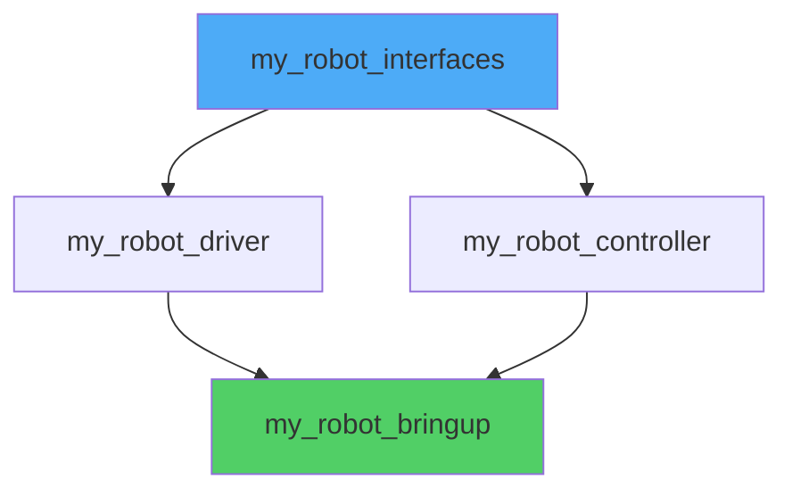
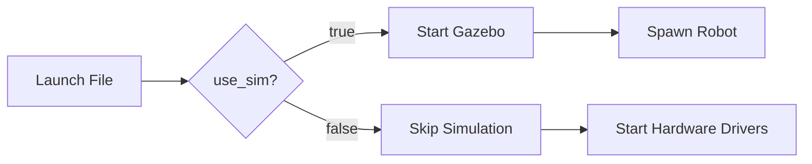

# Packages, Build Systems, and Launch Files

A production humanoid robot isn't a single script—it's 20-100 packages: sensor drivers, perception pipelines, motion planners, controllers, visualization tools. Each package is a modular component with dependencies, configuration files, and tests. You need a build system that handles cross-language compilation (C++ and Python), manages dependencies, and supports incremental builds. You need launch files that start dozens of nodes with the right parameters, namespaces, and remappings. ROS 2's package structure and colcon build system provide this infrastructure, but only if you understand how they work.

## Learning Objectives

> **By the end of this chapter, you will:**
> - Create well-structured ROS 2 packages with proper dependencies and metadata
> - Use colcon to build mixed C++/Python workspaces with incremental compilation
> - Write launch files in Python that configure and coordinate multiple nodes with parameters and remappings
> - Organize parameters in YAML files and load them dynamically at runtime

## Package Structure: The Unit of Distribution

A ROS 2 package is a directory containing code, configuration, and metadata. Packages are the unit of distribution—you install `ros-humble-nav2-bringup`, not individual files. Good package design follows single-responsibility: one package for camera drivers, another for camera calibration, a third for image processing. Packages declare dependencies so the build system installs prerequisites automatically.

Every ROS 2 package contains:

- `package.xml`: Metadata (name, version, dependencies, license)
- `setup.py` (Python) or `CMakeLists.txt` (C++): Build instructions
- Source code in language-specific directories
- Launch files (optional but common)
- Configuration files (optional)

Python package structure:

```
my_robot_bringup/
├── package.xml
├── setup.py
├── setup.cfg
├── my_robot_bringup/
│   ├── __init__.py
│   └── my_node.py
├── launch/
│   └── robot.launch.py
├── config/
│   └── params.yaml
├── resource/
│   └── my_robot_bringup
└── test/
    └── test_my_node.py
```

C++ package structure:

```
my_robot_driver/
├── package.xml
├── CMakeLists.txt
├── include/
│   └── my_robot_driver/
│       └── driver.hpp
├── src/
│   └── driver.cpp
├── launch/
│   └── driver.launch.py
└── config/
    └── driver_config.yaml
```

> 💡 **TIP**: Use `ros2 pkg create` to generate package skeletons with correct structure: `ros2 pkg create --build-type ament_python my_package --dependencies rclpy std_msgs`

## Creating a Python Package

Generate a new Python package:

```bash
cd ~/ros2_ws/src
ros2 pkg create --build-type ament_python my_robot_controller \
    --dependencies rclpy std_msgs geometry_msgs sensor_msgs \
    --node-name controller_node
```

This creates the directory structure and a minimal node. Edit `package.xml` to add metadata:

```xml
<?xml version="1.0"?>
<?xml-model href="http://download.ros.org/schema/package_format3.xsd" schematypens="http://www.w3.org/2001/XMLSchema"?>
<package format="3">
  <name>my_robot_controller</name>
  <version>0.1.0</version>
  <description>Balance controller for humanoid robot</description>
  <maintainer email="you@example.com">Your Name</maintainer>
  <license>Apache-2.0</license>

  <!-- Build tool dependency -->
  <buildtool_depend>ament_python</buildtool_depend>

  <!-- Runtime dependencies -->
  <depend>rclpy</depend>
  <depend>std_msgs</depend>
  <depend>geometry_msgs</depend>
  <depend>sensor_msgs</depend>

  <!-- Test dependencies -->
  <test_depend>ament_copyright</test_depend>
  <test_depend>ament_flake8</test_depend>
  <test_depend>ament_pep257</test_depend>
  <test_depend>python3-pytest</test_depend>

  <export>
    <build_type>ament_python</build_type>
  </export>
</package>
```

The `setup.py` file defines entry points (how ROS finds your nodes):

```python
from setuptools import setup
from glob import glob
import os

package_name = 'my_robot_controller'

setup(
    name=package_name,
    version='0.1.0',
    packages=[package_name],
    data_files=[
        # Install package.xml
        ('share/ament_index/resource_index/packages',
            ['resource/' + package_name]),
        ('share/' + package_name, ['package.xml']),
        # Install launch files
        (os.path.join('share', package_name, 'launch'),
            glob('launch/*.launch.py')),
        # Install config files
        (os.path.join('share', package_name, 'config'),
            glob('config/*.yaml')),
    ],
    install_requires=['setuptools'],
    zip_safe=True,
    maintainer='Your Name',
    maintainer_email='you@example.com',
    description='Balance controller for humanoid robot',
    license='Apache-2.0',
    tests_require=['pytest'],
    entry_points={
        'console_scripts': [
            'controller_node = my_robot_controller.controller_node:main',
        ],
    },
)
```

The `entry_points` section is critical—it tells ROS that running `ros2 run my_robot_controller controller_node` should execute the `main()` function in `controller_node.py`.

> ⚠️ **WARNING**: The package name in `package.xml`, `setup.py`, and the directory name must match exactly. Mismatches cause cryptic build failures.

## The Colcon Build System

Colcon is ROS 2's build tool, replacing catkin from ROS 1. It builds packages in dependency order, supports parallel compilation, and handles both Python and C++ packages. A workspace is a directory containing packages:

```
ros2_ws/
├── src/
│   ├── my_robot_controller/
│   ├── my_robot_driver/
│   └── my_robot_description/
├── build/
├── install/
└── log/
```

Build all packages:

```bash
cd ~/ros2_ws
colcon build
```

Colcon creates three directories:
- `build/`: Intermediate compilation artifacts
- `install/`: Built packages ready to run
- `log/`: Build logs for debugging

Source the workspace to use your packages:

```bash
source ~/ros2_ws/install/setup.bash
ros2 run my_robot_controller controller_node
```

Incremental builds are fast—colcon only rebuilds changed packages:

```bash
# Build only packages that changed
colcon build

# Build a specific package
colcon build --packages-select my_robot_controller

# Build with verbose output (debug compilation issues)
colcon build --event-handlers console_direct+
```

Colcon detects dependencies from `package.xml` and builds in the correct order. If package A depends on package B, colcon builds B first. Circular dependencies cause build failures.



> ✅ **TIP**: Use `colcon build --symlink-install` for Python packages. This creates symlinks instead of copies, so code changes take effect without rebuilding. Don't use for C++ (needs recompilation).

## Launch Files: Orchestrating Multi-Node Systems

Launch files start multiple nodes with configuration in one command. Instead of opening 15 terminals and running `ros2 run` manually, launch files handle node startup, parameters, namespaces, and remappings. ROS 2 launch files are Python scripts, giving you full programming power—conditionals, loops, external data loading.

Minimal launch file:

```python
from launch import LaunchDescription
from launch_ros.actions import Node


def generate_launch_description():
    return LaunchDescription([
        Node(
            package='my_robot_controller',
            executable='controller_node',
            name='balance_controller',
            output='screen',  # Print to terminal
        ),
        Node(
            package='my_robot_driver',
            executable='imu_driver',
            name='imu_driver',
            output='screen',
        ),
    ])
```

Run with:

```bash
ros2 launch my_robot_bringup robot.launch.py
```

This starts both nodes, prints their output to the terminal, and handles Ctrl+C shutdown gracefully.

## Advanced Launch Features

**Parameters from YAML files:**

```python
import os
from ament_index_python.packages import get_package_share_directory
from launch import LaunchDescription
from launch_ros.actions import Node


def generate_launch_description():
    # Find config file in install space
    config = os.path.join(
        get_package_share_directory('my_robot_controller'),
        'config',
        'controller_params.yaml'
    )

    return LaunchDescription([
        Node(
            package='my_robot_controller',
            executable='controller_node',
            name='balance_controller',
            parameters=[config],  # Load YAML params
            output='screen',
        ),
    ])
```

Example `controller_params.yaml`:

```yaml
balance_controller:
  ros__parameters:
    update_rate: 200.0  # Hz
    kp_roll: 1.5
    kp_pitch: 1.5
    kd_roll: 0.3
    kd_pitch: 0.3
    max_angle: 0.349  # radians (~20 degrees)
```

Nodes read parameters with:

```python
self.declare_parameter('update_rate', 100.0)
self.declare_parameter('kp_roll', 1.0)

update_rate = self.get_parameter('update_rate').value
kp_roll = self.get_parameter('kp_roll').value
```

> 🔴 **IMPORTANT**: Parameter names in YAML must be under the node name and `ros__parameters` key. Wrong structure means parameters aren't loaded, causing nodes to use defaults silently.

**Namespaces for multi-robot systems:**

```python
def generate_launch_description():
    return LaunchDescription([
        # Robot 1
        Node(
            package='my_robot_controller',
            executable='controller_node',
            name='controller',
            namespace='robot1',
        ),
        # Robot 2
        Node(
            package='my_robot_controller',
            executable='controller_node',
            name='controller',
            namespace='robot2',
        ),
    ])
```

This creates `/robot1/controller` and `/robot2/controller` nodes. Topics become `/robot1/cmd_vel` and `/robot2/cmd_vel`. Namespaces isolate robots on the same network without code changes.

**Remappings for topic rewiring:**

```python
Node(
    package='my_robot_controller',
    executable='controller_node',
    name='controller',
    remappings=[
        ('/cmd_vel', '/robot/base_controller/cmd_vel'),
        ('/odom', '/robot/odometry/filtered'),
    ],
)
```

If the node publishes to `/cmd_vel`, it actually publishes to `/robot/base_controller/cmd_vel`. Remappings let you connect nodes without modifying code.

**Conditional execution:**

```python
from launch.conditions import IfCondition
from launch.substitutions import LaunchConfiguration


def generate_launch_description():
    return LaunchDescription([
        DeclareLaunchArgument(
            'use_sim',
            default_value='false',
            description='Use simulation time',
        ),
        Node(
            package='gazebo_ros',
            executable='spawn_entity',
            condition=IfCondition(LaunchConfiguration('use_sim')),
        ),
    ])
```

Run with argument: `ros2 launch my_pkg robot.launch.py use_sim:=true`



## Including Other Launch Files

Complex robots split configuration across multiple launch files. The main launch file includes others:

```python
from launch.actions import IncludeLaunchDescription
from launch.launch_description_sources import PythonLaunchDescriptionSource


def generate_launch_description():
    sensors_launch = IncludeLaunchDescription(
        PythonLaunchDescriptionSource([
            get_package_share_directory('my_robot_sensors'),
            '/launch/sensors.launch.py'
        ])
    )

    navigation_launch = IncludeLaunchDescription(
        PythonLaunchDescriptionSource([
            get_package_share_directory('nav2_bringup'),
            '/launch/navigation_launch.py'
        ]),
        launch_arguments={'use_sim_time': 'false'}.items(),
    )

    return LaunchDescription([
        sensors_launch,
        navigation_launch,
    ])
```

This modular structure keeps launch files maintainable. Change sensor configuration without touching navigation. Swap simulation for hardware by including different sensor launch files.

## Working with Parameters

Parameters configure node behavior without recompilation. Declare parameters with defaults:

```python
class BalanceController(Node):
    def __init__(self):
        super().__init__('balance_controller')

        # Declare parameters with defaults
        self.declare_parameter('update_rate', 200.0)
        self.declare_parameter('kp_roll', 1.5)
        self.declare_parameter('kd_roll', 0.3)

        # Read current values
        self.update_rate = self.get_parameter('update_rate').value
        self.kp_roll = self.get_parameter('kp_roll').value
        self.kd_roll = self.get_parameter('kd_roll').value

        self.get_logger().info(f'Controller running at {self.update_rate} Hz')
```

Set parameters at launch:

```python
Node(
    package='my_robot_controller',
    executable='controller_node',
    parameters=[
        {'update_rate': 250.0},
        {'kp_roll': 2.0},
    ],
)
```

Or load from YAML as shown earlier. Change parameters at runtime:

```bash
ros2 param set /balance_controller kp_roll 1.8
ros2 param get /balance_controller kp_roll
ros2 param dump /balance_controller  # Save current values to file
```

For dynamic reconfiguration (parameters that take effect immediately), register a callback:

```python
self.add_on_set_parameters_callback(self.parameter_callback)

def parameter_callback(self, params):
    for param in params:
        if param.name == 'kp_roll':
            self.kp_roll = param.value
            self.get_logger().info(f'Updated kp_roll to {self.kp_roll}')
    return SetParametersResult(successful=True)
```

> ✅ **TIP**: Use parameter YAML files for different deployment environments: `config/lab.yaml`, `config/production.yaml`, `config/sim.yaml`. Launch the appropriate file based on deployment.

## Dependency Management

Dependencies are declared in `package.xml`:

- `<build_depend>`: Needed during compilation (C++ only)
- `<exec_depend>`: Needed at runtime
- `<depend>`: Shorthand for both build and exec depend
- `<test_depend>`: Needed only for testing

Example for a package using MoveIt 2 and Nav2:

```xml
<package format="3">
  <name>my_humanoid_robot</name>

  <!-- Core ROS 2 -->
  <depend>rclcpp</depend>
  <depend>rclpy</depend>

  <!-- Messages -->
  <depend>std_msgs</depend>
  <depend>geometry_msgs</depend>
  <depend>sensor_msgs</depend>
  <depend>nav_msgs</depend>

  <!-- Motion Planning -->
  <depend>moveit_ros_planning</depend>
  <depend>moveit_ros_planning_interface</depend>

  <!-- Navigation -->
  <depend>nav2_bringup</depend>
  <depend>nav2_msgs</depend>

  <!-- Testing -->
  <test_depend>ament_cmake_gtest</test_depend>
  <test_depend>ament_lint_auto</test_depend>
</package>
```

When you build with colcon, `rosdep` installs missing dependencies:

```bash
cd ~/ros2_ws
rosdep install --from-paths src --ignore-src -y
colcon build
```

This ensures all prerequisites are installed before compilation starts.

## Key Takeaways

> - Packages are the unit of distribution with metadata in package.xml and build instructions in setup.py or CMakeLists.txt
> - Colcon builds workspaces in dependency order with incremental compilation and parallel builds
> - Entry points in setup.py register executables so `ros2 run` can find your nodes
> - Launch files orchestrate multi-node systems with parameters, namespaces, and remappings in a single command
> - YAML configuration files separate deployment-specific settings from code for environment portability
> - Namespaces enable multi-robot systems by isolating topic and service names without code changes
> - Including launch files modularly organizes complex systems (sensors, navigation, manipulation)
> - Parameters provide runtime configuration with optional dynamic reconfiguration via callbacks
> - rosdep automatically installs dependencies declared in package.xml before building

## Further Reading

- [ROS 2 Package Documentation](https://docs.ros.org/en/humble/Tutorials/Beginner-Client-Libraries/Creating-Your-First-ROS2-Package.html) — Official guide to package creation and structure
- [Colcon Documentation](https://colcon.readthedocs.io/) — Complete reference for build system configuration and advanced usage
- [Launch File Architecture](https://design.ros2.org/articles/roslaunch.html) — Design rationale for ROS 2 launch system and Python-based approach

## Assessment

#### Multiple Choice Questions

**Q1 (Easy)**: What is the purpose of the `package.xml` file in a ROS 2 package?

- A) It contains the source code for nodes
- B) It declares metadata, dependencies, and license information
- C) It configures build optimization flags
- D) It defines launch file locations

<details>
<summary>Answer</summary>

**B) It declares metadata, dependencies, and license information** — The package.xml file is the package manifest. It tells the build system what the package needs, who maintains it, what license it uses, and how to categorize it. This enables dependency resolution, distribution, and package management. Source code goes in language-specific directories, not package.xml.
</details>

**Q2 (Medium)**: You modify a Python node in your workspace and run `colcon build` without any flags. What happens?

- A) Nothing—Python doesn't need compilation
- B) Colcon copies the modified file to install/
- C) Colcon rebuilds all packages
- D) Colcon rebuilds only dependent packages

<details>
<summary>Answer</summary>

**B) Colcon copies the modified file to install/** — By default, colcon copies Python files from src/ to install/ during build. To see changes, you must rebuild (even though there's no compilation). Using `--symlink-install` creates symlinks instead, so changes take effect without rebuilding. This is different from C++ which requires recompilation.
</details>

**Q3 (Medium)**: A launch file sets a parameter `max_speed: 2.0` but the node still uses the default value of 1.0. What is the most likely cause?

- A) Parameters must be set via `ros2 param set`, not launch files
- B) The node doesn't declare the parameter with `declare_parameter()`
- C) The YAML formatting is incorrect (wrong indentation)
- D) Launch files can't override default parameters

<details>
<summary>Answer</summary>

**B) The node doesn't declare the parameter with declare_parameter()** — ROS 2 requires explicit parameter declaration. If a node doesn't declare a parameter, it won't receive values from launch files or YAML configs. The parameter exists in the parameter server but the node never reads it. Always declare parameters in node `__init__()` before reading them. YAML formatting issues would prevent launch file loading entirely.
</details>

**Q4 (Hard)**: You have a workspace with packages A, B, and C. B depends on A, C depends on B. You modify package A. Which packages must be rebuilt?

- A) Only A
- B) A and B
- C) A, B, and C
- D) All packages in the workspace

<details>
<summary>Answer</summary>

**C) A, B, and C** — Colcon uses a dependency graph to determine build order. When a package changes, all packages that depend on it (directly or transitively) must be rebuilt because they might be affected by the changes. A's changes could affect B's behavior, which could affect C. Use `colcon build --packages-up-to C` to rebuild only C and its dependencies, or `colcon build --packages-select A` to rebuild only A (risky if changes affect dependents).
</details>

#### Coding Exercises

**Exercise 1**: Create a complete ROS 2 Python package named `robot_status` with a node that publishes the robot's battery level.

```bash
# TODO: Use ros2 pkg create to generate package structure
# TODO: Add node that publishes Float32 battery percentage (0-100) at 1Hz
# TODO: Add launch file to start the node
# TODO: Add parameter for update rate in YAML config
```

<details>
<summary>Solution</summary>

```bash
# Step 1: Create package
cd ~/ros2_ws/src
ros2 pkg create --build-type ament_python robot_status \
    --dependencies rclpy std_msgs \
    --node-name battery_monitor

# Step 2: Edit the generated node file
```

```python
# robot_status/battery_monitor.py
import rclpy
from rclpy.node import Node
from std_msgs.msg import Float32
import random


class BatteryMonitor(Node):
    """Simulates battery monitoring for a robot."""

    def __init__(self):
        super().__init__('battery_monitor')

        # Declare parameters
        self.declare_parameter('update_rate', 1.0)  # Hz
        self.declare_parameter('initial_charge', 100.0)  # %
        self.declare_parameter('discharge_rate', 0.1)  # % per second

        # Get parameter values
        update_rate = self.get_parameter('update_rate').value
        self.battery_level = self.get_parameter('initial_charge').value
        self.discharge_rate = self.get_parameter('discharge_rate').value

        # Create publisher
        self.publisher_ = self.create_publisher(
            Float32,
            'battery_level',
            10
        )

        # Create timer
        self.timer = self.create_timer(1.0 / update_rate, self.timer_callback)

        self.get_logger().info(
            f'Battery monitor started at {update_rate} Hz'
        )

    def timer_callback(self):
        # Simulate battery discharge
        self.battery_level -= self.discharge_rate
        if self.battery_level < 0:
            self.battery_level = 0

        # Publish current level
        msg = Float32()
        msg.data = self.battery_level
        self.publisher_.publish(msg)

        # Log warnings at low levels
        if self.battery_level < 20.0:
            self.get_logger().warn(
                f'Low battery: {self.battery_level:.1f}%'
            )
        elif self.battery_level == 0.0:
            self.get_logger().error('Battery depleted!')


def main(args=None):
    rclpy.init(args=args)
    node = BatteryMonitor()
    try:
        rclpy.spin(node)
    except KeyboardInterrupt:
        pass
    finally:
        node.destroy_node()
        rclpy.shutdown()


if __name__ == '__main__':
    main()
```

```python
# setup.py - update entry_points
entry_points={
    'console_scripts': [
        'battery_monitor = robot_status.battery_monitor:main',
    ],
},
```

```yaml
# config/battery_params.yaml
battery_monitor:
  ros__parameters:
    update_rate: 1.0
    initial_charge: 100.0
    discharge_rate: 0.1
```

```python
# launch/battery.launch.py
import os
from ament_index_python.packages import get_package_share_directory
from launch import LaunchDescription
from launch_ros.actions import Node


def generate_launch_description():
    config = os.path.join(
        get_package_share_directory('robot_status'),
        'config',
        'battery_params.yaml'
    )

    return LaunchDescription([
        Node(
            package='robot_status',
            executable='battery_monitor',
            name='battery_monitor',
            parameters=[config],
            output='screen',
        ),
    ])
```

```bash
# Build and run
cd ~/ros2_ws
colcon build --packages-select robot_status
source install/setup.bash
ros2 launch robot_status battery.launch.py
```
</details>

**Exercise 2**: Write a launch file that starts three nodes with different namespaces for a multi-robot system.

```python
# launch/multi_robot.launch.py
from launch import LaunchDescription
from launch_ros.actions import Node

def generate_launch_description():
    # TODO: Create three controller nodes
    # TODO: Assign namespaces: robot1, robot2, robot3
    # TODO: Remap /cmd_vel to /base_controller/cmd_vel for each
    pass
```

<details>
<summary>Solution</summary>

```python
# launch/multi_robot.launch.py
from launch import LaunchDescription
from launch_ros.actions import Node


def generate_launch_description():
    """Launch three robots with isolated namespaces."""

    robots = ['robot1', 'robot2', 'robot3']
    nodes = []

    for robot_name in robots:
        node = Node(
            package='my_robot_controller',
            executable='controller_node',
            name='controller',
            namespace=robot_name,
            parameters=[{
                'robot_id': robot_name,
                'update_rate': 100.0,
            }],
            remappings=[
                ('/cmd_vel', '/base_controller/cmd_vel'),
                ('/odom', '/localization/odometry'),
            ],
            output='screen',
        )
        nodes.append(node)

    return LaunchDescription(nodes)


# Alternative: More explicit version
def generate_launch_description_explicit():
    return LaunchDescription([
        Node(
            package='my_robot_controller',
            executable='controller_node',
            name='controller',
            namespace='robot1',
            parameters=[{'robot_id': 'robot1'}],
            remappings=[('/cmd_vel', '/base_controller/cmd_vel')],
            output='screen',
        ),
        Node(
            package='my_robot_controller',
            executable='controller_node',
            name='controller',
            namespace='robot2',
            parameters=[{'robot_id': 'robot2'}],
            remappings=[('/cmd_vel', '/base_controller/cmd_vel')],
            output='screen',
        ),
        Node(
            package='my_robot_controller',
            executable='controller_node',
            name='controller',
            namespace='robot3',
            parameters=[{'robot_id': 'robot3'}],
            remappings=[('/cmd_vel', '/base_controller/cmd_vel')],
            output='screen',
        ),
    ])
```

Resulting node and topic structure:
```
/robot1/controller (node)
  /robot1/base_controller/cmd_vel (publishes)
  /robot1/localization/odometry (subscribes)

/robot2/controller (node)
  /robot2/base_controller/cmd_vel (publishes)
  /robot2/localization/odometry (subscribes)

/robot3/controller (node)
  /robot3/base_controller/cmd_vel (publishes)
  /robot3/localization/odometry (subscribes)
```
</details>

#### Mini-Project

**Configurable Multi-Environment Robot Bringup**

Build a launch system that adapts to different deployment environments (simulation, lab testing, production) using parameters and conditional execution.

**Requirements:**

1. **Package Structure** (`my_robot_bringup`):
   - Three config files: `sim.yaml`, `lab.yaml`, `production.yaml`
   - Configs differ in sensor update rates, safety limits, logging verbosity
   - Main launch file with `environment` argument (sim/lab/production)

2. **Node Configuration**:
   - Sensor node: publishes dummy sensor data at configurable rate
   - Safety monitor: checks values against configurable limits
   - Logger node: logs at configurable verbosity (DEBUG/INFO/WARN)

3. **Conditional Execution**:
   - In sim mode: start with simulated time, high verbosity
   - In lab mode: start with real hardware drivers, medium verbosity
   - In production mode: start with optimized settings, minimal logging

4. **Multi-Robot Support**:
   - Accept `robot_namespace` argument
   - All topics namespaced appropriately
   - Default namespace: `robot1`

**Deliverables:**
- Complete package with proper structure (package.xml, setup.py)
- Three YAML config files with documented parameters
- Master launch file with conditional logic
- Three node implementations (sensor, safety monitor, logger)
- README with usage examples for each environment

**Example Usage:**
```bash
# Simulation environment
ros2 launch my_robot_bringup bringup.launch.py environment:=sim

# Lab testing with custom namespace
ros2 launch my_robot_bringup bringup.launch.py \
    environment:=lab robot_namespace:=test_bot

# Production deployment
ros2 launch my_robot_bringup bringup.launch.py environment:=production
```

**Success Criteria:**
- Launch file correctly loads environment-specific configs
- Conditional nodes start only in appropriate environments
- Multi-robot deployment works with isolated namespaces
- All parameters are properly declared and documented
- Build succeeds with `colcon build --symlink-install`

**Estimated Time:** 3-4 hours
