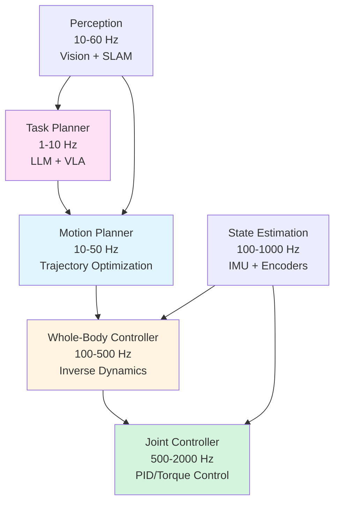
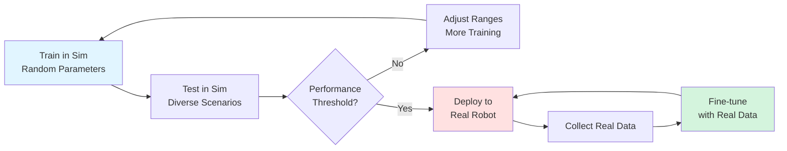

# Capstone: Autonomous Humanoid System

An autonomous humanoid isn't a collection of components—it's an orchestrated system where perception, planning, and control form tight feedback loops running at multiple timescales. When Figure 02 navigates a warehouse, packs boxes, and responds to verbal instructions simultaneously, it balances 1000Hz joint control, 30Hz visual servoing, 10Hz motion planning, and 1Hz task scheduling. This chapter integrates everything: VLA policies for manipulation, voice commands for task specification, kinematic control for locomotion, and sim-to-real transfer for deployment. You'll build a complete pipeline from simulation to hardware.

> **By the end of this chapter, you will:**
> - Architect multi-rate control hierarchies with real-time guarantees
> - Implement sim-to-real transfer using domain randomization and system identification
> - Deploy containerized robot applications with edge compute and model optimization
> - Debug integration issues across perception, planning, and control layers

## System Architecture: Multi-Rate Control Hierarchy

Humanoid systems organize control into hierarchical layers, each operating at appropriate timescales:



Each layer has distinct responsibilities:

- **Task Planner**: Decomposes high-level commands into action sequences
- **Motion Planner**: Generates collision-free trajectories respecting dynamics
- **Whole-Body Controller**: Computes joint torques for tracking trajectories
- **Joint Controller**: Low-level servo control of actuators

```python
from dataclasses import dataclass
from typing import Protocol, Optional
import numpy as np
from enum import Enum
import time
import threading

class ControlMode(Enum):
    """Robot operating mode."""
    IDLE = "idle"
    WALKING = "walking"
    MANIPULATING = "manipulating"
    SPEAKING = "speaking"

@dataclass
class RobotState:
    """Complete robot state snapshot."""
    joint_positions: np.ndarray  # (n_joints,)
    joint_velocities: np.ndarray
    base_pose: np.ndarray  # (x, y, z, qw, qx, qy, qz)
    base_velocity: np.ndarray  # (vx, vy, vz, wx, wy, wz)
    contact_forces: dict[str, np.ndarray]  # foot_name -> force vector
    timestamp: float

@dataclass
class ControlCommand:
    """Multi-level control targets."""
    mode: ControlMode
    task_goal: Optional[dict] = None  # High-level task parameters
    trajectory: Optional[np.ndarray] = None  # Motion plan
    joint_targets: Optional[np.ndarray] = None  # Low-level setpoints
    torques: Optional[np.ndarray] = None  # Direct torque control

class ControlLayer(Protocol):
    """Interface for control hierarchy layers."""

    def update(self, state: RobotState, dt: float) -> ControlCommand:
        """Compute control output given current state."""
        ...

class HumanoidControlHierarchy:
    """Multi-rate control system for humanoid robot."""

    def __init__(
        self,
        task_planner: ControlLayer,
        motion_planner: ControlLayer,
        whole_body_controller: ControlLayer,
        joint_controller: ControlLayer
    ):
        self.task_planner = task_planner
        self.motion_planner = motion_planner
        self.whole_body = whole_body_controller
        self.joint_ctrl = joint_controller

        # Control rates (Hz)
        self.rates = {
            'task': 5.0,
            'motion': 30.0,
            'whole_body': 200.0,
            'joint': 1000.0
        }

        # State
        self.current_state = None
        self.running = False
        self.threads = {}

    def start(self):
        """Launch control threads at different rates."""
        self.running = True

        # Highest frequency (joint control)
        self.threads['joint'] = threading.Thread(
            target=self._control_loop,
            args=('joint', self.joint_ctrl, self.rates['joint']),
            daemon=True
        )

        # Mid frequency (whole-body control)
        self.threads['whole_body'] = threading.Thread(
            target=self._control_loop,
            args=('whole_body', self.whole_body, self.rates['whole_body']),
            daemon=True
        )

        # Motion planning
        self.threads['motion'] = threading.Thread(
            target=self._control_loop,
            args=('motion', self.motion_planner, self.rates['motion']),
            daemon=True
        )

        # Task planning (lowest frequency)
        self.threads['task'] = threading.Thread(
            target=self._control_loop,
            args=('task', self.task_planner, self.rates['task']),
            daemon=True
        )

        # Start all threads
        for thread in self.threads.values():
            thread.start()

    def stop(self):
        """Gracefully shutdown control loops."""
        self.running = False
        for thread in self.threads.values():
            thread.join(timeout=1.0)

    def _control_loop(self, name: str, controller: ControlLayer, rate_hz: float):
        """Generic control loop at specified rate."""
        dt = 1.0 / rate_hz
        next_time = time.time()

        while self.running:
            loop_start = time.time()

            # Get current state (thread-safe)
            state = self.get_state()

            if state is not None:
                # Compute control
                command = controller.update(state, dt)

                # Apply command (implementation-specific)
                self._apply_command(name, command)

            # Timing control
            next_time += dt
            sleep_time = next_time - time.time()

            if sleep_time > 0:
                time.sleep(sleep_time)
            else:
                # Overrun warning
                overrun_ms = -sleep_time * 1000
                if overrun_ms > dt * 1000 * 0.1:  # >10% overrun
                    print(f"[{name}] Control loop overrun: {overrun_ms:.1f}ms")

    def get_state(self) -> Optional[RobotState]:
        """Thread-safe state access."""
        # In production, use proper synchronization (mutex/RWLock)
        return self.current_state

    def _apply_command(self, layer: str, command: ControlCommand):
        """Route command to appropriate subsystem."""
        # Implementation depends on hardware interface
        pass
```

> **TIP**: Use real-time operating systems (RTOS) or RT-PREEMPT Linux for guaranteed latency. Standard Linux can miss control deadlines, causing instability in dynamic maneuvers.

## Sim-to-Real Transfer with Domain Randomization

Training policies in simulation avoids hardware wear and accelerates iteration. But simulation isn't reality—physics engines approximate friction, contact dynamics, and actuator response. Domain randomization makes policies robust to these mismatches.



Randomize everything that matters:

```python
import numpy as np
from typing import Dict, Tuple
import pybullet as p
import pybullet_data

class SimulationRandomizer:
    """Domain randomization for sim-to-real transfer."""

    def __init__(self, robot_id: int, ground_id: int):
        self.robot_id = robot_id
        self.ground_id = ground_id

        # Randomization ranges (tuned per robot)
        self.param_ranges = {
            'mass_scale': (0.8, 1.2),
            'com_offset': (-0.02, 0.02),  # meters
            'friction': (0.5, 1.5),
            'damping': (0.5, 2.0),
            'motor_strength': (0.9, 1.1),
            'latency': (0.0, 0.02),  # seconds
            'sensor_noise': (0.0, 0.05),  # stddev scale
        }

    def randomize(self) -> Dict[str, float]:
        """
        Apply randomization to simulation.

        Returns:
            Dictionary of applied parameters (for logging)
        """
        applied = {}

        # 1. Dynamics randomization
        applied['mass_scale'] = self._randomize_masses()
        applied['com_offset'] = self._randomize_com()

        # 2. Contact randomization
        applied['friction'] = self._randomize_friction()

        # 3. Actuator randomization
        applied['damping'] = self._randomize_damping()
        applied['motor_strength'] = self._randomize_motor_strength()

        # 4. Observation randomization (applied per-step)
        applied['latency'] = self._sample('latency')
        applied['sensor_noise'] = self._sample('sensor_noise')

        return applied

    def _randomize_masses(self) -> float:
        """Randomize link masses."""
        scale = self._sample('mass_scale')

        n_links = p.getNumJoints(self.robot_id)
        for link_idx in range(-1, n_links):  # -1 is base
            dynamics = p.getDynamicsInfo(self.robot_id, link_idx)
            original_mass = dynamics[0]

            p.changeDynamics(
                self.robot_id,
                link_idx,
                mass=original_mass * scale
            )

        return scale

    def _randomize_com(self) -> Tuple[float, float, float]:
        """Randomize center of mass offsets."""
        offset = tuple(self._sample('com_offset') for _ in range(3))

        n_links = p.getNumJoints(self.robot_id)
        for link_idx in range(-1, n_links):
            p.changeDynamics(
                self.robot_id,
                link_idx,
                localInertiaDiagonal=[1, 1, 1],  # Simplified
                localInertiaPos=offset
            )

        return offset

    def _randomize_friction(self) -> float:
        """Randomize ground and foot friction."""
        friction = self._sample('friction')

        # Ground friction
        p.changeDynamics(
            self.ground_id,
            -1,
            lateralFriction=friction
        )

        # Foot friction (assume links named 'foot_left', 'foot_right')
        foot_links = self._find_links_by_name(['foot_left', 'foot_right'])
        for link_idx in foot_links:
            p.changeDynamics(
                self.robot_id,
                link_idx,
                lateralFriction=friction,
                spinningFriction=friction * 0.5,
                rollingFriction=friction * 0.1
            )

        return friction

    def _randomize_damping(self) -> float:
        """Randomize joint damping."""
        scale = self._sample('damping')

        n_joints = p.getNumJoints(self.robot_id)
        for joint_idx in range(n_joints):
            info = p.getJointInfo(self.robot_id, joint_idx)
            if info[2] != p.JOINT_FIXED:
                p.changeDynamics(
                    self.robot_id,
                    joint_idx,
                    jointDamping=info[6] * scale  # Original damping * scale
                )

        return scale

    def _randomize_motor_strength(self) -> float:
        """Simulate actuator strength variation."""
        # This is applied at control time, not in dynamics
        return self._sample('motor_strength')

    def _sample(self, param: str) -> float:
        """Sample from uniform distribution."""
        low, high = self.param_ranges[param]
        return np.random.uniform(low, high)

    def _find_links_by_name(self, names: list[str]) -> list[int]:
        """Find link indices by name."""
        indices = []
        n_links = p.getNumJoints(self.robot_id)

        for link_idx in range(n_links):
            info = p.getJointInfo(self.robot_id, link_idx)
            link_name = info[12].decode('utf-8')

            if any(name in link_name for name in names):
                indices.append(link_idx)

        return indices
```

> **WARNING**: Over-randomization makes learning impossible. Start with narrow ranges and gradually widen. Monitor sim performance—if success rate drops below 60%, ranges are too wide.

## System Identification for Accurate Models

Domain randomization helps, but precise system identification finds the real robot's parameters, enabling accurate forward simulation for planning.

```python
from scipy.optimize import minimize
import numpy as np

class SystemIdentifier:
    """Identify robot dynamic parameters from real data."""

    def __init__(self, n_dof: int):
        self.n_dof = n_dof

    def identify_friction(
        self,
        recorded_data: list[Dict]
    ) -> Dict[int, Dict[str, float]]:
        """
        Estimate friction parameters per joint.

        Args:
            recorded_data: List of dicts with 'position', 'velocity', 'torque'

        Returns:
            Dictionary mapping joint index to friction params
        """
        friction_params = {}

        for joint_idx in range(self.n_dof):
            # Extract joint data
            velocities = np.array([
                d['velocity'][joint_idx] for d in recorded_data
            ])
            torques = np.array([
                d['torque'][joint_idx] for d in recorded_data
            ])

            # Filter for constant velocity segments
            vel_stable = np.abs(np.gradient(velocities)) < 0.1
            vels = velocities[vel_stable]
            torqs = torques[vel_stable]

            if len(vels) < 10:
                continue

            # Fit friction model: τ = b*v + τ_c*sign(v)
            def friction_model(params, v):
                b, tau_c = params
                return b * v + tau_c * np.sign(v)

            def loss(params):
                predicted = friction_model(params, vels)
                return np.mean((predicted - torqs)**2)

            result = minimize(
                loss,
                x0=[0.1, 0.5],
                bounds=[(0, 10), (0, 5)],
                method='L-BFGS-B'
            )

            friction_params[joint_idx] = {
                'viscous': result.x[0],
                'coulomb': result.x[1]
            }

        return friction_params

    def identify_inertia(
        self,
        trajectory_data: list[Dict]
    ) -> np.ndarray:
        """
        Estimate inertia matrix from motion data.

        Returns:
            Inertia matrix (n_dof, n_dof)
        """
        # Extract accelerations and torques
        n_samples = len(trajectory_data)
        A = np.zeros((n_samples, self.n_dof))
        b = np.zeros(n_samples)

        for i, data in enumerate(trajectory_data):
            A[i, :] = data['acceleration']
            b[i] = data['torque'].sum()  # Simplified

        # Solve least squares: τ = I*α
        inertia_diag = np.linalg.lstsq(A, b, rcond=None)[0]

        return np.diag(np.maximum(inertia_diag, 0.01))  # Ensure positive
```

> **NOTE**: System identification requires excitation trajectories that cover the full operating range. Use chirp signals or pseudorandom binary sequences (PRBS) to excite all modes.

## Deployment: Containerization and Edge Computing

Deploy your system using Docker containers for reproducibility and isolation. Edge devices (NVIDIA Jetson, Intel NUC) run compute-intensive perception and planning.

```bash
# Dockerfile for robot perception node
FROM nvcr.io/nvidia/pytorch:23.12-py3

# Install ROS2 Humble
RUN apt-get update && apt-get install -y \
    ros-humble-ros-base \
    ros-humble-cv-bridge \
    python3-pip \
    && rm -rf /var/lib/apt/lists/*

# Install Python dependencies
COPY requirements.txt .
RUN pip install --no-cache-dir -r requirements.txt

# Copy application code
COPY src/ /opt/robot_ws/src/
WORKDIR /opt/robot_ws

# Build ROS2 workspace
RUN . /opt/ros/humble/setup.sh && \
    colcon build --symlink-install

# Entry point
COPY entrypoint.sh /
RUN chmod +x /entrypoint.sh
ENTRYPOINT ["/entrypoint.sh"]
CMD ["ros2", "launch", "perception", "perception.launch.py"]
```

```yaml
# docker-compose.yml for multi-container deployment
version: '3.8'

services:
  perception:
    build: ./perception
    runtime: nvidia
    environment:
      - NVIDIA_VISIBLE_DEVICES=all
      - ROS_DOMAIN_ID=42
    volumes:
      - /dev/video0:/dev/video0  # Camera
    devices:
      - /dev/video0
    network_mode: host
    restart: unless-stopped

  planning:
    build: ./planning
    environment:
      - ROS_DOMAIN_ID=42
      - ANTHROPIC_API_KEY=${ANTHROPIC_API_KEY}
    network_mode: host
    depends_on:
      - perception
    restart: unless-stopped

  control:
    build: ./control
    environment:
      - ROS_DOMAIN_ID=42
    privileged: true  # Hardware access
    network_mode: host
    depends_on:
      - planning
    restart: unless-stopped
```

```bash
#!/bin/bash
# entrypoint.sh - ROS2 environment setup

set -e

# Source ROS2 installation
source /opt/ros/humble/setup.bash

# Source workspace
if [ -f /opt/robot_ws/install/setup.bash ]; then
    source /opt/robot_ws/install/setup.bash
fi

# Execute command
exec "$@"
```

> **IMPORTANT**: Set resource limits (CPU, memory) for each container to prevent one component from starving others. Use `docker stats` to monitor resource usage.

## Model Optimization for Edge Deployment

Large VLA models need optimization for real-time inference on edge hardware:

```python
import torch
from torch.quantization import quantize_dynamic
from typing import Optional

class ModelOptimizer:
    """Optimize models for edge deployment."""

    @staticmethod
    def quantize_model(
        model: torch.nn.Module,
        dtype: torch.dtype = torch.qint8
    ) -> torch.nn.Module:
        """Apply dynamic quantization for faster inference."""
        quantized = quantize_dynamic(
            model,
            {torch.nn.Linear, torch.nn.Conv2d},
            dtype=dtype
        )
        return quantized

    @staticmethod
    def prune_model(
        model: torch.nn.Module,
        sparsity: float = 0.3
    ) -> torch.nn.Module:
        """Remove low-magnitude weights."""
        import torch.nn.utils.prune as prune

        for name, module in model.named_modules():
            if isinstance(module, torch.nn.Linear):
                prune.l1_unstructured(module, name='weight', amount=sparsity)
                prune.remove(module, 'weight')

        return model

    @staticmethod
    def export_onnx(
        model: torch.nn.Module,
        dummy_input: torch.Tensor,
        output_path: str,
        opset_version: int = 17
    ):
        """Export to ONNX for TensorRT optimization."""
        torch.onnx.export(
            model,
            dummy_input,
            output_path,
            export_params=True,
            opset_version=opset_version,
            do_constant_folding=True,
            input_names=['input'],
            output_names=['output'],
            dynamic_axes={
                'input': {0: 'batch_size'},
                'output': {0: 'batch_size'}
            }
        )
```

Benchmark inference times:

```bash
# Convert ONNX to TensorRT engine
trtexec --onnx=model.onnx \
        --saveEngine=model.trt \
        --fp16 \
        --workspace=4096 \
        --verbose

# Benchmark
trtexec --loadEngine=model.trt \
        --iterations=1000 \
        --avgRuns=100
```

> **TIP**: FP16 inference on NVIDIA GPUs provides 2-3x speedup with negligible accuracy loss for most robotics tasks. INT8 quantization offers 4x speedup but requires calibration data.

## Integration Testing and Debugging

Debug integration issues systematically:

```python
import rclpy
from rclpy.node import Node
from diagnostic_msgs.msg import DiagnosticArray, DiagnosticStatus
import psutil

class SystemHealthMonitor(Node):
    """Monitor system health and diagnose integration issues."""

    def __init__(self):
        super().__init__('health_monitor')

        self.diagnostics_pub = self.create_publisher(
            DiagnosticArray, '/diagnostics', 10
        )

        self.timer = self.create_timer(1.0, self.check_health)

        # Track component health
        self.component_status = {
            'perception': {'last_update': 0, 'hz': 0},
            'planning': {'last_update': 0, 'hz': 0},
            'control': {'last_update': 0, 'hz': 0}
        }

    def check_health(self):
        """Publish diagnostic information."""
        array = DiagnosticArray()
        array.header.stamp = self.get_clock().now().to_msg()

        # System resources
        cpu_status = DiagnosticStatus()
        cpu_status.name = "CPU Usage"
        cpu_status.level = DiagnosticStatus.OK
        cpu_percent = psutil.cpu_percent(interval=0.1)
        cpu_status.message = f"{cpu_percent:.1f}%"

        if cpu_percent > 80:
            cpu_status.level = DiagnosticStatus.WARN
        if cpu_percent > 95:
            cpu_status.level = DiagnosticStatus.ERROR

        array.status.append(cpu_status)

        # Memory
        mem_status = DiagnosticStatus()
        mem_status.name = "Memory Usage"
        mem_status.level = DiagnosticStatus.OK
        mem = psutil.virtual_memory()
        mem_status.message = f"{mem.percent:.1f}%"

        if mem.percent > 85:
            mem_status.level = DiagnosticStatus.WARN

        array.status.append(mem_status)

        # Component health (check message rates)
        for component, info in self.component_status.items():
            status = DiagnosticStatus()
            status.name = f"{component.capitalize()} Node"

            age = self.get_clock().now().nanoseconds / 1e9 - info['last_update']

            if age < 1.0:
                status.level = DiagnosticStatus.OK
                status.message = f"Running at {info['hz']:.1f} Hz"
            elif age < 5.0:
                status.level = DiagnosticStatus.WARN
                status.message = f"Slow updates ({age:.1f}s)"
            else:
                status.level = DiagnosticStatus.ERROR
                status.message = f"No data for {age:.1f}s"

            array.status.append(status)

        self.diagnostics_pub.publish(array)

def main():
    rclpy.init()
    node = SystemHealthMonitor()
    rclpy.spin(node)
    node.destroy_node()
    rclpy.shutdown()
```

Common integration issues:

| Symptom | Likely Cause | Debug Strategy |
|---------|--------------|----------------|
| High latency spikes | GC pauses, CPU throttling | Profile with `py-spy`, enable real-time priority |
| Dropped messages | Network congestion, queue overflow | Check `ros2 topic hz`, increase QoS queue depth |
| Unstable control | Parameter mismatch, feedback delay | Log control loop timing, verify PID gains |
| Failed IK solutions | Joint limits, unreachable targets | Visualize workspace in RViz, check singularities |
| VLA policy degradation | Distribution shift | Collect on-policy data, fine-tune with DAgger |

> **Key Takeaways**
> - Multi-rate control hierarchies organize tasks by timescale: task planning at 1-10Hz, motion planning at 10-50Hz, whole-body control at 100-500Hz, joint control at 500-2000Hz
> - Domain randomization makes sim-trained policies robust by varying masses, friction, actuator strength, latency, and sensor noise within plausible ranges
> - System identification finds real robot parameters through excitation trajectories and least-squares fitting; use chirp signals or PRBS for full coverage
> - Docker containerization provides reproducibility and isolation; use docker-compose for multi-component orchestration with shared networks
> - Model optimization techniques: dynamic quantization (2x speedup), pruning (30% sparsity), ONNX/TensorRT export (3-4x speedup with FP16/INT8)
> - Real-time performance requires RT-PREEMPT Linux or RTOS; standard Linux kernel can miss control deadlines causing instability
> - Integration debugging uses diagnostic topics to monitor component health, message rates, resource usage, and detect communication issues
> - Sim-to-real gap persists even with randomization; collect real data and fine-tune policies using DAgger or online RL for final performance

## Further Reading

- [Learning Dexterous In-Hand Manipulation (OpenAI)](https://arxiv.org/abs/1808.00177) — Landmark paper on domain randomization enabling sim-to-real transfer for complex manipulation
- [ROS2 Real-Time Working Group](https://github.com/ros-realtime/ros-realtime-rpi4-image) — Resources for deploying ROS2 with real-time guarantees on embedded hardware
- [TensorRT Model Optimizer](https://developer.nvidia.com/tensorrt) — NVIDIA's toolkit for optimizing deep learning models for edge deployment

## Assessment

#### Multiple Choice Questions

**Q1 (Easy)**: What is the typical control frequency for low-level joint controllers on humanoid robots?
- A) 1-10 Hz
- B) 10-50 Hz
- C) 100-500 Hz
- D) 500-2000 Hz

<details>
<summary>Answer</summary>
**D)** — Joint controllers operate at 500-2000 Hz (often 1000 Hz) to track commanded torques and handle fast disturbances. Lower frequencies cannot adequately compensate for contact dynamics and actuator dynamics.
</details>

**Q2 (Medium)**: In domain randomization for sim-to-real transfer, which parameter typically has the widest randomization range?
- A) Mass scale (0.8-1.2x)
- B) Friction coefficient (0.5-1.5x)
- C) Motor strength (0.9-1.1x)
- D) Center of mass offset (±2cm)

<details>
<summary>Answer</summary>
**B)** — Friction varies dramatically across surfaces and conditions (wet, dusty, worn) and is poorly modeled in simulation. Randomizing friction by ±50% is common, while mass and motor strength typically vary by ±10-20% in real hardware.
</details>

**Q3 (Medium)**: What is the primary benefit of using Docker containers for robot deployment?
- A) Faster inference speed for ML models
- B) Lower hardware costs through resource sharing
- C) Reproducible environments and dependency isolation
- D) Automatic real-time scheduling of control loops

<details>
<summary>Answer</summary>
**C)** — Containers package all dependencies (libraries, ROS2 versions, Python packages) ensuring the same code runs identically across development, simulation, and deployment. This eliminates "works on my machine" issues and simplifies updates.
</details>

**Q4 (Hard)**: When applying dynamic quantization to a VLA policy network, why do we typically quantize Linear layers but not BatchNorm layers?
- A) BatchNorm layers are too small to benefit from quantization
- B) Quantizing BatchNorm causes numerical instability in activation distributions
- C) BatchNorm is already optimized by fusing with preceding Conv/Linear layers
- D) Quantization of BatchNorm violates ROS2 message format requirements

<details>
<summary>Answer</summary>
**C)** — During optimization, BatchNorm layers are typically fused into the preceding Conv or Linear layers by folding the scale and shift parameters into the weights and biases. This eliminates the BatchNorm operation entirely, so there's nothing left to quantize. The fusion also improves inference speed.
</details>

#### Coding Exercises

**Exercise 1**: Implement a `LatencyMonitor` that measures end-to-end latency from perception input to control output by timestamping messages and publishing latency statistics.

```python
import rclpy
from rclpy.node import Node
from std_msgs.msg import Header
from collections import deque

class LatencyMonitor(Node):
    """Monitor end-to-end system latency."""

    def __init__(self):
        super().__init__('latency_monitor')
        self.latencies = deque(maxlen=100)
        # TODO: Implement subscriptions and latency computation

    def compute_statistics(self) -> dict:
        """Return mean, p95, p99 latencies."""
        # TODO: Implement
        pass
```

<details>
<summary>Solution</summary>

```python
import rclpy
from rclpy.node import Node
from std_msgs.msg import Header, String
from sensor_msgs.msg import Image
from geometry_msgs.msg import Twist
from collections import deque
import numpy as np
import time

class LatencyMonitor(Node):
    """Monitor end-to-end system latency."""

    def __init__(self):
        super().__init__('latency_monitor')

        # Track timestamps
        self.perception_times = {}  # frame_id -> timestamp
        self.latencies = deque(maxlen=100)

        # Subscribers
        self.perception_sub = self.create_subscription(
            Image, '/camera/image_raw', self.perception_callback, 10
        )
        self.control_sub = self.create_subscription(
            Twist, '/cmd_vel', self.control_callback, 10
        )

        # Publisher for statistics
        self.stats_pub = self.create_publisher(String, '/latency_stats', 10)

        # Timer for periodic reporting
        self.timer = self.create_timer(1.0, self.publish_statistics)

        self.get_logger().info("Latency monitor started")

    def perception_callback(self, msg: Image):
        """Record perception timestamp."""
        frame_id = msg.header.frame_id
        timestamp = msg.header.stamp.sec + msg.header.stamp.nanosec / 1e9
        self.perception_times[frame_id] = timestamp

    def control_callback(self, msg: Twist):
        """Compute latency when control command issued."""
        # Assume control message has custom header with source frame_id
        # In production, use proper message stamping
        current_time = self.get_clock().now().nanoseconds / 1e9

        # Match with most recent perception (simplified)
        if self.perception_times:
            oldest_frame = min(self.perception_times.keys())
            perception_time = self.perception_times[oldest_frame]

            latency = current_time - perception_time
            self.latencies.append(latency)

            # Clean old entries
            del self.perception_times[oldest_frame]

    def compute_statistics(self) -> dict:
        """Return mean, p95, p99 latencies."""
        if not self.latencies:
            return {'mean': 0, 'p95': 0, 'p99': 0, 'max': 0}

        latencies_ms = np.array(self.latencies) * 1000  # Convert to ms

        return {
            'mean': np.mean(latencies_ms),
            'std': np.std(latencies_ms),
            'p50': np.percentile(latencies_ms, 50),
            'p95': np.percentile(latencies_ms, 95),
            'p99': np.percentile(latencies_ms, 99),
            'max': np.max(latencies_ms)
        }

    def publish_statistics(self):
        """Publish latency statistics periodically."""
        stats = self.compute_statistics()

        msg = String()
        msg.data = (
            f"Latency (ms) - "
            f"Mean: {stats['mean']:.1f}, "
            f"P95: {stats['p95']:.1f}, "
            f"P99: {stats['p99']:.1f}, "
            f"Max: {stats['max']:.1f}"
        )
        self.stats_pub.publish(msg)

        self.get_logger().info(msg.data)

def main():
    rclpy.init()
    node = LatencyMonitor()
    rclpy.spin(node)
    node.destroy_node()
    rclpy.shutdown()
```

</details>

**Exercise 2**: Create a `DomainRandomizationSuite` that runs a trained policy across 100 randomized simulation environments and reports success rate and failure modes.

```python
import numpy as np
from typing import List, Dict

class DomainRandomizationSuite:
    """Evaluate policy robustness across randomized simulations."""

    def __init__(self, policy, simulator):
        self.policy = policy
        self.sim = simulator

    def run_suite(self, n_trials: int = 100) -> Dict:
        """Run policy across randomized environments."""
        # TODO: Implement evaluation loop
        pass

    def analyze_failures(self, results: List[Dict]) -> Dict:
        """Identify common failure modes."""
        # TODO: Categorize failures
        pass
```

<details>
<summary>Solution</summary>

```python
import numpy as np
from typing import List, Dict, Tuple
from collections import defaultdict

class DomainRandomizationSuite:
    """Evaluate policy robustness across randomized simulations."""

    def __init__(self, policy, simulator, randomizer):
        self.policy = policy
        self.sim = simulator
        self.randomizer = randomizer

    def run_suite(self, n_trials: int = 100, task_timeout: float = 30.0) -> Dict:
        """
        Run policy across randomized environments.

        Returns:
            Dictionary with success rate, failure modes, and statistics
        """
        results = []

        for trial_idx in range(n_trials):
            # Reset simulation
            self.sim.reset()

            # Apply randomization
            params = self.randomizer.randomize()

            # Run episode
            state = self.sim.get_observation()
            done = False
            steps = 0
            max_steps = int(task_timeout / self.sim.dt)

            trajectory = []

            while not done and steps < max_steps:
                action = self.policy.predict(state)
                next_state, reward, done, info = self.sim.step(action)

                trajectory.append({
                    'state': state,
                    'action': action,
                    'reward': reward
                })

                state = next_state
                steps += 1

            # Record result
            result = {
                'trial': trial_idx,
                'success': info.get('success', False),
                'steps': steps,
                'total_reward': sum(t['reward'] for t in trajectory),
                'failure_reason': info.get('failure_reason', None),
                'randomization_params': params,
                'trajectory': trajectory
            }
            results.append(result)

            if trial_idx % 10 == 0:
                print(f"Completed {trial_idx}/{n_trials} trials")

        # Compute statistics
        successes = [r for r in results if r['success']]
        failures = [r for r in results if not r['success']]

        return {
            'success_rate': len(successes) / n_trials,
            'mean_steps': np.mean([r['steps'] for r in results]),
            'mean_reward': np.mean([r['total_reward'] for r in results]),
            'failure_modes': self.analyze_failures(failures),
            'results': results
        }

    def analyze_failures(self, failures: List[Dict]) -> Dict:
        """
        Identify common failure modes.

        Returns:
            Dictionary mapping failure reason to count and example params
        """
        failure_categories = defaultdict(list)

        for failure in failures:
            reason = failure['failure_reason'] or 'unknown'
            failure_categories[reason].append(
                failure['randomization_params']
            )

        # Analyze parameter correlations with failures
        analysis = {}
        for reason, params_list in failure_categories.items():
            if not params_list:
                continue

            # Aggregate parameter values
            param_values = defaultdict(list)
            for params in params_list:
                for key, value in params.items():
                    param_values[key].append(value)

            # Compute statistics
            param_stats = {
                key: {
                    'mean': np.mean(values),
                    'std': np.std(values)
                }
                for key, values in param_values.items()
            }

            analysis[reason] = {
                'count': len(params_list),
                'percentage': len(params_list) / len(failures) * 100 if failures else 0,
                'parameter_distributions': param_stats
            }

        return analysis

    def generate_report(self, results: Dict) -> str:
        """Generate human-readable report."""
        report = f"""
Domain Randomization Evaluation Report
{'='*50}

Overall Success Rate: {results['success_rate']*100:.1f}%
Mean Episode Length: {results['mean_steps']:.1f} steps
Mean Total Reward: {results['mean_reward']:.2f}

Failure Mode Analysis:
{'-'*50}
"""
        for mode, stats in results['failure_modes'].items():
            report += f"\n{mode}: {stats['count']} occurrences ({stats['percentage']:.1f}%)\n"
            report += "  Correlated Parameters:\n"
            for param, dist in stats['parameter_distributions'].items():
                report += f"    {param}: μ={dist['mean']:.3f}, σ={dist['std']:.3f}\n"

        return report

# Example usage
"""
from simulation import HumanoidSimulator
from policy import VLAPolicy

sim = HumanoidSimulator()
policy = VLAPolicy.load('trained_model.pt')
randomizer = SimulationRandomizer(sim.robot_id, sim.ground_id)

suite = DomainRandomizationSuite(policy, sim, randomizer)
results = suite.run_suite(n_trials=100)
print(suite.generate_report(results))
"""
```

</details>

#### Mini-Project

**End-to-End Autonomous Humanoid System**: Build a complete pipeline integrating voice commands, vision-based navigation, manipulation, and balance control. The robot should: (1) Accept verbal instructions like "Go to the kitchen and bring me the red mug", (2) Navigate using visual SLAM, (3) Detect and grasp the target object with VLA policy, (4) Return while maintaining ZMP balance, (5) Report completion verbally.

**Requirements**:
1. Implement ROS2 launch file that starts all components (ASR, task planner, SLAM, VLA inference, kinematics, TTS)
2. Create state machine managing: idle → listening → planning → navigating → manipulating → returning → reporting
3. Add failure recovery: retry grasps up to 3 times, replan navigation if path blocked, request clarification if object not found
4. Deploy in Docker containers with resource limits (perception: 4GB RAM, 40% GPU; planning: 2GB RAM; control: 1GB RAM)
5. Log complete execution traces with timestamps for latency analysis
6. Test in simulation with 3 different scenarios: nominal, blocked path, ambiguous object

**Deliverables**:
- Multi-package ROS2 workspace with perception, planning, control packages
- Docker compose file with resource constraints
- Launch file for full system startup
- State machine implementation with transition logging
- Test suite demonstrating 3 scenarios with success metrics (completion time, grasp success, replanning count)
- Latency breakdown showing time spent in each pipeline stage
- Short video or detailed log showing complete execution from voice command to task completion
