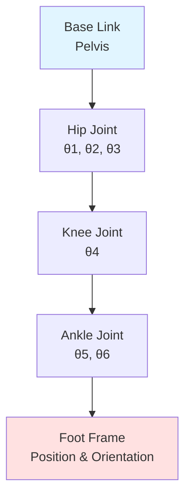
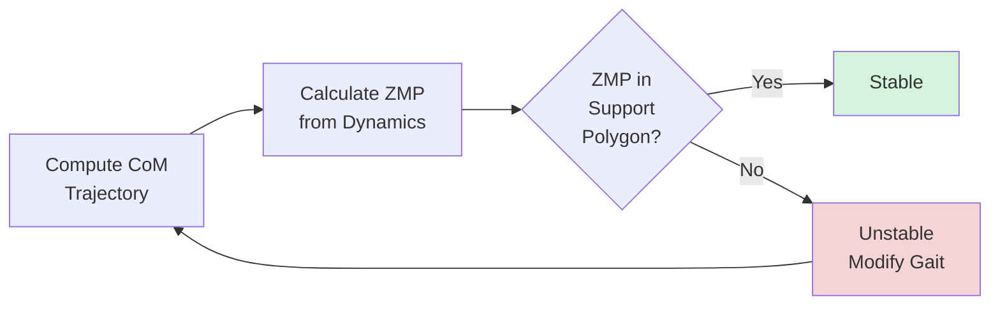

# Humanoid Kinematics and Balance Control

Walking is deceptively hard. Every step a humanoid takes requires solving inverse kinematics for multiple limbs simultaneously, predicting center-of-mass trajectories, and maintaining dynamic balance against gravity—all in real-time. When Boston Dynamics' Atlas performs a backflip, it's not just impressive choreography; it's millisecond-precision control of 28 degrees of freedom orchestrated through layers of kinematic transforms, ZMP constraints, and adaptive feedback loops.

> **By the end of this chapter, you will:**
> - Implement forward and inverse kinematics solvers for humanoid leg chains
> - Apply Zero Moment Point (ZMP) theory to maintain bipedal balance
> - Generate stable walking gaits using trajectory optimization
> - Debug common kinematic singularities and joint limit violations

## Forward Kinematics: From Joints to Position

Forward kinematics (FK) answers: "Given joint angles, where is the foot?" For a humanoid leg with hip (3 DOF), knee (1 DOF), and ankle (2 DOF), FK chains these transforms using the Denavit-Hartenberg convention or product-of-exponentials formulation.



The homogeneous transform from base to end-effector is:

```
T_base_foot = T_hip * T_knee * T_ankle
```

Each joint contributes a rotation matrix R(θ_i) and translation d_i:

```python
import numpy as np
from scipy.spatial.transform import Rotation

class HumanoidLegFK:
    """Forward kinematics for 6-DOF humanoid leg."""

    def __init__(self, link_lengths: dict[str, float]):
        self.l_thigh = link_lengths['thigh']
        self.l_shin = link_lengths['shin']
        self.l_foot = link_lengths['foot']

    def compute_transform(self, joint_angles: np.ndarray) -> tuple[np.ndarray, np.ndarray]:
        """
        Compute foot pose from joint angles.

        Args:
            joint_angles: [hip_yaw, hip_roll, hip_pitch, knee_pitch, ankle_pitch, ankle_roll]

        Returns:
            position: (3,) foot position in base frame
            rotation: (3, 3) foot orientation matrix
        """
        θ = joint_angles

        # Hip transform (3 DOF: yaw, roll, pitch)
        R_hip = (Rotation.from_euler('z', θ[0]) *
                 Rotation.from_euler('x', θ[1]) *
                 Rotation.from_euler('y', θ[2])).as_matrix()

        # Knee transform (1 DOF: pitch)
        R_knee = Rotation.from_euler('y', θ[3]).as_matrix()
        p_knee = R_hip @ np.array([0, 0, -self.l_thigh])

        # Ankle transform (2 DOF: pitch, roll)
        R_ankle = (Rotation.from_euler('y', θ[4]) *
                   Rotation.from_euler('x', θ[5])).as_matrix()
        p_ankle = p_knee + (R_hip @ R_knee) @ np.array([0, 0, -self.l_shin])

        # Final foot position
        R_foot = R_hip @ R_knee @ R_ankle
        p_foot = p_ankle + R_foot @ np.array([0, 0, -self.l_foot])

        return p_foot, R_foot
```

> **NOTE**: Real humanoids like Unitree H1 use URDF files with exact link transforms. Parse these with `urdf_parser_py` or `pinocchio` for production systems.

## Inverse Kinematics: Reaching Target Poses

Inverse kinematics (IK) solves the reverse problem: "What joint angles achieve this foot position?" This is harder—nonlinear, potentially multiple solutions, and subject to joint limits.

The Jacobian-based approach iteratively minimizes error:

```
Δq = J†(q) · (x_target - x_current)
```

where J† is the pseudoinverse of the Jacobian matrix ∂x/∂q.

```python
from typing import Optional

class HumanoidLegIK:
    """Iterative inverse kinematics solver."""

    def __init__(self, fk_solver: HumanoidLegFK):
        self.fk = fk_solver

    def solve(
        self,
        target_pos: np.ndarray,
        target_rot: Optional[np.ndarray] = None,
        q_init: Optional[np.ndarray] = None,
        max_iter: int = 100,
        tol: float = 1e-4
    ) -> tuple[np.ndarray, bool]:
        """
        Solve IK using damped least squares.

        Returns:
            joint_angles: Solution configuration
            success: Whether convergence criteria met
        """
        q = q_init if q_init is not None else np.zeros(6)
        λ = 0.01  # Damping factor

        for _ in range(max_iter):
            pos_current, rot_current = self.fk.compute_transform(q)

            # Position error
            δp = target_pos - pos_current

            # Orientation error (if target_rot provided)
            if target_rot is not None:
                δR = target_rot @ rot_current.T
                δω = self._rotation_error(δR)
                error = np.concatenate([δp, δω])
            else:
                error = δp

            if np.linalg.norm(error) < tol:
                return q, True

            # Numerical Jacobian
            J = self._compute_jacobian(q, target_rot is not None)

            # Damped least squares update
            δq = J.T @ np.linalg.inv(J @ J.T + λ**2 * np.eye(J.shape[0])) @ error
            q += δq

            # Enforce joint limits
            q = self._clamp_joint_limits(q)

        return q, False

    def _compute_jacobian(self, q: np.ndarray, full_pose: bool) -> np.ndarray:
        """Numerical Jacobian via finite differences."""
        ε = 1e-6
        n_dof = len(q)
        n_task = 6 if full_pose else 3
        J = np.zeros((n_task, n_dof))

        for i in range(n_dof):
            q_plus = q.copy()
            q_plus[i] += ε
            pos_plus, rot_plus = self.fk.compute_transform(q_plus)
            pos, rot = self.fk.compute_transform(q)

            J[:3, i] = (pos_plus - pos) / ε

            if full_pose:
                δR = rot_plus @ rot.T
                J[3:, i] = self._rotation_error(δR) / ε

        return J

    @staticmethod
    def _rotation_error(R: np.ndarray) -> np.ndarray:
        """Convert rotation matrix to axis-angle error."""
        angle = np.arccos(np.clip((np.trace(R) - 1) / 2, -1, 1))
        if angle < 1e-6:
            return np.zeros(3)
        axis = np.array([R[2,1] - R[1,2], R[0,2] - R[2,0], R[1,0] - R[0,1]])
        return angle / (2 * np.sin(angle)) * axis

    @staticmethod
    def _clamp_joint_limits(q: np.ndarray) -> np.ndarray:
        """Example joint limits for humanoid leg."""
        limits = np.array([
            [-0.5, 0.5],   # hip yaw
            [-0.4, 0.4],   # hip roll
            [-1.5, 0.5],   # hip pitch
            [0.0, 2.3],    # knee pitch
            [-0.7, 0.7],   # ankle pitch
            [-0.3, 0.3]    # ankle roll
        ])
        return np.clip(q, limits[:, 0], limits[:, 1])
```

> **WARNING**: IK can fail near singularities (e.g., fully extended knee). Always check the success flag and implement fallback behaviors like replanning or emergency stops.

## Zero Moment Point: The Balance Criterion

The Zero Moment Point (ZMP) is where the ground reaction force's moment is zero. For stable walking, the ZMP must stay inside the support polygon (footprint area). If it exits, the robot tips over.



Given center-of-mass (CoM) position r_com and total mass m, the ZMP position is:

```
p_zmp = r_com - (h_com / (g + z_ddot_com)) * [x_ddot_com; y_ddot_com]
```

where h_com is CoM height and g is gravity.

```python
import numpy as np

class ZMPBalanceController:
    """ZMP-based balance verification and control."""

    def __init__(self, g: float = 9.81):
        self.g = g

    def compute_zmp(
        self,
        com_pos: np.ndarray,
        com_acc: np.ndarray,
        com_height: float
    ) -> np.ndarray:
        """
        Calculate ZMP from CoM dynamics.

        Args:
            com_pos: (x, y, z) center of mass position
            com_acc: (ax, ay, az) CoM acceleration
            com_height: Height above ground

        Returns:
            (x_zmp, y_zmp) ZMP position
        """
        denominator = self.g + com_acc[2]

        if abs(denominator) < 1e-3:
            raise ValueError("Near-zero vertical acceleration, ZMP undefined")

        zmp_x = com_pos[0] - (com_height / denominator) * com_acc[0]
        zmp_y = com_pos[1] - (com_height / denominator) * com_acc[1]

        return np.array([zmp_x, zmp_y])

    def is_stable(
        self,
        zmp: np.ndarray,
        foot_corners: list[np.ndarray],
        margin: float = 0.01
    ) -> bool:
        """
        Check if ZMP is inside support polygon.

        Args:
            zmp: (x, y) ZMP position
            foot_corners: List of (x, y) polygon vertices (convex hull)
            margin: Safety margin (meters)

        Returns:
            True if ZMP is safely inside support region
        """
        from scipy.spatial import ConvexHull

        hull = ConvexHull(foot_corners)

        # Shrink polygon by margin
        centroid = np.mean(foot_corners, axis=0)
        shrunk_corners = []
        for corner in foot_corners:
            direction = corner - centroid
            shrunk = corner - margin * direction / np.linalg.norm(direction)
            shrunk_corners.append(shrunk)

        # Point-in-polygon test
        hull_shrunk = ConvexHull(shrunk_corners)
        return self._point_in_convex_hull(zmp, hull_shrunk)

    @staticmethod
    def _point_in_convex_hull(point: np.ndarray, hull: ConvexHull) -> bool:
        """Check if point is inside convex hull."""
        for eq in hull.equations:
            if np.dot(eq[:-1], point) + eq[-1] > 0:
                return False
        return True
```

> **TIP**: Modern humanoids like Figure 01 use model-predictive control (MPC) to plan ZMP trajectories 0.5-1.0 seconds ahead, enabling dynamic maneuvers beyond simple walking.

## Gait Generation: Putting It Together

A walking gait combines FK, IK, and ZMP control into a cyclic trajectory. The standard approach: define foot swing trajectories, solve IK per timestep, verify ZMP stability.

```python
from dataclasses import dataclass
import numpy as np
from typing import Iterator

@dataclass
class GaitParameters:
    step_length: float = 0.2      # meters
    step_height: float = 0.05     # meters
    step_duration: float = 0.6    # seconds
    double_support: float = 0.1   # seconds
    com_height: float = 0.8       # meters

class SimpleWalkingGait:
    """Generate stable walking trajectories."""

    def __init__(self, params: GaitParameters):
        self.params = params
        self.ik_left = HumanoidLegIK(HumanoidLegFK({
            'thigh': 0.3, 'shin': 0.3, 'foot': 0.05
        }))
        self.ik_right = HumanoidLegIK(HumanoidLegFK({
            'thigh': 0.3, 'shin': 0.3, 'foot': 0.05
        }))
        self.zmp_ctrl = ZMPBalanceController()

    def generate_step_trajectory(
        self,
        start_pos: np.ndarray,
        end_pos: np.ndarray,
        duration: float,
        dt: float = 0.01
    ) -> Iterator[np.ndarray]:
        """Generate swing foot trajectory using cubic spline."""
        n_samples = int(duration / dt)

        for i in range(n_samples):
            t = i / (n_samples - 1)  # 0 to 1

            # Cubic interpolation for horizontal
            pos_xy = start_pos[:2] + t * (end_pos[:2] - start_pos[:2])

            # Parabolic arc for height
            height = start_pos[2] + 4 * self.params.step_height * t * (1 - t)

            yield np.array([pos_xy[0], pos_xy[1], height])

    def walk_forward(self, n_steps: int, dt: float = 0.01) -> Iterator[dict]:
        """
        Generate walking motion.

        Yields:
            Dictionary with joint angles and ZMP info per timestep
        """
        left_pos = np.array([0.0, 0.1, 0.0])
        right_pos = np.array([0.0, -0.1, 0.0])
        com_pos = np.array([0.0, 0.0, self.params.com_height])

        for step in range(n_steps):
            # Alternate swing leg
            if step % 2 == 0:  # Right leg swings
                target_pos = right_pos + np.array([self.params.step_length, 0, 0])

                for swing_pos in self.generate_step_trajectory(
                    right_pos, target_pos, self.params.step_duration, dt
                ):
                    q_left, _ = self.ik_left.solve(left_pos)
                    q_right, _ = self.ik_right.solve(swing_pos)

                    # Approximate CoM motion
                    com_pos[0] += (self.params.step_length / 2) * dt / self.params.step_duration
                    com_acc = np.array([0.1, 0, 0])  # Simplified

                    zmp = self.zmp_ctrl.compute_zmp(com_pos, com_acc, self.params.com_height)

                    yield {
                        'left_joints': q_left,
                        'right_joints': q_right,
                        'zmp': zmp,
                        'com': com_pos.copy(),
                        'timestamp': step * self.params.step_duration + (swing_pos[0] - right_pos[0]) / self.params.step_length * self.params.step_duration
                    }

                right_pos = target_pos

            else:  # Left leg swings
                target_pos = left_pos + np.array([self.params.step_length, 0, 0])

                for swing_pos in self.generate_step_trajectory(
                    left_pos, target_pos, self.params.step_duration, dt
                ):
                    q_left, _ = self.ik_left.solve(swing_pos)
                    q_right, _ = self.ik_right.solve(right_pos)

                    com_pos[0] += (self.params.step_length / 2) * dt / self.params.step_duration
                    com_acc = np.array([0.1, 0, 0])

                    zmp = self.zmp_ctrl.compute_zmp(com_pos, com_acc, self.params.com_height)

                    yield {
                        'left_joints': q_left,
                        'right_joints': q_right,
                        'zmp': zmp,
                        'com': com_pos.copy(),
                        'timestamp': step * self.params.step_duration + (swing_pos[0] - left_pos[0]) / self.params.step_length * self.params.step_duration
                    }

                left_pos = target_pos
```

> **IMPORTANT**: This simplified gait assumes flat ground. Production systems need terrain adaptation, force feedback, and whole-body optimization. Libraries like `pinocchio` and `drake` provide industrial-strength implementations.

## Integration with ROS2

Deploy this on real hardware using ROS2 control interfaces:

```bash
# Install dependencies
sudo apt install ros-humble-control-toolbox ros-humble-realtime-tools
pip install pinocchio scipy
```

```python
import rclpy
from rclpy.node import Node
from sensor_msgs.msg import JointState
from geometry_msgs.msg import Point

class HumanoidWalkingNode(Node):
    """ROS2 node for humanoid walking control."""

    def __init__(self):
        super().__init__('humanoid_walker')

        self.joint_pub = self.create_publisher(
            JointState, '/joint_commands', 10
        )
        self.zmp_pub = self.create_publisher(
            Point, '/zmp_position', 10
        )

        self.gait = SimpleWalkingGait(GaitParameters())
        self.timer = self.create_timer(0.01, self.control_loop)
        self.gait_iterator = self.gait.walk_forward(n_steps=10)

    def control_loop(self):
        """Publish joint commands at 100 Hz."""
        try:
            state = next(self.gait_iterator)

            # Publish joint commands
            joint_msg = JointState()
            joint_msg.header.stamp = self.get_clock().now().to_msg()
            joint_msg.name = [
                'l_hip_yaw', 'l_hip_roll', 'l_hip_pitch',
                'l_knee_pitch', 'l_ankle_pitch', 'l_ankle_roll',
                'r_hip_yaw', 'r_hip_roll', 'r_hip_pitch',
                'r_knee_pitch', 'r_ankle_pitch', 'r_ankle_roll'
            ]
            joint_msg.position = list(state['left_joints']) + list(state['right_joints'])
            self.joint_pub.publish(joint_msg)

            # Publish ZMP for monitoring
            zmp_msg = Point(x=state['zmp'][0], y=state['zmp'][1], z=0.0)
            self.zmp_pub.publish(zmp_msg)

        except StopIteration:
            self.get_logger().info('Gait sequence completed')
            self.timer.cancel()

def main():
    rclpy.init()
    node = HumanoidWalkingNode()
    rclpy.spin(node)
    node.destroy_node()
    rclpy.shutdown()
```

> **Key Takeaways**
> - Forward kinematics chains transforms through joints; inverse kinematics uses Jacobian-based iteration to solve for joint angles achieving target poses
> - Zero Moment Point must stay inside the support polygon for stable balance; compute ZMP from CoM acceleration and height
> - Walking gaits combine swing-leg trajectories (cubic splines), stance-leg IK solutions, and ZMP verification at each timestep
> - Damped least-squares IK prevents instability near singularities; always enforce joint limits and check convergence
> - Real humanoids use model-predictive control to plan ZMP trajectories 0.5-1s ahead, enabling dynamic maneuvers
> - ROS2 control interfaces publish joint commands at 100+ Hz; separate planning (1-10 Hz) from execution (100-1000 Hz)
> - Production systems require whole-body optimization considering torque limits, ground contact forces, and terrain geometry
> - Use libraries like Pinocchio or Drake for validated implementations with analytical Jacobians and efficient dynamics

## Further Reading

- [Humanoid Robotics: A Reference (Kajita et al.)](https://www.springer.com/gp/book/9783642545351) — Comprehensive treatment of ZMP theory, preview control, and gait generation from AIST researchers
- [Pinocchio: Fast Forward and Inverse Dynamics](https://github.com/stack-of-tasks/pinocchio) — High-performance C++ library with Python bindings for robot kinematics and dynamics
- [Introduction to Humanoid Robotics (Kajita & Espiau)](https://arxiv.org/abs/0812.4214) — Tutorial paper covering ZMP fundamentals and preview control methods

## Assessment

#### Multiple Choice Questions

**Q1 (Easy)**: What does forward kinematics compute for a robot arm?
- A) Joint angles from a desired end-effector position
- B) End-effector position and orientation from joint angles
- C) The ZMP location for balance control
- D) Optimal gait trajectory for walking

<details>
<summary>Answer</summary>
**B)** — Forward kinematics maps from joint space (angles) to task space (Cartesian position/orientation) by chaining transforms through the kinematic tree.
</details>

**Q2 (Medium)**: Why might inverse kinematics fail to find a solution?
- A) The target position is outside the robot's reachable workspace
- B) The robot is near a kinematic singularity
- C) Joint limits prevent reaching the target configuration
- D) All of the above

<details>
<summary>Answer</summary>
**D)** — IK can fail due to workspace limits (target unreachable), singularities (Jacobian rank deficiency), or joint constraints. Always check the success flag and implement fallback behaviors.
</details>

**Q3 (Medium)**: What happens if the Zero Moment Point moves outside the support polygon?
- A) The robot will tip over
- B) Energy efficiency decreases but balance is maintained
- C) The gait automatically adjusts to restore stability
- D) Joint torques increase to compensate

<details>
<summary>Answer</summary>
**A)** — When ZMP exits the support polygon, the ground reaction force cannot counteract gravitational and inertial moments, causing the robot to tip. Control systems must modify the gait to keep ZMP inside the footprint.
</details>

**Q4 (Hard)**: In damped least-squares IK, what role does the damping factor λ play?
- A) It speeds up convergence for well-conditioned Jacobians
- B) It prevents large joint velocities near singularities by regularizing the pseudoinverse
- C) It directly constrains joint angles to stay within limits
- D) It adjusts the ZMP position for balance

<details>
<summary>Answer</summary>
**B)** — The damping factor λ regularizes the Jacobian pseudoinverse $(J^T J + \lambda^2 I)^{-1}$, preventing numerical instability and large joint velocities when the Jacobian becomes ill-conditioned near singularities.
</details>

#### Coding Exercises

**Exercise 1**: Extend the `HumanoidLegFK` class to include a visualization method that plots the leg skeleton in 3D using matplotlib. Show joint positions and link connections.

```python
import matplotlib.pyplot as plt
from mpl_toolkits.mplot3d import Axes3D

# Add this method to HumanoidLegFK class
def visualize(self, joint_angles: np.ndarray) -> None:
    """Plot 3D skeleton of leg configuration."""
    # TODO: Implement visualization
    pass
```

<details>
<summary>Solution</summary>

```python
def visualize(self, joint_angles: np.ndarray) -> None:
    """Plot 3D skeleton of leg configuration."""
    θ = joint_angles

    # Compute intermediate joint positions
    positions = [np.array([0, 0, 0])]  # Base (pelvis)

    # Hip
    R_hip = (Rotation.from_euler('z', θ[0]) *
             Rotation.from_euler('x', θ[1]) *
             Rotation.from_euler('y', θ[2])).as_matrix()
    positions.append(positions[-1])  # Hip at pelvis

    # Knee
    p_knee = R_hip @ np.array([0, 0, -self.l_thigh])
    positions.append(p_knee)

    # Ankle
    R_knee = Rotation.from_euler('y', θ[3]).as_matrix()
    p_ankle = p_knee + (R_hip @ R_knee) @ np.array([0, 0, -self.l_shin])
    positions.append(p_ankle)

    # Foot
    R_ankle = (Rotation.from_euler('y', θ[4]) *
               Rotation.from_euler('x', θ[5])).as_matrix()
    R_foot = R_hip @ R_knee @ R_ankle
    p_foot = p_ankle + R_foot @ np.array([0, 0, -self.l_foot])
    positions.append(p_foot)

    # Plot
    fig = plt.figure(figsize=(8, 8))
    ax = fig.add_subplot(111, projection='3d')

    positions = np.array(positions)
    ax.plot(positions[:, 0], positions[:, 1], positions[:, 2],
            'o-', linewidth=3, markersize=8, label='Leg Chain')
    ax.scatter([0], [0], [0], c='red', s=100, label='Base')
    ax.scatter([p_foot[0]], [p_foot[1]], [p_foot[2]],
               c='green', s=100, label='Foot')

    ax.set_xlabel('X (m)')
    ax.set_ylabel('Y (m)')
    ax.set_zlabel('Z (m)')
    ax.legend()
    ax.set_title('Humanoid Leg Configuration')
    plt.show()
```

</details>

**Exercise 2**: Implement a function that validates whether a sequence of joint configurations is collision-free by checking if any link passes through the ground plane (z < 0).

```python
def is_collision_free(
    fk_solver: HumanoidLegFK,
    joint_trajectory: list[np.ndarray]
) -> bool:
    """Check if trajectory avoids ground collision."""
    # TODO: Implement collision checking
    pass
```

<details>
<summary>Solution</summary>

```python
def is_collision_free(
    fk_solver: HumanoidLegFK,
    joint_trajectory: list[np.ndarray],
    ground_clearance: float = 0.01
) -> bool:
    """
    Check if trajectory avoids ground collision.

    Args:
        fk_solver: Forward kinematics instance
        joint_trajectory: List of joint configurations
        ground_clearance: Minimum allowed height above ground

    Returns:
        True if all intermediate link positions are above ground
    """
    for joint_angles in joint_trajectory:
        θ = joint_angles

        # Check all link positions
        positions_to_check = []

        # Knee position
        R_hip = (Rotation.from_euler('z', θ[0]) *
                 Rotation.from_euler('x', θ[1]) *
                 Rotation.from_euler('y', θ[2])).as_matrix()
        p_knee = R_hip @ np.array([0, 0, -fk_solver.l_thigh])
        positions_to_check.append(p_knee)

        # Ankle position
        R_knee = Rotation.from_euler('y', θ[3]).as_matrix()
        p_ankle = p_knee + (R_hip @ R_knee) @ np.array([0, 0, -fk_solver.l_shin])
        positions_to_check.append(p_ankle)

        # Foot position
        p_foot, _ = fk_solver.compute_transform(joint_angles)
        positions_to_check.append(p_foot)

        # Check ground clearance
        for pos in positions_to_check:
            if pos[2] < ground_clearance:
                return False

    return True
```

</details>

#### Mini-Project

**Adaptive Terrain Walking**: Extend the `SimpleWalkingGait` class to handle sloped terrain. Modify the IK solver to accept different target heights for each foot, implement a slope-detection function that adjusts step height and duration, and visualize the resulting gait with matplotlib showing both foot trajectories and ZMP trace. Test on slopes up to 10 degrees.

**Requirements**:
1. Add `terrain_slope: float` parameter to `GaitParameters`
2. Modify `generate_step_trajectory` to compute target foot position based on terrain height
3. Implement `compute_terrain_height(x: float, y: float, slope: float) -> float`
4. Adjust ZMP computation to account for inclined support polygon
5. Create visualization showing: foot paths, ZMP trajectory, terrain surface, stability margins

**Deliverables**:
- Modified `GaitParameters` dataclass with terrain parameters
- Updated `SimpleWalkingGait.walk_forward()` method
- Test script demonstrating stable walking on 5° and 10° slopes
- Plot comparing ZMP trajectories for flat vs. sloped terrain
