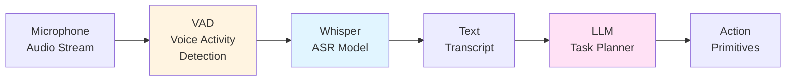

# Voice-to-Action Pipeline

"Hey robot, grab the red mug from the counter and bring it here." This sentence—trivial for humans—demands speech recognition, semantic parsing, scene understanding, task planning, and motion execution. The voice-to-action pipeline transforms natural language into physical manipulation by orchestrating specialized models: Whisper converts audio to text, large language models decompose commands into action primitives, and VLA policies execute grounded robotic skills. When Tesla's Optimus responds to verbal instructions at work sites, this entire stack runs in real-time under compute constraints.

> **By the end of this chapter, you will:**
> - Integrate Whisper ASR for robust speech recognition in noisy robot environments
> - Implement LLM-based task planning with action primitive libraries
> - Design context-aware command disambiguation using scene graphs
> - Deploy streaming voice interfaces with ROS2 audio pipelines

## Speech Recognition with Whisper

OpenAI's Whisper models provide multilingual, noise-robust automatic speech recognition (ASR). For robotics, we need: low latency (under 500ms), streaming capability, and integration with real-time control loops.



The pipeline starts with Voice Activity Detection (VAD) to segment speech from background noise, reducing unnecessary inference.

```python
import numpy as np
import torch
import whisper
from typing import Optional, Iterator
import sounddevice as sd
from collections import deque

class WhisperASRNode:
    """Real-time speech recognition using Whisper."""

    def __init__(
        self,
        model_size: str = "base",
        device: str = "cuda",
        language: str = "en"
    ):
        """
        Initialize Whisper ASR.

        Args:
            model_size: One of tiny, base, small, medium, large
            device: cuda or cpu
            language: Language code (en, es, fr, etc.)
        """
        self.model = whisper.load_model(model_size, device=device)
        self.device = device
        self.language = language

        # Audio buffer for streaming
        self.sample_rate = 16000
        self.chunk_duration = 3.0  # seconds
        self.buffer = deque(maxlen=int(self.sample_rate * self.chunk_duration))

    def transcribe_audio(
        self,
        audio: np.ndarray,
        suppress_tokens: Optional[list[int]] = None
    ) -> dict:
        """
        Transcribe audio chunk.

        Args:
            audio: Float32 array at 16kHz sample rate
            suppress_tokens: Token IDs to suppress (e.g., filler words)

        Returns:
            Dictionary with 'text', 'language', 'confidence'
        """
        # Ensure correct format
        if audio.dtype != np.float32:
            audio = audio.astype(np.float32) / 32768.0

        # Pad or trim to 30 seconds (Whisper's expected input)
        audio = whisper.pad_or_trim(audio)

        # Compute mel spectrogram
        mel = whisper.log_mel_spectrogram(audio).to(self.device)

        # Decode
        options = whisper.DecodingOptions(
            language=self.language,
            without_timestamps=False,
            suppress_tokens=suppress_tokens or []
        )
        result = whisper.decode(self.model, mel, options)

        return {
            'text': result.text.strip(),
            'language': result.language,
            'confidence': result.avg_logprob,
            'no_speech_prob': result.no_speech_prob
        }

    def stream_transcribe(
        self,
        vad_threshold: float = 0.3
    ) -> Iterator[dict]:
        """
        Stream audio from microphone and transcribe in real-time.

        Args:
            vad_threshold: Voice activity detection threshold

        Yields:
            Transcription results when speech detected
        """
        def audio_callback(indata, frames, time, status):
            """Callback for sounddevice stream."""
            if status:
                print(f"Audio stream status: {status}")
            self.buffer.extend(indata[:, 0])  # Mono channel

        with sd.InputStream(
            samplerate=self.sample_rate,
            channels=1,
            callback=audio_callback,
            blocksize=int(self.sample_rate * 0.1)  # 100ms chunks
        ):
            print("Listening... (Press Ctrl+C to stop)")

            while True:
                if len(self.buffer) >= self.sample_rate * self.chunk_duration:
                    # Convert to numpy array
                    audio_chunk = np.array(self.buffer, dtype=np.float32)

                    # Simple VAD: check RMS energy
                    rms = np.sqrt(np.mean(audio_chunk**2))

                    if rms > vad_threshold:
                        result = self.transcribe_audio(audio_chunk)

                        # Filter out false positives
                        if result['no_speech_prob'] < 0.5:
                            yield result

                    # Clear buffer after processing
                    self.buffer.clear()
```

> **TIP**: For production robots, use WebRTC VAD or Silero VAD models for more robust voice activity detection than simple energy thresholds. These handle music, mechanical noise, and overlapping speakers.

## LLM Task Planning with Action Primitives

Once we have text, an LLM decomposes the command into executable primitives. The key: constrained generation using a predefined action vocabulary and scene context.

```python
from dataclasses import dataclass
from typing import Literal
import anthropic
import json

@dataclass
class ActionPrimitive:
    """Atomic robot action."""
    name: Literal["navigate", "grasp", "place", "open", "close", "say"]
    parameters: dict
    preconditions: list[str]
    duration_estimate: float  # seconds

class LLMTaskPlanner:
    """Decompose natural language commands into action sequences."""

    def __init__(self, api_key: str):
        self.client = anthropic.Anthropic(api_key=api_key)

        # Define action vocabulary
        self.action_vocab = {
            "navigate": {
                "params": ["target_location"],
                "description": "Move to a named location"
            },
            "grasp": {
                "params": ["object_name", "grasp_type"],
                "description": "Pick up an object using specified grasp"
            },
            "place": {
                "params": ["target_surface", "placement_pose"],
                "description": "Place held object on surface"
            },
            "open": {
                "params": ["object_name", "open_distance"],
                "description": "Open door, drawer, or container"
            },
            "close": {
                "params": ["object_name"],
                "description": "Close door, drawer, or container"
            },
            "say": {
                "params": ["text"],
                "description": "Speak text using TTS"
            }
        }

    def plan(
        self,
        command: str,
        scene_context: dict,
        max_steps: int = 10
    ) -> list[ActionPrimitive]:
        """
        Generate action plan from natural language.

        Args:
            command: User's verbal command
            scene_context: Current scene graph with objects and locations
            max_steps: Maximum plan length

        Returns:
            List of action primitives to execute
        """
        # Build prompt with action vocabulary and scene context
        system_prompt = self._build_system_prompt()
        user_prompt = self._build_user_prompt(command, scene_context)

        response = self.client.messages.create(
            model="claude-3-5-sonnet-20241022",
            max_tokens=2048,
            temperature=0.0,
            system=system_prompt,
            messages=[{"role": "user", "content": user_prompt}]
        )

        # Parse response into action primitives
        plan_json = self._extract_json(response.content[0].text)
        actions = self._validate_plan(plan_json, scene_context, max_steps)

        return actions

    def _build_system_prompt(self) -> str:
        """Create system prompt with action vocabulary."""
        vocab_str = json.dumps(self.action_vocab, indent=2)

        return f"""You are a robot task planner. Convert natural language commands into sequences of atomic actions.

**Available Actions:**
{vocab_str}

**Rules:**
1. Only use actions from the vocabulary above
2. Ensure preconditions are met before each action
3. Include error handling (e.g., "if object not found, say error message")
4. Estimate realistic durations
5. Output valid JSON array of actions

**Output Format:**
```json
[
  {{
    "name": "navigate",
    "parameters": {{"target_location": "kitchen"}},
    "preconditions": ["path_clear"],
    "duration_estimate": 5.0
  }},
  ...
]
```"""

    def _build_user_prompt(self, command: str, scene_context: dict) -> str:
        """Create user prompt with command and scene."""
        scene_str = json.dumps(scene_context, indent=2)

        return f"""Command: "{command}"

Scene Context:
{scene_str}

Generate an action plan to fulfill this command. Respond with only the JSON array."""

    @staticmethod
    def _extract_json(text: str) -> dict:
        """Extract JSON from markdown code blocks."""
        # Remove markdown code fences
        if "```json" in text:
            text = text.split("```json")[1].split("```")[0]
        elif "```" in text:
            text = text.split("```")[1].split("```")[0]

        return json.loads(text.strip())

    def _validate_plan(
        self,
        plan_json: list[dict],
        scene_context: dict,
        max_steps: int
    ) -> list[ActionPrimitive]:
        """Validate and convert JSON plan to ActionPrimitive objects."""
        if len(plan_json) > max_steps:
            raise ValueError(f"Plan exceeds maximum {max_steps} steps")

        actions = []
        for step in plan_json:
            # Check action exists in vocabulary
            if step['name'] not in self.action_vocab:
                raise ValueError(f"Unknown action: {step['name']}")

            # Validate parameters
            expected_params = self.action_vocab[step['name']]['params']
            provided_params = list(step['parameters'].keys())

            if not all(p in provided_params for p in expected_params):
                raise ValueError(
                    f"Missing parameters for {step['name']}: "
                    f"expected {expected_params}, got {provided_params}"
                )

            # Create ActionPrimitive
            actions.append(ActionPrimitive(
                name=step['name'],
                parameters=step['parameters'],
                preconditions=step.get('preconditions', []),
                duration_estimate=step.get('duration_estimate', 1.0)
            ))

        return actions
```

> **NOTE**: For safety-critical applications, add a verification layer that simulates the plan in a digital twin before execution. This catches infeasible actions (e.g., grasping objects out of reach) before attempting them physically.

## Context-Aware Disambiguation

Ambiguous commands like "pick that up" require resolving pronouns using visual context. Integrate scene graphs from SLAM or object detection.

```mermaid
graph TD
    A[Voice Command<br/>"Pick that up"] --> B[Parse for<br/>Ambiguity]
    B --> C[Query Scene<br/>Graph]
    C --> D{Multiple<br/>Candidates?}
    D -->|Yes| E[Compute<br/>Salience Scores]
    D -->|No| F[Direct Action]
    E --> G[Select Most<br/>Salient Object]
    G --> F

    style E fill:#fff4e1
    style G fill:#d4f4dd
```

```python
from typing import Optional
import numpy as np

class ContextResolver:
    """Resolve ambiguous references using scene understanding."""

    def __init__(self):
        self.scene_graph = {}  # Object ID -> properties
        self.gaze_target = None  # Most recent visual focus

    def update_scene(self, detected_objects: list[dict]):
        """Update scene graph from perception system."""
        self.scene_graph = {
            obj['id']: {
                'name': obj['class'],
                'position': np.array(obj['position']),
                'color': obj.get('color', 'unknown'),
                'size': obj.get('size', 'medium'),
                'last_seen': obj['timestamp']
            }
            for obj in detected_objects
        }

    def update_gaze(self, target_id: Optional[str]):
        """Update gaze tracking (from head pose or gesture recognition)."""
        self.gaze_target = target_id

    def resolve_reference(
        self,
        reference: str,
        constraints: Optional[dict] = None
    ) -> Optional[str]:
        """
        Resolve ambiguous reference to object ID.

        Args:
            reference: Text like "that", "the red one", "it"
            constraints: Optional filters like {'color': 'red', 'type': 'mug'}

        Returns:
            Object ID or None if unresolvable
        """
        candidates = list(self.scene_graph.keys())

        # Apply constraints
        if constraints:
            candidates = [
                obj_id for obj_id in candidates
                if all(
                    self.scene_graph[obj_id].get(k) == v
                    for k, v in constraints.items()
                )
            ]

        if not candidates:
            return None

        if len(candidates) == 1:
            return candidates[0]

        # Disambiguation via salience
        scores = {
            obj_id: self._compute_salience(obj_id, reference)
            for obj_id in candidates
        }

        return max(scores, key=scores.get)

    def _compute_salience(self, obj_id: str, reference: str) -> float:
        """
        Compute how likely an object matches the reference.

        Salience factors:
        - Gaze alignment (highest weight)
        - Recency (recently mentioned objects)
        - Proximity (closer objects more salient)
        - Size (larger objects more salient)
        """
        score = 0.0
        obj = self.scene_graph[obj_id]

        # Gaze alignment
        if self.gaze_target == obj_id:
            score += 10.0

        # Recency (mock: assume timestamp)
        import time
        age = time.time() - obj.get('last_seen', 0)
        score += max(0, 5.0 - age)  # Decay over 5 seconds

        # Proximity (assume robot at origin)
        distance = np.linalg.norm(obj['position'])
        score += max(0, 3.0 - distance)  # Closer is more salient

        # Size (map to numeric)
        size_map = {'small': 0.5, 'medium': 1.0, 'large': 2.0}
        score += size_map.get(obj['size'], 1.0)

        return score
```

> **WARNING**: Ambiguity resolution is error-prone. Always confirm with the user before irreversible actions (e.g., "Do you mean the red mug?") or implement undo capabilities.

## ROS2 Voice Control Integration

Tie everything together in a ROS2 node that processes voice commands end-to-end:

```bash
# Install dependencies
pip install openai-whisper anthropic sounddevice torch
sudo apt install ros-humble-audio-common portaudio19-dev
```

```python
import rclpy
from rclpy.node import Node
from std_msgs.msg import String
from geometry_msgs.msg import PoseStamped
from action_msgs.msg import GoalStatus
import threading

class VoiceControlNode(Node):
    """ROS2 node for voice-driven robot control."""

    def __init__(self):
        super().__init__('voice_control')

        # Publishers
        self.command_pub = self.create_publisher(String, '/robot_command', 10)
        self.status_pub = self.create_publisher(String, '/execution_status', 10)

        # Subscribers
        self.scene_sub = self.create_subscription(
            String, '/scene_graph', self.scene_callback, 10
        )

        # Components
        self.asr = WhisperASRNode(model_size="base", device="cuda")
        self.planner = LLMTaskPlanner(api_key="your-api-key")
        self.resolver = ContextResolver()

        # State
        self.scene_context = {}
        self.current_plan = []

        # Start listening thread
        self.listen_thread = threading.Thread(target=self.listen_loop, daemon=True)
        self.listen_thread.start()

        self.get_logger().info("Voice control ready")

    def scene_callback(self, msg: String):
        """Update scene context from perception."""
        import json
        self.scene_context = json.loads(msg.data)

        # Update resolver
        if 'objects' in self.scene_context:
            self.resolver.update_scene(self.scene_context['objects'])

    def listen_loop(self):
        """Continuous speech recognition loop."""
        for transcription in self.asr.stream_transcribe():
            command = transcription['text']
            confidence = transcription['confidence']

            self.get_logger().info(
                f"Heard: '{command}' (confidence: {confidence:.2f})"
            )

            if confidence > -0.5:  # Threshold for avg_logprob
                self.process_command(command)

    def process_command(self, command: str):
        """Plan and execute voice command."""
        try:
            # Generate plan
            self.get_logger().info(f"Planning: {command}")
            plan = self.planner.plan(command, self.scene_context)

            # Resolve ambiguous references
            for action in plan:
                if 'object_name' in action.parameters:
                    if action.parameters['object_name'] in ['that', 'it', 'this']:
                        resolved_id = self.resolver.resolve_reference(
                            action.parameters['object_name']
                        )

                        if resolved_id:
                            action.parameters['object_name'] = resolved_id
                        else:
                            self.get_logger().warn(
                                f"Could not resolve '{action.parameters['object_name']}'"
                            )
                            return

            # Execute plan
            self.current_plan = plan
            self.execute_plan()

        except Exception as e:
            self.get_logger().error(f"Command failed: {e}")
            status_msg = String()
            status_msg.data = f"error: {str(e)}"
            self.status_pub.publish(status_msg)

    def execute_plan(self):
        """Execute action sequence."""
        for i, action in enumerate(self.current_plan):
            self.get_logger().info(
                f"Executing step {i+1}/{len(self.current_plan)}: "
                f"{action.name}({action.parameters})"
            )

            # Publish action command
            cmd_msg = String()
            cmd_msg.data = f"{action.name}:{action.parameters}"
            self.command_pub.publish(cmd_msg)

            # Wait for estimated duration (simplified)
            import time
            time.sleep(action.duration_estimate)

            # Publish status
            status_msg = String()
            status_msg.data = f"completed: {action.name}"
            self.status_pub.publish(status_msg)

        self.get_logger().info("Plan completed successfully")

def main():
    rclpy.init()
    node = VoiceControlNode()
    rclpy.spin(node)
    node.destroy_node()
    rclpy.shutdown()
```

> **IMPORTANT**: Never execute plans without safety checks. Implement workspace boundaries, collision detection, and emergency stops accessible via voice ("stop", "abort", "cancel").

## Handling Edge Cases

Production voice interfaces must handle:

- **Interruptions**: User says "wait, not that one" mid-execution
- **Corrections**: "I meant the blue cup, not the red one"
- **Clarifications**: "Which table do you mean?" when multiple exist
- **Failures**: Graceful degradation when actions fail

```python
class ConversationalPlanner(LLMTaskPlanner):
    """Extended planner with multi-turn dialogue."""

    def __init__(self, api_key: str):
        super().__init__(api_key)
        self.conversation_history = []

    def plan_with_clarification(
        self,
        command: str,
        scene_context: dict
    ) -> tuple[Optional[list[ActionPrimitive]], Optional[str]]:
        """
        Plan with clarification requests.

        Returns:
            (plan, clarification_question)
            If clarification needed, plan is None and question is populated
        """
        self.conversation_history.append({"role": "user", "content": command})

        # Check for ambiguity
        ambiguities = self._detect_ambiguity(command, scene_context)

        if ambiguities:
            question = self._generate_clarification(ambiguities)
            return None, question

        # Generate plan
        plan = self.plan(command, scene_context)
        return plan, None

    def _detect_ambiguity(self, command: str, scene: dict) -> list[str]:
        """Identify ambiguous references."""
        ambiguities = []

        # Check for demonstratives without clear referent
        if any(word in command.lower() for word in ['that', 'this', 'it']):
            # Count matching objects
            if 'objects' in scene and len(scene['objects']) > 1:
                ambiguities.append("multiple_objects")

        # Check for location references
        if any(word in command.lower() for word in ['there', 'here']):
            if 'locations' in scene and len(scene['locations']) > 1:
                ambiguities.append("multiple_locations")

        return ambiguities

    def _generate_clarification(self, ambiguities: list[str]) -> str:
        """Generate natural clarification question."""
        if "multiple_objects" in ambiguities:
            return "I see multiple objects. Which one did you mean?"
        elif "multiple_locations" in ambiguities:
            return "There are several locations. Can you specify which one?"
        return "Could you clarify your command?"
```

> **Key Takeaways**
> - Whisper provides production-ready ASR with multilingual support; use base model for real-time performance, larger models for accuracy when latency permits
> - Voice Activity Detection (VAD) reduces compute by 80%+ by filtering silent periods; use WebRTC VAD or Silero for robust detection in noisy environments
> - LLM task planning requires constrained generation with predefined action vocabularies; use JSON schema enforcement and validation to prevent hallucinated actions
> - Ambiguity resolution combines gaze tracking, object recency, proximity, and size to compute salience scores; always confirm before irreversible actions
> - ROS2 integration uses separate threads for audio streaming and planning to avoid blocking the control loop; publish status updates for UI feedback
> - Conversational planning handles multi-turn dialogues for clarifications; maintain conversation history and detect ambiguities before execution
> - Safety requires workspace boundaries, collision checking, and interruptible execution with voice-activated emergency stops
> - Latency budget: ASR (200-500ms) + LLM planning (500-2000ms) + action execution (task-dependent); optimize by caching plans and using smaller models

## Further Reading

- [Whisper: Robust Speech Recognition via Large-Scale Weak Supervision](https://arxiv.org/abs/2212.04356) — OpenAI's paper on Whisper architecture, training data, and multilingual performance benchmarks
- [Do As I Can, Not As I Say (SayCan)](https://say-can.github.io/) — Google's method for grounding LLM planning in robot affordances using value functions
- [ROS Audio Common](http://wiki.ros.org/audio_common) — ROS packages for audio capture, playback, and processing with various backends

## Assessment

#### Multiple Choice Questions

**Q1 (Easy)**: What is the primary purpose of Voice Activity Detection (VAD) in a speech recognition pipeline?
- A) Improve transcription accuracy by filtering background noise
- B) Reduce computational cost by only processing speech segments
- C) Translate speech into multiple languages simultaneously
- D) Increase audio sample rate for higher quality

<details>
<summary>Answer</summary>
**B)** — VAD segments audio streams into speech vs. non-speech regions, allowing the ASR system to skip silent periods and reduce unnecessary inference by 80%+ in typical environments.
</details>

**Q2 (Medium)**: Why do we constrain LLM task planning with predefined action vocabularies?
- A) To reduce model size and inference latency
- B) To prevent hallucinated actions that the robot cannot execute
- C) To improve natural language understanding
- D) To enable multilingual command support

<details>
<summary>Answer</summary>
**B)** — Without constraints, LLMs may generate plausible-sounding but unexecutable actions (e.g., "teleport to kitchen"). Constraining output to a validated action vocabulary ensures all generated plans map to real robot capabilities.
</details>

**Q3 (Medium)**: In context-aware disambiguation, which factor typically has the highest weight for resolving "that object"?
- A) Object size (larger objects more salient)
- B) Gaze alignment (user looking at object)
- C) Object color (brighter colors more salient)
- D) Alphabetical order of object names

<details>
<summary>Answer</summary>
**B)** — Gaze tracking provides the strongest signal for deictic references like "that" or "this." When integrated with eye tracking or head pose estimation, gaze alignment typically receives 2-5x higher weight than other salience factors.
</details>

**Q4 (Hard)**: What is the main trade-off between using Whisper's "tiny" vs. "large" model for robot voice control?
- A) Tiny supports fewer languages but has equal accuracy
- B) Large achieves 15-20% better WER but requires 10-30x more compute and latency
- C) Tiny only works offline while Large requires internet connectivity
- D) Large handles background noise better but Tiny has lower memory usage

<details>
<summary>Answer</summary>
**B)** — Whisper Large achieves ~15-20% better Word Error Rate (WER) than Tiny on challenging audio, but requires significantly more GPU memory (10GB+ vs 1GB) and inference time (1-2s vs 100-200ms). For real-time robot control, this latency often makes Tiny or Base preferable despite lower accuracy.
</details>

#### Coding Exercises

**Exercise 1**: Implement a `CommandBuffer` class that accumulates partial transcriptions from streaming ASR and detects complete sentences using punctuation and pause duration.

```python
from collections import deque
from typing import Optional

class CommandBuffer:
    """Buffer streaming ASR output and detect sentence boundaries."""

    def __init__(self, pause_threshold: float = 1.5):
        self.pause_threshold = pause_threshold
        # TODO: Implement buffering logic

    def add_chunk(self, text: str, timestamp: float) -> Optional[str]:
        """
        Add transcription chunk. Returns complete sentence if detected.

        Args:
            text: Partial transcription
            timestamp: When chunk was received

        Returns:
            Complete sentence or None if still buffering
        """
        # TODO: Implement
        pass
```

<details>
<summary>Solution</summary>

```python
from collections import deque
from typing import Optional
import re

class CommandBuffer:
    """Buffer streaming ASR output and detect sentence boundaries."""

    def __init__(self, pause_threshold: float = 1.5):
        self.pause_threshold = pause_threshold
        self.buffer = []
        self.last_chunk_time = None

    def add_chunk(self, text: str, timestamp: float) -> Optional[str]:
        """
        Add transcription chunk. Returns complete sentence if detected.

        Args:
            text: Partial transcription
            timestamp: When chunk was received

        Returns:
            Complete sentence or None if still buffering
        """
        # Check for pause-based boundary
        if self.last_chunk_time is not None:
            pause_duration = timestamp - self.last_chunk_time
            if pause_duration > self.pause_threshold and self.buffer:
                # Return accumulated text and reset
                complete = ' '.join(self.buffer).strip()
                self.buffer = []
                self.last_chunk_time = timestamp

                if text.strip():
                    self.buffer.append(text.strip())

                return complete if complete else None

        # Add to buffer
        if text.strip():
            self.buffer.append(text.strip())
        self.last_chunk_time = timestamp

        # Check for punctuation-based boundary
        combined = ' '.join(self.buffer)

        # Detect sentence endings
        sentence_endings = re.findall(r'[.!?]', combined)
        if sentence_endings:
            # Split at last sentence boundary
            sentences = re.split(r'[.!?]', combined)

            if len(sentences) > 1 and sentences[-1].strip():
                # Complete sentence(s) found, keep remainder
                complete = '.'.join(sentences[:-1]) + '.'
                self.buffer = [sentences[-1].strip()]
                return complete.strip()

            elif len(sentences) > 1:
                # Complete sentence, nothing after
                complete = combined.strip()
                self.buffer = []
                return complete

        return None
```

</details>

**Exercise 2**: Create a `SafetyValidator` that checks planned actions against a configurable workspace boundary before execution.

```python
import numpy as np

class SafetyValidator:
    """Validate action plans against safety constraints."""

    def __init__(self, workspace_bounds: dict):
        """
        Args:
            workspace_bounds: {'x': [min, max], 'y': [min, max], 'z': [min, max]}
        """
        self.bounds = workspace_bounds

    def validate_action(self, action: ActionPrimitive) -> tuple[bool, str]:
        """
        Check if action is safe to execute.

        Returns:
            (is_safe, reason_if_unsafe)
        """
        # TODO: Implement validation logic
        pass
```

<details>
<summary>Solution</summary>

```python
import numpy as np

class SafetyValidator:
    """Validate action plans against safety constraints."""

    def __init__(self, workspace_bounds: dict):
        """
        Args:
            workspace_bounds: {'x': [min, max], 'y': [min, max], 'z': [min, max]}
        """
        self.bounds = workspace_bounds
        self.forbidden_objects = ['person', 'pet', 'fragile']

    def validate_action(self, action: ActionPrimitive) -> tuple[bool, str]:
        """
        Check if action is safe to execute.

        Returns:
            (is_safe, reason_if_unsafe)
        """
        # Check navigation targets
        if action.name == 'navigate':
            target = action.parameters.get('target_location')
            if target and not self._is_location_safe(target):
                return False, f"Location '{target}' is outside safe workspace"

        # Check grasp targets
        if action.name == 'grasp':
            obj_name = action.parameters.get('object_name', '').lower()
            if any(forbidden in obj_name for forbidden in self.forbidden_objects):
                return False, f"Cannot grasp forbidden object type: {obj_name}"

        # Check placement positions
        if action.name == 'place':
            pose = action.parameters.get('placement_pose')
            if pose and not self._is_position_safe(pose):
                return False, "Placement position outside workspace bounds"

        # Check force limits
        if action.name in ['open', 'close']:
            force = action.parameters.get('max_force', 50)
            if force > 100:  # Newtons
                return False, f"Excessive force requested: {force}N (max 100N)"

        return True, ""

    def _is_location_safe(self, location: str) -> bool:
        """Check if named location is within bounds."""
        # Mock: assume location string has format "room_x_y"
        # Real implementation would query a location database
        return True  # Simplified

    def _is_position_safe(self, position: dict) -> bool:
        """Check if 3D position is within workspace bounds."""
        if not isinstance(position, dict) or 'x' not in position:
            return False

        for axis in ['x', 'y', 'z']:
            val = position.get(axis, 0)
            bounds = self.bounds.get(axis, [-np.inf, np.inf])

            if not (bounds[0] <= val <= bounds[1]):
                return False

        return True

    def validate_plan(self, plan: list[ActionPrimitive]) -> tuple[bool, list[str]]:
        """
        Validate entire action sequence.

        Returns:
            (all_safe, list_of_issues)
        """
        issues = []

        for i, action in enumerate(plan):
            is_safe, reason = self.validate_action(action)
            if not is_safe:
                issues.append(f"Step {i+1} ({action.name}): {reason}")

        return len(issues) == 0, issues
```

</details>

#### Mini-Project

**Multi-Turn Voice Assistant**: Build a conversational robot assistant that handles complex commands with clarifications. Implement a state machine that manages dialogue turns, remembers context across exchanges, and handles corrections ("no, I meant the other one").

**Requirements**:
1. Extend `ConversationalPlanner` with multi-turn dialogue state management
2. Implement context tracking for anaphora resolution ("it", "that", "the previous one")
3. Add correction handling that modifies the current plan without full replan
4. Create a simple test suite with scripted dialogues covering: ambiguity clarification, corrections mid-execution, multi-step commands requiring confirmations
5. Log conversation transcripts showing how context evolves

**Example Interaction**:
```
User: "Bring me a drink"
Robot: "I see water, juice, and soda. Which would you like?"
User: "The juice"
Robot: [Plans: navigate(kitchen) → grasp(juice) → navigate(user) → place(table)]
User: "Wait, actually the water"
Robot: "Updating plan..." [Modifies grasp target without replanning navigation]
```

**Deliverables**:
- Extended `ConversationalPlanner` with state management
- Test script demonstrating 3+ multi-turn dialogues
- Visualization showing conversation state transitions (can use simple text tree)
- Performance metrics: average turns to completion, correction handling success rate
